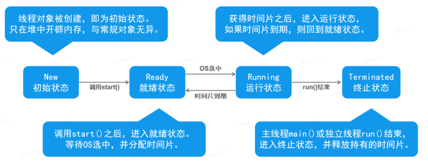
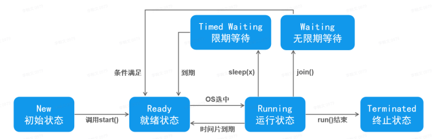
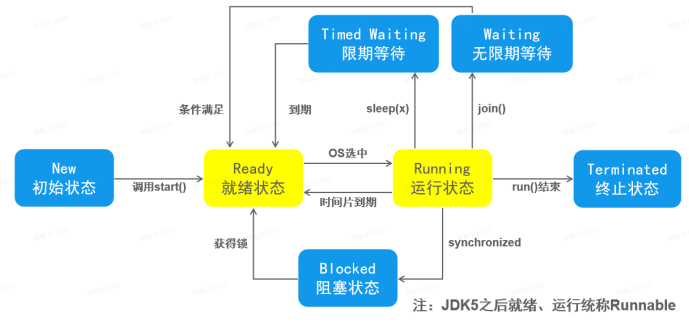

# Java Web-多线程

# 基础

## 进程

`Process` 进程：就是一个应用程序在运行期间，它所申请的资源（硬件、软件）的总和，它即是内存中划定的一块区域，而且是当前应用程序所“独占”的（当一个应用程序功能足够复杂的时候，它可能会由多个进程组成，每一个进程都会承担或者提供相应的某一项功能）。

## 线程

Thread 线程：“是一个轻量级的进程(Light Weight Process)“，一个进程是由多个线程组成的，同时，线程又是CPU的最基本的调度单位；进程由多个线程组成，彼此间完成不同的工作，交替执行，
称为多线程。

**线程的组成部分** 

> * CPU时间⽚
> * 运⾏数据
> * 线程的逻辑代码

## 区别

> * 进程是操作系统资源分配的基本单位，而线程是CPU的基本调度单位
> * 一个程序运行后至少有一个进程。
> * 一个进程可以包含多个线程，但是至少需要有一个线程
>   进程间不能共享数据段地址，但同进程的线程之间可以。

## 一些CPU相关的概念

* 某一个线程如果想要计算，必须首先要争抢到CPU的时间片（是一个非常小的，几乎不可以再切割的时间单位），才有机会让CPU来计算程序中指定的逻辑
* 我们的操作系统可以同时运行多个应用程序，这些程序是由多个进程组成的，同时每一个进程又包含了多个线程，因此，有一个权力非常大的对象“调度器”，由调度器来决定什么时间，哪个线程来执行CPU的运算

## 创建线程

> ```
> 1. 编写Thread的子类，重写run方法，通过start启动线程(因为Java是单根继承结构，所以一个类是线程类，就不能是其它类型的子类型了，有局限性)
> 2. 编写一个类实现Runnable接口，实现run方法，通过start启动线程（因为Task类只需要实现接口，所以它可以是其它类的子类型，更灵活）
> 3. 更加灵活，可以不用再刻意的新建一个类，它的唯一的确定，就是别人无法重用（它没有名称）
> ```

注意

> 启动线程需要注意的问题 
>
> * 不要调⽤run⽅法 
> * ⼀个线程只能调⽤⼀次start⽅法

## 线程的⽣命周期[重点]

### 线程的状态（基本）

> 初始状态——就绪状态——运行状态——终止状态



### 线程的状态（等待）

> 初始状态——就绪状态——运行状态——限期等待——无限期等待——终止状态



### 线程的状态重点（阻塞）

> 创建状态——就绪状态——运行状态——阻塞/等待状态——终止状态



## 线程常⻅的⽅法 

~~~java
1、设置线程名称 （setName、getName、Thread.currentThread获取当前线程对象） 
2、设置线程的优先级 (setPriority、getPriority) 
3、线程休眠 (Thread.sleep(毫秒数)) 
4、线程礼让(Thread.yeild()) 
5、线程加⼊(join())
~~~

## 线程安全【重点】

### 线程安全问题

> * 当多线程并发访问临界，如果破坏原⼦操作，可能会造成数据不⼀致
> * 临界资源：共享资源(同⼀个对象)，⼀次只可以有⼀个线程操作，才可以保证准确性 
> * 原⼦操作：不可拆分的步骤，被视作⼀个整体。其步骤不能打乱和缺省

### 线程同步 

> * ⽅式⼀：同步代码块 
> * ⽅式⼆：同步⽅法