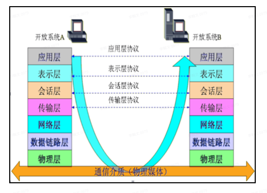
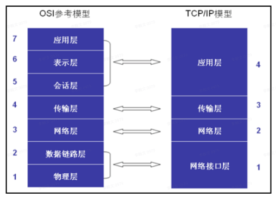

# Java Web-网络编程

## 常见的计算机网络

> 互联网：（Internet）点与点相连。
>
> 万维⽹：（WWW ‒ World Wide Web）端与端相连。
>
> 物联⽹：（ IoT - Internet of things） 物与物相连。
>
> ⽹络编程：让计算机与计算机之间建⽴连接、进⾏通信。

## 网络模型

### OSI模型

OSI（Open System Interconnect），即开放式系统互联。

* 是ISO组织在1985年研究的⽹络互联模型。
* 该体系结构标准定义了⽹络互联的七层框架（物理层、数据链路层、⽹络层、传输层、会话层、表⽰层和 应⽤层）。

每层主要功能

> * 第七层：应⽤层负责⽂件访问和管理、可靠运输服务、远程操作服务。（HTTP、FTP、SMTP）。 
> * 第六层：表⽰层负责定义转换数据格式及加密，允许选择以⼆进制或ASCII格式传输。 
> * 第五层：会话层负责使应⽤建⽴和维持会话，使通信在失效时继续恢复通信。（断点续传）。
> * 第四层：传输层负责是否选择差错恢复协议、数据流重⽤、错误顺序重排。（TCP、UDP）。
> * 第三层：⽹络层负责定义了能够标识所有⽹络节点的逻辑地址。（IP地址）。
> * 第⼆层：链路层在物理层上，通过规程或协议（差错控制）来控制传输数据的正确性。（MAC）。
> * 第⼀层：物理层为设备之间的数据通信提供传输信号和物理介质。（双绞线、光导纤维）。

### TCP/IP模型

* TCP/IP模型是因特⽹使⽤的参考模型，基于TCP/IP的参考模型将协议分成四个层次。 
* 该模型中最重要的两个协议是TCP和IP协议。

每层功能

> 第四层：应⽤层负责传送各种最终形态的数据，是直接与⽤⼾打交道的层，典型协议是HTTP、FTP等。 
>
> 第三层：传输层负责传送⽂本数据，主要协议是TCP、UDP协议。
>
> 第⼆层：⽹络层负责分配地址和传送⼆进制数据，主要协议是IP协议。
>
> 第⼀层：接⼝层负责建⽴电路连接，是整个⽹络的物理基础，典型的协议包括以太⽹、ADSL等等。

### ⽹络编程总结 【掌握】

~~~java
1、什么计算机⽹络（了解）
* 为实现资源共享、信息传递通过传出介质将若⼲台主机连接到⼀起的⼀个⽹络
*
* 2、计算机⽹络模型（了解）
* OSI：
* 应⽤层 主要指的是是程序
* 表⽰层 将数据加密或者解密成⼆进制的数据
* 会话层 保持主机之间的连接
* 传输层 通过⽹络协议传输数据(TCP协议、UDP协议)
* ⽹络层 分配IP地址(IP地址)
* ⽹络数据链路层 保证准确性(MAC地址物理地址)
* 物理层 进⾏数据传输
*
* 3、TCP/IP模型（了解）
* 应⽤层
* 传输层
* ⽹络层
* 物理层
*
* 4、⽹络编程需要什么？（重点）
* 	a、通信协议(TCP\UPD\HTTP)
*	b、IP地址
* 	c、端⼝号
* ⽹络编程三要素：协议、地址、端⼝号
~~~

## IP协议

~~~java
* ⽹络三要素之ip地址
* 1、概念
* 	a、什么是IP地址 (了解)
* 	   分配给每⼀台主机的唯⼀数字标识
*
* 	b、ipv4和ipv6 (了解)
* 	   ipv4：4个字节32位组成，每⼀段由8位组成。使⽤0~255之间的数字表⽰(应⽤)
* 	   ipv6：16个字节128位组成，每⼀段由32位组成。使⽤0~65535之间的数字表⽰
* 	c、ip地址的分类
*      A类地址 ⼤型⽹络：⽹络地址.主机地址.主机地址.主机地址
* 	   B类地址 中型⽹络：⽹络地址.⽹络地址.主机地址.主机地址
* 	   C类地址 个⼈⽹络：⽹络地址.⽹络地址.⽹络地址.主机地址
* 	d、回路地址(⾃⼰与⾃⼰通信IP地址) (重要)
* 					域名
* 	   127.0.0.1 localhost
*
* 	   DNS域名解析器：将域名解析成ip地址。⼀个ip地址可以对应多个域名 ⼀个域名职能对应⼀个ip地址
* 	   默认情况下：DNS解析回去找到C:\Windows\System32\drivers\etc\hosts⽂件去查找对应的域名解析，如果找不到会去DNS服务器中取查找
* 	   常⻅的DNS域名器：114.114.114.114 8.8.8.8
*
* 	e、ip相关的命令 (重要)
* 	   ipconfig(查看本机的ip地址信息) ifconfig(Linux操作系统，查看本机的ip地址信息)
* 	   ping命令 (检查是否连接上了⽬标主机)
*
* 	   https://www.baidu.com:80/
*
* 2、应⽤
* 	 java是⾯向对象的编程语⾔，在java使⽤InetAddress类表⽰ip地址信息
~~~

### InetAddress类

获取

⽅式⼀：获取本机的InetAddress对象

> `InetAddress.getLocalHost()`    通过本地的ip地址信息获取`InetAddress`对象 
>
> `getHostName()`   获取主机名(域名)
>
> `getHostAddress()`   获取ip地址

⽅式⼆：根据指定的主机名获取InetAddress对象

> `InetAddress.getByName("主机名")`

⽅式三：根据指定的ip地址获取InetAddress对象

> `InetAddress.getByName("IP地址")`

⽅式四：根据指定的主机名获取所有的InetAddress

> `InetAddress.getAllByName("主机名")`
>
> 使⽤`lambda`表达式遍历
>
> ~~~java
> InetAddress[] ias = InetAddress.getAllByName("主机名");
> //使⽤lambda表达式遍历
> Arrays.stream(ias).forEach(ia ->{
> System.out.println(ia.getHostAddress());
> System.out.println(ia.getHostName());
> });
> ~~~

## 端⼝号

Port：端口，这个是为了区分不同的应用程序如何来接受网络数据包

~~~java
* ⽹络编程三要素之端⼝号
* 	a、概念：
* 		端⼝号指的是每⼀个设备上程序的唯⼀数字标识
* 	b、端⼝的范围：0~65535之间
* 		公认端⼝号：0~1023
* 		注册端⼝号：1024~49151
* 		动态端⼝号：49152~65536 (指的是程序没有设置端⼝号系统默认随机分配的端⼝号)
* 	c、常⻅的端⼝号
* 		mysql端⼝号：3306
* 		oracle端⼝号：1521
* 		redis端⼝号：6379
* 		tomcat端⼝号：8080
* 		web服务器端⼝号：80
* 		FTP服务器端⼝号：21
* 	d、总结：以后⾃⼰编写的程序的端⼝号最好设置在1024~65535之间即可
~~~

## 通信协议(TCP/UDP)【掌握】

Internet P：每一台硬件（能接入网络的）在网络上的一个唯一地址标识，其它设备能直接通过IP来对该设备发起连接请求

TCP(Transform Control Protocol)

~~~java
* 1、概念：
* 	TCP:传输控制协议
* 	特点：⾯向连接、安全可靠、效率低、基于字节流进⾏通信、数据⼤⼩⽆限制。
*   基于双工的网络传输协议
*   在连接的时候，双方都会有一些前置的交互，因此，这个连接一旦创建好以后，发送的数据，在数据帧上是顺序准确的、数据一定是完整的（丢包）
*   相对其它的通讯协议来说，发送的效率较慢
*   连接的两方，是有主次之分的，分为服务器方和客户端方
*   客户端方:在连接服务器的时候，必须要知道对方的IP和PORT信息
*    
* 	建⽴连接三次握⼿、断开连接四次挥⼿
* 	通俗解释：打电话
*
* 	UDP：数据报协议
* 	特点：⾯向⽆连接、不安全、效率⾼、基于数据报包的形式通信、数据包⼤概在64kb
* 	通俗解释：对讲机
*
* 在java中使⽤Socket类来进⾏⽹络编程
* Socket：套接字、指的是⽹络间的⼀个通信设备
~~~

**TCP与UDP区别总结：**

> 1. TCP面向连接（如打电话要先拨号建立连接）;UDP是无连接的，即发送数据之前不需要建立连接
> 2. TCP提供可靠的服务。也就是说，通过TCP连接传送的数据，无差错，不丢失，不重复，且按序到达;UDP尽最大努力交付，即不保   证可靠交付
> 3. TCP面向字节流，实际上是TCP把数据看成一连串无结构的字节流;UDP是面向报文的，UDP没有拥塞控制，因此网络出现拥塞不会使源主机的发送速率降低（对实时应用很有用，如IP电话，实时视频会议等）
> 4. 每一条TCP连接只能是点到点的;UDP支持一对一，一对多，多对一和多对多的交互通信
> 5. TCP首部开销20字节;UDP的首部开销小，只有8个字节
> 6. TCP的逻辑通信信道是全双工的可靠信道，UDP则是不可靠信道