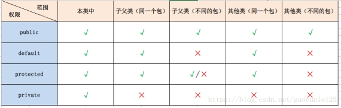

# Java-基础

## （1）、Java权限修饰符有哪些？有何区别？

* Public、private、protected、default

* 同包：父类中的public、protected以及default修饰的成员变量和方法，子类都可以使用

* 不同包：子类只能使用父类中的protected和public修饰的成员变量和方法

## （2）、重载与重写的区别？

* 重载：在一个类中，同名的方法有不同的参数列表（参数类型不同、参数个数不同、参数顺序不同）则认为重载。重载对返回类型没有要求（可同可不同），不能以返回值类型来判断重载。

* 重写：是父类与子类之间的多态性，就是子类把父类的方法重新再写一遍，子类继承了父类原有的方法，子类中的方法与父类中的方法、参数列表，就称之为重写；但要注意子类函数的访问修饰权限不能小于父类的；若子类中的方法与父类中的某一方法具有相同的方法名、返回类型和参数表，则新方法将覆盖原有的方法，如需父类中原有的方法则可使用 super 关键字。

* 总结：

> **重载**
>
> 1.重载Overload是一个类中多态性的一种表现。
>
> 2.重载要求同名方法的参数列表不同(参数类型，参数个数甚至是参数顺序)。
>
> 3.重载的时候，返回值类型可以相同也可以不相同。无法以返回型别作为重载函数的区分标准
>
> **重写**
>
> 1.发生在父类与子类之间
>
> 2.方法名，参数列表，返回类型（除过子类中方法的返回类型是父类中返回类型的子类）必须相同
>
> 3.访问修饰符的限制一定要大于被重写方法的访问修饰符（public>protected>default>private)
>
> 4.重写方法一定不能抛出新的检查异常或者比被重写方法申明更加宽泛的检查型异常

* **区别**：

  重载和重写都是实现多态的方式。

  > * 重载实现的是编译时的多态性，重载发生在一个类中，同名的方法如果有不同的参数列表（参数类型不同、参数个数不同、参数顺序不同）则视为重载，重载对返回类型没有特殊的要求，不能根据返回类型进行区分。
  >
  > * 重写实现的是运行时的多态性，重写发生在子类与父类之间，重写要求子类重写方法与父类被重写方法有相同的参数列表，有兼容的返回类型，比父类被重写方法更好访问，不能比父类被重写方法声明更多的异常（里氏代换原则）。

* 方法重写和方法重载的具体不同

 

## （3）、多态的实现条件有哪些？

* **多态**

  > 编译时多态（设计时多态）：编译时多态是静态的，主要指方法的重载，根据相同方法的不同参数列表来区分函数，通过编译后变成两个不同的函数。
  >
  > 运行时多爱：运行时多态时动态的，通过动态绑定来实现，JAVA运行时系统根据调用该方法的实例的类型来决定选择调用那个方法称为运行时多态。（多态主要指运行时多态）

* 重载与重写是 Java 多态性的不同表现。

  > 重写是父类与子类之间多态性的表现，在运行时起作用（动态多态性，譬如实现动态绑定）
  >
  > 重载是一个类中多态性的表现，在编译时起作用（静态多态性，譬如实现静态绑定）。

* 多态要点

  > 1、多态是方法的多态，不是属性的多态（多态与属性无关）
  >
  > 2、多态存在要有三个必要条件：继承、方法重写、父类应用指向子类对象
  >
  > 3、父类引用指向子类对象后，用该父类引用调用子类重写的方法，此时多态就出现了。

  例如 ：Object cat = new Cat();

* 三个必要条件：

  > **继承：**在多态中必须存在有继承关系的子类和父类。其中继承包括了接口的实现implements
  >
  > **重写**：子类对父类中某些方法进行重新定义，在调用这些方法时就会调用子类的方法。
  >
  > **向上转型**：在多态中需要将子类的引用赋给父类对象，只有这样该引用才能够具备技能调用父类的方法和子类的方法。

  只有满足了上述三个条件，我们才能够在同一个继承结构中使用统一的逻辑实现代码处理不同的对象，从而达到执行不同的行为。

## （4）、多态的使用场合有哪些？

通过方法的参数传递形成多态，如通过方法的参数传递形成多态；

在方法体中直接使用多态的语法格式，如父类的引用指向子类的对象（Account acc = new FixedAccount();）

通过方法的返回值类型形成多态

 

Java中多态的实现方式：

接口实现

继承父类进行方法重写

同一个类中进行方法重载

方法表与方法调用

 

## （5）、解释一下什么是开闭原则？

对扩展是开放的，对修改是关闭的；在程序需要扩展时不去修改原有的代码，实现热插拔的效果，使程序的扩展性更好，易于维护和升级。

 

## （6）、final、finally、finalize分别表示什么意思？

Final（关键字）：

> 被final修饰的类不能被继承，所以一个类不能被abstract和final修饰。
>
> 被final修饰的变量和方法都是不能被更改的，继承之后子类也不能对父类的finala方法重写，但是可以重载。

Finally：

> finally是在Java异常处理时用到的，在try ,catch之后执行，不管有没有捕获到异常最后的finally方法肯定会得到执行。

Finalize：

> 方法名。Java 技术允许使用 finalize() 方法在**垃圾收集器**将对象从内存中清除出去之前做必要的清理工作。这个方法是由垃圾收集器在确定这个对象没有被引用时对这个对象调用的。它是在 Object 类中定义的，因此所有的类都继承了它。子类覆盖 finalize() 方法以整理系统资源或者执行其他清理工作。**finalize() 方法是在垃圾收集器删除对象之前对这个对象调用的**。注意：finalize不一定被jvm调用，只有当垃圾回收器要清除垃圾时才被调用。

 

## （7）、throw、throws、Throwable 分别表示什么意思？

Throwable：

> Throwable在Java中是异常处理这个分支的顶级父类，其它所有异常处理的实现都依赖于Throwable

Throws：

> throws应用在方法声明处，指明此方法在执行时可能会出现的异常类型。一旦该方法执行时出现异常，就会在异常代码处生成一个异常类的对象，此对象满足Throws后的异常类型时，就会被抛出。（这里有两个过程，代码有异常时，1.生成一个异常对象；2. throws捕获到这个异常，将异常对象抛出）

throws和try-catch-finally一起称为异常处理的两种方式。

> try-catch-finally是在出现异常时主动处理掉异常，使得程序可以继续执行下去；而throws捕获到异常之后向上抛出异常对象，不去真正地处理这个异常。
>
> Throw：throw使用在方法体内。与try-catch-finally和throws都不同，异常处理的两个阶段：1.遇到异常，生成异常对象；2.捕获到异常，进行抛出或处理。try-catch-finally和throws都处在第二个阶段，都是捕获到异常后的相关处理，一般使用系统根据异常类型自动生成的异常对象进行处理。而throw应用在第一阶段，手动地产生一个异常对象。

## （8）、抽象类和接口的联系与区别？

抽象类：

> 1、只有方法签名（方法名+参数），没有方法体的方法
>
> 2、抽象方法一般存在于抽象类中
>
> ​	2.1有抽象方法的一定是抽象类
>
> ​	2.2抽象类里不一定有抽象方法
>
> 3、抽象类可以有抽象方法，只需要声明，无需实现；抽象方法不能声明为静态的，不能被static、final修饰，所以抽象类不能实例化对象（也就是直接New对象）；但是可以new后加“{ };”，然后在里面重写，会自动生成一个代理对象。
>
> 4、抽象类需要被继承，是单继承
>
> ​	4.1子类需要重写超类中的抽象方法
>
> ​	4.2如果子类也是抽象类，那么可以不用重写
>
> 5、抽象类：抽取相同的行为和属性——向上造型

抽象类设计规则：抽取派生类的共同属性和行为，如果子类的行为不是有一致的就写成抽象方法

接口—是一个特殊的抽象类：

> 1、用Interface修饰，只有抽象方法和常量的引用数组类型
>
> 2、接口可以被多实现，implements用“,”逗号隔开。例如：Interface3 implements Interface0,Interface1,Interface2
>
> 3、接口不能被实列化（接口也不能直接New对象，和抽象类一样）
>
> 4、接口中只能有抽象方法，没有构造方法
>
> 5、接口里面只能有常量，并且不能私有化，默认是public static final型，且必须初始化，实现类中不能重新定义和修改值
>
> 6、接口可以被接口继承 ，可以是多继承。

接口设计规则：

> 1、抽取派生类的共同属性和行为抽到超类中，
>
> 2、抽象类：如果子类方法都一样设计为普通方法，如果子类的行为不是有一致的就写成抽象方法
>
> 3、接口：抽取部分子类相同行为，抽取到接口中——多继承，多实现，接口是对单继承的扩展

抽象类和接口的区别与联系

> 1.抽象类和接口都不能被实例化；
>
> 2.抽象类使用abstract修饰，接口用Interface修饰；
>
> 3.抽象类是单继承，一个类只能使用一次继承关系，继承用关键字extends；接口可以多继承（extends)多实现(interface)，多实现的时候用逗号（,）隔开;
>
> 4.抽象类里面可以变量，变量可以私有化； 接口里只有常量，默认是public static final，不能被私有化，只能是公开的（public)；
>
> 5.抽象类可以有抽象方法，只需要声明，无需实现；抽象方法不能声明为静态的，不能被static、final修饰；接口里的方法都是抽象方法，但是都只是声明，并没有方法体，而且没有构造方法；
>
> 6.抽象类里面可以包含抽象方法和非抽象方法，抽象方法没有方法体，但是普通方法里面有方法体；有抽象方法的一定是抽象类，抽象类里不一定有抽象方法；一个类继承了抽象类，如果这个类实现了抽象类里面的所有抽象方法，那么该类可以不是抽象类，但是如果没有实现所有的抽象方法，那该类是抽象类

## （9）、内部类有什么特点

内部类： 所谓内部类就是在一个类内部进行其他类结构的嵌套操作。

主要分为：成员内部类、局部内部类、静态内部类、匿名内部类四种

1. 内部类的特点：

   （1）内部类与其他成员并行，可以互相访问

   （2）外包类和内部类不同名，内部类的作用域仅在声明它的类和方法体中，如果内部类要在外部引用则必须用：

   > 外部类类名.内部类类名 内部对象引用名=外部类对象名.new 内部类构造名（）；或
   >
   > 外部类类名.内部类类名 内部对象引用名=new 外部类构造名.内部类构造名（）；

   （3）支持四种基本权限

   （4）如果加上static关键词，则会变成顶层类

   （5）内部类对象可以在成员中作变量以及被成员调用等

   （6）非静态内部类也可以有自己的成员，但不可以有静态成员，可以去访问外包类的静态成员

   （7）可以是类和接口，可以被final和abstract关键词修饰，也可以进行继承和实现

 

1.非静态内部类默认持有外部类的引用，所以在使用内部类对象时需要首先创建外部类的对象。

2.外部类需要使用内部类时首先需要创建内部类的对象。 

 

2.使用：

 （1）内部类可以作为外包类的一个成员变量使用

 （2）在外包类的语句块中定义内部类

 （3）在外包类的外的其他类中访问内部类

注：在外包类之外访问内部类的方法：

外部类类名.内部类类名 内部对象引用名=外部类对象名.new 内部类构造名（）；

外部类类名.内部类类名 内部对象引用名=new 外部类构造名.内部类构造名（）；

 

优点：

1.在java中一个类可以实现多个接口但只能继承一个抽象类，内部类的出现使得多继承的方案变的完整

2.方便统一的将存在一定逻辑关系的类组织起来，优化代码结构。

3.提高代码的封装性，隐藏内部具体的实现。

 

## （10）、请问垃圾回收机制是什么？

当程序创建对象，数组等引用类型实体时，系统会在堆内存中为之分配一块内存区，对象就保存在内存区中，当内存不再被任何引用变量引用时，这块内存就变成了垃圾，等待垃圾回收机制去进行回收。

垃圾回收机制的特点:

1、垃圾回收机制只负责回收堆内存中的对象，不会回收任何物理资源（网络io等）

2、程序无法精准控制垃圾回收的运行，垃圾回收在合适的时候进行，当对象永久性失去了引用后。系统会在合适的时候回收它所占的内存

3、在垃圾回收机制回收任何对象之前，总会调用它的finalize（）方法，该方法可能使该对象重新复活（使用一个引用变量重新去引用该对象），从而导致垃圾回收机制取消回收。

 

## （11）、数组的优点和缺点是什么？

优点：

1、按照索引查询元素速度快；

2、能存储大量数据；

3、按照索引遍历数组方便；

4、数组定义简单，而且访问很方便；

5、可以随机访问其中的元素。

 

缺点：

1、根据内容查找元素速度慢；

2、数组的大小一经确定不能改变，不适合动态存储；

3、数组只能存储一种类型的数据；

4、增加、删除元素效率慢；

5、未封装任何方法，所有操作都需要用户自己定义；

6、数组的空间必须是连续的，这就造成数组在内存中分配空间时必须找到一块连续的内存空间。所以数组不可能定义的太大，因为内存中不可能有那么多大的连续的内存空间，而解决这个问题的方法就是使用链表。