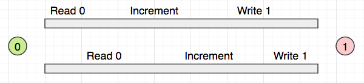
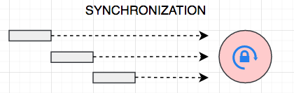

# JavaSE-多线程

https://blog.csdn.net/Evankaka/article/details/44153709

https://blog.csdn.net/qq_35598736/article/details/108431422?spm=1001.2014.3001.5502

https://blog.csdn.net/Bb15070047748/article/details/119381337

# 基础-线程

## 进程与线程

`Process` 进程：就是一个应用程序在运行期间，它所申请的资源（硬件、软件）的总和，它即是内存中划定的一块区域，而且是当前应用程序所“独占”的（当一个应用程序功能足够复杂的时候，它可能会由多个进程组成，每一个进程都会承担或者提供相应的某一项功能）。

Thread 线程：“是一个轻量级的进程(Light Weight Process)“，一个进程是由多个线程组成的，同时，线程又是CPU的最基本的调度单位；进程由多个线程组成，彼此间完成不同的工作，交替执行，称为多线程。

**线程的组成部分** 

> * CPU时间⽚
> * 运⾏数据
> * 线程的逻辑代码

## 区别

> * 进程是操作系统资源分配的基本单位，而线程是CPU的基本调度单位
> * 一个程序运行后至少有一个进程。
> * 一个进程可以包含多个线程，但是至少需要有一个线程
>   进程间不能共享数据段地址，但同进程的线程之间可以。

## Thread和Runnable的区别

如果一个类继承Thread，则不适合资源共享。但是如果实现了Runable接口的话，则很容易的实现资源共享。

总结：

> 实现Runnable接口比继承Thread类所具有的优势：
>
> 1. 适合多个相同的程序代码的线程去处理同一个资源
> 2. 可以避免java中的单继承的限制
> 3. 增加程序的健壮性，代码可以被多个线程共享，代码和数据独立
> 4. 线程池只能放入实现Runable或callable类线程，不能直接放入继承Thread的类

特别注意：

> * main方法其实也是一个线程。在`java`中所以的线程都是同时启动的，至于什么时候，哪个先执行，完全看谁先得到CPU的资源。
> * 在`java`中，每次程序运行至少启动2个线程。一个是`main`线程，一个是垃圾收集线程。因为每当使用`java`命令执行一个类的时候，实际上都会启动一个`ＪＶＭ`，每一个`ｊＶＭ`实习在就是在操作系统中启动了一个进程。

## 一些CPU相关的概念

* 某一个线程如果想要计算，必须首先要争抢到CPU的时间片（是一个非常小的，几乎不可以再切割的时间单位），才有机会让CPU来计算程序中指定的逻辑
* 我们的操作系统可以同时运行多个应用程序，这些程序是由多个进程组成的，同时每一个进程又包含了多个线程，因此，有一个权力非常大的对象“调度器”，由调度器来决定什么时间，哪个线程来执行CPU的运算

> 如果创建的线程数量大于CPU的线程数，情况会如何呢？
>
> 在我们的操作系统中，有一个专门的`线程调度器`，它负责给每个线程分配`CPU时间片`，并且在每个线程间进行快速切换，使得每个线程有机会使用`processor`来进行运算，这就造就了“并发”的效果。

## 创建线程

> ```
> 1. 编写Thread的子类，重写run方法，通过start启动线程(因为Java是单根继承结构，所以一个类是线程类，就不能是其它类型的子类型了，有局限性)
> 2. 编写一个类实现Runnable接口，实现run方法，通过start启动线程（因为Task类只需要实现接口，所以它可以是其它类的子类型，更灵活）
> 3. 更加灵活，可以不用再刻意的新建一个类，它的唯一的确定，就是别人无法重用（它没有名称）
> ```

注意

> 启动线程需要注意的问题 
>
> * 不要调⽤run⽅法 
> * ⼀个线程只能调⽤⼀次start⽅法

## 线程的⽣命周期[重点]

### 线程的状态（基本）

> 初始状态——就绪状态——运行状态——终止状态


### 线程的状态（等待）

> 初始状态——就绪状态——运行状态——限期等待——无限期等待——终止状态


### 线程的状态重点（阻塞）

> 创建状态——就绪状态——运行状态——阻塞/等待状态——终止状态


## 线程常⻅的⽅法 

~~~java
1、设置线程名称 （setName、getName、Thread.currentThread获取当前线程对象） 
2、设置线程的优先级 (setPriority、getPriority) 
3、线程休眠 (Thread.sleep(毫秒数)) 
4、线程礼让(Thread.yeild()) 
5、线程加⼊(join())
~~~

## 线程安全【重点】

### 线程安全问题

> * 当多线程并发访问临界，如果破坏原⼦操作，可能会造成数据不⼀致
> * 临界资源：共享资源(同⼀个对象)，⼀次只可以有⼀个线程操作，才可以保证准确性 
> * 原⼦操作：不可拆分的步骤，被视作⼀个整体。其步骤不能打乱和缺省

### 线程同步、异步

同步：就是必须要等到耗时任务结束以后，流程才会往下继续执行

> * ⽅式⼀：同步代码块 
> * ⽅式⼆：同步⽅法

异步：就是在提交一个耗时任务以后，程序流程依然会照旧往下执行

## 线程资源竞争状况

~~~java
public void incrementTotalBytes(){
  totalBytes++;
}
~~~

在这个方法中，修改状态的代码虽然只有一行，但实际上包含了 3 步操作：

1. 首先从主存储器（`main memory`）把这个状态的值拷贝到`CPU`中
2. `CPU`对这个值进行`add`操作
3. `CPU`将这个更新后的值写回到主存储器（`main memory`）

整个方法的逻辑由于包含了 3 步操作，因此我们称之为`非原子操作`（`non - atomic operation`，不能再进一步细分的操作），假定发生如下场景，那么就会导致对要修改的数据，其中某一个线程的修改操作无效（被另一个线程的修改操作覆盖）：



### 解决方案：

在修改被争抢的资源方法上新增一个synchronized(同步)

> 效果：会让该方法变成原子性的一个操作(不能再切割的)，也就是说，当一个线程在里面执行，还没有执行完毕的时候，其它要调用这个方法的线程会一直被阻塞在外面

工作原理：

1. 当一个类的方法，只要有一个被加了`sync`修饰，那么`JVM`就会创建出一个类似于`lock`的对象，我们称之为`monitor`(监视器)

2. 当有任何一个线程想要访问带有`sync`的方法时，`JVM`的调度器就会询问自己一个问题：`monitor`是否可以获取到

   ​      -- Y 当前线程就会拿到该`monitor`，然后进去执行该方法
   ​      -- N 当前线程就会被阻塞在方法外

3. 当某一个线程执行完逻辑以后，它会把`monitor`归还给调度器

4. 补充说明：被争抢的资源，一般来说只有一个，因此，`JVM`为它创建的`monitor`也只有一个，而且它是用来限定当前这个类的唯一的这个实例中所有的`sync`修饰的方法的




## Lock

参考：https://blog.csdn.net/m0_50370837/article/details/124471888

参考：https://www.cnblogs.com/dolphin0520/p/3923167.html

### Lock锁 

* JDK5加⼊，与synchronized⽐较，显⽰定义，结构更灵活。
* 提供更多实⽤性⽅法，功能更强⼤、性能更优越。

### Synchronized和lock锁的区别（互斥锁）

> 1. Lock是一个接口，而synchronized是Java中的关键字，synchronized是内置的语言实现；
> 2. synchronized在发生异常时，会自动释放线程占有的锁，因此不会导致死锁现象发生；而Lock在发生异常时，如果没有主动通过unLock()去释放锁，则很可能造成死锁现象，因此使用Lock时需要在finally块中释放锁；
> 3. Lock可以让等待锁的线程响应中断，而synchronized却不行，使用synchronized时，等待的线程会一直等待下去，不能够响应中断；
> 4. 通过Lock可以知道有没有成功获取锁，而synchronized却无法办到。
> 5. Lock可以提高多个线程进行读操作的效率。
>
> 在性能上来说，如果竞争资源不激烈，两者的性能是差不多的，而当竞争资源非常激烈时（即有大量线程同时竞争），此时Lock的性能要远远优于synchronized。所以说，在具体使用时要根据适当情况选择。

使用sync的语句块，能集中的对需要同步化的代码进行锁定，能从一定程度上降低整个方法的阻塞系数

# 进阶-线程池

Lambda表达式参考：https://jimmysun.blog.csdn.net/article/details/102710138

线程池参考：

https://jimmysun.blog.csdn.net/article/details/95225769

https://blog.csdn.net/Bb15070047748/article/details/119424448

## 线程池

> * 如果有⾮常的多的任务需要多线程来完成，且每个线程执⾏时间不会太⻓，这样频繁的创建和销毁线程。
> * 频繁创建和销毁线程会⽐较耗性能。有了线程池就不要创建更多的线程来完成任务，因为线程可以重⽤ 
> * 线程池⽤维护者⼀个队列，队列中保存着处于等待（空闲）状态的线程。不⽤每次都创建新的线程。

## 原理


## 好处

> 1. 降低资源消耗，通过池化思想，减少创建线程和销毁线程的消耗，控制资源
> 2. 提高响应速度，任务到达时，无需创建线程即可运行
> 3. 提供更多更强大的功能，可扩展性高

## 常见的类(Executor)

> 常用的线程池接口和类（所在包`java.util.concurrent`）
>
> Executor：线程池的顶级接口。
>
> ExecutorService：线程池接口，可通过submit（Runnable task）提交任务代码。
>
> Executors工厂类 ：通过此类可以获得一个线程池。


> 1. `Executors.newFixedThreadPool(Runtime.getRuntime().availableProcessors() - 1)`  参数：`nThreads` - 池中的线程数
>
>    * 创建一个有固定线程数量的线程池 N-1 模式 个别组件会用N + 1
>    * 非常适合保守的来限定对于服务器CPU资源的使用
>
> 2. `Executors.newCachedThreadPool()`
>
>    * 一开始，pool的size为0，随着提交任务的增多，它会不断创建新的线程实例，随着时间的推进，有的任务很快就执行完了，线程对象会有部分闲置，因此 它们会被pool销毁(回收)，实现pool的size出现弹性增长和收缩
>
>    * 适用于提交请求的频率不是特别快，也不是特别多的场景
>
> 3. `Executors.newScheduledThreadPool(参数);`
>
>    * 创建一个线程池，可以安排命令在给定延迟后运行，或定期执行。
>
>    * 参数： `corePoolSize` - 保留在池中的线程数，即使它们是空闲的。
>    * 返回：一个新创建的调度线程池
>    * `Throws:
>      IllegalArgumentException – if corePoolSize < 0`
>
>    > 1. `schedule(Runnable command, long delay, TimeUnit unit);`
>    >
>    >    * 参数：
>    >
>    >      command——要执行的任务 
>    >
>    >      delay——从现在开始延迟的时间，表示提交任务以后，隔多久才执行
>    >
>    >      execution unit——延迟参数的时间单位
>    >
>    >    * 返回：一个 ScheduledFuture 表示任务的挂起完成，其 get() 方法将在完成时返回 null
>    >
>    > 2. `scheduleAtFixedRate(Runnable command,long initialDelay,long period,TimeUnit unit);`
>    >
>    >    1)  在delay时间过后，按照period的频率执行已经提交的任务
>    >    2) 保障任务的开始时间间隔为`period`，但是如果有一个任务的执行时间超出`period`，那么下一个任务的开始时间将会延迟到上一个任务结束
>    >
>    >    * 参数：
>    >
>    >      command——要执行的任务 
>    >
>    >      initialDelay——延迟第一次执行的时间 
>    >
>    >      period——连续执行之间的周期 
>    >
>    >      unit——`initialDelay`和`period`参数的时间单位
>    >
>    >    * 返回：一个` ScheduledFuture `表示任务的挂起完成，其 get() 方法将在取消时抛出异常
>    >
>    > 3. `scheduleWithFixedDelay(Runnable command, long initialDelay,long delay,TimeUnit unit);`     
>    >
>    >    严格保障上一个任务结束和下一个任务开始之间的间隔一定是delay。
>    >
>    >    * 参数：
>    >
>    >       command - 执行的任务 
>    >
>    >      initialDelay - 延迟第一次执行的时间 
>    >
>    >      delay - 一个执行结束和下一个单元开始之间的延迟 unit - `initialDelay `和` delay` 参数的时间单位
>    >
>    >    * 返回：一个 `ScheduledFuture` 表示任务的挂起完成，其 get() 方法将在取消时抛出异常
>
> `pool.submit(() -> {});`    开发人员不需要自己来创建线程对象，而是把关注点放在run，也就是具体的业务逻辑
>
> submit方法：提交一个有返回值的任务，它会立即返回一个包装了一个在未来某一个时间点会得到结果的对象。
>
> future相当于我们以后获取结果的一个句柄
>
> `shutdown()`    类似于各种`join`，即是会等到所有提交的任务执行完毕以后，再关闭`pool`，`shutdown`以后，不可以再提交新的任务了。

## Callable接口

> * jdk5加入，与Runnable接口类似，实现之后代表一个线程任务。
> * Callable 具有泛型返回值、可以声明异常。
>
> ~~~java
> public interface Callable<V>{
>     public V call() throws Exception;
> }
> ~~~

## Future接口

> * Future 接口表示将要执行玩任务的结果。
> * get() 以阻塞灯饰等待Future中的异步处理结果（`call() `的返回值）。

## Runnable与Callable接口的区别

> 1. 两个接口都可以当做线程任务提交并执行。
> 2. Callable 接口执行完线程任务后有返回值，而 Runnable 接口没有。
> 3. Callable 接口中的 call 方法已经抛出异常，而 Runnable 接口不能抛出异常。
>
> ### Future 接口
>
> * 用于接口 Callable 的线程任务的返回值。
> * get() 方法当线程任务执行完成之后才能获取返回值，这个方法是一个阻塞方法。 