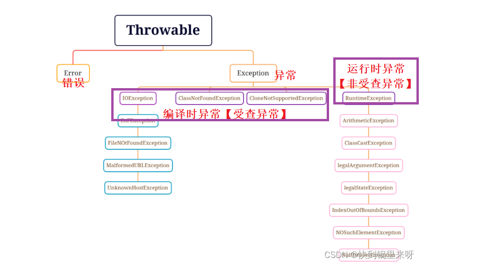
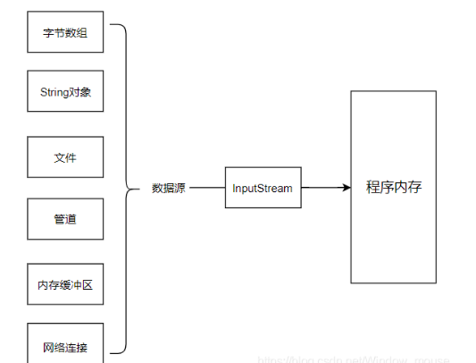
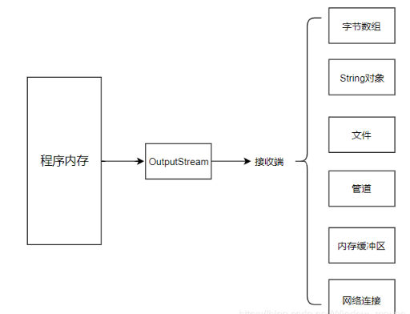
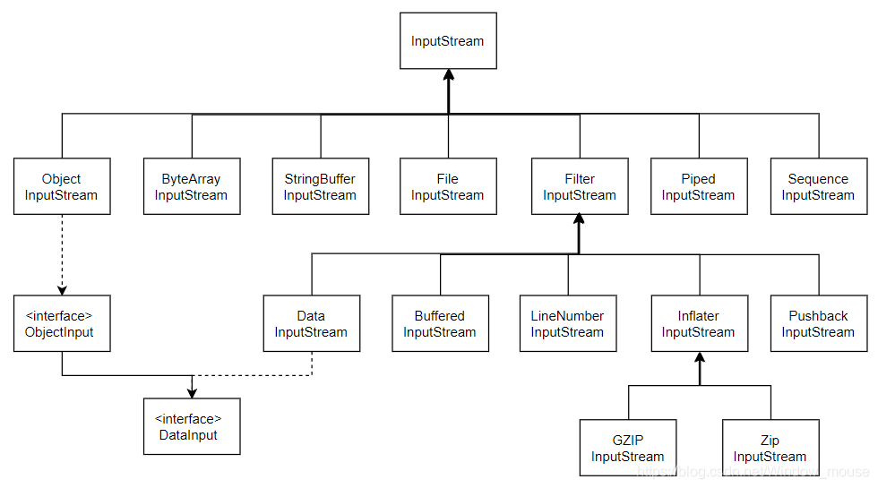
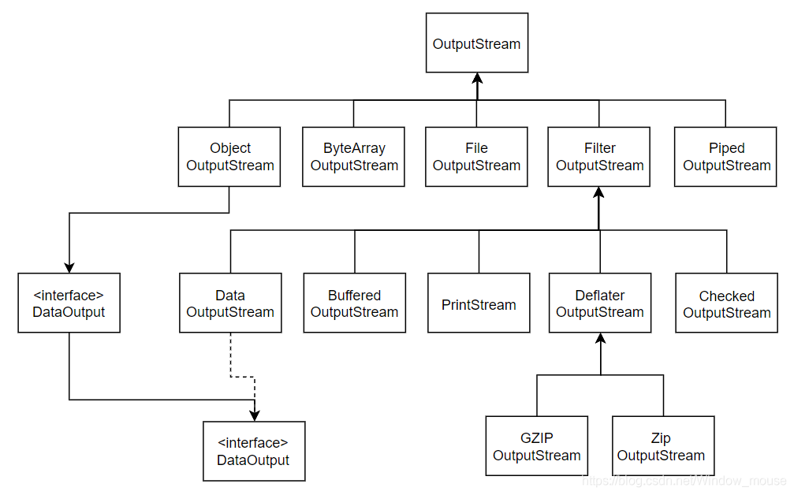
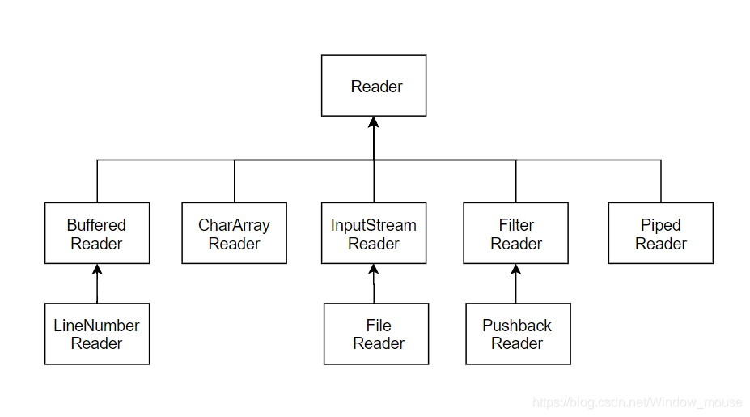
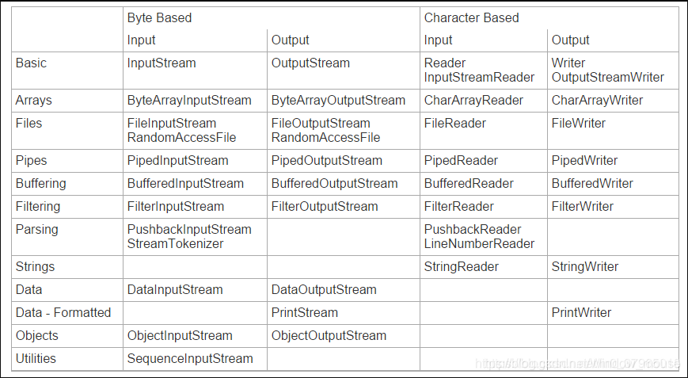

# JavaSE-异常、I/O流

# 异常

https://leixiaoheng.blog.csdn.net/article/details/125040373

程序在运⾏的过程出现的错误，称之为异常。如果异常不处理，那么就会终⽌java虚拟机的运⾏。意味着出现异常后⾯的代码就不会再执⾏了。

## JAVA的异常处理机制

如果某个方法不能按照正常的途径完成任务，就可以通过另一种路径退出方法。在这种情况下会抛出一个封装了错误信息的对象。此时，这个方法会立刻退出同时不返回任何值。另外，调用这个方法的其他代码也无法继续执行，异常处理机制会将代码执行交给异常处理器。

## 异常产生的原因

> **主要是有三种原因：**
>
> 1. 编写程序代码中的错误产生的异常，比如数组越界、空指针异常等，这种异常叫做未检查的异常，一般需要在类中处理这些异常
> 2. Java内部错误发生的异常，Java虚拟机产生异常
> 3. 通过throw（抛出异常）语句手动生成的异常，这种异常叫做检查的异常，一般是用来给方法调用者一些必要的信息

## 异常分类

Throwable(异常的父类)

 （1）Throwable：是异常体系的顶层类，其派生出两个重要的子类, Error 和 Exception而 Error 和 Exception 两子类分别表示错误和异常。

区别就是不检查异常（Unchecked Exception）和检查异常（Checked Exception）。

（2）Exception 类用于用户程序可能出现的异常情况，它也是用来创建自定义异常类型类的类。

> **指异常产生后程序员可以通过代码进行处理，使程序继续执行。**

（3）Error 定义了在通常环境下不希望被程序捕获的异常。Error 类型的异常用于 Java 运行时由系统显示与运行时系统本身有关的错误。堆栈溢出是这种错误的一例。

> **指的是Java虚拟机无法解决的严重问题，比如：JVM的内部错误、资源耗尽等，典型代表：StackOverflowError和OutOfMemoryError，一旦发生回力乏术**。

**异常可能在编译时发生，也有可能在程序运行时发生，根据发生时机不同，可以分为：**

> **运行时异常**：都是 RuntimeException 类及其子类异常，如 NullPointerException、IndexOutOfBoundsException 等，这些异常是不检查异常，程序中可以选择捕获处理，也可以不处理。这些异常一般由程序逻辑错误引起，程序应该从逻辑角度尽可能避免这类异常的发生。
>
> > RuntimeException 不受检测异常（不太严重的问题），就算是有这种发生问题的可能性，既不要try-catch，也不需要throws
>
> **编译时异常**：是指 RuntimeException 以外的异常，类型上都属于 Exception 类及其子类。从程序语法角度讲是必须进行处理的异常，如果不处理，程序就不能编译通过。如 IOException、ClassNotFoundException 等以及用户自定义的 Exception 异常，一般情况下不自定义检查异常。
>
> > 非RuntimeException的子类 受检测异常（较为严重的问题），编译器强制要求开发人员面对这个问题：1、自己来处理，编写try-catch。2、自己不处理，在方法上添加throws XxxException，它的用意是告诉调用这个方法的人，这个方法会有发生错误的风险，需要注意。

## 异常处理

### 防御式编程

* **LBYL: Look Before You Leap. 在操作之前就做充分的检查. 即：事前防御型**。

  >  **缺陷：正常流程和错误处理流程代码混在一起, 代码整体显的比较混乱。**

* **EAFP: It's Easier to Ask Forgiveness than Permission. "事后获取原谅比事前获取许可更容易". 也就是先操作,遇到问题再处理. 即：事后认错型**。

  > **优势：正常流程和错误流程是分离开的, 程序员更关注正常流程，代码更清晰，容易理解代码**。

**异常处理的核心思想就是 EAFP。**

异常处理主要的5个关键字：**throw、try、catch、final、throws**

### 异常的抛出（throw）

* **在编写程序时，如果程序中出现错误，这就需要将错误的信息通知给调用者**。**可以借助关键字throw，抛出一个指定的异常对象，将错误信息告知给调用者。**

  > 注意：
  >
  > * **用来手工抛出异常**
  > * **throw必须写在方法体内部**
  > * **如果抛出的是编译时异常，程序员就必须要处理，否则无法通过编译**
  > * **如果抛出的运行时异常，则可以不用处理，直接交给JVM来处理**
  > * **一旦出现异常，后面的代码就不会执行**

## 异常捕获

### throws异常声明

>  **throws处在方法声明时参数列表之后，当方法中抛出编译时异常，用户不想处理该异常，此时就可以借助throws将异常抛 给方法的调用者来处理。**格式如下：
>
> ~~~java
> 修饰符 返回值类型 方法名(参数列表) throws 异常类型 {
> }
> ~~~
>
> 注意：
>
> * **用来声明该方法可能会发生异常**
> * **如果方法内部抛出了多个异常，throws之后就必须跟多个异常类型，用逗号进行分隔**
> * **如果抛出多个异常类型有父子关系，直接声明父类**
> * **调用声明抛出异常的方法时，调用者必须对该异常进行处理，或者继续使用throws抛出**

### **try-catch捕获异常并处理**

* **当程序抛出异常的时候，程序员通过try-each处理了异常**，**如果程序抛出异常，不处理异常，那就会交给JVM处理，JVM处理就会把程序立即终止**。

* **并且，即使用了try-each 也必须捕获一个对应的异常，如果不是对应异常，也会让JVM进行处理。**

  > 注意：
  >
  > * **如果try抛出多个异常，就必须用多个catch进行捕获**（**因为不可能同时抛不同的异常**）
  > * **如果异常之间具有父子关系，那就必须子类异常在前，父类异常在后catch，不然会报错** 

### finally

* **finally用来进行资源回收，不论程序正常运行还是退出，都需要回收资源**。

* **异常会引发程序的跳转，可能会导致有些语句执行不到**，**不管程序会不会抛出异常，finally都会执行**，**即使有return，finally也会被执行**

  >  **总结：**
  >
  > * **throw抛出异常，throws声明异常**
  >
  > * **finally语句一定会执行**

### 语法

~~~java
try{ 
    可能会出现异常的代码
}catch(要捕获的异常类型1 变量名){ 
    如果出现对应异常所执⾏的代码 
}catch(要捕获的异常类型2 变量名 ){ 
    如果出现对应异常所执⾏的代码 
}... 
	//catch需要注意的点 
	//finally的特点
    //try catch finally使⽤语法
捕获异常 代码执⾏的顺序 
    //先执⾏try中的代码
    
继承中⽅法的重写 
    ⼦类重写⽗类的⽅法，不能抛出⽐⽗类更⼤、更多的编译器异常
~~~

### 自定义异常

⾃定义运⾏时异常

⾃定义编译期异常

> * **自定义异常默认会继承 Exception 或者 RuntimeException**
>
> * **继承于 Exception 的异常默认是受查异常**
>
> * **继承于 RuntimeException 的异常默认是非受查异常**

## 异常处理流程总结

运⾏期异常，可以利⽤逻辑判断解决(避免) 

编译期异常，必须要解决 现在如果代码出现异常(直接try、catch)

>* 程序先执行 try 中的代码。
>* 如果 try 中的代码出现异常, 就会结束 try 中的代码, 看和 catch 中的异常类型是否匹配。
>* 如果找到匹配的异常类型, 就会执行 catch 中的代。
>* 如果没有找到匹配的异常类型, 就会将异常向上传递到上层调用者。
>* 无论是否找到匹配的异常类型, finally 中的代码都会被执行到(在该方法结束之前执行)。
>* 如果上层调用者也没有处理的了异常, 就继续向上传递.
>* 一直到 main 方法也没有合适的代码处理异常, 就会交给 JVM 来进行处理, 此时程序就会异常终止。

# I/O流

https://blog.csdn.net/Window_mouse/article/details/115583837

I/O就是输入、输出。Java  IO类库基于抽象基础类InputStream和OutputStream构建了一套I/O体系，主要解决从数据源读入数据和将数据写入到目的端的问题。我们可以将数据源和目的地理解为IO流的两端。

> - 从数据源中通过InputStream流对象读入数据到程序内存中流程
>
> 
>
> - 从程序内存中通过OutputStream流对象写入到目的地的流程
>
> 

**Java IO库还提供面向字符流的Reader/Writer体系。**

从流的流向上可以分为：

* 输入流InputStream或Reader，任何从这两个流派生而来的类都有read()基本方法，读取单个字节或者字节数组；
* 输出流OutputStream或Writer，任何从这两个流派生而来的类都有write()基本方法，用于写单个字节或者字节数组。

从操纵字节或者操作字符的角度，可分为：

* 面向字节流的类，基本都以XxxStream结尾；
* 面向字符流的类，基本都以XxxReader或者XxxWriter结尾（一般而言）。

## I/O流的继承体系结构

### InputStream体系

### OutputStream体系

### Reader体系

### Writer体系

### 总结

## File类

### File

表⽰操作系统磁盘上的⽂件或者是⽂件夹

路径： 

* 相对路径 （相对于当前⼯程的跟路径）
* 绝对路径 (在磁盘上的完整路径)

### 常⻅⽅法

获取⽂件的⽗⽬录(File)：getParentFile()

获取⽂件所在位置磁盘的总空间：getTotalSpace()

获取⽂件所在位置磁盘的可⽤空间：getFreeSpace()

获取⽂件的最后修改时间(毫秒)：lastModified()

判断⽂件是否可读：canRead()

判断⽂件是否可写：canWrite()

判断⽂件是否可执⾏：canExecute()

判断⽂件是否是隐藏⽂件：isHidden()

### FileNameFilter接⼝

FileNameFilter：⽂件过滤器接⼝

* boolean accept(File pathname)。 
* 当调⽤File类中的listFiles()⽅法时，⽀持传⼊FileNameFilter接⼝接⼝实现类，对获取⽂件进⾏过滤，只有 满⾜条件的⽂件的才可出现在listFiles()的返回值中。

## I/O流

### 流的分类 

按⽅向 

* 输⼊流：将<存储设备>中的内容读⼊到<内存>中。
* 输出流：将<内存>中的内容写⼊到<存储设备>中。

按单位

* 字节流：以字节为单位，可以读写所有数据 。 
* 字符流：以字符为单位，只能读写⽂本数据 。 

按功能 

* 节点流：具有实际传输数据的读写功能。 
* 过滤流：在节点流的基础之上增强功能。

### 字节流【重点】

#### 字节抽象类 

* InputStream ：字节输⼊流

  ~~~java
  * public int read(){}。
  * public int read(byte[] b){}。
  * public int read(byte[] b,int off,int len){}。 
  ~~~

* OutputStream ：字节输出流

  ~~~java
  * public void write(int n){}。
  * public void write(byte[] b){}。 
  * public void write(byte[] b,int off,int len){}。
  ~~~

#### ⽂件字节流【重点】

⽂件字节输⼊流FileOutputStream  

~~~java
out.write(int b) ; 
* ⼀次写⼊⼀个字节，整数表⽰这个字节对应ASCII码值
out.write(byte b) ; 
* ⼀次写⼊⼀个字节数组的内容
out.write(b, off, len) ; 
* 参数2：从数组的指定位置开始
* 参数3：执⾏写出的字节个数
* ⼀次写⼊⼀个字节数组的内容
~~~

⽂件字节输⼊流 FileInputStream

~~~java
fis.read() ; 
* ⼀次读取⼀个字节，返回这个字节所对应的ASCII值,如果读到流的末尾返回-1
fis.read(byte[] b) ; 
* 从流中⼀次读取⾃定义缓冲区⼤⼩的字节，并返回读取到的字节⻓度,如果读到流的末尾返回-1
fis.read(byte[] b,int offset,int len) ; 
* 参数2：读取到数组中指定起始位置；
* 参数3: 指定读取的字节个数；
* 从流中⼀次读取⾃定义缓冲区⼤⼩的字节，并返回读取到的字节⻓度,如果读到流的末尾返回-1
~~~

#### FileNameFilter接⼝

> FileNameFilter：⽂件过滤器接⼝
>
> * boolean accept(File pathname)。
> * 当调⽤File类中的listFiles()⽅法时，⽀持传⼊FileNameFilter接⼝接⼝实现类，对获取⽂件进⾏过滤，只有 满⾜条件的⽂件的才可出现在listFiles()的返回值中。

### 字节缓冲流【重点】

> 缓冲流： `BufferedOutputStream` /` BufferedInputStream `
>
> * 提⾼IO效率，减少访问磁盘的次数。 
> * 数据存储在缓冲区中，flush是将缓存区的内容写⼊⽂件中，也可以直接close。
> * 缓冲流、节点流、处理流（它不能直接和文件打交道）

### 字符流【重点】

#### 字符抽象类

Reader ：字符输⼊流 

~~~java
public int read(){}。 
public int read(char[] c){}。
public int read(char[] b,int off,int len){}。 
~~~

Writer ：字符输出流 

~~~java
public void write(int n){}。 
public void write(String str){}
public void write(String str,int offset,int len){}
public void write(char[] c){}。
public void write(char[] c,int offset,int len){}。
~~~

#### ⽂件字符流【重点】

⽂件字符输⼊流 FileReader

~~~java 
fr.read()
* ⼀次读取⼀个字符，并返回这个字符在Unicode码表中的值，如果读到流的末尾返回-1
fr.read(char[] ch)
* ⼀次读取⼀个字符数组，并返回读取到的字符的⻓度，如果读到流的末尾返回-1
fr.read(char[] ch,int offset,int len)
* 参数2：指定存放在数组中的起始位置 
* 参数3：指定存放字符的⻓度
* ⼀次读取⼀个字符数组，并返回读取到的字符的⻓度，如果读到流的末尾返回-1
~~~

⽂件字符输出流 FileWriter

~~~java
write(int b)
* 写⼊⼀个字符，整数表⽰这个字符在Unicode码表中的值
write(char[] ch)
* 写⼊⼀个字符数组
write(String str)
* 写⼊⼀个字符串
write(char[] ch,int offset,int len)
* 参数2：可以指定数组的起始位置 
* 参数3：可以指定写⼊的字符⻓度
* 写⼊⼀个字符数组
write(String st,int offset,int len)
* 参数2：可以指定字符串的起始位置 
* 参数3：可以指定写⼊的字符⻓度
* 写⼊⼀个字符串
~~~

### 字符缓冲流【重点】

缓冲流：` BufferedWriter / BufferedReader `

> * ⽀持输⼊换⾏符
>
> * 可⼀次写⼀⾏、读⼀⾏。

## IO流细节

> 1. 在使⽤⽂件输出流的时候如果⽂件不存在会⾃动创建，但是要保证其⽗⽬录存在
> 2. 在使⽤⽂件输出流的时候，如果想要向⽂件中追加内容，那么需要将构造参数append设置为true 
> 3. 在使⽤IO读写的时候，读写的操作应当写在try代码块中，关闭资源的代码写在finally代码块中
> 4. 将IO流的创建写在try()中，这样IO流在使⽤完成之后⽆需关闭

## 匿名内部类

接口名就是类型，而{}中的逻辑，就是一个动态代码块，里面是接口中所有抽象方法的具体实现

## try()

> * try后面括号中的组件实现了Closeable接口，JVM会自动帮程序来关闭 in.close() out.close()
> * 它们并非是为了释放JVM中相应的内存，因为JVM中有GC可以自动管理
> * 主要是为了，Java程序申请的硬件资源，通知它们可以释放了
> *  如果没有释放的话，会发生系统崩溃，因为比如OS一般都有同时可以打开多少个文件的限制（65536）

## 序列化与反序列化

**序列化**：就是把一个引用类型(对象)，拆分成最小的单位(byte)，以便今后数据字节流的形式存储在磁盘中或者是通过网络协议发送另一方，它是数据存储和发送的一种重要技术。(对象序列化是对象持久化的一种实现方法)。

**反序列化**：根据序列化保存的信息重建对象的过程。

> 序列化：将`java`对象转化诶字节序列的过程。
>
> 反序列化：将字节序列转化`java`对象的过程。

### 序列化细节

* 需要被序列化的类一定要实现`java.io.Serializable`接口：因为`ObjectOutputStream`在序列化的时候，会有一个类型检测
* `serialVersionUID`相当于一个防伪编码，作用是为了在序列化与反序列化的过程中，预防有人篡改字节码中的信息；`JVM`在反序列化的时候，会去识别这个“防伪编码”，作用有点类似于`MD5`校验

> * 对象流读到流的末尾，会抛出异常`EOFException`
> * 如果属性不想被序列化，那么可以使⽤transient关键字修饰 
> * 类实现了`Serializable` 接⼝，会⾃动⽣成⼀序列化`id`(序列化和反序列的id要保证⼀致)