# JavaSE-集合、泛型

## 集合

https://thinkwon.blog.csdn.net/article/details/98844796

https://blog.csdn.net/Bb15070047748/article/details/119349613

集合是⼀种对象容器，⽤于存放对象 

### 集合架构

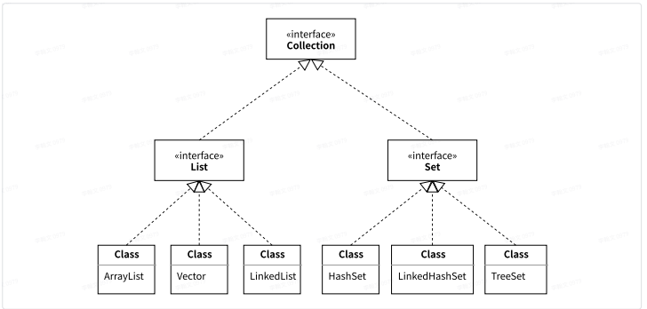

### Collection接⼝

单列集合的顶层接⼝

> Collection是大部分集合组件的父接口
>
> 1. 能保存多个元素
> 2. 提供了操作他们的一些基本方法CRUD（create research update delete）
>
> 3. 可以被迭代的（可以被循环输出）
>
> 4. 其中元素的顺序无法得到保证，具体要看实例化的是什么样的容器

#### 常⽤⽅法 

> * add ⽅法向集合集合中添加元素 
> * clear ⽅法,清空集合中所有元素
> * contains ⽅法 判断集合是否包含某个元素
> * isEmpty 判断集合是否为空
> * remove ⽅法 移除集合中元素，返回boolean类型。如果集合中不包含次元素，则删除失败
> * size() 返回集合中元素的个数 
> * toArray 将集合转换成数组。
> * toString 将数组转为集合
> * addAll 向⼀个集合中添加另⼀个集合
> * containsAll 判断⼀个集合中是否包含另⼀个集合
> * removeAll 从⼀个集合中移除另⼀个集合

### Collections⼯具类

* Collections.reverse(List list)   将集合元素进⾏翻转
* Collections.shuffle(List list)   将集合中的元素进⾏随机打乱
* Collections.sort(List list)  按照字典顺序

## List集合

### List集合

[List接口](https://so.csdn.net/so/search?q=List接口&spm=1001.2101.3001.7020)是单列集合的一个重要分支，下面主要有两个实现 `ArrayList `和`LinkedList`，List类型接口的特点是存储的元素是有序的，即存放进去是什么顺序，取出来还是什么顺序，也就是基于[线性](https://so.csdn.net/so/search?q=线性&spm=1001.2101.3001.7020)存储；因此在List接口中提供有大量根据索引来操作元素的方法；

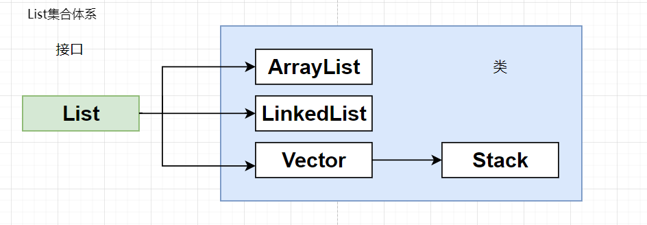

#### List特点

> 1. List接口存储的数据是有序排列的，原来存储的时候是什么顺序，取出来就什么顺序（Set接口存储的是无序的）；
> 2. List接口为存储的每一个元素都分配了一个索引，通过索引我们可以精确的来访问某一个指定的元素；
> 3.  List接口存储的数据允许存在重复，这与Set接口不同（Set接口不允许存储相同的元素）;

#### List接口

List是Collection的子接口，因此Collection中存在的方法List都存在；因为List的特点是有序，因此除Collection接口提供的方法之外List还添加了许多与顺序相关的方法，例如指定顺序插入，指定顺序删除，指定顺序替换等；

#### 常用方法

> * public boolean add(int index, E element)：将指定的元素，添加到该集合中的指定位置上。
> * public E get(int index)：返回集合中指定位置的元素。
> * public boolean remove(int index)： 移除列表中指定位置的元素, 返回的是被移除的元素。
> * public E set(int index, E element)：用指定元素替换集合中指定位置的元素,返回值的更新前的元素。
> * List<E> subList(int fromIndex, int toIndex)：从fromIndex下标截取到toIndex下标。

### ArrayList类

#### 常⽤⽅法

> * add(int index, E element)  在集合指定下标位置上添加元素
>
> * clear()  清空集合中所有的元素 
>
> * remove(int index)  移除集合中指定下标位置上的元素 
>
> * .lastIndexOf()  返回元素在集合中的下标（找到集合中最后⼀个相同元素），如果不存在返回-1
>
> * set(int index, E element)  修改集合中指定下标位置上的元素
>
> * get(int index)  获取指定下标位置上的元素 
>
> * subList(int beginIndex,int endIndex)   截取集合中指定下标开始到结束位置上的元素
>
> * list.listIterator();
>
>   ~~~java
>   /**
>   * List集合遍历的三种⽅式：
>   * 1、迭代器
>   * 2、for循环
>   * 3、foreach循环(增强for循环) 可以遍历数组和集合
>   *
>   * 语法：
>   * for(元素的类型 变量 : 数组|集合){ //变量就表⽰遍历出来的元素
>   *
>   * }
>   */
>   ~~~

#### 原理

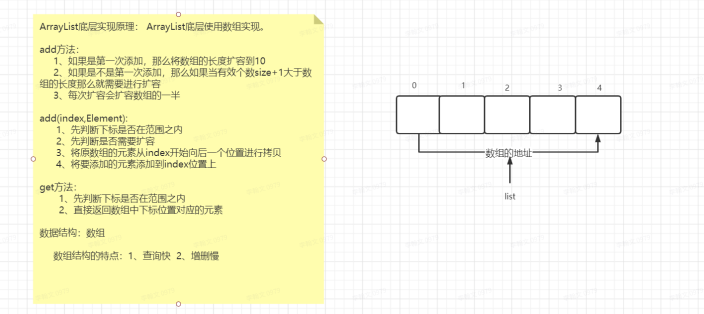

> List特点
>
> 1. 有序的（插入有序性）
> 2. 可以放置重复元素
>
> ArrayList
>
> 1. 基于数组实现的额，具备了数组所有的优点
> 2. 动态扩容
> 3. 随机查找速度非常快（基于下标访问的），随机插入非常慢，如果插入的index非常靠前，那么后面的每一个元素都要为前一个元素腾出位置来

~~~java
// 参数1：从哪个数组拷贝出来
// 参数2：从原先这个数组的第几个位置开始拷贝
// 参数3：拷贝到哪里去
// 参数4：拷贝的元素放到目标数组里面，是从第几个位置开始放置
// 参数5：一共需要拷贝多少元素
System.arraycopy(data, index + 1, data, index, (size - index - 1));
~~~

### LinkedList类

#### 常⽤⽅法

常⽤的⽅法与ArrayList⼀致。⾃⼰独有⼀些向⾸尾添加移除等⽅法(可以模拟对列、堆栈等数据结构)

> * offer("XXX")  向对列的尾部添加元素
> * poll()   获取并移除对列的头部的元素
> * element()  获取但不移除对列的头部的元素
>
> * peek()  获取但不移除对列的头部的元素

#### 原理

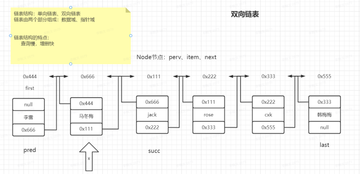

>  LinkedList 
>
>  * 是一个基于Node（节点）来实现的虚拟容器（没有具体的边界），每一个节点都会从"前"和"后"两个方向记住临近节点的信息
>  * 双向链表
>  * 优点：
>    随机访问的速度比较慢，但是随机插入、删除的速度比较快。

#### 堆栈和队列结构

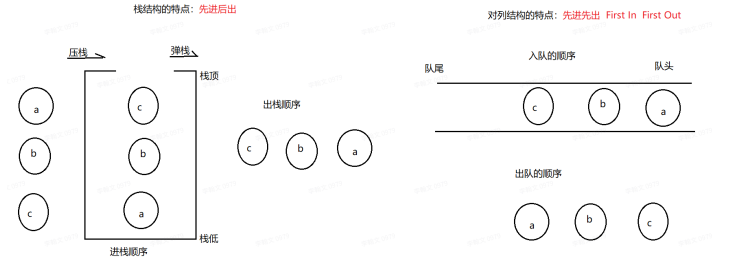

### Vector类

#### 常用方法

与ArrayList的方法基本一致

#### 原理

与 ArrayList 的底层⼀致，使⽤数组实现

#### 常⻅⾯试问题

> ArrayList 、 LinkedList 、 Vector 的区别: 
>
> * ArrayList和Vector底层使⽤数组实现(增删慢、查询快) 
>   1. ArrayList是当添加元素的时候，才会扩容数组，默认⻓度为10 
>   2. Vector是当创建对象的是，就创建⻓度为10的数组 
>   3. ArrayList线程不安全，效率⾼ 
>   4. Vector是线程安全的，效率低
> * LinkedList底层使⽤双向链表实现(增删快、查询慢)

### ArrayList、LinkedList、Vector特点

ArrayList

> 1. 基于数组
> 2. 默认容量为10，每次扩容上一次的一半；内存空间连续
> 3. 增删元素较慢--移动元素
> 4. 查询较快--下标
> 5. 线程不安全
> 6. 展示--查询居多时

LinkedList

> 1.  基于链表
> 2. 内存空间不连续
> 3. 增删元素较快
> 4. 查询较慢
> 5. 线程不安全
> 6. 购物车--增删频繁

Vector

> 1. 基于数组
>     
> 2. 初始大小：10
>
> 3. 扩容：每次扩容一倍，内存空间连续
> 4.  增删较慢，查询较快 
>
> 5. 线程安全
>
> 6.  java的最早的集合
> 7.  原生elementAt==get等
> 8. elements返回值为Enumeration，本质为迭代器

## Set集合

Set接口和List接口一样，继承与Collection接口，也是一个单列集合；Set集合中的方法和Collection基本一致；并没有对`Collection`接口进行功能上的扩充，只是底层实现的方式不同了（采用的数据结构不一样）

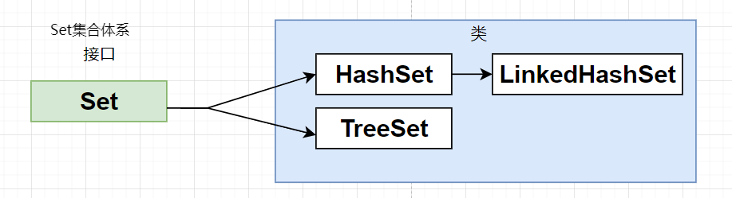

### HashSet类

#### 常用方法

与Collocation接口中定义的方法一致

#### 特点

* 无序
* 无下标
* 不可重复

#### HashSet 去重原理

> HashSet底层去重： ⾸先会⽐较两个对象的hashCode的值，如果hashCode值不⼀样，则直接认为两个对象是不同的对象，如果 HashCode值⼀样，那么就会⽐较两个⽅法的equals⽅法， 如果equals⽅法返回false，则表⽰两个对象是不同 的对象，如果equals⽅法返回true，则表⽰两个对象是相同的对象，则不会向HashSet中添加。
>
> 总之：HashSet确定对象是否重复，是先判断hashcode再判断equals，两者都相等则认为是相同对象

### LinkedHashSet类

> LinkedHashSet 
>
> 特点：:
>
> * 有序 
> * ⽆下标
> * 不可重复 
>
> 与⽗类的⽅法⼀致,去重的原理，也与⽗类⼀致

1. 底层实现 (LinkedHashMap)
2. 去重原理 (与hashSet⼀致)

### TreeSet类

> TreeSet特点：
>
> 1. ⽆序(但是有字典顺序) 
> 2. ⽆下标 
> 3. 不可重复

#### 常⽤⽅法

与 HashSet 类的⽅法⼀致 

**特点：使⽤ TreeSet 集合存储对象的时候，对象必须要实现Comparable接⼝**

#### 实现原理

TreeSet 在存储元素的时候，会调⽤ compareTo ⽅法。

两个作⽤：

1. 排序: 返回值⼤于0升序，返回值⼩于0降序 
2. 去重(返回值为0) TreeSet 认为返回0，两个对象就是相同的对象

> * TreeSet集合在保存对象元素的时候，对象必须要实现Comparable接⼝重写compareTo⽅法。
> *  TreeSet的去重原理为：如果compareTo⽅法的返回值为0，则认为是相同的对象
> * 如果compareTo⽅法的返回⼤于0则是升序排序，⼩于0则是降序排序

### Map集合

#### Map集合特点

* Map集合是双列集合，由key和value组成。称之为键值对
* 键的特点：⽆序，⽆下标，不重复。
* 值的特点：⽆序，⽆下标，可重复

#### Map集合体系结构

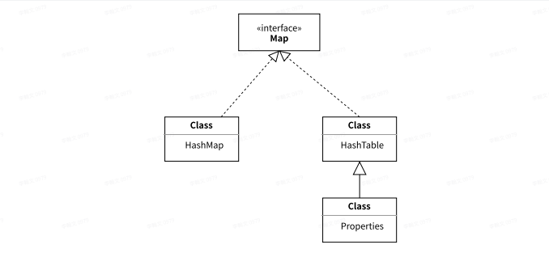

### HashMap

#### HashMap基本使⽤

> 常⽤⽅法
>
> * put(K key, V value)    向map集合中添加元素
> * get(Object key)   从集合中获取元素的值。根据key获取对应value
> * Set<K> keySet()  返回map集合中所有的key
> * clear()   清空map集合中的元素
> * Collection<V> values()   返回map集合中所有的value
> * remove("XXX")   根据key移除map中的元素
> * Set<Map.Entry<K,V>> entrySet()  返回map集合中所有的key和value (Entry)
> * boolean containsKey(Object key)    判断是否包含指定的key
> * boolean containsValue(Object value)     判断是否包含指定的value
> * V remove(Object key)
> * int size()

####  HashMap实际应⽤ 

https://blog.csdn.net/Bb15070047748/article/details/119350110

> * 可以使⽤Map 表⽰⼀个实体类
> * 可以使⽤List<Map<String,Object>> 表⽰⼀个实体类集合

#### HashMap底层实现原理

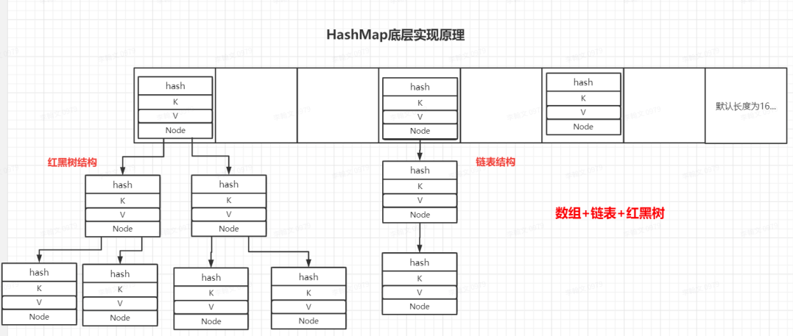

#### put的过程原码

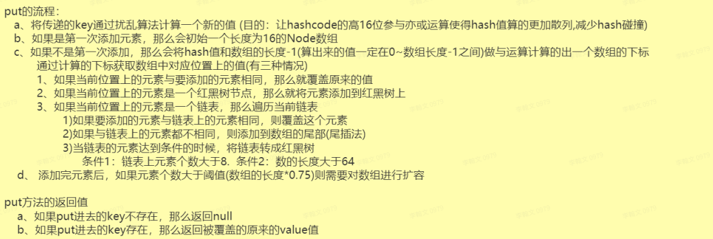

#### resize过程原码

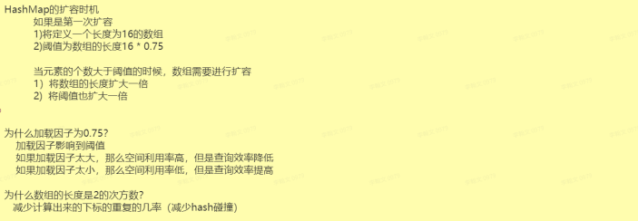

### HashTable

> Hashtable常⽤⽅法与HashMap⼀致
>
> HashMap与Hashtable区别： 
>
> * Hashtable是线程安全的，HashMap是线程不安全的
> * Hashtable中不允许存储null作为key和value，⽽HashMap可以 
>
> 在实际开发中⼀般都是⽤HashMap。考虑线程安全使⽤ConCurrentHashMap

### 常⻅的集合⾯试⾯试题

1. 简述：ArrayList、LinkedList、Vector的区别 
2. 简述：HashSet、TreeSet的去重原理
3. ArrayList、LinkedList底层实现 
4. HashMap、HashTable的区别
5. HashMap底层实现原理 
6. HashMap扩容机制 
7. HashMap的数组容量为什么是2的次⽅数
8. HashMap的负载因⼦为什么是0.75 
9. HashMap添加元素的过程 
10. 谈谈了解的数据结构

### 迭代器(Iterator)

#### 原理 

迭代是重复反馈过程的活动,其⽬的通常是为了逼近所需⽬标或结果。每⼀次对过程的重复称为⼀次“迭代” , ⽽每⼀次迭代得到的结果会作为下⼀次迭代的初始值。

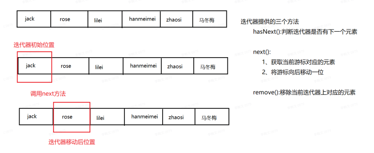

迭代：挨个儿访问其中的每一个元素 ，获取到能访问这个容器中的元素的一个指针，它默认是指向这个容器中第一个元素的上方

#### Iterator接口

在开发中，经常需要遍历集合中的所有元素。针对这种需求，JDK专门提供了一个接口`java.util.Iterator`。Iterator接口也是Java集合中的一员，但它与Collection、Map接口有所不同，Collection接口与Map接口主要用于存储元素，而Iterator主要用于迭代访问（即遍历）Collection中的元素，因此Iterator对象也被称为迭代器。

**迭代**：即Collection集合元素的通用获取方式。在取元素之前先要判断集合中有没有元素，如果有，就把这个元素取出来，继续在判断，如果还有就再取出出来。一直把集合中的所有元素全部取出。这种取出方式专业术语称为迭代。

**迭代器的作⽤：获取集合中的所有的元素**

#### 常用方法

~~~java
public E next():返回迭代的下一个元素。
public boolean hasNext():如果仍有元素可以迭代，则返回 true。
~~~

迭代器内部有个指针，默认指向第0行数据（没有指向任何数据），可以通过`hashNext()`方法来判断指针下一位指向的行是否有数据，通过`next()`方法可以让指针往下移动，通过hashNext()和next()方法我们可以利用while循环来变量整个迭代器的内容；

#### 迭代器使⽤常⻅问题

* 迭代器迭代完成之后，迭代器的位置在最后⼀位。 所以迭代器只能迭代⼀次 。

  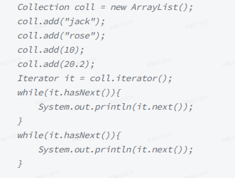

* 迭代器在迭代的时候，不要调⽤多次next⽅法，可能会出错 NoSuchElementException 。

  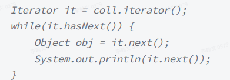

* 在迭代器迭代的时候，不能向集合中添加或者删除元素 ConcurrentModificationException。

  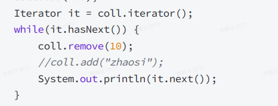

## 泛型

参 数 化 类 型 J D K 1 . 5 之 后

泛型擦除： JDK1.7之后 

java泛型详解：https://blog.csdn.net/s10461/article/details/53941091

1. 泛型，即“参数化类型”。一提到参数，最熟悉的就是定义方法时有形参，然后调用此方法时传递实参。那么参数化类型怎么理解呢？顾名思义，就是将类型由原来的具体的类型参数化，类似于方法中的变量参数，此时类型也定义成参数形式（可以称之为类型形参），然后在使用/调用时传入具体的类型（类型实参）。
2. 泛型的本质是为了参数化类型（在不创建新的类型的情况下，通过泛型指定的不同类型来控制形参具体限制的类型）。也就是说在泛型使用过程中，操作的数据类型被指定为一个参数，这种参数类型可以用在类、接口和方法中，分别被称为泛型类、泛型接口、泛型方法。

**泛型是用来限定类型的一种参数**

**所有的集合在使用泛型的时候，只能使用封装类型，不能使用基本类型**

例子：为解决如下 ：

~~~java
java.lang.ClassCastException: java.lang.Integer cannot be cast to java.lang.String
~~~

ArrayList可以存放任意类型，例子中添加了一个String类型，添加了一个Integer类型，再使用时都以String的方式使用，因此程序崩溃了。为了解决类似这样的问题（在编译阶段就可以解决），泛型应运而生。

### 特性

泛型只在编译阶段有效。在编译过程中，正确检验泛型结果后，会将泛型的相关信息擦出，并且在对象进入和离开方法的边界处添加类型检查和类型转换的方法。也就是说，泛型信息不会进入到运行时阶段。

**总结：泛型类型在逻辑上看以看成是多个不同的类型，实际上都是相同的基本类型。**

### 泛型的使用

三种使用方式，分别为：泛型类、泛型接口、泛型方法

#### 泛型类

> 泛型类 类名

泛型类型用于类的定义中，被称为泛型类。通过泛型可以完成对一组类的操作对外开放相同的接口。最典型的就是各种容器类，如：List、Set、Map。

最基本写法：

~~~java
class 类名称 <泛型标识：可以随便写任意标识号，标识指定的泛型的类型>{
  private 泛型标识 /*（成员变量类型）*/ var; 
  .....
  }
}
~~~

定义的泛型类，就一定要传入泛型类型实参么？

在使用泛型的时候如果传入泛型实参，则会根据传入的泛型实参做相应的限制，此时泛型才会起到本应起到的限制作用。如果不传入泛型类型实参的话，在泛型类中使用泛型的方法或成员变量定义的类型可以为任何的类型。

> 注意：
>
> * 泛型的类型参数只能是类类型，不能是简单类型。
>
> - 不能对确切的泛型类型使用`instanceof`操作。如下面的操作是非法的，编译时会出错。
>
>   ~~~java
>   if(ex_num instanceof Generic<Number>){   
>   } 
>   ~~~

#### 泛型接口

> 泛型接⼝ 接口名<T>

泛型接口与泛型类的定义及使用基本相同。泛型接口常被用在各种类的生产器中。

当实现泛型接口的类，未传入泛型实参时：

~~~java
/**
 * 未传入泛型实参时，与泛型类的定义相同，在声明类的时候，需将泛型的声明也一起加到类中
 * 即：class FruitGenerator<T> implements Generator<T>{
 * 如果不声明泛型，如：class FruitGenerator implements Generator<T>，编译器会报错："Unknown class"
 */
class FruitGenerator<T> implements Generator<T>{
    @Override
    public T next() {
        return null;
    }
}
~~~

当实现泛型接口的类，传入泛型实参时：

~~~java
/**
 * 传入泛型实参时：
 * 定义一个生产器实现这个接口,虽然我们只创建了一个泛型接口Generator<T>
 * 但是我们可以为T传入无数个实参，形成无数种类型的Generator接口。
 * 在实现类实现泛型接口时，如已将泛型类型传入实参类型，则所有使用泛型的地方都要替换成传入的实参类型
 * 即：Generator<T>，public T next();中的的T都要替换成传入的String类型。
 */
public class FruitGenerator implements Generator<String> {

    private String[] s = new String[]{"A", "B", "C"};

    @Override
    public String next() {
        Random rand = new Random();
        return s[rand.nextInt(3)];
    }
}
~~~

#### 泛型通配符

**同一种泛型可以对应多个版本（因为参数类型是不确定的），不同版本的泛型类实例是不兼容的**。

为解决泛型类实例，类型通配符应运而生。

**类型通配符一般是使用？代替具体的类型实参**。

可以解决当具体类型不确定的时候，这个通配符就是 **?** ；当操作类型时，不需要使用类型的具体功能时，只使用Object类中的功能。那么可以用 ? 通配符来表未知类型。

#### 泛型方法

> 泛型⽅法 public  <T> ⽅法名(T t,...){}

**泛型类，是在实例化类的时候指明泛型的具体类型；**

**泛型方法，是在调用方法的时候指明泛型的具体类型** 。

~~~java
/**
 * 泛型方法的基本介绍
 * @param tClass 传入的泛型实参
 * @return T 返回值为T类型
 * 说明：
 *     1）public 与 返回值中间<T>非常重要，可以理解为声明此方法为泛型方法。
 *     2）只有声明了<T>的方法才是泛型方法，泛型类中的使用了泛型的成员方法并不是泛型方法。
 *     3）<T>表明该方法将使用泛型类型T，此时才可以在方法中使用泛型类型T。
 *     4）与泛型类的定义一样，此处T可以随便写为任意标识，常见的如T、E、K、V等形式的参数常用于表示泛型。
 */
public <T> T genericMethod(Class<T> tClass)throws InstantiationException ,
  IllegalAccessException{
        T instance = tClass.newInstance();
        return instance;
}
~~~

##### 泛型方法的基本用法

~~~java
 /** 
     * 这才是一个真正的泛型方法。
     * 首先在public与返回值之间的<T>必不可少，这表明这是一个泛型方法，并且声明了一个泛型T
     * 这个T可以出现在这个泛型方法的任意位置.
     * 泛型的数量也可以为任意多个 
     *    如：public <T,K> K showKeyName(Generic<T> container){
     *        ...
     *        }
     */
    public <T> T showKeyName(Generic<T> container){
        System.out.println("container key :" + container.getKey());
        //当然这个例子举的不太合适，只是为了说明泛型方法的特性。
        T test = container.getKey();
        return test;
    }
~~~

##### 泛型方法总结

泛型方法能使方法独立于类而产生变化，以下是一个基本的指导原则：

> 无论何时，如果你能做到，你就该尽量使用泛型方法。也就是说，如果使用泛型方法将整个类泛型化，那么就应该使用泛型方法。另外对于一个static的方法而已，无法访问泛型类型的参数。所以如果static方法要使用泛型能力，就必须使其成为泛型方法。

#### 泛型上下边界

> ~~~java
> /**
> * 定义泛型上边界
> *
> * <? extends 类型>
> */
> public static void test02(List<? extends Number> list) {
> }
> 
> /**
> * 定义泛型下边界
> *
> * <? super 类型>
> */
> public static void test03(List<? super Number> list) {
> }
> ~~~