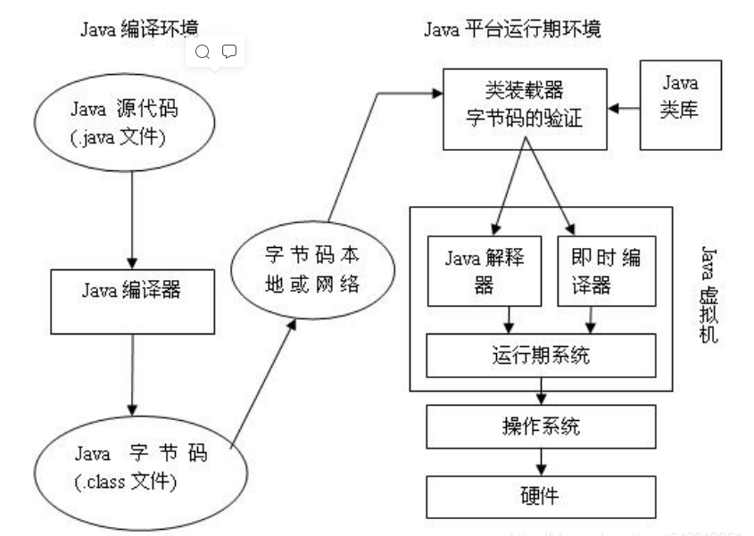
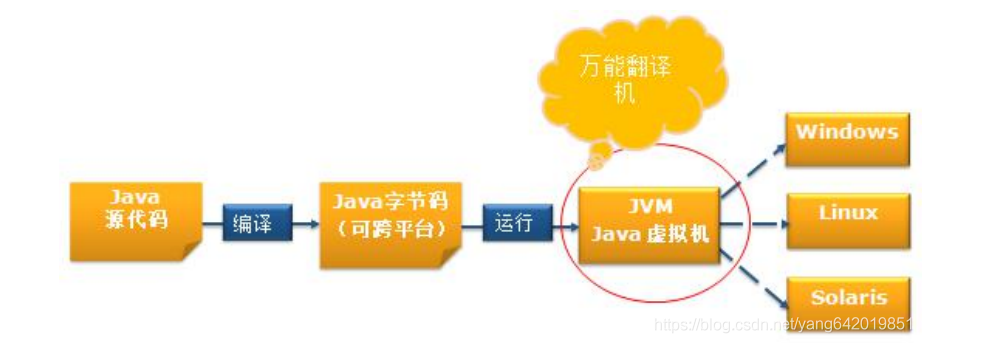
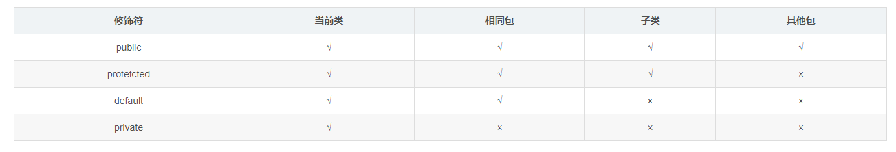
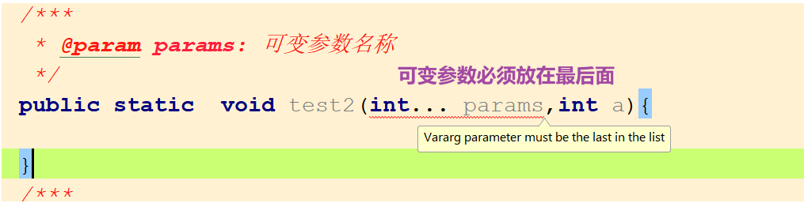
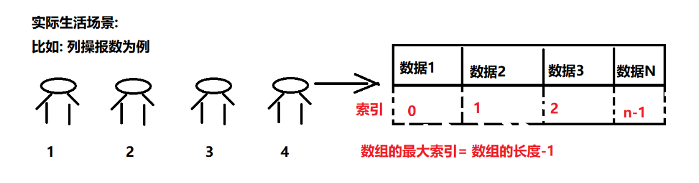
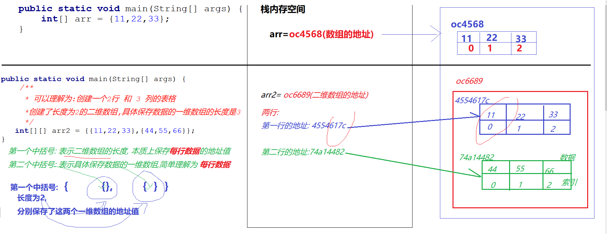
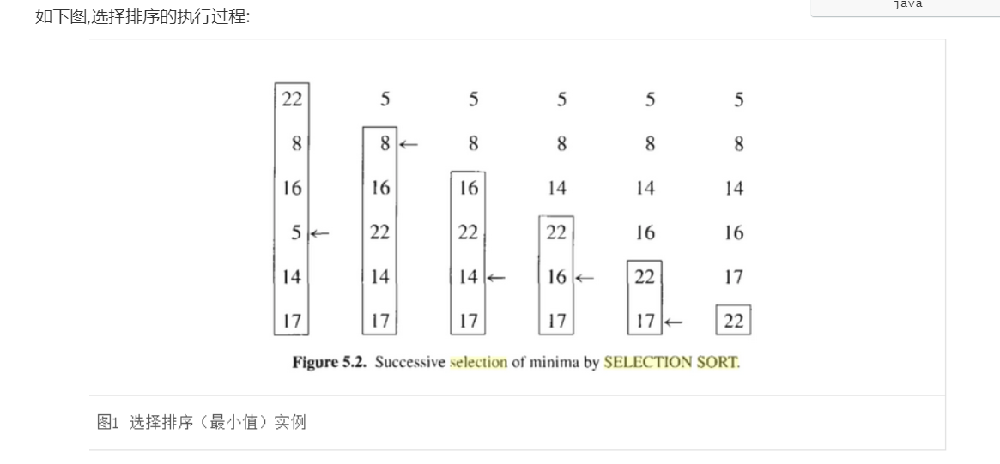
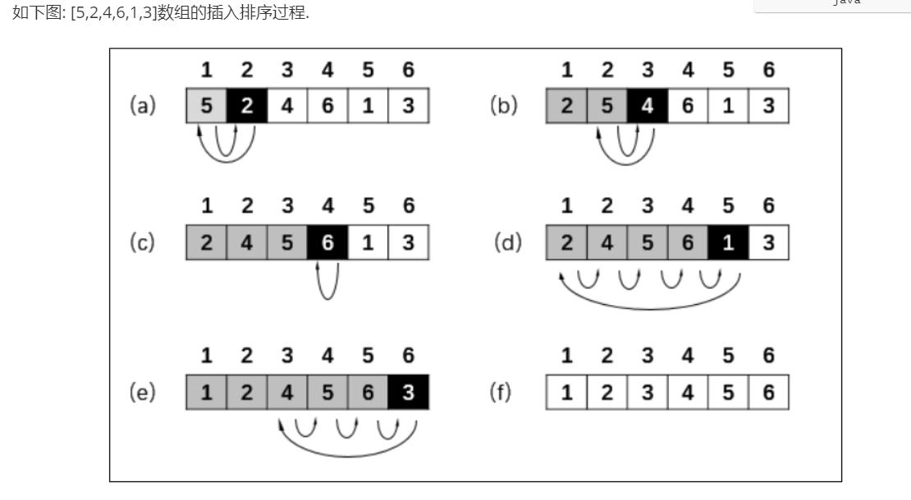

# Java 基础

# day02

## 1、java语言的特点：

java是一种强类型语言。强类型指的编写程序时,必须首先声明类型. 比如: 定义整数,声明整数类型

​	**简单性、面向对象、分布式、健壮性、安全性、体系结构中立、可移植性、解释型、高性能、多线程、动态性**

* **简单性：**Java语言是C++语言的一个“纯净”版本。没有头文件、指针运算、结构、联合、操作符重载、虚基类等。

* **面向对象：**面向对象即面向数据。Java的面向对象特性与C++旗鼓相当，Java与C++的主要不同点在于多继承，在Java中，取而代之的是更简单的接口概念。

* **分布式：**Java有一个丰富的例程库，用于处理像HTTP和FTP之类的TCP/IP协议。Java应用程序能够通过URL打开和访问网络上的对象，其便捷程度就像访问本地文件一样。

* **健壮性：**Java编写的程序具有多方面的可靠性。Java编译器能够检测许多在其他语言中仅在运行时才能检测出来的问题。

* **安全性：**Java适用于网络/分布式环境。从一开始，Java程序能够防范各种攻击，其中包括：运行时堆栈溢出。破坏自己进程空间之外的内存。未经授权读写文件。

* **体系结构中立：**编译器生成一个体系结构中立的目标文件格式，这是一种编译过的代码，只要有Java运行时系统，这些编译后的代码可以在许多处理器上运行。Java编译器通过生成与特定的计算机体系结构无关的字节码指令来实现这一特性。

+ **可移植性：**例：Java中的int永远为32位的整数，而C/C++中，int可能是16位整数、32位整数，也可能是编译器提供商指定的其他大小。这样的优点便消除了代码移植的问题。

+ **编译性:**指的高级语言编写的程序在运行前,先编译成计算机识别的代码,这个过程称之为编译：高级语言编写程序 *.java----------->-高级语言 编译   二进制 *.class----------------------> JVM 计算机运行

  运行特点:把程序一次性全部编译成二进制, 在计算机运行.

* **解释型：**Java解释器可以在任何一只了解释器的机器上执行Java字节码。
* **高性能：**字节码可以（在运行时刻）动态地翻译成对应运行这个应用特定CPU的机器码。
* **多线程：**多线程可以带来更好的交互响应和实时行为。如今大家非常关注并发性，我们不在追求更快的处理器，而是更多的处理器，Java是第一个支持并发的主流语言。
* **动态性：**库中可以自由地添加新方法和实例变量，而对客户段没有任何影响。

## Java两种核心机制

***Java 虚拟机(Java Virtual Machine) JVM***

JVM 可以理解成一个可运行 Java 字节码的虚拟计算机系统

- 它有一个解释器组件，可以实现 Java 字节码和计算机操作系统之间的通信
- 对于不同的运行平台，有不同 的 JVM。
- JVM 屏蔽了底层运行平台的差别，实现了“一次编译，随处运行”。

***垃圾回收器(Garbage Collection) GC***

* 不再使用的内存空间应当进行回收-垃圾回收。
* 在 C/C++等语言中，由程序员负责回收无用内存。
* Java 语言消除了程序员回收无用内存空间的责任：
* JVM 提供了一种系统线程跟踪存储空间的分配情况。并在 JVM 的空闲时，检查并释放那些可以被释放的存储空间。
* 垃圾回收器在 Java 程序运行过程中自动启用，程序员无法精确控制和干预。

## 2、java跨平台性

​	**java语言编写的程序可以运行在任意平台(指的操作系统)** 

### 2.1 平台（PlatForm）

​		平台: 指的操作系统.

​		通俗的来讲: 平台指的**安装了不同操作系统的计算机.**

​		注意:

​		操作系统不同, 安装不同操作操作的系统计算机就有差异.

​		比如:

​		安装了window操作系统的计算机:   安装软件的类型一般是exe文件.

​		安装了linux操作系统的计算机: 安装软件的类型一般是tar.gz文件

### 2.2跨平台（面试）

​		跨平台:  指的java语言编写的程序可以在任意平台运行.

​		跨平台, 可移植性等等,其实都是一个意思.

​		疑问: 

​		不同的平台,是有差异的, 那么java语言编写的程序怎么实现在不同平台运行呢?

​		问题:

​		java语言是怎么解决平台差异性问题?

​		java解决的方案: jvm虚拟机(翻译),如下图

​		实际生活的场景:

## 3、三大技术平台

* **javaSE**

  JavaSE（Java Platform Standard Edition）：Java标椎平台，所有的Java项目都需要JavaSE的支持，包括JavaEE 和JavaME亦是如此；如JavaWeb、Android、Java桌面软件，JavaFX 等；

  小结: 

  **javaSE是基础**,规定了开发的基本语言,基本规范, 后面的javaEE, javaME都需要遵循javaSE规定的标准.

  **javaSE应用与桌面开发,**比如: GUI等技术,类似与360完全卫士,百度网盘等桌面程序.

* **javaEE**

  JavaEE（Java Platform Enterprise Edition）：Java企业平台，用于开发和部署可移植、健壮、可拓展和安全稳定的服务器端Java应用程序，如企业的应用系统ERP、CRM、CMS、 OA，电信系统、银行系统等；Java EE是基于Java SE封装了Web服务、组件模型、管理和通信API，实现企业级的大型应用，如阿里巴巴的大部分应用都是基于Java开发的，不仅如此，阿里巴巴也基于Java封装了众多的Java中间件；

  小结:

  1. javaEE技术架构应用与企业级项目开发(简单,快捷)

  2. javaEE技术架构对javaSE进行了封装, 封装的目的: 简化代码量

     比如: javaSE开发企业级项目, 基本上每一步都需要书写. 类似与早期 手洗衣服,每一步都需要人参与.

     比如: javaEE开发企业级项目,可以简化代码量, 类似与现在的洗衣机衣服,只需人把衣服放到洗衣机, 然后取出来.

* **javaME**

  JavaME（Java Platform Micro Edition）: Java微型平台，也叫K-JAVA，
  用于开发移动设备、嵌入式设备（比如手机、PDA、电视机顶盒和打印机等，Java原本就是为了电视机顶盒而设计的），不过现在市场份额并不是很高了；

  比如: 早期塞班系统的诺基亚手机 采用javaME开发的游戏.

  现在移动开发技术,比如: Android, IOS,**H5**等技术,这些技术比较火. 所以javaME技术平台很少用了

## 4、Java虚拟机

​		java虚拟机, 简称为JVM(Java  Virtual Machine), 

​		**作用: 模拟真实计算机环境,java语言的编写的程序直接运行在JVM虚拟机,最终实现java语言的跨平台特性.**

​	如下流程:

​	java语言编写的程序(高级语言)----->编译:  class文件----->程序直接在JVM虚拟机运行---->JVM虚拟机在计算机上运行.

​	比如: 

​	安装了windows操作系统的计算机, 那么与之对应的windows系统JVM

​	安装了linux操作系统的计算机,那么与之对应的Linux系统JVM

## 5、JDK , JRE和JVM区别和联系

* **JDK：**Java Development Kit，Java 开发工具包。jdk 是整个 Java 开发的核心，它集成了 jre 和一些好用的小工具。例如：javac，java，javadoc,jar 等。

* **JRE：**Java Runtime Environment，Java 运行时环境，主要包含两个部分，jre包含的核心类库+JVM虚拟机。jvm 的标准实现和 Java 的一些基本类库。它相对于 jvm 来说，多出来一部分的 Java 类库。

* **JVM：**JAVA Virtual Machine，jvm 是 Java 能够跨平台的核心,实现一次编写，源码编译后的class文件是在jvm虚拟机运行.，多处运行(write once,run anywhere)
* **区别和联系**

**JDK、JRE、JVM区别与联系**
这三者的关系是：一层层的包含关系。JDK>JRE>JVM

在JDK下面的的jre目录里面有两个文件夹bin和lib,在这里可以认为bin里的就是jvm，lib中则是jvm工作所需要的类库，而jvm和 lib和起来就称为jre。JVM+Lib=JRE。总体来说就是，我们利用JDK（调用JAVA API）开发了JAVA程序后，通过JDK中的编译程序（javac）将我们的文本java文件编译成JAVA字节码，在JRE上运行这些JAVA字节码，JVM解析这些字节码，映射到CPU指令集或OS的系统调用。

区别： JDK和JRE一个是开发环境，一个是运行环境。在bin文件夹下会发现，JDK有javac.exe而JRE里面没有，javac指令是用来将java文件编译成class文件的，这是开发者需要的，而用户（只需要运行的人）是不需要的。JDK还有jar.exe, javadoc.exe等等用于开发的可执行指令文件。 JVM不能单独搞定class的执行，解释class的时候JVM需要调用解释所需要的类库lib。

## 6、java程序运行原理

# day03

## 7、java基础语法

### 7.1标识符

* 指在开发中，自定义的名称，这些名称统称为标识符

* 常见的标识符：**包名、类名、方法名、参数名、变量名、常量名等等；**

  **一个正确的标识符需要遵循以下规则：**

  1. 标识符可以由字母、数字、下划线（_）、美元符（$）组成，但不能包含 @、%、空格等其它特殊字符
  2. 不能以数字开头。如：123name 就是不合法
  3. 标识符严格区分大小写。如: tmooc 和 tMooc 是两个不同的标识符
  4. 标识符的命名最好能反映出其作用，做到见名知意。
  5. **标识符不能是Java的关键字**

  **命名规则（驼峰命名法）:**

  1. 类名和接口名：每个单词的首字母，其余为小写。（大驼峰）
  2. 方法名、变量名：第二个单词起的首字母为大写，其余全为小写。（小驼峰）
  3. 常量名：基本数据类型的常量名使用全部大写字母，字与字之间用下划线分隔。
  4. 标识符定义包名包名的单词都小写,多个包之间用点号连接.
  5. 最终使用标识符定义名称时: 做到见名知意.

### 7.2关键字

指的java中已经定义好的,并且被赋予了特殊的含义,用在特定的位置.

切忌:

程序中自定义的名称,其实就是标识符,  标识符不能使用java的关键字.		

在Java中,有一些单词被赋予了特定的意义,一共有50个关键字。

这关键字单词都是全小写,其中**有两个保留字:const和goto。**

**注意***：

* **关键字不能被用作标识符！**

* **java中经常使用并且具有特殊含义的单词,虽然不是关键字, 一般情况下不能随意使用**

  如：main

需要注意的是，除了上述的关键字以外**，true,false,null也不可以被用作标识符**

* **数据类型的关键字**

  long:  表示整数类型

  float: 表示浮点类型(其实就是小数)

  **double: 表示浮点类型(java默认, 其实就是小数)**

  char: 表示字符类型(使用单引号括起来的字符,比如: 'A')

  boolean: 表示布尔类型(取值是true或者false)

* **流程语句的关键字**

  if, else,  swithc :  用来判断的

  for, do,while: 用来遍历循环的

* **权限修饰符的关键字**

  public:  公共的, 目前修饰类和方法, 表示类是一个公共的类, 表示方法是一个公共的方法,可以在任意位置使用

  private: 私有的,  目前修饰类和方法, 表示类是一个私有的的类, 表示方法是一个私有的方法,只能在特定位置使用

  protected: 受保护的,  目前修饰类和方法, 表示类是一个受保护的的类, 表示方法是一个受保护的方法,只能在特定位置使用

* **定义类, 方法的关键字**

  final:  最终的,最后, 目前修饰数据, 通过使用final修饰的数据,称之为常量(constant)

* **定义包的关键字**

  package: 定义类所属的包(马上演示)

  import:  导入外部的包名.类名(稍后演示)

* package：包，其实就是目录，在代码开发中通常用多个目录来定义一个包，主要作用是用来区分一个项目下享用的类名。

  

   			 **-d**  表示 类带有package

  ​			  **.**     表示 类在当前目录

  运行编译好的类,如图

  

### 7.3注释

注释是对代码的解释或说明 ，用于提高代码的阅读性。

**注释参与代码的运行。**

**单行注释** 以  // 开头     一般用于定义的语句上面或变量上面

~~~java
//dgdfg
~~~

**多行注释** 以 /*  开始  */ 结尾   一般用于定义的方法上面 ，用于解释方法

~~~java
/*
*多行注释：
*定义了一个主方法main,作用：执行程序
*/
~~~

**文档注释** 以  /** 开头 */结尾   一般用于定义的类上面，对类进行标注或说明。

**文档注释在生成帮助文档后，会出现在里面，其他两种不会。**

使用生成帮助文档的命令:  javadoc   XXX.java  (必须保证执行命令时, XXX.java就在当前目录里面)

~~~java
/**
  文档注释：
  定义了一个类Demo2,演示注释
*/
~~~

### 7.4变量

变量  顾名思义：指的在程序运行过程中,可以改变的值, 称之为变量.

从本质上讲, 其实变量就是在内存中开辟了一块内存空间, 来保存变量的值.

* **定义方式一:  定义变量同时赋值**

  ​	类型  变量名称 = 值;

* **定义方式二:  1. 先定义变量的名称    2. 再给变量赋值**

  * 步骤一:   类型  变量名称;

  * 步骤二:    变量名称 = 值;

* **定义方式三:  批量定义变量以及赋值**

  类型 变量名称 = 值, 变量名称 = 值,------ 变量名称 = 值;

  注意事项: 定义方式三定义变量时, 多个变量之间用逗号隔开,最后一个变量用分号表示.

注意：

* 变量名不能重复使用。

* 定义变量是要给其赋值（不定义有输出是会报错）。

  

* 变量放在方法内部(局部变量), 没有初始值,在使用时,必须赋值

* 变量放在方法外部(成员变量),有初始值, 在使用时,可以不用赋值.

  

### 7.5常量

常量：指在程序运行中，不可以改变的值。

常用的常量：

注意：空常量不能直接被打印

### 7.6数据类型的基本类型

1. java是强类型语言：指在定义数据时，要先声明数据相应的类型，

2. java数据类型为两大类:：

* 第一大类:  引用数据类型(后面讲)

  比如: String  就是引用数据类型,

  比如:   null是引用数据类型的值.   String userName = null;

* 第二大类: 基本数据类型(今天讲)

  基本数据类型分为四类八种

  1. 整数类型: byte ,int, short , long
  2. 浮点类型: float, double
  3. 布尔类型: boolean (定义布尔类型,取值只有两种: true和false)
  4. 字符类型 : char   (定义字符类型的值,用单引号引起来, 单引号有且仅有一个字符)

  

3. 计算机存储单元

   * **计算机的最小单位是 :  Bit (位)**

     1Bit表示1个1或者1个0.

   * 计算机的最小存储文件的单位: Byte

     1Byte = 8Bit

     1KB  = 1024Byte.

     1MB = 1024KB

     1GB = 1024MB

4. 基本数据类型占的内存大小以及表示的数据范围

   

   如： byte类型 占内存的空间大小1个Byte , 等同于8位.

   

   

   * 注意:

     int 类型占内存4个字节,也就是32位, float类型占内存4个字节, 也是32位,为什么float表示的数据范围比int类型要大?

     float是浮点数 转成 整数, 转换规则(位运算)和 int是整数 的转换规则不一样, 所以float比 int的数据范围大.

   * 总结

     1. 整数型:  byte , short, int , long 在转换成10进制, 转换规则是一样, 如上图byte的转换
     2. 浮点型: float, double 在转成10进制时,转换规则是一样, 采用的位运算.
     3. 数据类型表示的范围从小到大依次为: 

   

5. 数据类型转换

   * 自动类型转换(类型提升), 数据类型依次为:如上图  （这种转换数据精度不会缺失）

   * 如果将大的数据类型转成小的数据类型, 需要强转. （这种转换会造成数据进度缺失）

### 7.7运算符

 运算符号将数据组织起来得到的是一个表达式.

 运算符:

* 算术运算符:  通过算术运算符组织的数据, 称之为算术表达式.比如:   int a=1; int b=2; int sum = **a+b**

* 比较运算符:  通过比较运算符组织的数据, 称之为条件表达式,  比如:   int a=1; int b=2;   boolean flag = **a>b**

* 逻辑运算符: 通过逻辑运算符组织的数据, 称之为关系表达式,  比如:   int a=1; int b=2; int c = 3  boolean flag =**(  a>b) && (c>b)**
* 三目运算符：类型  变量名称 =  (关系表达式或者条件表达式)  ?  值1 : 值2;(关系表达式或者条件表达式) 如果结果:  true,  变量名称 = 值1; 反之 变量名称 = 值2;

注意事项:

1. 基本类型在运算时, 定义的变量是什么类型, 运算以后得到的结果就是什么类型.

2. ++和--

   如果++在变量后面, 先给变量赋值, 然后再+1;

   如果++在变量前面, 先+1, 然后再给变量赋值

3. 比较运算符将数据给组织起来,得到是一个条件表达式,  最终得到的结果是boolean类型

4. 三目运算符：(关系表达式或者条件表达式) 如果结果:  true,  变量名称 = 值1; 反之 变量名称 = 值2;

5.  逻辑运算符

   * !   取反（非真既假）

   * &,   &&  表示 并且,  

     逻辑与 将多个条件表达式组合起来,构成了关系表达式, 

     如果多个条件表达式的结果都为true, 逻辑与的结果就是true

     只要有一个条件表达式的结果为false, 逻辑与的结果就是false.

     * &  和   && 区别

       1. 如果使用&, 那么所有的条件表达式都进行判断
       2. 如果使用&&, 如果左边的条件表达式结果为false, 那么就判断, 在企业开发中,推荐使用&&

   * |   或者  ||    表示或

     逻辑或运算符将多个条件表达式组织起来, 只要有一个条件表达式的结果为true,那么逻辑或的结果是true.

     逻辑或运算符将多个条件表达式组织起来, 所有条件表达式的结果为false,那么逻辑或的结果是false.

     * |  和  || 区别

       如果 | , 所有的条件表达式都要进行判断.

       如果||, 如果左边的条件表达式结果为true, 后面的条件表达式就不再判断了.

## 8、ASCII码

信息在计算机上是用二进制表示的，这种表示法让人理解就很困难。因此计算机上都配有输入和输出设备，这些设备的主要目的就是，以一种人类可阅读的形式将信息在这些设备上显示出来供人阅读理解。为保证人类和设备，设备和计算机之间能进行正确的信息交换，人们编制的统一的信息交换代码，这就是ASCII码表，它的全称是“美国信息交换标准代码”。

简单用一句话描述:

计算机的盘符(键盘上的文字)-------->ASCII码表<------映射成:  10进制数字(0-127)

## 8、Unicode码

* Unicode又称为统一码、万国码、单一码，是国际组织制定的旨在容纳全球所有字符的编码方案，包括字符集、编码方案等，它为每种语言中的每个字符设定了统一且唯一的二进制编码，以满足跨语言、跨平台的要求。

* Unicode标准也在不断发展，但最常用的是用两个字节表示一个字符（如果要用到非常偏僻的字符，就需要4个字节）。现代操作系统和大多数编程语言都直接支持Unicode。
  但是问题在于，原本可以用一个字节存储的英文字母在Unicode里面必须存两个字节（规则就是在原来英文字母对应ASCII码前面补0），这就产生了浪费。那么有没有一种既能消除乱码，又能避免浪费的编码方式呢？答案就是UTF-8！

* UTF-8编码
  * 这是一种变长的编码方式：它可以使用1~4个字节表示一个符号，根据不同的符号而变化字节长度，当字符在ASCII码的范围时，就用一个字节表示，保留了ASCII字符一个字节的编码做为它的一部分，如此一来UTF-8编码也可以是为视为一种对ASCII码的拓展。值得注意的是unicode编码中一个中文字符占2个字节，而UTF-8一个中文字符占3个字节。从unicode到uft-8并不是直接的对应，而是要过一些算法和规则来转换。
  * 在计算机内存中，统一使用Unicode编码，当需要保存到硬盘或者需要传输的时候，就转换为UTF-8编码。
  * 用记事本编辑的时候，从文件读取的UTF-8字符被转换为Unicode字符到内存里，编辑完成后，保存的时候再把Unicode转换为UTF-8保存到文件。

# day04

## **9、IDE**

 **IDE**(其实就是开发工具，下面介绍的开发工具的特点)

集成[开发环境](https://baike.baidu.com/item/%E5%BC%80%E5%8F%91%E7%8E%AF%E5%A2%83)（[IDE](https://baike.baidu.com/item/IDE)，Integrated Development Environment ）是用于提供程序开发环境的应用程序，一般包括代码编辑器、[编译器](https://baike.baidu.com/item/%E7%BC%96%E8%AF%91%E5%99%A8/8853067)、[调试](https://baike.baidu.com/item/%E8%B0%83%E8%AF%95)器和[图形用户界面](https://baike.baidu.com/item/%E5%9B%BE%E5%BD%A2%E7%94%A8%E6%88%B7%E7%95%8C%E9%9D%A2/3352324)等工具。集成了代码编写功能、分析功能、[编译](https://baike.baidu.com/item/%E7%BC%96%E8%AF%91/1258343)功能、调试功能等一体化的开发软件服务套。

常见的IDE开发工具:

* eclipse
* myeclipse
* sts
* idea(企业中普遍使用)

## 10、Scanner

* 是一个键盘扫描对象，通过键盘扫描获取用户输入。

- 一个简单的文本扫描器，可以使用正则表达式解析原始类型和字符串。 

- `Scanner`使用分隔符模式将其输入打破令牌，默认情况下匹配空格。  然后可以使用各种`next`方法将得到的令牌转换成不同类型的值。 

- 使用：通过创建对象进行使用   Scanner scanner=new Scanne(System.in);

  int a=scanner.nextInt();     

  nextByte()，nextDouble()，nextFloat()，nextLong()，nextShot()这些也可以通过Scanner进行扫描键盘输入，只要在输入时进行相应的数据定义就可以了。

  在创建**scanner**的时候会导入包  import   java.util.Scanner;

## 11、在流程语句中 switch注意细节

* 常量表达式的的诗句类型是：
  1. 整数类型：byte、short、int；
  2. 字符类型 ：char
  3. 枚举类型: enum, 从JDK1.5之后switch才支持枚举类型
  4. 字符串类型: String, 从JDK7之后switch才支持String类型
* **switch**  和  **if**  的区别：
  * switch的常量表达式有数据类型限制，而在开发过程中我们会判断很多类型的数据，所以switch的数据类型不能满足，我们队对数据类型的判断。
  * 使用  **if**  分支语句进行判断的时候没有数据类型的限制，在企业开发中一般使用  **if**  进行语句判断。

# day06

## 12、循环体语句

* **指重复执行的语句** ：有  for , while  ,  do   while  三种语句。

* 特点 ：代码重复执行；循环有开始, 有结束, 如果没有结束的循环,称之为死循环

### for循环

* 语句格式

~~~java
for(初始化语句;条件判断语句;条件控制语句){
    循环体语句;
}
初始化语句：指循环的起始位置；
条件判断语句:通过条件判断语句,来确定循环是否继续；
条件控制语句: 通过条件控制语句来控制循环执行的次数；
循环体语句: 指的循环重复执行的代码。
~~~

* 执行步骤：

1. 执行初始化语句

2. 进行条件判断语句

   如果条件判断的结果为false, 循环体语句就不执行了

   如果条件判断的结果为true,执行循环体语句

3. 执行完循环体语句以后,然后再执行条件控制语句

   重复第2步

4. 循环结束以后,执行其他语句

### while循环

* 语句格式

  ~~~java
  初始化语句;
  while(条件判断语句){
      循环体语句;
      条件控制语句;
  }
  ~~~

* 执行步骤

  1. 执行初始化语句(指的循环起始位置)

  2. 执行条件判断语句

     如果条件判断结果为false, 结束循环

     如果条件判断结果为true,执行循环体

  3. 执行每句循环体语句以后,再执行条件控制语句

     重复第2步执行

  4. 循环结束,执行其他语句.

### while和for循环区别

* while和for循环相同点

  执行流程是一样的.

* while和for循环区别

  1. for循环初始化语句对应的变量, 循环结束以后,就不能使用了

     

  2. while循环初始化语句对应的变量, 循环结束以后,可以继续使用

     

  3. for循环,必须清楚循环的起始位置,也就是说必须定义初始化语句.

  4. while循环, 可以不清楚循环的起始位置,也就是说不用定义初始化语句.

### 死循环

* 死循环概述

  指的循环体语句一直执行,不会停下来.

  死循环造成的问题:  内存溢出(指的内存空间不够用了,电脑会死机 )

* 死循环的语法

  方式一：

  ~~~java
  for(;;){    
      循环体语句;//会一直执行,不会停
  }
  ~~~

  方式二：

  ~~~java
  while(true){
       循环体语句;//会一直执行,不会停
  }
  ~~~

### do  while循环

* 语法格式

  ~~~java
  初始化语句
  do{    
      循环体语句;     
      条件控制语句;
  }while(条件判断语句);
  ~~~

* 执行步骤

  1. 执行初始化语句

  2. 执行循环体语句

  3. 执行条件控制语句,然后在执行条件判断语句

     条件判断的结果为false, 结束循环

     条件判断的结果为true, 重复从第2步开始执行

  4. 循环结束,执行其他语句。

### do-while 和while(for)的区别

* do---while

  由于do-while先执行循环体语句, 所以不管条件判断是否满足, do-while至少执行一次循环体语句.

* while(for)

  由于先执行条件判断语句,然后再执行循环体语句, 所以while再执行时,如果条件不满足,不会执行循环体语句.

###  break和continue

* break

  1. switch分支语句中, 使用break,用来结束分支语句的执行
  2. 循环语句,使用break,用来结束循环(跳出循环)

* continue

  只能应用与循环语句中, 用来结束本次循环(终止某个循环体语句的执行),可以继续下次循环(继续执行下个循环体语句).

### 嵌套循环

* 嵌套循环概述

  循环中嵌入了循环,这种写法就是嵌套循环.

  语法格式:

  ~~~java
  // 嵌套了两层循环
  for(----){//外层循环    
      for(----){//内层循环            
      }    
  }
  
  // 嵌套了两层循环
  for(----){//外层循环    
      while(----){//内层循环          
      }    
  }
  
  // 嵌套了两层循环
  for(----){//外层循环   
      do{//内层循环         
      }while(--); 
  }
  
  // 嵌套了两层循环
  while(----){//外层循环 
      for(---){//内层循环  
      }   
  }
  ~~~

* 两层嵌套循环的执行流程:

  1. 执行外层循环的初始化语句

  2. 执行外层循环的 条件判断语句

     如果外层循环的条件判断的结果是false, 整个循环结束了

     如果外层循环的条件判断结果是true, 那么执行内层循环(内层循环的执行流程和单个for或者单个while或者单个do while)一样

  3. 如果内层循环执行完毕以后, 接着执行外层循环的条件控制语句.

     重复从第2步的执行

  4. 循环结束,执行其他语句.

## 13、Random类

* 作用：获取随机数。

* 常用方法

  `nextInt()`:   获取一个任意的随机数

  `nextInt(int bound)`: 获取一个[0, bound)的随机数(获取一个大于等于0, 并且小于 bound的随机数)

# day07

## 14、方法（method、function）

* 介绍：指的将具有实际功能意义的代码抽取出来,封装成一个整体, 这个整体就是我们的方法
* 优点: 
  1. **把复用的逻辑抽取出来，封装成方法，提高代码的重用性**
  2. **实现相对独立的逻辑，提高代码的维护性**
  3. **可以对具体实现进行隐藏、封装**
* 作用：**简化代码，提高代码的可读性，可维护性，可重用性**
* 使用：1. 定义  2.调用

### 语法格式

~~~java
//public 关键字, 修饰方法,表示方法是公共的, 可以在任意地方使用
//static 关键字, 修饰方法, 表示方法是静态的,可以直接在main方法中使用(调用)
//void   关键字,修饰方法, 表示方法没有返回值(返回值稍后再讲),
//方法名称 标识符(identifier,由数字,下划线,英文字母,美元符号,不能以数字开头),方法名称的命名遵循小驼峰命名法
public static 返回值类型 方法名称(){ 
    方法体;// 实际功能意义的代码
    //方法体【函数体】 return 返回值；
 	//如果返回值类型void ,可以不用写return 也可以只写return
}
~~~

- 不写默认是default
- **修饰符的访问权限**

Java访问修饰符包括private，default，protected和public。含义分别表示私有的，默认的，受保护的和公有的访问修饰符。这些访问修饰符既可以修饰类中的属性，又可以修饰类中的方法，而public和default还可以修饰类。在同一个java文件里，公有类有且仅有一个，并且该文件命名为类名.java。

注意：

1. 定义方法时,使用static修饰的,可以直接在main方法中调用
2. 定义方法时, 位置和main同一个级别(指的定义的方法都在类的内部).
3. 定义方法时,不要在方法内部嵌套方法.

### 方法的分类

- **根据方法有没有参数,可分为:**
- 1.无参方法
- 2.有参方法
- **根据有没有返回值，可分为：**
- 1.无返回值方法
- 2.有返回值方法

### 参数区分

1. 形式参数

   形式参数在定义方法时, 在方法后面的小括号里面来使用.

   基本语法:

   ~~~java
   public  static void 方法名称(类型 形式参数的名称){}
   
   比如: 定义一个int类型的变量 : int  a;
   形式参数的定义 和 定义变量不赋值 是一样一样的.
   ~~~

2. 实际参数

   实际参数在调用方法时, 根据定义方法的形参类型赋值

   基本语法:

   ~~~java
   public static void main(String[] args){
       //调用方法
       方法名称(具体的数据);// 具体的数据就是实际参数. int a;   a=10;
   }
   ~~~

   注意：

   1. 实参的数量和类型必须和形参保持完全的一致。
   2. 如果定义方法有返回值，运算的结果会返回给调用者，调用者需要定义相同类型的变量接收数据

   **实际参数和形式参数之间的关联**

   

###  可变参数

* 语法格式

  ~~~java
  public static void  方法名称(数据类型... 可变参数名称){    方法体;}
  
  public static 返回数据类型  方法名称(数据类型... 可变参数名称){    方法体;    return  返回数据;}
  
  public static 返回数据类型  方法名称(数据类型 形式参数名称, 数据类型... 可变参数名称){    方法体;    return  返回数据;}
  ~~~

  可变参数的参数传递流程:

  

* 注意：

1. 可变参数在方法的参数里面有且仅有一个

2. 可变参数在和其它参数一块使用时, 可变参数必须放在参数列表的最后面.

3. 如图,错误的写法

   

   

### 方法的重载

函数的重载的原则（两等两小一大--中的一小：重写方法异常小于等于父类）

* 介绍

  方法重载指的方法名称相同, 方法的参数个数和参数类型不同.

* 特点

  1. 方法重载, 方法的名称必须相同
  2. 方法重载, 方法的参数个数可以不同
  3. 方法重载, 方法的参数类型可以不同
  4. 方法重载, 与方法是否有返回值无关

### 数组

* 介绍: 数组用来保存同一种数据类型,多个数据的"容器"

* 特点:

  1. 数组里面保存的数据类型是一样
  2. 数组里面可以保存多个数据
  3. 数组的长度是固定的

* 常见的数组的创建

  1. 方式一:  创建一个动态数组(可以动态赋值)

     数据类型[]  数组名称 = new  数据类型[数组长度];

     或者

     数据类型  数组名称[] = new  数据类型[数组长度];

  2. 方式二: 创建一个静态数组(已经赋值了)

     数据类型[]  数组名称  = {值1, 值2, 值3,---值N};

     或者

     数据类型  数组名称[] = {值1, 值2, 值3,---值N};

### 成员变量和局部变量

* 成员变量:

  定义在方法外部的变量,称之为成员变量

* 局部变量

  定义在方法内部的变量称之为局部变量.

* 成员变量和局部变量的区别(大家不用死记硬背,用的多了,自然就会了)

  1. 成员变量一般可以被权限修饰符修饰(比如public)

  2. 局部变量不可以使用权限修饰符修饰

  3. 成员变量可以在类的任意方法内部使用

  4. 局部变量不可以在其它方法内部使用

  5. 成员变量可以不用赋值,一般都有默认值

     基本类型的成员变量

     int  ,默认值是0

     double, 默认是0.0

     引用类型的变量没有赋值,默认值是null.

     注意: 不能直接打印null

  6. 局部变量必须赋值

* 补充说明

  ~~~java
  public class Demo1 {
      //1.定义成员变量,有初始值
      public static  int a=10;
      //2.定义成员变量,没有初始值, 默认值0
      public static  int b;
      //3.成员变量不被static修饰
      public  int c=100;
      //4. 成员变量不被static修饰,不被public修饰,具体后面在讲
      int d=10;
      
      //3.主方法: main方法是被static修饰的方法, 
      // mian如果使用成员变量,
      // 情况一: 成员变量被static修饰,可以直接使用, 比如:  static  int a=10;
      // 情况二: 成员变量不被static修饰,可以直接使用, 比如: new Demo1().c
      public static void main(String[] args) {
          System.out.println(a);
          System.out.println(new Demo1().c);
      }
  }
  ~~~

### 方法参数之基本类型和引用类型的区别

* 回顾基本类型

  整数类型:  byte  short  int  long

  浮点类型: float,  double 

  字符类型: char

  布尔类型: boolean

* 程序运行的流程

  *.java(源码文件)------>编译:  *.class(字节码文件)---------->直接在jvm虚拟机上运行

* JVM内存分配(先说2块内存)

  1. 栈内存:  保存要执行的方法(包含方法内部的方法体, 基本类型的局部变量,基本类型的参数等)
  2. 堆内存:  保存引用类型的对象

* 方法定义的基本类型的参数

  特点:

  **方法的参数是基本类型, 方法执行完毕,方法出栈,那么基本类型 的参数也会从栈中移除**

  如图:

  

* 方法的参数是引用类型

  特点:

  **方法的参数是引用类型, 引用类型的数据在堆空间保存, 方法执行完毕出栈,不影响引用类型 的参数.**

### 方法递归

* 什么是递归

  简单理解: 方法递归指的在方法内部调用当前方法.

  注意细节:

  1. 不能出现无穷递归
  2. 找到递归的出口(指的递归何时结束)

  应用场景:

  企业开发中,如果需要层层去分析,要使用方法的递归.

  比如: 

  分析某个目录下面有什么文件以及子目录就要使用递归.

# day08

## 15、数组

* 数组：数组就是在内存中开辟了一段连续的空间, 用来保存同一种数据类型的"容器".

* 数组特点:

  1. 数组可以保存多个数据
  2. 数组保存的数据是同一种数据类型
  3. 数组的长度是固定的

  如图：一条烟: 一段连续的空间,保存的几盒烟是有限制的.

  ​		    一盒笔: 一段连续的空间,保存彩笔的个数是有限制的.

  

* 适用
  1. 如果需要保存多个数据, 这时使用数组来保存.
  2. 如果对多个数据进行统一的操作, 这时可以使用数组.

### 数组创建

**动态创建**

* 语法格式:

  **类型 [ ]   数组名称  =  new  类型 [ 数组的长度]**  或者  类型    数组名称 [ ] =  new  类型 [ 数组的长度] 

  数组的长度: 其实指的数组保存数据的个数

* 动态创建数组特点:

1. 创建数组时,这时在内存中开辟一段连续的空间, 这个空间指的保存数据的最大个数。

2. 数组里面没有赋值, 数组里面有默认值.

   比如: int类型的数组,如果没有赋值, 默认值都是0

   比如: double类型的数组,如果没有赋值, 默认值都是0.0

   比如: String类型的数组,如果没有赋值, 默认值都是null

   注意: 如果数组是引用类型的引用类型的数组,如果没有赋值,里面的默认值都是null, 比如String

**静态创建**

* 语法格式

  **数据类型[]  数组名称 = {数据1, 数据2,----数据N}** 和 数据类型  数组名称[] = {数据1, 数据2,----数据N}

* 静态创建数组特点

  1. 数组里面有初始值
  2. 数组的长度也是固定的

  注意：静态数组创建是不能为空，为空就是没有在内存中开辟一段连续空间(意味数组没有长度,也就意味着没有索引)

### 数组使用

* 数组 的长度

  int  数组的长度=  数组.length;

* 索引

  1. 什么索引,索引对数组的作用

     索引是数组中数据的唯一标识.

  2. 索引的特点

     由于计算机习惯从0开始,索引也默认使用计算机的特点

     从0开始的,最大索引值= 数组的长度-1

     如图所示:

     

### 数组的取值和赋值操作

* 取值

  1. 什么是取值?

     从数组中获取数据, 通过索引获取数据.

     语法:

     **类型  变量名称 =  数组[ 索引 ];**

* 赋值

  2. 什么是赋值

     给数组对应索引的位置赋一个新的数据.

     语法:

     **数组[索引]=新的数据;**

###  数组的遍历

* 方式一:  普通for循环遍历, 使用的索引进行遍历的(最大索引值= 长度-1)

  基本语法:     快捷键 fori   itar

  ~~~java
  for(int index=0; index<数组的长度; index++){   
      //遍历数组, 取值, 赋值
  }
  for(int index=0; index<=数组的长度-1; index++){   
      //遍历数组, 取值, 赋值
  }
  ~~~

* 方式二:  增强for遍历(从JDK1.5版本以后才有的),使用的迭代器实现的(后面在讲集合时,会讲迭代器)

  基本语法:    快捷键  iter

  ~~~java
  for(数组的数据类型 变量名称 :  数组){
       //遍历数组, 取值, 赋值
  }
  //变量名称: 用来表示数组中的每一个元素
  ~~~

### 数组在内存中存储:  **堆内存**存储

 **java执行原理**

~~~java
*.java(源码)(高级语言编写的程序)------>编译: *.class(字节文件)---->JVM虚拟机运行(虚拟机运行在计算机的内存上)
~~~

### jvm内存分配

https://codertao.blog.csdn.net/article/details/89142396?spm=1001.2014.3001.5502

* 栈内存空间: 

  执行的方法,栈里面存的执行的方法,包含方法的参数,方法内部的局部变量等等

  特点:  先进后出.

  

* 堆内存空间

  堆里面保存的引用类型的对象.

  堆里对象的特点:

  当对象不被引用(指的对象不再使用了), 对象最终被java的GC回收.

### 数组在堆里面存储情况

* 一个数组在堆里如何存储

  1. 静态数组在堆里面的存储情况

  

  2. 动态数组在堆里的存储情况如何

  

* 多个数组在堆里如何存储.(省略)

  和一个数组的存储情况一样

* 一个数组赋值给另一个数组,如何在堆里存储的.

  

### 数组的扩容

https://blog.csdn.net/csdn_cai/article/details/107664929

* 数组的长度是固定的。

* 扩容: 改变数组的长度

  分析: 数组的长度是固定, 该如何扩容.

  思路是这样的:

  1. 新建一个数组,指定扩容后的长度
  2. 将原有数组的数据设置到新的数组里面
  3. 将新建的数组再赋值给原有数组,完成原有数组的扩容

# day09

## 16、debug

* Bug：指程序中的故障(程序中的异常或错误 )
* DeBug: 通过调试程序,排除程序中的故障

### BreakPoints断点

* DeBug对程序进行调试,在调试时,需要将程序停下来.

* 怎么让程序停下来, 通过设置断点,让程序停下来

* BreakPoints断点概述

  指的阻断程序执行的"收费站,水闸",那么"收费站,水闸"就是所谓的断点.

* 总结

  1. 断点：通过在程序中设置，才能阻断程序的执行。
  2. 调试时，如果发现断点附近程序出现了故障(清楚了程序的问题所在)，后面的程序就不再执行了，如果断点处的程序没有故障，放开断点，然程序继续向下执行，继续调试。

### 常见的菜单按钮(菜单按钮有对应快捷键)说明

https://blog.csdn.net/weixin_48692664/article/details/107222006

### 小结

* 断点调试前提:  DeBug方式启动程序

* 断点执行流程

  1. 以debug的方式运行程序
  2. 点击箭头向下图标 (按F8或者F7，如果不好用（fn+f8,fn+f7）)
  3. 程序一直一步一步的向下执行
  4. 如果在执行到某一步程序不向下执行了，说明这一步代码有问题
  5. 如果程序最终执行完毕，说明程序一般没有问题。

* 注意

  调试如果发现程序不能继续向下执行了,说明此处的位置,代码出现了bug.

## 17、Arrays工具类

* 该类包含用于操作数组的各种方法（如排序和搜索）。 该类还包含一个静态工厂，可以将数组视为列表。 
* 总结
  1. "遍历"数组
  2. 对数组进行排序
  3. 对数组进行比较,判断是否是相同的数组
  4. 将数组转成集合

### 常用API

* 遍历数组的方法

  ~~~java
  Arrays类定义的方法:  toString(类型[] 数组名称);// 遍历的数组类型是任意的
  ~~~

* 对数组进行排序(Arrays底层使用的快速排序算法)

  ~~~java
  Arrays类定义的方法:
  sort(类型[] 数组名称);// 对数值类型的数组进行排序.
  sort(T[] a, Comparator<? super T> c);//根据对象里面的数值属性进行排序,在排序时指定Comparator(了解)
  ~~~

* 对数组进行比较,判断是否是相同的数组

  ~~~java
  Arrays类定义的方法:
  static boolean equals​(int[] a, int[] a2) 
  ~~~

* 将数组转成集合

  ~~~java
  static <T> List<T> asList(T... a) ;// a是可变参数,其实就是数组,将数组转成list集合
  ~~~

### 使用

* 步骤一:  导入包

* 步骤二: 可以直接通过工具类, 来调用方法.

* 注意:

  Arrays工具类里面的方法都是被static修饰的, 特点可以直接通过类名调用,

  也可以通过对象调用(由于构造方法被私有化了,所以不能new).

~~~java
public static void main(String[] args) {
        //1.定义一个数组
        int[] arr ={11,55,22,33};
        int[] arr2 = {55,11,22,33};
        System.out.println(Arrays.equals(arr,arr2));
        //2.数组进行排序
        Arrays.sort(arr);
        //3.遍历
        System.out.println(Arrays.toString(arr));
        //2.数组--->list(今天了解,后面详细讲)
        List<int[]> ints = Arrays.asList(arr);
    }
~~~

## 18、二维数组

 二维数组介绍: 一维数组中的一维数组.

可以把二维数组理解为二维表格(多行多列).

### 创建

* 方式一

  ~~~java
  类型[][] 数组名称 ;
  数组名称= new [表示的索引][表示具体保存数据的一维数组的长度]
   或者
  类型[][] 数组名称 ;
  数组名称= {{表示具体的数据},{表示具体的数据},{表示具体的数据}};
  ~~~

* 方式二

  ~~~java
  类型[][] 数组名称 = new 类型 [长度1][长度2]
   长度1 表示 另个一维数组的索引
   长度2:表示具体保存数据的一维数组的长度
  比如: 
  int[][] arr  = new int[2][3];
  比如: arr={{11,22,33},{100,200,300}}
  ~~~

* 方式三

  ~~~java
  类型[行][列] 数组名称 = {{具体的数据},{具体的数据},{具体的数据}};
  [行]: 表示另一个一维数组的索引
  [列]: 表示具体保存数据的一维数组的长度
  ~~~

* 方式四

  ~~~java
  类型[][] 数组名称 = new 类型[行][];//创建一个不规则的二维数组.
  ~~~

代码如下

~~~java
public static void main(String[] args) {
        //类型[][] 数组名称 ;
        //数组名称= {{表示具体的数据},{表示具体的数据},{表示具体的数据}};
        int[][] arr;
        arr =new int[2][2];
        //创建了一个长度为2的二维数组,那么具体保存数据的一维数组的长度是2
       int[][] arr2 = {{11,22},{33,44}}; 
       arr =arr2;
       //创建二维数组
        // arr3: 表示创建了长度为3的二维数组,具体保存数据的一位数组的长度不确定
        int[][] arr3 = new int[3][];
        //创建了一个 "3行", "每行数据个数不固定"的二维数组
        int[][] arr4 = {{1,1,1},{2,2,3},{6,6,6,7,10,1100}};
        arr3 = arr4;
    }
~~~

### 二维数据在内存中的存储情况

一维数组在内存的存储情况

### 二维数组的使用

* 二维数组的特点

  1. 第一个中括号,可以理解为行号, 行号从0开始的

  2. 第二个中括号,可以理解为每行里面保存的具体数据, 那么数据对应的索引从0开始

     (注意: 每行的数据对应的索引都是从0开始的)

* 取值

* 赋值

* 遍历

# day10

## 19、排序

### 冒泡排序

排序时,相同位置的元素两两比较,比较的结果得到一个最大值(或者得到最小值),最后最大值(最小值)"浮出水面"

思路：通过嵌套循环. 在内层循环中实现数组中相邻数据的两两比较.

~~~java
 public static void main(String[] args) {
        //1.定义数组
        int[] arr = {11,5,18,19,7};
        //2.嵌套循环:
        //arr.length-1: 实现数组两两比较,多少轮
        for (int i = 0; i <arr.length-1 ; i++) {
            //3.内层循环实现两两比较, 从小到大排列
            for (int j = 0; j <arr.length-1-i ; j++) {
                //4.前面的数据如果大于后面的数据,实现位置互换
                if(arr[j]>arr[j+1]){
                    //5.定义一个临时变量(第三个瓶子)
                    int temp = arr[j+1];
                    arr[j+1]=arr[j];//将大的数据放后面
                    arr[j]=temp;
                }
            }
        }
        System.out.println(Arrays.toString(arr));
    }
~~~

### 选择排序

选择排序是一种简单直观的排序算法。它的工作原理是：第一次从待排序的数据元素中选出最小（或最大）的一个元素，存放在序列的起始位置，然后再从剩余的未排序元素中寻找到最小（大）元素，继续放在起始位置直到未排序元素个数为0。

~~~java
public static void main(String[] args) {
        //1.定义一个数组: 从大到小排列
        int[] arr = {11,5,18,19,7};
        //2.嵌套循环: 拿外层循环的数据 和内层循环的数据进行比较
        // (从小到大排列的数组,每轮得到最小值)
        //arr.lenth-1 : 只比较5轮
        //获取比较的次数
        /***
         * 前面的大于后面,通过位置交互, 将大的数据放在后面,将小的数据放在前面
         * 第一轮比较:
         * i=0; j=1,2,3,4 取外层的arr[0],与内层的 arr[1],arr[2],arr[3],arr[4]
         * 得到: {5,----------}
         * 第二轮比较:
         * i=1,j=2,3,4, 取外层的 arr[1],与内层的 arr[2],arr[3],arr[4]
         * 得到: {5,7,-----------}
         * 第三轮比较:
         * i=2,j=3,4, 取外层的 arr[2],与内层的arr[3],arr[4]
         * 得到: {5,7,11,--}
         * 第四轮比较:
         * i=3,j=3,4, 取外层的 arr[3],与内层的arr[4]
         * 得到: {5,7,11,18-}
         * 第五轮比较:不需要了
         
         * 得到: {5,7,11,18,19}
         */
        int count =0;
        for (int i = 0; i < arr.length-1; i++) {
            //3.取出外层循环的数据
            //int outer = arr[i];
            //4.内层循环
            for (int j = i+1; j <arr.length; j++) {
                //5.取出内层循环的数据
                //int inner = arr[j];
                //6.进行比较
                if(arr[i]>arr[j]){
                    int temp = arr[j];
                    arr[j]=arr[i];//将的数据放在后面
                    arr[i]=temp;
                }
                count++;
            }

        }
        System.out.println("比较次数: "+count);
        System.out.println(Arrays.toString(arr));

    }

    private static void test1() {
        //1.定义一个数组
        int[] arr = {22,8,16,5,14,17};
        //2.嵌套循环: 拿外层循环的数据 和内层循环的数据进行比较
        // (从小到大排列的数组,每轮得到最小值)
        //arr.lenth-1 : 只比较5轮
        //1轮: 22, {8,16,5,14,17}; 5次  ,比较的结果: {5,-----}
        //2轮: 8, {8,16,22,14,17}; 5次
        for (int i = 0; i < arr.length-1; i++) {
            //3.取出外层循环的数据
            //int outer = arr[i];
            //4.内层循环
            for (int j = i+1; j <arr.length; j++) {
                //5.取出内层循环的数据
                //int inner = arr[j];
                //6.进行比较
                if(arr[i]>arr[j]){
                    int temp = arr[j];
                    arr[j]=arr[i];//将的数据放在后面
                    arr[i]=temp;
                }
            }
        }
        System.out.println(Arrays.toString(arr));
    }
~~~

### 冒泡排序和选择排序的区别

* 不同点

  比较方式不一样.

  冒泡排序比较的 方式: 相同位置的元素进行比较,如果实现的从小到大排列, 每一轮比较的结果,得到一个最大值放在数组后面.

  选择排序比较的方式: 让外层循环的数组的数据和内层循环数组的数据进行比较,如果从小到大排列, 每一轮比较的结果,得到一个最小值放在数组前面.

* 相同点

  如果写标准的冒泡排序, 那么执行的时间复杂度(比较次数,比较次数越多,耗费时间就越长)和选择排序的时间复杂度是一样的.

  推荐使用选择排序吧.

### 插入排序

* 插入排序实现思想(数组从小到大排列)

  对于前面已经排序好的元素, 用未排序的数据和前面已经排序好的数据进行比较, 如果未排序的数据大于已排序好的数据,那么将未排序好的数据插入到前面.

  简单理解:

  将数组"一分为二"

  1. 已经排序好的数组
  2. 未排序好的数组
  3. 从未排序好的数组取出其中的数据(和已排序好的数据是相邻位置)与已经排序好的数组的数据进行比较

* 如图分析: int[] arr = {5,2,4,6,1,3};

~~~java
 /**
     * 第一轮比较:
     * i=0;  不比较
     * 第二轮比较:
     * i=1: 比较一次:  arr[0]与arr[1],得到的结果: {2,5,-------}
     * 第三轮比较:
     * i=2; 比较: arr[1]与arr[2],arr[0]与arr[1] 得到的结果: {2,4,5,----}
     * 第三轮比较:
     * i=3, 比较: arr[2]与arr[3],arr[1]与arr[2],arr[0]与arr[1],得到的结果: {2,4,5,----}
     * 第四轮比较
     * i=4. 比较:arr[3]与arr[4],arr[2]与arr[3],arr[1]与arr[2],arr[0]与arr[1],
     * 得到的结果: {2,4,5,6----}
     * 第五轮:
     * 得到的结果:{1,2,4,5,6----}
     * 第六轮:
     * 得到的结果:{1,2,3,4,5,6}
     */
    public static void main(String[] args) {
        //1.定义好的数组
        int[] arr = {5,2,4,6,1,3};
        //2.定义外层循环: 确定比较多少轮
        for (int i = 0; i <arr.length; i++) {//0,1,2,3,4,5
            //3.内层循环
            for (int j = i; j >0; j--) {
                //4.进行比较
                // arr[j-1] : 属于已经排序好的数组中的数据
                // arr[j]: 未排序好的数组中的数据
                if(arr[j-1]>arr[j]){
                    //进行位置互换
                    int temp = arr[j];//取出小的数据
                    arr[j] = arr[j-1];//将大的数据放后面
                    arr[j-1]=temp;//将小的数据放前面
                }
            }
        }
        System.out.println(Arrays.toString(arr));
    }
~~~

插入排序: 当要排序的数组中的数据比较少时,推荐使用插入排序(耗费时间少)

Arrays的sort方法默认采用快速排序

## 20、面向对象

### 对象

在开发中，万物皆是对象。

* 对象特征
  1. 对象都有自己的特征，专业术语称之为属性。
  2. 对象都有自身的行为，专业术语称之为行为。

### 面向对象和面向过程的区别.

* 面向过程:

  面向过程就是开发时,分析的是问题的解决步骤,然后调用方法一步一步去解决.不同的问题,不同的解决方案

  优点:  执行时间短,效率高, 比如: 游戏开发采用C语言(面向过程的开发语言)

  缺点: 代码不能复用.

* 面向对象

  面向对象就是开发时, 分析问题的具体实现对象是"谁", 而不考虑具体的实现过程.

  优点: 代码可以复用

  缺点: 执行时间长,效率低.

### 类

类可以简单理解为程序中的"模板", 在模板里面包含了现实对象的属性和行为.

专业术语: 类其实就是将现实中对象的属性和行为抽取出来,封装的一个整体.

#### 类的定义

* 步骤一: public  class   类名
* 步骤二: 在类的内部描述现实对象的属性: 通过成员变量来表示类里面的属性

* 步骤三: 在类的内部描述现实对象的行为: 通过方法来表示类里面的行为.

~~~java
public class Dog {
    //颜色
    String color;
    //品种
    String dogType;
    //性别
    int  sex;// 1 表示公, 0 表示母
    //年龄
    int age;
    //行为
    public static void  dogSound(){
        System.out.println("狗吠");
    }
    //行为
    public void dogPlay(){
        System.out.println("狗和主人一起玩");
    }
    //行为
    public void proHouse(){
        System.out.println("看家护院");
    }
}
~~~

#### 类的使用

* 类和对象的关系

  类: 简单理解为程序的模板. 

  ​      比如: 奥迪的工程师,设计奥迪A6, 设计一个A6模板(类)

  ​      比如: 根据奥迪A6的模板去生产不同颜色的,或者不同配置的A6车(类的具体实现,其实就是类的实例或者类的对象).

  ​      比如:  设计奥迪A6设计一个模板(类)---------------->生产出不同的A6

  类和对象的关系:

  ​    对象就是类的实例化.

  ​    类可以实例化多个对象.

* 类的使用

  通过去实例化类(创建对象), 然后可以通过对象去操作类里面的成员变量和方法.

  使用步骤:

  * 步骤一: 创建对象(一个类可以new多次,可以创建多个对象)

  ~~~java
  类型  对象 =  new  类型();//创建一个对象
  ~~~

  * 步骤二: 对象操作成员变量和方法了

  ~~~java
  对象.成员变量 =  数据;// 赋值操作
  类型  变量名称 = 对象.成员变量;// 获取值
  对象.方法名称(实际参数);//对象调用带参数的方法
  对象.方法名称();//对象调用没有参数的方法
  ~~~

#### 细节

* 成员变量: 实例化成员变量(没有被static修饰) 和 类成员变量(被static修饰)
  1.  实例化成员变量(没有被static修饰) : 必须通过对象来调用
  2.  类成员变量(被static修饰): 可以通过类名直接调用, 也可以通过对象来调用
* 方法:  实例化方法(没有static修饰)和类方法(被static修饰了)

  1.  实例化方法(没有static修饰), 调用时: 必须通过对象来调用

  2.  类方法(被static修饰了),调用时: 可以直接通过类名.方法(参数...)调用, 也可以通过对象调用

### 成员变量和局部变量的区别

####  从定义位置

成员变量在类的内部,方法的外部

局部变量在方法的内部

#### 从默认值

成员变量都有默认值.

如果成员变量是整数类型:  默认值是0

如果成员变量是浮点数类型:  默认值是0.0

如果成员变量是布尔类型:  默认值是false

如果成员变量是字符类型:  默认值是空字符

如果成员变量是String ,默认值是null

如果成员变量是引用类型,如果没有赋值,默认值都是null

局部变量没有默认值,所以在使用局部变量时,必须先赋值

#### 从命名

成员变量不允许重名

局部变量不允许重名,如果在不同的方法内部,可以定义重名的局部变量.

成员变量和局部变量可以重名,在使用时,就近原则.

###  构造方法

#### 如何创建对象

~~~java
类型  对象   = new  类型();

类型(),其实就是我们的构造方法
~~~

#### 构造方法

* 细节: 如果没有提供构造方法, 类中有一个默认的没有参数的构造方法.不写,类里面也默认有.

* 方法重载

  方法名称必须相同,方法的参数个数,参数类型,参数类型的顺序可以不同.与返回值无关.

* 构造方法重载

  * 没有参数的构造方法: 用来创建对象的

  ~~~java
   public Car(){
          System.out.println("通过无参的构造方法创建对象");
   }
  ~~~

  * 带有参数的构造方法: 1. 用来创建对象   2. 可以给成员变量赋值

  ~~~java
  	//1.成员变量
       String brand;
      //3.定义了一个带参数的构造方法
      public Car(String a){
          //成员变量, //参数
          brand  =  a;
          System.out.println("带参数的方法执行了:"+brand);
      }
      public static void main(String[] args) {
          //1.通过带参数的构造方法,创建一个对象
          Car car2 = new Car("捷达品牌的车");
      }
  ~~~

  

#### 构造方法存在的细节

* 如果没有提供构造方法,类里面有一个默认的无参数的构造方法

* 如果类里面提供了有参数的构造方法, 那么无参数的构造方法就没有了

  

### this

怎么区分相同名称的成员变量和局部变量

通过this来区分成员变量和局部变量. this.成员变量名称

#### this是谁?

this就表示当前对象, 通俗的来讲, this在那个类里面使用, this就表示当前类对象.

* this作用:

  * 作用一: this操作成员变量

  * 作用二: this调用方法

  * 作用三: this调用构造方法(了解即可)

~~~java
public class Dog {
    String color;
    String sex;
    int age;
    public Dog(){

    }
    public Dog(String color,String sex){
        this.color = color;
        this.sex=sex;
    }
    public Dog(String color,String sex,int age){
        this(color,sex);//this调用带有两个参数的构造方法,对成员变量color,sex赋值
        this.color = color;
        this.sex= sex;
        this.age=age;
    }
    public void say(){
        System.out.println("小狗在歌唱");
    }
    public  void test(){
        this.say();// this表示当前Dog对象
    }

    public static void main(String[] args) {
        //1.通过无参数的构造方法创建一个对象
        Dog dog = new Dog();
        dog.test();
        //2.通过带三个参数的有参构造方法创建对象
        Dog dog1 = new Dog("白色", "公", 20);
        System.out.println(dog1.color);
        System.out.println(dog1.sex);
        System.out.println(dog1.age);
    }
}
~~~
