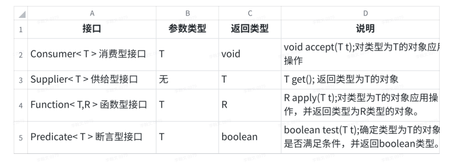
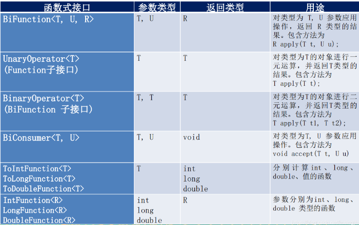
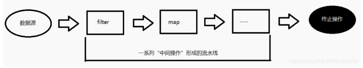
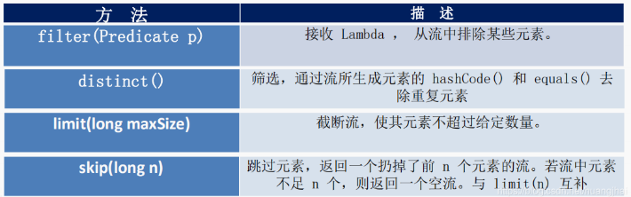
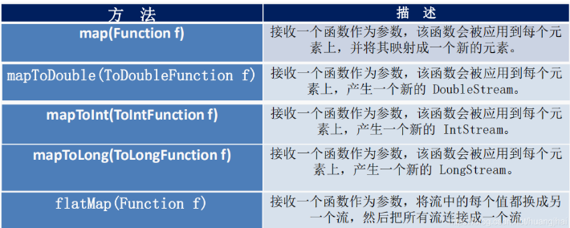
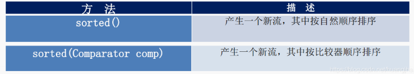
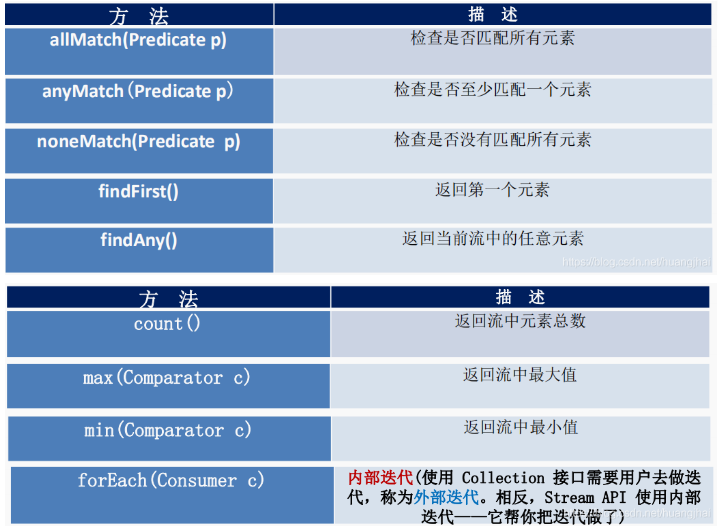
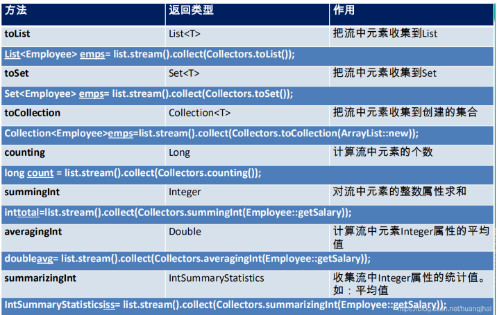
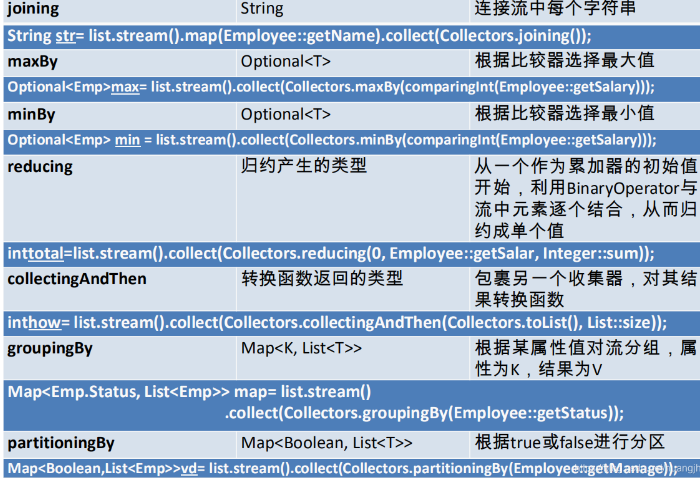

# jdk1.8的新特性

# Lamb表达式

https://blog.csdn.net/huangjhai/article/details/107110182

https://juejin.cn/post/7025174420624769061

* Lambda表达式是特殊的匿名内部类，语法更简洁。
* Lambda表达式允许把函数作为一个方法的参数（函数作为方法参数传递），将代码像数据一样传递。

## 语法

> Lambda表达式
>
> Java语言中引入了一个操作符**`->`**，该操作符被称为Lambda操作符或箭头操作符。它将Lambda分为两个部分：
>
> - 左侧：指定了Lambda表达式需要的所有参数
>
> - 右侧：制定了Lambda体，即Lambda表达式要执行的功能。
>
>   ~~~java
>   如：
>   (parameters) -> expression
>   或
>   (parameters) ->{ statements; }
>   ~~~

## 语法格式

1. 语法格式一：无参，无返回值，Lambda体只需一条语句。如下：

~~~java
  public void test(){
    Runnable runnable=()-> System.out.println("Runnable 运行");
    runnable.run();
  }
~~~

2. 语法格式二：Lambda需要一个参数，无返回值。如下：

~~~java
  public void test(){
    Consumer<String> consumer=(x)-> System.out.println(x);
    consumer.accept("Hello Consumer");
  }
~~~

3. 语法格式三：Lambda只需要一个参数时，参数的小括号可以省略，如下：

~~~java
  public void test(){
    Consumer<String> consumer=x-> System.out.println(x);
    consumer.accept("Hello Consumer");
  }
~~~

4. 语法格式四：Lambda需要两个参数，并且Lambda体中有多条语句。如下：

~~~java
  public void test(){
    Comparator<Integer> c=(x, y)->{
      System.out.println("Hello");
      return Integer.compare(x,y);
    };
    System.out.println(com.compare(2,4));
  }
~~~

5. 语法格式五：有两个以上参数，有返回值，若Lambda体中只有一条语句，return和大括号都可以省略不写。如下：

~~~java
  public void test(){
    Comparator<Integer> com=(x, y)-> Integer.compare(x,y);
    System.out.println(com.compare(4,2));
  }
~~~

6. Lambda表达式的参数列表的数据类型可以省略不写，因为JVM可以通过上下文推断出数据类型，即“类型推断”。如下：

~~~java
  public void test(){
    Comparator<Integer> com=(Integer x, Integer y)-> Integer.compare(x,y);
    System.out.println(com.compare(4,2));
  }
~~~

## lambda表达式的重要特征

> * 可选类型声明：不需要声明参数类型，编译器可以统一识别参数值。
> * 可选的参数圆括号：一个参数无需定义圆括号，但无参数或多个参数需要定义圆括号。
> * 可选的大括号：如果主体包含了一个语句，就不需要使用大括号。
> * 可选的返回关键字：如果主体只有一个表达式返回值则编译器会自动返回值，大括号需要指定明表达式返回了一个数值。

## Lambda表达式的作用域

Lambda表达式可以看作是匿名内部类实例化的对象，Lambda表达式对变量的访问限制和匿名内部类一样，因此Lambda表达式可以访问局部变量、局部引用，静态变量，实例变量。

1. 访问局部变量

   在Lambda表达式中规定只能引用标记了final的外层局部变量。我们不能在lambda 内部修改定义在域外的局部变量，否则会编译错误。特殊情况下，局部变量也可以不用声明为 final，但是必须不可被后面的代码修改（即隐性的具有 final 的语义）

2. 访问局部引用，静态变量，实例变量

   Lambda表达式不限制访问局部引用变量，静态变量，实例变量。

### Lambda表达式访问局部变量作限制的原因

* Lambda表达式不能访问非final修饰的局部变量的原因是，局部变量是保存在栈帧中的。而在Java的线程模型中，栈帧中的局部变量是线程私有的，如果允许Lambda表达式访问到栈帧中的变量地址（可改变的局部变量），则会可能导致线程私有的数据被并发访问，造成线程不安全问题。
* 基于上述，对于引用类型的局部变量，因为Java是值传递，又因为引用类型的指向内容是保存在堆中，是线程共享的，因此Lambda表达式中可以修改引用类型的局部变量的内容，而不能修改该变量的引用。
* 对于基本数据类型的变量，在 Lambda表达式中只是获取到该变量的副本，且局部变量是线程私有的，因此无法知道其他线程对该变量的修改，如果该变量不做final修饰，会造成数据不同步的问题。
* 但是实例变量，静态变量不作限制，因为实例变量，静态变量是保存在堆中(Java8之后)，而堆是线程共享的。在Lambda表达式内部是可以知道实例变量，静态变量的变化。

## Lambda表达式的优缺点

> 优点：
>
> 1. 使代码更简洁，紧凑
> 2. 可以使用并行流来并行处理，充分利用多核CPU的优势
>    有利于JIT编译器对代码进行优化
>
> 缺点：
>
> 1. 非并行计算情况下，其计算速度没有比传统的 for 循环快
> 2. 不容易调试
> 3. 若其他程序员没有学过 Lambda 表达式，代码不容易看懂

# 函数式接口

* 如果⼀个接⼝只有⼀个抽象⽅法，则该接⼝称之为函数式接⼝。 
* 函数式接⼝可以使⽤Lambda表达式，Lambda表达式会被匹配到这个抽象⽅法上 。

* 可以在任意函数式接口上使用@FunctionalInterface注解，这样做可以用于检测它是否是一个函数式接口，同时javadoc也会包含一条声明，说明这个接口是一个函数式接口。

## 自定义函数式接口

1. 按照函数式接口的定义，自定义一个函数式接口，如下：

~~~java
@FunctionalInterface
public interface MyFuncInterf<T> {
   public T getValue(String origin);
}
~~~

2. 定义一个方法将函数式接口作为方法参数。如下：

~~~java
  public String test(MyFuncInterf<String> mf,String origin){
    return mf.getValue(origin);
  }
~~~

3. 将Lambda表达式实现的接口作为参数传递。如下：

~~~java
  public void test(){
      String value=toLowerString((str)->{
        return str.toLowerCase();
      },"ABC");
    System.out.println(value);
  }
~~~

## Java内置函数式接口

### 其他接口的定义

# 方法引用

* 实现抽象方法的参数列表，必须与方法引用的参数列表一致，方法的返回值也必须一致，即方法的签名一致
* ⽅法引⽤是Lambda表达式的⼀种简写形式。

## 常⻅形式

> * 对象::实例⽅法 
> * 类::静态⽅法 
> * 类::实例⽅法 
> * 类::new

## 构造器引用

格式：类名::new
与函数式接口相结合，自动与函数式接口中方法兼容，可以把构造器引用赋值给定义的方法。需要注意构造器参数列表要与接口中抽象方法的参数列表一致。

# Stream

https://blog.csdn.net/huangjhai/article/details/107852137

* 流（Stream）与集合类似，但集合中保存的是数据，⽽Stream中保存对集合或数组数据的操作。

* Stream是Java8中处理集合的关键抽象概念，Stream API提供了一种高效且易于使用的处理数据的方式。你可以使用它对集合数据进行指定操作，如可以执行非常复杂的查找、过滤和映射数据等操作。

> 注意：
>
> 1. Stream自己不会存储元素
> 2. Stream不会改变源对象，Stream操作会返回一个新的Stream
> 3. Stream操作是延迟执行的，这意味着等到获取结果时,Stream才会执行

Stream操作的三个步骤：

1. Stream创建，由一个数据源，如集合、数组来获取一个Stream
2. 中间操作。一个中间操作链，对数据源的数据进行处理。（在⼀个或多个步骤中，将初始Stream转化到另⼀个Stream的中间操作。）
3. 终止操作。执行中间操作链并产生结果。（使⽤⼀个终⽌操作来产⽣⼀个结果。该操作会强制之前的延迟操作⽴即执⾏，在此之后，该 Stream就不能使⽤了。）

## 创建Stream 

> * 通过Collection对象的stream()或parallelStream()⽅法。
> * 通过Arrays类的stream()⽅法。
> * 通过Stream接⼝的of()、iterate()、generate()⽅法。
> * 通过IntStream、LongStream、DoubleStream接⼝中的of、range、rangeClosed⽅法。

1. 使用集合来创建Stream

   Java8中的Collection接口被扩展，提供了两个获取Stream的方法：

~~~java
//返回一个顺序流
default Stream<R> stream() 
//返回一个并行流
default Stream<E> parallelStream()
~~~

2. 使用数组创建Stream
   Java8中的Arrays的静态方法stream()可以获取流：

~~~java
static <T> Stream<T> stream(T[] array)
static IntStream<T> stream(int[] array)
static LongStream<T> stream(long[] array)
static DoubleStream<T> stream(double[] array)
~~~

3. 由值创建Stream
   使用Stream的静态方法of来创建一个流，该方法可以接收任意数量的参数:

~~~java
static<T> Stream<T> of(T... values)
~~~

4. 由函数创建Stream
   可以使用Stream的静态方法iterate()和generate()创建无限流:

~~~java 
public static<T> Stream<T> iterate(final T seed, final UnaryOperator<T> f)
public static<T> Stream<T> generate(Supplier<T> s)
~~~

## 常⻅中间操作

> * filter、limit、skip、distinct、sorted (排序)
> * map 
> * parallel

### **筛选与切片**

### **映射**

### **排序**

## 常⻅终⽌操作

> * orEach、min、max、count 
> * reduce、collect

### 查找与匹配

### 规约

### 收集

Collector接口中的方法的实现决定了如何对流执行收集操作（如收集到List、Set、Map）。Collectors实用类提供了很多静态方法，可以方便地创建常用的收集器实例，具体方法与实例如下图：

