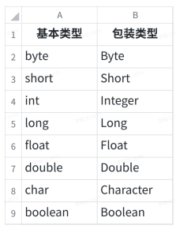
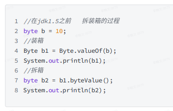
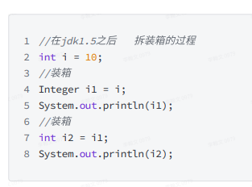

# JavaSE

[>>操作指南](guide.md)

## Java程序运行机制

### 编译

> Java Compiler 即是我们在安装 JDK 的时候，自带的编译工具，我们可以使用 javac 来进行调用：**javac FinalMain.java**

### 运行

编译产生的 Java 字节码，是和操作系统无关的，我们可以在任意操作系统运行，前提是这个系统安装了 Java 运行环境（ JRE ，`Java Runtime Environment`），JRE 中有一个组件叫 Java 虚拟机（ JVM ，`Java Virtual Machine` ），会将 Java 字节码转换为当前操作系统的原生代码，而这个原生代码是可以被当前操作系统理解并直接执行的代码。

> JVM 正是 Java程序无需安装、跨平台的原因，这是 Java 程序最大的特点之一(JVM消除不同操作系统的差异性)。
>
> 可以通过如下指令来执行字节码：**java com.thinkaboutai.Main**

## 数据类型

### 变量与常量

使用变量来在内存中临时保存数据。

> 变量的命名规则需遵循驼峰命名法

常量，即不能修改的变量，需使用 `final` 进行修饰

### 引用类型数据

在 Java 中，除开值类型以外的数据类型，都是引用类型数据，用来存储一些较为复杂的数据，例如对象。

> 区别
> 1. 值类型在传递的时候，拷贝的是值：每一个变量的值都是独立存储的，因此，修改一个变量的时候，不会影响其它的变量。
> 2. 引用类型在传递的时候，拷贝的是对象引用的地址：当两个变量的值存储的是同一个对象的引用的时候，通过一个变量修改这个对象的值，会影响到引用这个对象的其它变量。

### String

字符串就是字符的序列，我们除开可以使用 `new` 来进行实例化以外，还可以使用字符串字面量（ `Literal` ）来进行创建。

> 注意：由于字符串是不可变（ immutable ）对象，因此其方法不会修改原有字符串，都是通过返回值（如有）的方式返回修改以后的字符串

**转义字符，用来表示或者转换一些特殊的字符串**

### Array

可以使用数组来保存一系列的列表项，通过下标来访问数组的每一个元素，也可以对其进行赋值。`Arrays` 是 `JDK` 提供的一个用于操作数组的工具类，里面包含了很多常用的数组方法。还可以使用字面量来对数组直接进行初始化。

### 类型转换

向上转换不会发生数据丢失，是无损转换。

向下转换会发生数据丢失。发生转换成存储空间更小的类型

> 向上和向下转换都只能用于可互相转换的类型之间，例如数字类型之间的互相转换，但字符串不可以转换为数字。

##  逻辑操作符

逻辑操作符可以用来组合多个布尔值或布尔表达式

> && 逻辑与 表示两者同时满足
> || 逻辑或 表示两者满足其一即可
>  ! 取反

## OOP（面向对象编程）

### 介绍

**面向过程编程**：是分析问题解决的过程 ，通过函数把过程一步一步实现，在使用时通过调用相关函数即可。(做一件事，分为多个步骤，每个步骤之间是有序的，最后按序完成）

优点：性能高。

缺点：维护和扩张困难、代码复用性差。

**面向对象编程**：把一个问题拆分成多个小的对象，强调的是通过调用对象的行为来实现功能，而不是自己一步一步的去操作实现。

优点：易维护、易复用、易扩展。

缺点：比于面向过程性能低。

**三大基本特征**：即封装、继承和多态。

### 类(class)与对象

* class(类)：是一组相关**属性**和**行为**的集合。可以看成是一类事物的模板，使用事物的属性特征和行为特征来描述该 类事物。也可以理解为是blueprint（蓝图），是用来创建对象的图纸。

  **属性**：就是该事物的状态信息。

  **行为**：就是该事物能够做什么。

* object(对象)：对象是类的一个**实例**（instance），必然具备该类事物的属性和行为。

#### 类的定义

* 定义类：就是定义类的成员，包括成员变量和成员方法
* 成员变量：在类中，方法外。
* 成员方法：去掉static。

#### 成员变量与成员方法

* 类的成员变量为类的属性。可以是基本数据类型，也可以是引用类型。格式如下：

  ~~~java
  		[修饰符]  数据类型  变量名 [=初始值];  
  ~~~

  说明：

  1. 与类修饰符一样，某些修饰符可以同时放在一起，有些则不能。
  2. 在定义类的成员变量时，可以同时赋初值；要想操作成员变量，必须放到方法中。

* 类的方法是用来定义类的行为，在方法中通过操作类的成员变量、编写业务逻辑、返回 结果等实现类的业务行为。方法也是类与外界交互的重要窗口。格式如下：

  ~~~java
   [修饰符]  返回值的数据类型  方法名(参数1，参数2，…，参数 n){//n可以=0  
   			… …          //方法体(可以定义变量（局部变量）、编写控制流程等操作，用于实现类的行为，也 即实现方法的目的。)
   } 
  ~~~

  #### 修饰符

  | 修饰符       | 含义                                                         |
  | :----------- | ------------------------------------------------------------ |
  | public       | 公有访问修饰符，公共类，对所有类可见。                       |
  | private      | 私有访问修饰符，在同一类内可见。                             |
  | private      | 受保护的访问修饰符，对同一包内的类和所有子类可见。           |
  | default      | 默认访问修饰符，在同一包内可见，不使用任何修饰符。           |
  | final        | 最终修饰符，修饰的变量为常量，是不可修改的。                 |
  | static       | 静态修饰符。static 关键字用来声明独立于对象的静态方法。静态方法不能使用类的非静态变量。静态方法从参数列表得到数据，然 后计算这些数据。 |
  | abstract     | 抽象修饰符，只有方法头，无方法体。 抽象方法是一种没有任何实现的方法，该方法的的具体实现由子类提供。抽象方法不能被声明成final和static。 |
  | synchronized | 同步修饰符，`synchronized`关键字声明的方法同一时间只能被一 个线程访问。 |
  | native       | 本地修饰符，表示方法体是由其他语言在程序外部完成的。         |

#### 成员变量与局部变量的区别

1. 语法上
   成员变量是定义在类中 、方法之外的变量；局部变量是定义在类的方法中的变量，包括 方法参数。 成员变量可以被访问修饰符和静态修饰符修饰，局部变量不行。
2. 存储方式上
   成员变量是对象的一部分，在对象创建时，一同保存在堆区；局部变量保存在栈区。
3. 生存周期上
   成员变量与对象一起产生、一起消亡；局部变量只有当对象调用方法时起产生，调用方 法结束时局部变量消亡。
4. 初始化情况
   即使没有对成员变量显式赋值，系统也会给它们赋一个默认值；局部变量则不行， 必须为它们赋值。

#### 对象与类的关系

* 类是抽象的，不是具体的，类只是负责把事物描述起来，提供模板；对象是类的实例化，是具体的；定义好一个Java类后需要通过对象将类进行实例化

* 类是对一类事物的描述，是抽象的。

* 对象是一类事物的实例，是具体的。

* 类是对象的模板，对象是类的实体。

#### 内存分配

* JVM内存，总共分为5大内存区域，寄存器、本地方法栈、方法区、栈内存（虚拟机栈）、堆内存；和我们程序员有关的为方法区、栈内存、堆内存；
  * 方法区：存储类的信息（有多少变量、方法、是什么修饰符修饰的等）、常量信息、静态变量等信息
  * 栈内存（VM栈）：方法调用时进栈内存执行，也就是方法运行时消耗的内存；
  * 堆内存：存储类的实例信息，只要是new出来的信息都存在堆内存
* 在new一个类的时候，Jvm去方法区找有没有这个class，没有就加载到方法区，属性方法这些都是在方法区class中的；Jvm加载完后，就根据这个模板在堆中创建对象给属性赋默认值，然后再执行赋值语句给对象赋值；

* 基本数据类型（值传递）：方法调用时，实参把它的值传递给对应的形参，形参只是用实参的值初始化自己的存储单元内容，是两个不同的存储单元，所以方法执行中形参值的改变不影响实参的值，存储在栈这个区域
* 引用数据类型（引用传递[也称为传地址]）：方法调用时，实参是对象（或数组），这时实参与形参指向同一个地址，在方法执行中，对形参的操作实际上就是对实参的操作，这个结果在方法结束后被保留了下来，所以方法执行中形参的改变将会影响实参。如上图：首先计算赋值表达式的右值，也即是对象，将其保存在堆这个区域，并且得到一个内存地址（引用，例如0x10），然后将这个内存地址通过一个变量，也即赋值表达式的左值（例如tb），保存在栈这个区域。tb这个变量通过内存地址引用了保存在内存堆中的一个对象，这就是我们为什么称之为引用类型数据的原因。

> `Java`不同于 `C/C++`，它不需要通过编码释放内存，当我们执行完一个代码块，其中保存在栈区域的变量都会被移除掉。同时，后台还会有一个进程（`Garbage Collection`，简称`GC`，即垃圾回收器），随时监控堆区域，如果堆区域的对象没有被引用，那么它们也会在某个时间点被自动释放掉。
>
> 在`Java`中，除了基本数据类型之外的数据类型都是引用数据类型，都是通过`new`在堆内存开辟空间；

#### OOP 原则（封装、抽象、继承、多态）

**封装**：即把数据和操作数据的方法，打包到一个单元或者对象中。经过封装后，属性再也不是直接暴露给外部了，我们可以在外部操作属性之前加以控制。原则：将属性隐藏起来，若需要访问某个属性，提供公共方法对其访问。

**抽象**：即通过隐藏不必要的细节，来降低复杂度（降低外部调用的复杂度）。就是把一些实现的细节隐藏在类中，而是通过一些接口和方法来对它进行操作即可。(当我们不想封装一个具体的类的时候，所封装出来的类，之所以不想封装出来，是因为它的行为比较抽象无法编写出具体的逻辑)。主要是用来被继承的，它的子类必须要实现父类中的抽象方法，否则它自己也必须声明为abstract class

**继承**：即子类继承父类的特征（属性）和行为，使得子类对象（实例）具有父类的属性和方法，或子类从父类继承方法，使得子类具有父类相同的行为。

继承可以使得子类盖父类别的原有属性和方法，使其获得与父类别不同的功能。另外，为子类别追加新的属性和方法也是常见的做法。

* 子类继承父类可以获得父类的功能，提高代码的复用性。
* 子类可以重写（覆盖）某些父类的功能，我们一般称为增强。
* 子类除了可以继承父类的功能之外，还可以额外添加子类独有的功能，一般来说，子类要比父类强大（你的是我的，我的还是我的）。

**多态**：即事物（对象）存在的多种形态，简称多态。多态体现了程序的可扩展性、代码的复用性。（一个行为，在不同条件下，有不同的执行效果。在定义方法的时候，我们可以把参数类型定义的更为抽象一些，这样它就能接受所有的自类型实例，以此来提高程序的兼容性）。

### 比较对象

- ==用来比较两者的地址(引用)，基本类型直接比较值。
- 我们如果要实现"当这个对象中某些个属性值相等，我们就认为这是两个相同的对象"，可以使用equals。
- 重写Object的equals方法（默认比较的是地址）。

### 类型转换

- 主要分为向上（自动）和向下转型（需要在变量前面加以类型修饰）。

- 对于基本类型而言，比如数字，可以把长度小的类型自动转换成长度大的，相反，长度大的也可以强制类型转化为长度小的。

- 当把子类型转换为父类型的时候，这个实例的行为会变成它只能调用父类型声明的那些方法（能做什么看左边的类型，具体怎么做，看右边是什么样的实例）。

- 变量名+ instanceof +类型：前者是后者这个类型的一个实例吗？

  > `instanceof`是 `Java` 的保留关键字。它的作用是测试它左边的对象是否是它右边的类的实例，返回 `boolean`的数据类型。
  >
  > `instanceof`是`Java`中的二元运算符，左边是对象，右边是类；当对象是右边类或子类所创建对象时，返回true；否则，返回false。
  >
  > `instanceof`一般用于对象类型强制转换
  >
  > `null`用`instanceof`跟任何类型比较时都是false
  >
  > 特别说明：
  >
  > - 类的实例包含本身的实例，以及所有直接或间接子类的实例。
  > - `instanceof`左边显式声明的类型与右边操作元必须是同种类或存在继承关系，也就是说需要位于同一个继承树，否则会编译错误。

### 关键字(this、abstract、static、final)

**this**：是Java中的一个关键字，代表所在类的当前对象的引用（地址值），即对象自己的引用.。

>  方法被哪个对象调用，方法中的this就代表那个对象。即谁在调用，this就代表谁。

**abstract**：所谓的抽象类，就是我们不想具体化一个类型所封装出来的类型。

> 1、不能实例化的。
> 2、抽象类存在的意义，他就是用来被继承或扩展的。
> 3、抽象类中不一定有抽象方法，但是有抽象方法一定它就是抽象类。
> 4、抽象类中也可以有具体的方法。
> 5、**抽象类的子类不一定非要实现父类型中的抽象方法，它可以继续声明自己也是抽象的。**
>
> 说明：
>
> * abstract不能与final修饰同一类。
> * 在某些情况下，public、default可与abstract、final等非访问修饰符联合使用。

**static**：在类中，用static声明的成员变量为静态成员变量，也成为类变量。类变量的生命周期和类相同，在整个应用程序执行期间都有效。

* static修饰的成员变量和方法，从属于类
* 普通变量和方法从属于对象
* 静态方法不能调用非静态成员，编译会报错

> 1. `static`修饰的变量(属性)，全局公用（这个类的所有实例共有的）,它不依赖类的实例而存在，类只要一加载就存在了。一般直接通过类名进行调用，它是这个类的实例所有共有的（它只有一份）。
> 2. `static`修饰方法，静态方法只能引用静态属性（在引用非静态属性的时候，这个this没有指向）
> 3. `static`方法只能引用静态变量和静态方法
> 4. `static`一般都"只执行一次"或者"只有一份"
> 5. 静态代码块：只执行一次，并且时间点在构造器之前，在静态属性初始化之后
>
> ##### **用途：方便在没有创建对象的情况下进行调用(方法/变量)。**static可以用来修饰类的成员方法、类的成员变量，另外也可以编写static代码块来优化程序性能
>
> 静态方法中不能访问非静态成员方法和非静态成员变量，但是在非静态成员方法中是可以访问静态成员方法和静态成员变量。

**fianl**：用来修饰类、方法和变量，final 修饰的类不能够被继承，修饰的方法不能被继承类重新定义，修饰的变量为常量，是不可修改的。

> 1. 被`final`修饰的变量，具有"不可改变"的特性
> 2. 修饰基本类型：其值不可以再进行修改
> 3. 修饰引用类型(可以改但地址没变)，而使用`new`一定是在内存中创建了一个新对象，所以地址会改变，如果通过setter进行修改，地址没有改变
> 4. 修饰类：这是这个类的最终版，不能被扩展和继承
> 5. 修饰方法：这是这个方法的最终版，不能被重写
> 6. final修饰的变量可以在构造器中进行第一次赋值初始化，但只能第一次去赋值初始化

### 构造方法

* 如果不提供构造方法，系统会给出无参数构造方法。
* 如果提供了构造方法，系统将不再提供无参数构造方法。
* 构造方法是可以重载的，既可以定义参数，也可以不定义参数。

> 构造方法的写法上，方法名与它所在的类名相同。它没有返回值，所以不需要返回值类型，甚至不需要void。

### 接口

接口：主要是用来封装一揽子抽象方法的，它侧重在于对行为的一种抽象（动词）。（是当我们去抽象对象的行为时，所封装的类型，它本质上是定义了一种行为的契约、规约，因为我们从接口中定义的抽象方法上，只能看到方法的参数input，还有返回类型output）

语法特点：

1. 接口中主要定义的是方法，而且默认都是public abstract。
2. 它也能定义变量（属性），但是都是默认public final static，并且必须要对其进行初始化。
3. 接口可以被类所实现，实现它的时候，需要实现其中所有的抽象方法，否则，这个类必须声明为abstract class。
4. 接口中不能有具体的方法实现，它只是一种行为的规约（规范和约定）。
5. 接口可以继承其它接口（继承多个），达到复用方法的定义。
6. 其他类在implements接口的时候，可以实现多个接口。
7. 接口中也可以定义带方法体的default方法。
8. 接口可以说是抽象类抽象到极致的一种特殊情况。

用法：

1. 接口最主要的作用是为了解耦的，可以把紧密耦合的两个东西（执行者、主体/主体所执行的行为）变成松耦合。

   ~~~java
   new User("Jack").eat();
   new Animal("Pony").eat();
   ~~~

   把eat这个单独定义成接口中的一个方法，让不同的类型来实现这个接口，最终达到主体和行为之间的松耦合

2. 形成多态

3. 接口最终形成了一种跨界类型

接口与抽象类：

> 抽象类与接口的区别：
>
> 1. 抽象类既有抽象方法也有具体方法；接口中主要都是抽象方法（除default方法）
> 2. 抽象类中可以定义成员变量，而接口中只能定义常量
> 3. 抽象类只能被单继承，而接口可以被实现多个
> 4. 抽象类体现的是is a的关系，而接口体现的是like a的关系
>
> 接口和其他类型之间的关系：
>
> * 接口和实现类之间的是implements
> * 接口和接口之间是extends
>
> 面向接口设计的好处：
>
> * 面向接口设计方法，可以极大提高方法的兼容性
> * 灵活切换实现方式
> * 是的程序更容易扩展，同时最小化扩展带来的负面影响
> * 更容易进行独立的单元测试

## Object类

1. Object 是所有的类的超类、基类。位于继承树的最顶层。
2. 任何⼀个没有显⽰定义extends⽗类的类。都直接继承Object，否则就是间接继承
3. 任何⼀个类都可以享有Object提供的⽅法
4. Object类可以代表任何⼀个类(多态)，可以作为⽅法的参数、⽅法的返回值

### Object中常⽤⽅法

#### getClass方法

此⽅法⽤于返回该对象的真实类型(运⾏时的类型)

> public final Class getClass()

#### hashCode⽅法

1. 返回该对象的⼗进制的哈希吗值
2. hash值是由hash算法通过对象的地址、对象中的字符串、数字等，计算出来的 
3. 相同的对象应当返回相同的哈希吗值，不同的对象尽量返回不同的哈希码值

> public native int hashCode(); 

#### toString⽅法

返回对象的字符串表现形式   

用于开发人员调试程序，在程序的某一个特定的地方检测对象的值

> * 全限定名+@+⼗六进制的hash值(地址)
>
> * 如果直接输出⼀个对象，那么默认会调⽤这个对象的toString⽅法，⽽toString⽅法是Object类提供的，返 回的是“对象的地址” 。但是我们⼀般输出对象希望输出的是对象的属性信息，所以可以重写⽗类的 toString⽅法

#### equals⽅法

* Object类的equals⽅法的作⽤是⽐较两个对象是否相等。⽐较的是内存地址。其底层代码的是== 

* 如果不想⽐较内存地址，那么需要重写equals⽅法

> 1. 重写equals⽅法：可以通过快速生成重写。
> 2. hashCode() ：散列算法，和雪花算法有点近似，但有细节区别，最主要是为了保证所有的元素计算出来的值，不会发生碰撞。
> 3. 开发人员可以考虑重写父类型的equals方法，来实现属性值的比较
> 4. 最佳实践：我们在重写的时候，一般equals和hashCode一起重写，主要是为了进行更严谨的比较，避免出现内存泄漏（数据创建出来以后，程序访问不到这个对象，地址丢失）
>
> == 和 equals的区别：
>
> 1. 两个东西都是⽤于⽐较的 
> 2. == 可以⽤于基本类型和引⽤类型 
> 3. equals只能⽤于引⽤类型的⽐较

## Number类

Byte、Short、Integer、Long、Float、Double六个⼦类 

提供⼀组⽅法,⽤于将其中某⼀种类型转换成其他类型 xxxValue()⽅法

## 包装类

1. 因为基本数据类型不具有⽅法和属性。⽽引⽤数据类型可以拥有属性和⽅法，使⽤更加的灵活 
2. 所以Java给8种基本数据类型提供对应8个包装类。包装类也就是引⽤数据类型

### 装箱和拆箱

1. 装箱就是将基本类型转换成包装类 
2. 拆箱就是将包装类型转换成基本类型

jdk1.5 之前装箱和拆箱

jdk1.5 之后的装箱和拆箱

## 缓冲区

整数型包装类缓冲区：整数型的包装类定义缓冲区(-128~127)，如果定义的数在这个范围你之内，那么直接从缓存数组中获取，否则，重新new新的对象

## String类

1. String 类代表字符串。 Java程序中的所有字符串⽂字（例如 "abc" ）都被实现为此类的实例。 
2. String 字符串被创建就不能修改。

### String创建对象

1. 直接赋值 
2. 通过构造⽅法创建对象

### String类常⽤⽅法

* **charAt(index)** 获取指定下标对应的字符，返回char类型

* **indexOf("字符串")** 获取指定字符串在原字符串中的下标,如果不包含该字符串则返回-1
* **lastIndexOf("字符串"**) 与indexOf⽅法⼀致，区别：从后往前找
* **length()** 获取字符串的⻓度
* **equals()** 判断两个字符串是否相等
* **equalsIgnoreCase()** 判断两个字符串是否相等,忽略⼤⼩写
* **isEmpty()** 判断字符串是否为空串
* **startsWith("指定字符")** 判断字符串是否以指定的字符串开头
* **startsWith("ab", 2)** 判断字符串是否以指定的字符串开头,指定开始位置
* **endsWith("ab")** 判断字符串是否以指定的字符串结尾
* **contains("SB")** 判断字符串中是否包含⾃定的字符串
* **str.concat("world")=str + "world"** 将字符串与指定的字符串进⾏拼接
* **.replace("SB", "!!")** 字符串替换：将字符串中指定的字符串替换成指定的字符串
* **substring(0, 5)**  字符串截取，从指定的下标开始和结束 (范围是左闭右开)
* **substring(6)**字符串截取，从指定的下标开始⼀直到最后
* **split(" ")**  字符串切割，按照指定的字符串对原字符串进⾏切割
* **trim()**  去除字符串前后的空格
* **toUpperCase()**  将字符串中的字⺟变成⼤写
* **toLowerCase()**   将字符串中的字⺟变成⼩写

### 可变字符串

1. StringBuffer
2. StringBuilder

### StringBuffer、StringBuilder类

常⽤⽅法 

* append(String str)：在字符串的后⾯追加字符串
* delete(int start, int end) ：删除字符串，从指定的下标开始和结束
* insert(int offset, String str)： 在指定下标位置添加指定的字符串
* reverse() ：将字符串翻转
* toString()：将StringBuffer转换成String类型

### String、StringBuffer、StringBuilder区别

* 这三个类都可以⽤于表⽰字符串 

  1. String类是字符串常量类，⼀旦定义不能改变 
  2. StringBuffer、StringBuilder是可变的字符串,⾃带有缓冲区。默认缓冲区⼤⼩16个字符 
  3. StringBuffer是线程安全的，所以效率低 StringBuilder是线程不安全的，所以效率⾼ 

  总结：在⼤量的字符串拼接的时候，使⽤ StringBuffer、StringBuilder。⽽不考虑线程安全的时候，选择 StringBuilder，否则选择StringBuffer

## 集合

集合是⼀种对象容器，⽤于存放对象 

### 集合架构

### Collection接⼝

单列集合的顶层接⼝

> Collection是大部分集合组件的父接口
>
> 1. 能保存多个元素
> 2. 提供了操作他们的一些基本方法CRUD（create research update delete）
>
> 3. 可以被迭代的（可以被循环输出）
>
> 4. 其中元素的顺序无法得到保证，具体要看实例化的是什么样的容器

### 常⽤⽅法 

> * add ⽅法向集合集合中添加元素 
> * clear ⽅法,清空集合中所有元素
> * contains ⽅法 判断集合是否包含某个元素
> * isEmpty 判断集合是否为空
> * remove ⽅法 移除集合中元素，返回boolean类型。如果集合中不包含次元素，则删除失败
> * size() 返回集合中元素的个数 
> * toArray 将集合转换成数组。
> * toString 将数组转为集合
> * addAll 向⼀个集合中添加另⼀个集合
> * containsAll 判断⼀个集合中是否包含另⼀个集合
> * removeAll 从⼀个集合中移除另⼀个集合

### ArrayList类

#### 常⽤⽅法

> * add(int index, E element)  在集合指定下标位置上添加元素
>
> * clear()  清空集合中所有的元素 
>
> * remove(int index)  移除集合中指定下标位置上的元素 
>
> * .lastIndexOf()  返回元素在集合中的下标（找到集合中最后⼀个相同元素），如果不存在返回-1
>
> * set(int index, E element)  修改集合中指定下标位置上的元素
>
> * get(int index)  获取指定下标位置上的元素 
>
> * subList(int beginIndex,int endIndex)   截取集合中指定下标开始到结束位置上的元素
>
> * list.listIterator();
>
>   ~~~java
>   /**
>   * List集合遍历的三种⽅式：
>   * 1、迭代器
>   * 2、for循环
>   * 3、foreach循环(增强for循环) 可以遍历数组和集合
>   *
>   * 语法：
>   * for(元素的类型 变量 : 数组|集合){ //变量就表⽰遍历出来的元素
>   *
>   * }
>   */
>   ~~~

#### 原理

> List特点
>
> 1. 有序的（插入有序性）
> 2. 可以放置重复元素
>
> ArrayList
>
> 1. 基于数组实现的额，具备了数组所有的优点
> 2. 动态扩容
> 3. 随机查找速度非常快（基于下标访问的），随机插入非常慢，如果插入的index非常靠前，那么后面的每一个元素都要为前一个元素腾出位置来

~~~java
// 参数1：从哪个数组拷贝出来
// 参数2：从原先这个数组的第几个位置开始拷贝
// 参数3：拷贝到哪里去
// 参数4：拷贝的元素放到目标数组里面，是从第几个位置开始放置
// 参数5：一共需要拷贝多少元素
System.arraycopy(data, index + 1, data, index, (size - index - 1));
~~~

### LinkedList类

#### 常⽤⽅法

常⽤的⽅法与ArrayList⼀致。⾃⼰独有⼀些向⾸尾添加移除等⽅法(可以模拟对列、堆栈等数据结构)

> * offer("XXX")  向对列的尾部添加元素
> * poll()   获取并移除对列的头部的元素
> * element()  获取但不移除对列的头部的元素
>
> * peek()  获取但不移除对列的头部的元素

#### 原理

>  LinkedList 
>
> * 是一个基于Node（节点）来实现的虚拟容器（没有具体的边界），每一个节点都会从"前"和"后"两个方向记住临近节点的信息
> * 双向链表
> * 优点：
>   随机访问的速度比较慢，但是随机插入、删除的速度比较快。

#### 堆栈和队列结构

### 迭代器

#### 原理 

迭代是重复反馈过程的活动,其⽬的通常是为了逼近所需⽬标或结果。每⼀次对过程的重复称为⼀次“迭代” , ⽽每⼀次迭代得到的结果会作为下⼀次迭代的初始值。

迭代：挨个儿访问其中的每一个元素 ，获取到能访问这个容器中的元素的一个指针，它默认是指向这个容器中第一个元素的上方

**迭代器的作⽤：获取集合中的所有的元素**

#### 迭代器使⽤常⻅问题

* 迭代器迭代完成之后，迭代器的位置在最后⼀位。 所以迭代器只能迭代⼀次 。

  

* 迭代器在迭代的时候，不要调⽤多次next⽅法，可能会出错 NoSuchElementException 。

  

* 在迭代器迭代的时候，不能向集合中添加或者删除元素 ConcurrentModificationException。

  

## 泛型

参 数 化 类 型 J D K 1 . 5 之 后

泛型擦除： JDK1.7之后 

java泛型详解：https://blog.csdn.net/s10461/article/details/53941091

1. 泛型，即“参数化类型”。一提到参数，最熟悉的就是定义方法时有形参，然后调用此方法时传递实参。那么参数化类型怎么理解呢？顾名思义，就是将类型由原来的具体的类型参数化，类似于方法中的变量参数，此时类型也定义成参数形式（可以称之为类型形参），然后在使用/调用时传入具体的类型（类型实参）。
2. 泛型的本质是为了参数化类型（在不创建新的类型的情况下，通过泛型指定的不同类型来控制形参具体限制的类型）。也就是说在泛型使用过程中，操作的数据类型被指定为一个参数，这种参数类型可以用在类、接口和方法中，分别被称为泛型类、泛型接口、泛型方法。

**泛型是用来限定类型的一种参数**

**所有的集合在使用泛型的时候，只能使用封装类型，不能使用基本类型**

例子：为解决如下 ：

~~~java
java.lang.ClassCastException: java.lang.Integer cannot be cast to java.lang.String
~~~

ArrayList可以存放任意类型，例子中添加了一个String类型，添加了一个Integer类型，再使用时都以String的方式使用，因此程序崩溃了。为了解决类似这样的问题（在编译阶段就可以解决），泛型应运而生。

### 特性

泛型只在编译阶段有效。在编译过程中，正确检验泛型结果后，会将泛型的相关信息擦出，并且在对象进入和离开方法的边界处添加类型检查和类型转换的方法。也就是说，泛型信息不会进入到运行时阶段。

**总结：泛型类型在逻辑上看以看成是多个不同的类型，实际上都是相同的基本类型。**

### 泛型的使用

三种使用方式，分别为：泛型类、泛型接口、泛型方法

#### 泛型类

泛型类型用于类的定义中，被称为泛型类。通过泛型可以完成对一组类的操作对外开放相同的接口。最典型的就是各种容器类，如：List、Set、Map。

最基本写法：

~~~java
class 类名称 <泛型标识：可以随便写任意标识号，标识指定的泛型的类型>{
  private 泛型标识 /*（成员变量类型）*/ var; 
  .....
  }
}
~~~

定义的泛型类，就一定要传入泛型类型实参么？

在使用泛型的时候如果传入泛型实参，则会根据传入的泛型实参做相应的限制，此时泛型才会起到本应起到的限制作用。如果不传入泛型类型实参的话，在泛型类中使用泛型的方法或成员变量定义的类型可以为任何的类型。

> 注意：
>
> * 泛型的类型参数只能是类类型，不能是简单类型。
>
> - 不能对确切的泛型类型使用`instanceof`操作。如下面的操作是非法的，编译时会出错。
>
>   ~~~java
>   if(ex_num instanceof Generic<Number>){   
>   } 
>   ~~~

#### 泛型接口

泛型接口与泛型类的定义及使用基本相同。泛型接口常被用在各种类的生产器中。

当实现泛型接口的类，未传入泛型实参时：

~~~java
/**
 * 未传入泛型实参时，与泛型类的定义相同，在声明类的时候，需将泛型的声明也一起加到类中
 * 即：class FruitGenerator<T> implements Generator<T>{
 * 如果不声明泛型，如：class FruitGenerator implements Generator<T>，编译器会报错："Unknown class"
 */
class FruitGenerator<T> implements Generator<T>{
    @Override
    public T next() {
        return null;
    }
}
~~~

当实现泛型接口的类，传入泛型实参时：

~~~java
/**
 * 传入泛型实参时：
 * 定义一个生产器实现这个接口,虽然我们只创建了一个泛型接口Generator<T>
 * 但是我们可以为T传入无数个实参，形成无数种类型的Generator接口。
 * 在实现类实现泛型接口时，如已将泛型类型传入实参类型，则所有使用泛型的地方都要替换成传入的实参类型
 * 即：Generator<T>，public T next();中的的T都要替换成传入的String类型。
 */
public class FruitGenerator implements Generator<String> {

    private String[] s = new String[]{"A", "B", "C"};

    @Override
    public String next() {
        Random rand = new Random();
        return s[rand.nextInt(3)];
    }
}
~~~

#### 泛型通配符

**同一种泛型可以对应多个版本（因为参数类型是不确定的），不同版本的泛型类实例是不兼容的**。

为解决泛型类实例，类型通配符应运而生。

**类型通配符一般是使用？代替具体的类型实参**。

可以解决当具体类型不确定的时候，这个通配符就是 **?** ；当操作类型时，不需要使用类型的具体功能时，只使用Object类中的功能。那么可以用 ? 通配符来表未知类型。

#### 泛型方法

**泛型类，是在实例化类的时候指明泛型的具体类型；**

**泛型方法，是在调用方法的时候指明泛型的具体类型** 。

~~~java
/**
 * 泛型方法的基本介绍
 * @param tClass 传入的泛型实参
 * @return T 返回值为T类型
 * 说明：
 *     1）public 与 返回值中间<T>非常重要，可以理解为声明此方法为泛型方法。
 *     2）只有声明了<T>的方法才是泛型方法，泛型类中的使用了泛型的成员方法并不是泛型方法。
 *     3）<T>表明该方法将使用泛型类型T，此时才可以在方法中使用泛型类型T。
 *     4）与泛型类的定义一样，此处T可以随便写为任意标识，常见的如T、E、K、V等形式的参数常用于表示泛型。
 */
public <T> T genericMethod(Class<T> tClass)throws InstantiationException ,
  IllegalAccessException{
        T instance = tClass.newInstance();
        return instance;
}
~~~

##### 泛型方法的基本用法

~~~java
 /** 
     * 这才是一个真正的泛型方法。
     * 首先在public与返回值之间的<T>必不可少，这表明这是一个泛型方法，并且声明了一个泛型T
     * 这个T可以出现在这个泛型方法的任意位置.
     * 泛型的数量也可以为任意多个 
     *    如：public <T,K> K showKeyName(Generic<T> container){
     *        ...
     *        }
     */
    public <T> T showKeyName(Generic<T> container){
        System.out.println("container key :" + container.getKey());
        //当然这个例子举的不太合适，只是为了说明泛型方法的特性。
        T test = container.getKey();
        return test;
    }
~~~

##### 泛型方法总结

泛型方法能使方法独立于类而产生变化，以下是一个基本的指导原则：

> 无论何时，如果你能做到，你就该尽量使用泛型方法。也就是说，如果使用泛型方法将整个类泛型化，那么就应该使用泛型方法。另外对于一个static的方法而已，无法访问泛型类型的参数。所以如果static方法要使用泛型能力，就必须使其成为泛型方法。