# 排序算法

* 排序，就是使一串[记录](https://baike.baidu.com/item/记录/1837758)，按照其中的某个或某些[关键字](https://baike.baidu.com/item/关键字/7105697)的大小，递增或递减的排列起来的[操作](https://baike.baidu.com/item/操作/5797370)。
* 排序算法，就是如何使得记录按照要求排列的方法。排序算法在很多领域得到相当地重视，尤其是在大量数据的处理方面。一个优秀的算法可以节省大量的资源。在各个领域中考虑到数据的各种限制和规范，要得到一个符合实际的优秀算法，得经过大量的推理和分析。

## 算法的评价标准

* **稳定性是一个特别重要的评估标准**。稳定的算法在排序的过程中不会改变元素彼此的位置的相对次序，反之不稳定的排序算法经常会改变这个次序，这是我们不愿意看到的。我们在使用排序算法或者选择排序算法时，更希望这个次序不会改变，更加稳定，所以排序算法的稳定性，是一个特别重要的参数衡量指标依据。就如同空间复杂度和时间复杂度一样，有时候甚至比时间复杂度、空间复杂度更重要一些。所以往往评价一个排序算法的好坏往往可以从下边几个方面入手：

  （1）[时间复杂度](https://baike.baidu.com/item/时间复杂度/1894057)：即从序列的初始状态到经过排序算法的变换移位等操作变到最终排序好的结果状态的过程所花费的时间度量。

  （2）[空间复杂度](https://baike.baidu.com/item/空间复杂度/9664257)：就是从序列的初始状态经过排序移位变换的过程一直到最终的状态所花费的空间开销。

  （3）使用场景：排序算法有很多，不同种类的排序算法适合不同种类的情景，可能有时候需要节省空间对时间要求没那么多，反之，有时候则是希望多考虑一些时间，对空间要求没那么高，总之一般都会必须从某一方面做出抉择。

  （4）[稳定性](https://baike.baidu.com/item/稳定性/4557421)：稳定性是不管考虑时间和空间必须要考虑的问题，往往也是非常重要的影响选择的因素。

  ### 术语：

  * 稳定：如果a原本在b前面，而a=b,排序之后a仍然在b的前面；
  * 不稳定：如果a原本在b前面，而a=b,排序之后a有可能会出现在b的后面；
  * 内排序：所有排序操作都在内存中完成；
  * 外排序：由于数据太大，因此把数据放在磁盘中，而排序通过磁盘和内存的数据传输才能进行；
  * 时间复杂度：描述算法运行时间的函数，用大O符号表述；
  * 空间复杂度：描述算法所需要的内存空间大小。
    

## 算法分类

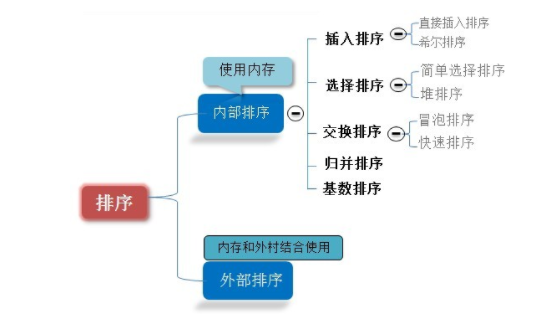

## 比较与非比较排序的区别：

* **比较：**常见的**快速排序、归并排序、堆排序、冒泡排序**等属于**比较排序**

  这类排序的最终结果，依赖于元素之间的比较。只有每个元素之间都进行比较才能确定自己的位置。

  在**冒泡排序**之类的排序中，问题规模为n，又因为需要比较n次，所以平均时间复杂度为**O(n²)**。在**归并排序、快速排序**之类的排序中，问题规模可通过分治法消减为logN次，所以平均时间复杂度为**O(nlogn)**。

  **优点：适用于各种规模的数据，也不在乎数据的分布，都能进行排序。可以说，比较排序适用于一切需要排序的情况。**

* **非比较**：**计数排序、基数排序、桶排序**则属于**非比较排序**

  非比较排序是通过确定每个元素之前，应该有多少个元素来排序。针对数组arr,计算arr[i]之前有多少个元素，则唯一确定了arr[i]在排序后数组中的位置。

  非比较排序只要确定每个元素之前的已有的元素个数即可，所有一次遍历即可解决。算法时间复杂度**O(n)**。

  **优缺点：非比较排序的时间复杂度低，但由于非比较排序需要占用空间来确定唯一的位置。所以对数据规模和数据分布有一定的要求。**

## 算法图解

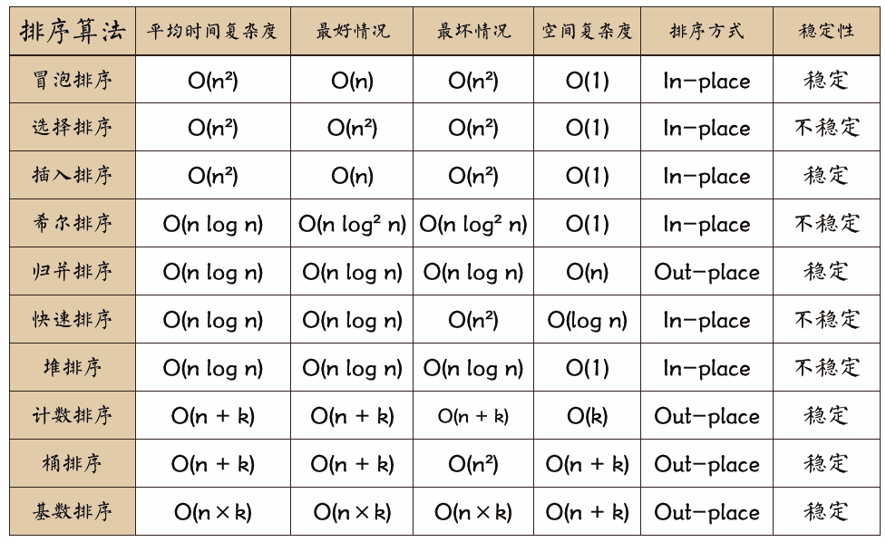

## 图解分析

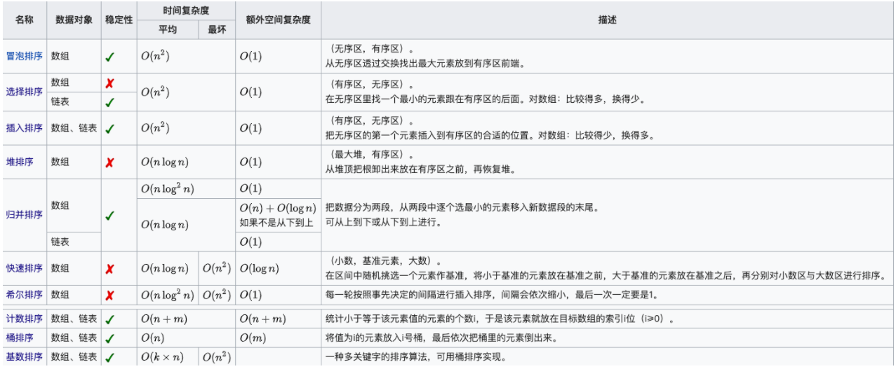

* 时间复杂度

  平方阶 (O(n2)) 排序 各类简单排序：直接插入、直接选择和冒泡排序。

  线性对数阶 (O(nlog2n)) 排序 快速排序、堆排序和归并排序；

  O(n1+§)) 排序，§ 是介于 0 和 1 之间的常数。 希尔排序

  线性阶 (O(n)) 排序 基数排序，此外还有桶、箱排序。

* 关于稳定性

  稳定的排序算法：冒泡排序、插入排序、归并排序和基数排序。

  不是稳定的排序算法：选择排序、快速排序、希尔排序、堆排序。

* 名词解释：
  * n：数据规模

  * k："桶"的个数
  * In-place：占用常数内存，不占用额外内存
  * Out-place：占用额外内存
  * 稳定性：排序后 2 个相等键值的顺序和排序之前它们的顺序相同
    1. 平均时间复杂度是指所有可能的输入实例均以等概率的出现情况下得到算法的运行时间
    2. 最坏时间复杂度，一般讨论的时间复杂度均是最坏情况下的时间复杂度，这样做的原因是最坏情况下的时间复杂度是算法在任何输入实例上运行的界限，这就保证了算法的运行时间不会比最坏情况更长。
    3. 平均时间复杂度和最坏时间复杂度是否一样，这就需要根据算法不同而不同了。

参考：**https://blog.csdn.net/m0_37741420/article/details/106981276**

## 1、冒泡排序 

冒泡排序是比较基础的[排序算法](https://so.csdn.net/so/search?q=排序算法&spm=1001.2101.3001.7020)之一，其思想是相邻的元素两两比较，较大的数下沉，较小的数冒起来，这样一趟比较下来，最大(小)值就会排列在一端。整个过程如同气泡冒起，因此被称作冒泡排序。

### 原理（步骤）

1. 比较相邻的元素。如果第一个比第二个大，就交换他们两个。
2. 每趟从第一对相邻元素开始，对每一对相邻元素作同样的工作，直到最后一对。
3. 针对所有的元素重复以上的步骤，除了已排序过的元素(每趟排序后的最后一个元素)，直到没有任何一对数字需要比较。

### 动图


### 外循环+内循环代码优化：

* 外循环优化：引入一个boolean型变量isSwap，来判断下次比较还有没有必要进行。只在“趟”的级别上优化。

  **isSwap变量的作用**，该变量的作用是**假如本趟比较过程中没有交换发生，则不必进行下一趟比较**

* 内循环优化：要实现在“次”的级别进行优化，其思路是“记下最后一次交换的位置，后边没有交换，必然是有序的，然后下一次排序从第一个比较到上次记录的位置结束即可”。

~~~java
public class BubbleSort {
    public static void main(String[] args) {
        int[] array = new int[5];
        Random random = new Random();
        for (int i=0;i<array.length;i++){
            int num= random.nextInt(10)+1;
            array[i]=num;
        }
        System.out.println("排序前的的数组为："+ Arrays.toString(array));
        bubbleSort(array);
        System.out.println("排序后的的数组为："+ Arrays.toString(array));
    }

    public static void bubbleSort(int[] array) {
        int position = array.length - 1;
        /*外循环为排序趟数，array.length个数进行array.length-1趟 */
        for (int i = 0; i < array.length - 1; i++) {
            boolean isSwap = false;
            /*用来记录最后一次交换的位置*/
            int newPosition = 0;
            /*内循环为每趟比较的次数，第i趟比较array.length-i次 */
            for (int j = 0; j < position; j++) {
                /*相邻元素比较，若满足条件则交换（升序为左大于右，降序反之） */
                if (array[j] > array[j + 1]) {
                    int temp = array[j];
                    array[j] = array[j + 1];
                    array[j + 1] = temp;
                    isSwap = true;
                    /*记录最后一次交换的位置*/
                    newPosition = j;
                }
                /*查看每趟比较后的数组元素*/
                System.out.println("第 " + (i + 1) + " 趟，第 " + (j + 1) + " 次比较后的结果：");
                for (int k = 0; k < array.length; k++) {
                    System.out.print(array[k] + " ");
                }
                System.out.println();
            }
            /*如果没有交换过元素，则已经有序，不再进行接下来的比较*/
            if (!isSwap) {
                break;
            }
            /*下趟比较所需要比较到的位置*/
            position = newPosition;
        }
    }
}

~~~

### 稳定性

是稳定的排序算法，遇到相同的不会进行交换，不同的值才会进行交换。

### 时间复杂度

* 如果待排序序列的初始状态恰好是我们希望的排序结果(如升序或降序)，一趟扫描即可完成排序。所需的关键字比较次数C和记录移动次数M均达到最小值：

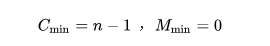

​		**最好的时间复杂度为O(n)。**

* 如果待排序序列是反序(如我们希望的结果是升序，待排序序列是降序)的，需要进行n-1趟排序。每趟排序要进行n-i次关键字的比较(1≤i≤n-1)，且每次比较都必须移动记录三次来达到交换记录位置。在这种情况下，比较和移动次数均达到最大值：

  

  **冒泡排序的最坏时间复杂度为O(n2)。**

* 综上，**因此冒泡排序总的平均时间复杂度为O(n2)。**

### 适用

**数据量小的的排序**

## 2、选择排序

选择排序是一种简单直观的排序算法。它的工作原理是：第一次从待排序的数据元素中选出最小（或最大）的一个元素，存放在序列的起始位置，然后再从剩余的未排序元素中寻找到最小（大）元素，继续放在起始位置知道未排序元素个数为0。

### 原理（步骤 ）

1. 首先在未排序序列中找到最小（大）元素，存放到排序序列的起始位置。
2. 再从剩余未排序元素中继续寻找最小（大）元素，然后放到未排序序列的起始位置。
3. 重复第二步，直到所有元素均排序完毕。

### 动图


### 优化代码

选择排序的优化思路一般是在一趟遍历中，同时找出最大值与最小值，放到数组两端，这样就能将遍历的趟数减少一半。第一次选择最大值与最小值，过程如下：

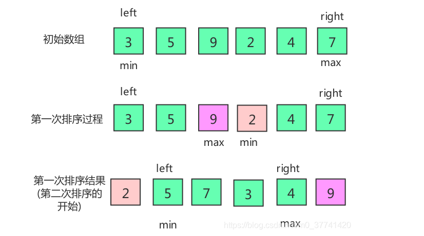

~~~java
public static void selectionSort(int[] array) {
        /*初始化左端、右端元素索引*/
        int left = 0;
        int right = array.length - 1;
        while (left < right){
            /*初始化最小值、最大值元素的索引*/
            int min = left;
            int max = right;
            for (int i = left; i <= right; i++){
                /*标记每趟比较中最大值和最小值的元素对应的索引min、max*/
                if (array[i] < array[min])
                    min = i;
                if (array[i] > array[max])
                    max = i;
            }
            /*最大值放在最右端*/
            int temp = array[max];
            array[max] = array[right];
            array[right] = temp;
            /*此处是先排最大值的位置，所以得考虑最小值（arr[min]）在最大位置（right）的情况*/
            if (min == right)
                min = max;
            /*最小值放在最左端*/
            temp = array[min];
            array[min] = array[left];
            array[left] = temp;
            /*每趟遍历，元素总个数减少2，左右端各减少1，left和right索引分别向内移动1*/
            left++;
            right--;
        }
    }
~~~

### 稳定性

在选择排序中，每趟都会选出最大元素与最小元素，然后与两端元素交换，此时，待排序序列中如果存在与原来两端元素相等的元素，稳定性就可能被破坏。如[5,3,5,2,9]，在array[0]与array[3]元素交换时，序列的稳定性就被破坏了，所以选择排序是一种不稳定的排序算法。

### 时间复杂度

**选择排序的时间复杂度都为O(n2)。**

### 适用

元素个数少的时候。

## 3、插入排序

插入排序也是一种常见的排序算法，插入排序的思想是：将初始数据分为有序部分和无序部分，每一步将一个无序部分的数据插入到前面已经排好序的有序部分中，直到插完所有元素为止。

### 原理(步骤)

插入排序的步骤如下：每次从无序部分中取出一个元素，与有序部分中的元素从后向前依次进行比较，并找到合适的位置，将该元素插到有序组当中。

假如有[5,2,3,9,4,7]六个元素，下面就以排序过程中的一个步骤（此时有序部分为[2,3,5,9]，无序部分为[4,7]，接下来要把无序部分的“4”元素插入到有序部分），来展示一下插入排序的运行过程。

1. 首先，原始的数组元素是这样的。

   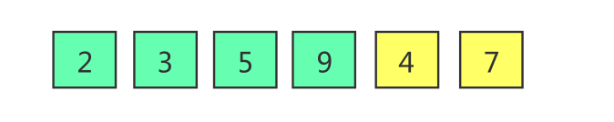

   其中，浅绿色代表有序部分，黄色代表无序部分。

2. 在无序部分中挑出要插入到有序部分中的元素。

   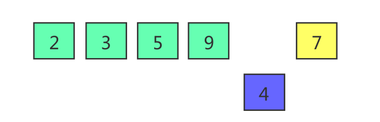

3. 将要插入的元素与左边最近的有序部分的元素进行比较。由于4 < 9，所以9向后移，4向前移。

   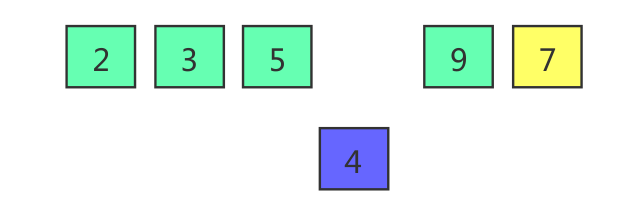

4. 继续将要插入的元素与左边最近的有序部分的元素进行比较。由于4 < 5，所以5向后移，4继续向前移。

   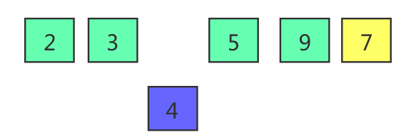

5. 继续将4与3比较。由于4>3，所以不再向前比较，插入到当前位置。

   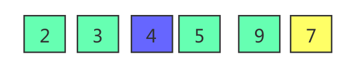

6. 此时有序部分，由[2,3,5,9]变成[2,3,4,5,9]。

   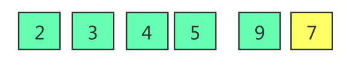

### 动图


### 插入排序优化——折半插入排序

该方法优化有二分的思想，是在将待排序的元素与有序部分的元素比较时，不再挨个比较，而是用二分折中的方式进行比较，加快比较效率。

```java
public static void insertionSort(int[] array) {
    int j,low,mid,high,temp;
    for (int i=1;i<array.length;i++){
        low= 0;
        high=i-1;
        temp =array[i];
        /*找到合适的插入位置high+1，如果中间位置元素
         *比要插入元素大，则查找区域向低半区移动，否
         *则向高半区移动
         */
        while (low<=high){
            mid=(low+high)/2;
            if (array[mid]>temp){
                high=mid-1;
            }else{
                low=mid+1;
            }
        }
        /*high+1后的元素后移*/
        for (j=i-1;j>=high+1;j++){
            array[j+1] = array[j];
        }
        array[j+1]=temp;
    }
}
```

### 稳定性

在使用插入排序时，元素从无序部分移动到有序部分时，必须是不相等(大于或小于)时才会移动，相等时不处理，所以直接插入排序是稳定的。

### 时间复杂度

* 在插入排序中，当待排序序列是有序时，是最优的情况，只需当前数跟前一个数比较一下就可以了，这时一共需要比较n- 1次，时间复杂度为O(n)。
* 最坏的情况是待排序数组是逆序的，此时需要比较次数最多，总次数记为：1+2+3+…+N-1，所以，插入排序最坏情况下的时间复杂度为O(n2)。
* 平均来说，array[1…j-1]中的一半元素小于array[j]，一半元素大于array[j]。插入排序在平均情况运行时间与最坏情况运行时间一样，是O(n2)。

### 适用

待排序序列的元素个数不多(<=50)，且元素基本有序。

## 冒泡、选择、插⼊区别

> * 冒泡、选择、插⼊由于均使⽤的了嵌套循环，并且循环基本上都要遍历所有的元素，所 以⽤⼤ O 表⽰法都需要 O(N^2) 时间级别。
> * 但是三种排序还是有⼀些细微的区别（循环⽐较次数、交换次数）
>   * 冒泡排序书写是最简单的，但是平均性能是没有选择排序和插⼊排序好的。因为它的循环⽐较次数和交换 次数都⽐较多 
>   * 选择排序循环⽐较的次数多，但是交换的次数少
>   * 插⼊排序的交换次数多，但是循环⽐较的次数少

## 4、快速排序

快速排序也是一种较为基础的排序算法，其效率比冒泡排序算法有大幅提升。因为使用冒泡排序时，一趟只能选出一个最值，有n个元素最多就要执行n - 1趟比较。而使用快速排序时，一次可以将所有元素按大小分成两堆，也就是平均情况下需要logn轮就可以完成排序。

### 原理(步骤)

快速排序的思想是：每趟排序时选出一个基准值，然后将所有元素与该基准值比较，并按大小分成左右两堆，然后递归执行该过程，直到所有元素都完成排序。

1. 先从数列中取出一个数作为基准数。
2. 分区过程，将比这个数大的数全放到它的右边，小于或等于它的数全放到它的左边。
3. 再对左右区间重复第二步，直到各区间只有一个数。

### 动图


### 代码优化

* 三数取中：该方法指的是选取基准值时，不再取固定位置(如第一个元素、最后一个元素)的值，因为这种固定取值的方式在面对随机输入的数组时，效率是非常高的。但是一旦输入数据是有序的，使用固定位置取值，效率就会非常低。因此此时引入了三数取中，即在数组中随机选出三个元素，然后取三者的中间值做为基准值。
* 当待排序序列的长度分割到一定大小(如 < 10)后，使用插入排序。
* 在一次分割结束后，可以把与Key相等的元素聚在一起，继续下次分割时，不用再对与key相等元素分割。

~~~java
public static void quickSort(int[] array) {
        if (array==null||array.length<2){
            return;
        }
        process(array,0,array.length-1);
    }
    //第三版快排：不再固定去arr[R]，改为去随机位置的值，然后和arr[R]进行交换，接下来的过程就和第二版一样
    //第三版的复杂度变化了，是O(nlogn)，该事件复杂度是最终求的是数学上的一个平均期望值
    public static void process(int[] array, int L, int R) {
        if (L >= R) {
            return;
        }
        swap(array, L + (int) (Math.random() * (R - L + 1)), R);
        int[] equalArea = netherlandsFlag(array, L, R);
        process(array, L, equalArea[0] - 1);
        process(array, equalArea[1] + 1, R);
    }

    public static void swap(int[] array, int i, int j) {
        int tmp = array[i];
        array[i] = array[j];
        array[j] = tmp;
    }
    /*
    在arr[L...R]上，以arr[R]做基准值，在[L...R]范围内，
    <arr[R]的数都放在左侧，=arr[R]的数放在中间，
    >arr[R]的数放在右边返回的值为和arr[R]相等的范围的数组
     */
    public static int[] netherlandsFlag(int[] arr, int L, int R) {
        if (L > R) {
            return new int[] { -1, -1 };
        }
        if (L == R) {
            return new int[] { L, R };
        }
        //小于基准值的区域的右边界
        int less = L - 1;
        //大于基准值的区域的左边界
        int more = R;
        int index = L;
        while (index < more) {
            //等于基准值，不做处理，判断下一个数据
            if (arr[index] == arr[R]) {
                index++;
            } else if (arr[index] < arr[R]) {//当前数小于基准值
                /*
                将当前值和小于区域右边的一个值交换：swap
                判断下一个数据：index++
                小于区域右移：++less（先++是为了完成swap）
                 */
                swap(arr, index++, ++less);
            } else {
                /*
                将当前值和大于区域左边的一个值交换：swap
                大于区域左移：--more（先--是为了完成swap）
                 */
                swap(arr, index, --more);
            }
        }
        /*
        因为最开始是把arr[R]作为基准值的，所以在进行接下来的一步之前，
        arr[R]实际是在大于区域的最右侧的，
        所以还需要进行一步交换，这样整个数组就成了小于区域、等于区域、大于区域的样子
         */
        swap(arr, more, R);
        //less + 1是等于区域的起始位置，more经过上一步的和arr[R]交换后，就成了等于区域的结束位置
        return new int[] { less + 1, more };
    }
~~~

### 稳定性

在使用快速排序时，每次元素分堆都要选择基准因子。此时，基准因子两边都有可能出现和基准因子相同的元素，如序列[1,3,2,4,3,4,6,3]，如果选择了array[4]作为基准因子，那么array[1]和array[7]势必会被分到基准因子的同一侧，序列的稳定性被破坏。所以，快速排序是一种不稳定的排序算法。

### 时间复杂度

快速排序的时间复杂度是O(nlogn)

### 适用

待排序序列元素较多，并且元素较无序。

## 5、希尔排序

希尔排序又称为缩小增量排序，是对之前介绍的插入排序的一种优化版本，优化的地方在于：不用每次插入一个元素时，就和序列中有序部分中的所有元素进行比较。

### 原理(步骤)

该方法的基本思想是：设待排序元素序列有n个元素，首先取一个整数increment（小于序列元素总数）作为间隔，所有距离为increment的元素放在同一个逻辑数组中，在每一个逻辑数组中分别实行直接插入排序。然后缩小间隔increment，重复上述逻辑数组划分和排序工作。直到最后取increment=1，将所有元素放在同一个数组中排序为止。

其实从上面的希尔排序的思想中也能看出希尔排序的实现步骤：

1. 选increment，划分逻辑分组，组内进行直接插入排序。
2. 不断缩小increment，继续组内进行插入排序。
3. 直到increment=1，在包含所有元素的序列内进行直接插入排序。

### 动图


1. 假如有[5,2,3,9,4,7]六个元素，第一趟取increment的方法是：6/3向下取整+1=3。将整个数据列划分为间隔为3的3个逻辑分组，然后对每一个逻辑分组执行直接插入排序，相当于对整个数组执行了部分排序调整。

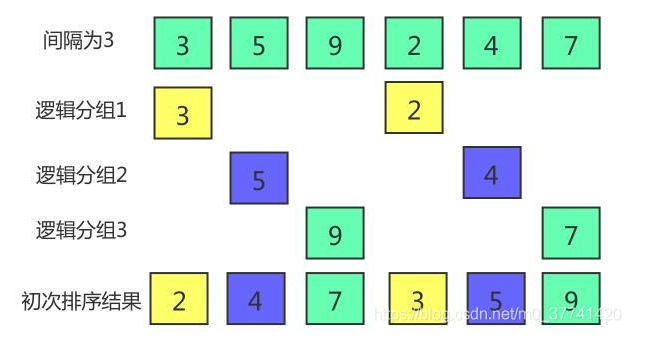

2. 第二趟将间隔increment= increment/3向下取整+1=2，将整个数组划分为2个间隔为2的逻辑分组，分别进行排序。

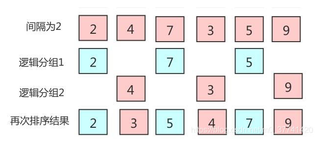

3. 第3趟继续缩小间隔。间隔缩小为increment= increment/3向下取整+1=1，当增量为1的时候，实际上就是把整个数列作为一个逻辑分组进行插入排序。


### 代码优化

由于希尔排序是基于插入排序的，所以在插入排序中也可运用直接插入排序中的优化方式，此处以二分折中的方式来优化希尔排序

~~~java
public static void shellSort(int[] array) {
        /*初始化划分增量*/
        int increment = array.length;
        int j,temp,low,mid,high;
        /*每次减小增量，直到increment = 1*/
        while (increment > 1){
            /*增量的取法之一：除三向下取整+1*/
            increment = increment/3 + 1;
            /*对每个按增量划分后的逻辑分组，进行直接插入排序*/
            for (int i = increment; i < array.length; ++i) {
                low = 0;
                high = i-1;
                temp = array[i];
                while(low <= high){
                    mid = (low+high)/2;
                    if(array[mid]>temp){
                        high = mid-1;
                    }else{
                        low = mid+1;
                    }
                }
                j = i-increment;
                /*移动元素并寻找位置*/
                while(j >= high+1){
                    array[j+increment] = array[j];
                    j -= increment;
                }
                /*插入元素*/
                array[j+increment] = temp;
            }
        }
    }
~~~

### 稳定性

 希尔排序是直接插入排序的优化版，在排序过程中，会根据间隔将一个序列划分为不同的逻辑分组，在不同的逻辑分组中，有可能将相同元素的相对位置改变。如[2,2,4,1]，按间隔为2，降序排序，前两个元素的相对位置就会改变。因此，希尔排序是不稳定的排序方式。

### 时间复杂度

希尔排序在最坏情况下的时间复杂度为O(n2)，平均情况下的时间复杂度为O(n1.3)。

### 适用

待排序序列元素较少时。

## 6、归并排序

### 原理（步骤）

归并排序是建立在归并操作上的一种有效的排序算法，该算法是采用分治法的一个非常典型的应用。将已有序的子序列合并，得到完全有序的序列；即先使每个子序列有序，再使子序列段间有序。若将两个有序表合并成一个有序表，称为二路归并。

> 步骤：
>
> 1. 创建临时数组，使其大小为两个已经排序序列之和，该空间用来存放合并后的序列；
> 2. 设定两个指针，最初位置分别为两个已经排序序列的起始位置；
> 3. 比较两个指针所指向的元素，选择相对小的元素放入到合并空间，并移动指针到下一位置；
> 4. 重复步骤 3 直到某一指针达到序列尾；
> 5. 将另一序列剩下的所有元素直接复制到合并序列尾。

### 图解

动图


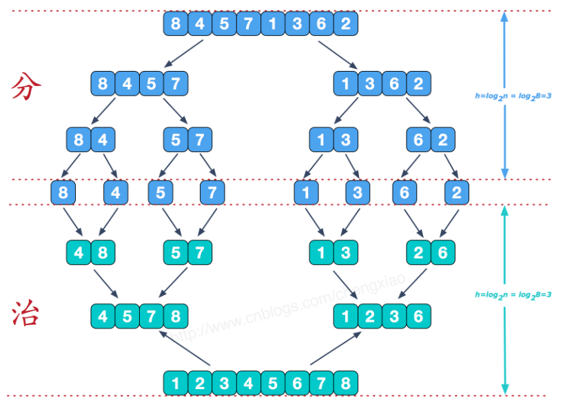

### 代码

~~~java
 static int[] mergeSort(int[] arr) {
        if (arr.length == 1) return arr; // 就单独一个元素，直接返回，不存在排序的问题
        // 拆分
        int[] left = new int[arr.length / 2];
        System.arraycopy(arr, 0, left, 0, left.length);
        System.out.println("left:" + Arrays.toString(left));
        int[] leftSorted = mergeSort(left);

        int[] right = new int[arr.length - left.length];
        System.arraycopy(arr, left.length, right, 0, right.length);
        System.out.println("right:" + Arrays.toString(right));
        int[] rightSorted = mergeSort(right);
        // 合并
        return merge(leftSorted, rightSorted);
    }

    private static int[] merge(int[] left, int[] right) {
        int[] sorted = new int[left.length + right.length];
        // System.arraycopy(left, 0, sorted, 0, left.length);
        // System.arraycopy(right, 0, sorted, left.length, right.length);
        int p = 0; // sorted 数组的指针，表示新添加到里面的元素应该放在第几个
        int lp = 0; // left 数组的指针
        int rp = 0; // left 数组的指针
        while (lp < left.length && rp < right.length) {
            if (left[lp] <= right[rp]) sorted[p] = left[lp++];
            else sorted[p] = right[rp++];
            p++;
        }
        // left或right会又一个剩余
        // 把剩余的直接copy到sorted末尾里面即可
        if (lp == left.length) { // right还有剩余
            System.arraycopy(right, rp, sorted, p, sorted.length - p);
        } else {
            System.arraycopy(left, lp, sorted, p, sorted.length - p);
        }
        return sorted;
    }
~~~

### 稳定性

归并排序是一种稳定的排序算法，因为在拆、合的过程中，如果多个元素相等，不用移动其相对位置，就可完成排序过程。

### 时间复杂度

因为归并排序使用的是分治的思想，可以简单理解为要进行logN次合并，每次合并的数量级是N，所以其时间复杂度为O(nlogn)。

### 适用场景

待排序序列中元素较多，并且要求较快的排序速度时。