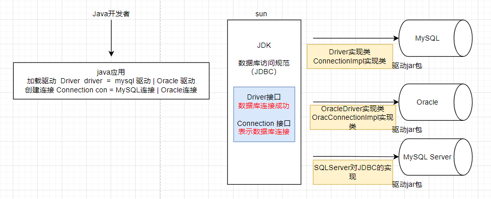
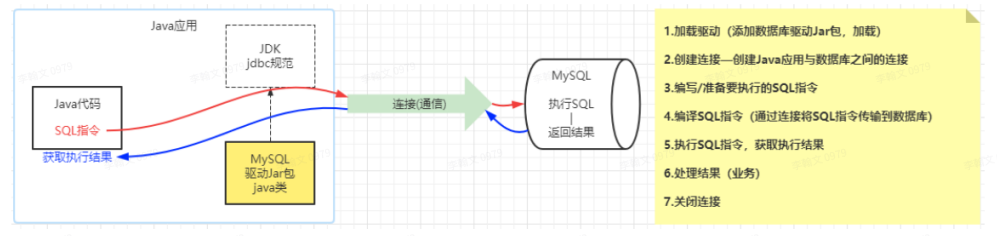
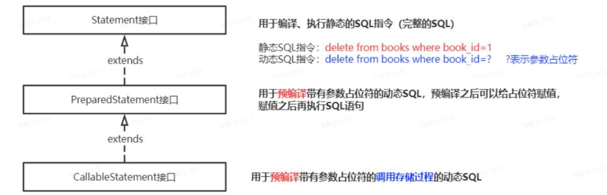

# JDBC-基础

## JDBC简介

* `JDBC(Java DataBase Contectivity)` ：java数据库的连接，数据库编程。
* `JDBC` 是Java语言（JDK）为完成数据库的访问操作提供的一套统一标准。



## JDBC步骤



## JDBC驱动

### 加载驱动

将对应的`jar`添加到工程的`lib`目录下，右键该jar包，选择Add as Library，点击OK；或者将其对应的坐标加到`pom.xml`文件中。

### 注册驱动

通过反射机制，将驱动jar⽂件中提供的驱动类载⼊到JVM中

~~~java
Class.forName("com.mysql.cj.jdbc.Driver");
~~~

### 创建连接

~~~java
// 创建连接：通过数据库驱动管理器 DriverManager（java.sql.Driver）获取连接
// JDBC JDK提供的数据库连接的规范 --- java.sql
// java.sql.Connection接⼝ ⼀个对象就表⽰⼀个数据库连接
// url 数据库的统⼀资源定位器（定位数据库连接资源；数据库服务器的地
// username 数据库连接⽤⼾名
// password 数据库连接密码
// characterEncoding 设置编码
// useSSL=true 使⽤SSL通信
// useTimezone=true 设置客⼾端和服务端时区转换
String url = "jdbc:mysql://localhost:3306/表名";
Connection connection = DriverManager.getConnection(url,"MySQL用户名","MySQL密码");
~~~

> 注意：
>
> * 在我们的应⽤程序中⼿动注册驱动的代码也可以省略 【Class.forName("com.mysql.cj.jdbc.Driver");】 
> * 如果我们没有⼿动注册驱动，驱动管理器在获取连接的时候发现没有注册驱动则读取 驱动 jar/META-INF/servicesjava.sql.Driver⽂件中配置的驱动类路径进⾏注册

### 编写SQL指令

编写要执⾏的SQL指令：SQL指令中需要的参数可以通过字符串拼接的形式（会导致SQL注⼊）

### 加载SQL指令

~~~java
// 加载SQL指令:获取SQL指令的加载器
// java.sql.Statement 对象 可以理解为 SQL指令的“加载器”
// java.sql.PreparedStatement 对象 SQL指令的“预编译加载器”
Statement statement = connection.createStatement();
~~~

### 执⾏SQL、获取结果

~~~java
// 执⾏SQL获取执⾏结果
// a. 如果SQL指令为DQL,则 ResultSet rs = statement.executeQuery(sql); rs中就是查询结果
// b. 如果SQL指令为DML，则 int i = statement.executeUpdate(sql); i就表⽰DML操作影响的数据⾏数
// 如果i>0，表⽰DML操作是成功的；如果i=0表⽰DML操作对数据表中的数据没有影响
int i = statement.executeUpdate(sql);
~~~

### 处理结果

~~~java
// 处理结果（业务）
// 添加操作：返回值i>0表⽰添加成功，否则表⽰添加失败
// 修改操作：返回值i>0表⽰修改对数据有影响，如果i=0 表⽰对数据库没有影响
// 删除操作：返回值i>0表⽰删除对数据有影响，如果i=0 表⽰对数据库没有影响
// 查询操作：从ResultSet rs中取出查询结果，封装到Java对象中
System.out.println(i>0?"添加成功":"添加失败");

~~~

### 关闭连接

~~~java
// 关闭连接
// 如果执⾏DML操作：需要关闭Statement和Connection
// 如果执⾏DQL操作：需要关闭ResultSet、Statement和Connection
// 关闭之前先判空、由⼤到⼤关闭
if(statement != null && !statement.isClosed()){
	statement.close();
}
if(connection !=null && !connection.isClosed()){
	connection.close();
}
~~~

## JDBC增删改查实操

insert、delete、update、select

## JDBC的核⼼类与接⼝

> * java.sql.DriverManager类 驱动管理器
> * java.sql.Connection接⼝ 数据库连接
> * java.sql.Statement接⼝ SQL指令的“加载/执⾏器” 
> * java.sql.ResultSet接⼝ 结果集

### DriverManager类

> * 注册驱动 
> * 创建数据库连接

### Connection接⼝

> Connection对象表⽰Java应⽤程序与数据库之间的连接
>
> * 通过Connection接⼝对象，获取执⾏SQL语句的Statement对象
> * 完成数据的事务管理

#### 获取Statement对象

>  Statement接⼝: 编译执⾏静态SQL指令
>
> ~~~java
> Statement statement = connection.createStatement();
> ~~~
>
> PreparedStatement接⼝：继承了Statement接⼝，预编译动态SQL指令（解决SQL注⼊问 题）。
>
> ~~~java
>  PreparedStatement preparedStatement = connection.prepareStatement(sql);
> ~~~

#### 事务管理

~~~java
//开启事务（关闭事务⾃动提交）
connection.setAutoCommit(false);
//事务回滚
connection.rollback();
//提交事务
connection.commit();
~~~

### Statement接⼝

> ⽤于编译、执⾏SQL指令



~~~java
// 执⾏DML操作的SQL指令
int i = statement.executeUpdate(sql);
// 执⾏DQL操作的SQL指令
ResultSet rs = statement.executeQuery(sql);
~~~

### ResultSet接⼝

> ResultSet接⼝对象，表⽰查询操作返回的结果集，提供了便利的⽅法⽤于获取结果集中的数据

判断结果集中是否还有数据未取出

~~~java
ResultSet rs = statement.executeQuery(select_statement);
// 判断rs中是否还有数据
rs.next();
~~~

获取rs指向的结果集中某⾏的数据

~~~java
int id = rs.getInt(String columnLable); //获取rs指向的⾏的 列 数据（字段名）
int id = rs.getInt(int columnIndex);
rs.getString(""); //获取String类型数据
rs.getDouble(""); //获取Double类型数据
....
rs.getDate(""); //获取⽇期类型数据
~~~

## SQL注⼊问题

> * 在JDBC操作SQL指令编写过程中，如果SQL指令中需要数据，我们可以通过字符串拼接的形式将参 数拼接到SQL指令中， 如` String sql = "delete from books where book_id="+s;` (s就是拼接到SQL中的变 量) 
>
> * 使⽤字符串拼接变量的形式来设置SQL语句中的数据，可能会导致` 因变量值的改变引起SQL指令的原意发⽣改变` ，这就被称为SQL注⼊。SQL注⼊问题是需要避免 的。
>
>   例如： 
>
>   * 如果s的值为` 1` ，SQL指令 ： `delete from books where book_id=1`， 
>   * 如果s的值为 `1 or 1=1 `，SQL指令：`delete from books where book_id=1 or 1=1` 
>   * 那么SQL中的条件则是⼀个恒等式

### 如何解决SQL注⼊问题

> 使⽤`PreparedStatement`进⾏SQL预编译解决SQL注⼊问题： 
>
> * 在编写SQL指令时，如果SQL指令中需要参数，⼀律使⽤ `?` 参数占位符 
> * 如果SQL指令中有  ` ?` ，在JDBC操作步骤中不再使⽤`Statement`，⽽是从`Conection`对象获取 `PreparedStatement`对SQL指令进⾏预编译 `PreparedStatement preparedStatement = connection.prepareStatement(sql);` 
> *  预编译完成之后，通过`PreparedStatement`对象给预编译后的SQL指令的 `? `复制 
>   * `prepareadStatement.setInt`(参数占位符序号,值); 
>   * `prepareadStatement.setString`(参数占位符序号,值); 
> * SQL指令中的所有 ? 完成赋值之后，通过`PreparedStatement`执⾏SQL执⾏SQL时不再加载SQL
>   * `int i = prepareadStatement.executeUpdate(); `
>   * `ResultSet rs = preparedStatement.executeQuery();`

## 其他

```java
@Data // 在程序运行期间自动生成getter&setter、toString、hashCode、equals
@NoArgsConstructor // 默认构造器、无参构造器
@AllArgsConstructor // 全参构造器
```

```java
URL 一般来说由4个部分组成
schema(jdbc:mysql://) | domain(localhost):port(3306) | path(/sql_store) | params
```

JDBC 数据静默处理：不要破坏数据，不会让用户造成严重误解的