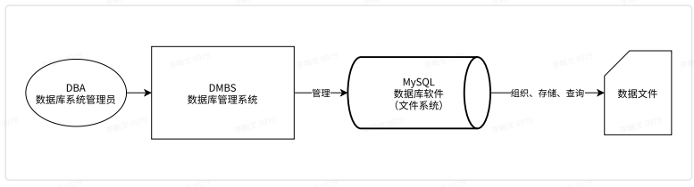
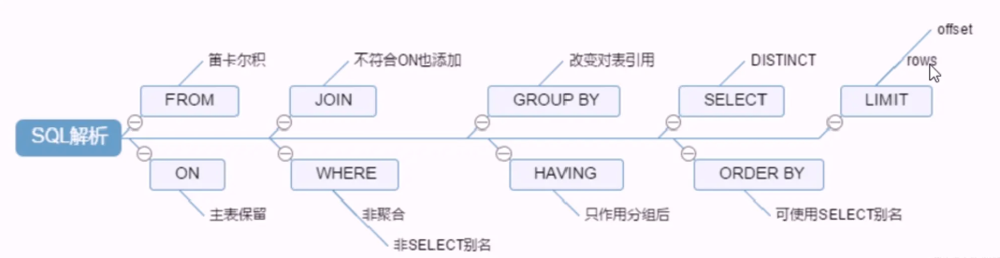
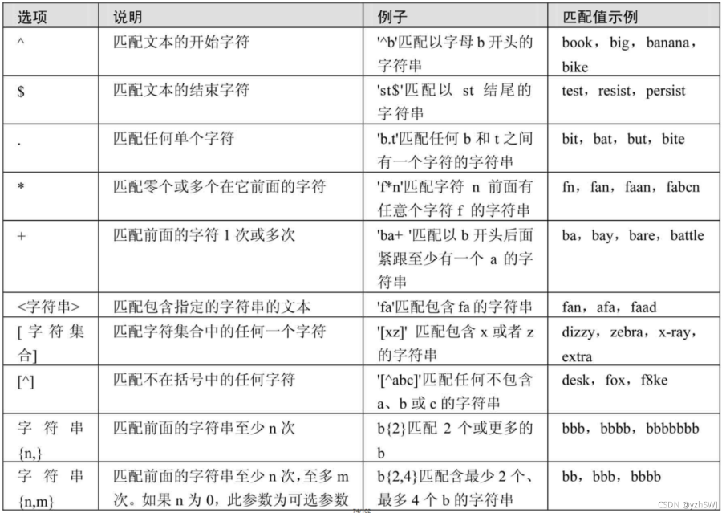
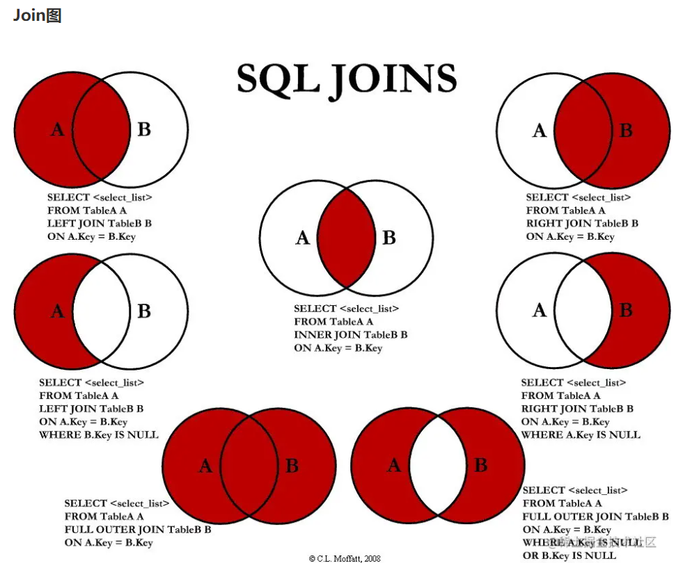

# MySQL

参考文档：

https://www.runoob.com/mysql/mysql-connection.html

https://juejin.cn/post/6850037271233331208

https://blog.csdn.net/weixin_45851945/article/details/114287877

https://juejin.cn/post/6844903599915401230

https://juejin.cn/post/6844903935539413006

语法：

https://segmentfault.com/a/1190000008063235

https://juejin.cn/post/6844904053902671886

# 数据库

## 简介

`DataBase`：就是存放数据的仓库；数据库（DataBase，简称DB）是⻓期存储在计算机内部有结构的、⼤量的、共享的数据集合。是可快速访问的以某种格式存储的数据集合。

为方便管理，使用`DBMS`(DataBase Management System，数据库管理系统)进行管理。

通过指令访问`DBMS`，`DBMS`执行指令对数据进行查询或修改、删除，同时`DBMS`也会将结果返回给我们。

数据库主要分为两种关系型和非关系型：

> - 关系型（`Relational`）：采⽤了关系模型来组织数据的存储，以⾏和列的形式存储数据并记录数据与数据之 间的关系⸺将数据存储在表格中，数据保存在彼此相互关联的表格中，我们可以使用`SQL`（Structured Query Language）来进行操作。常见的`RDBMS`有MySQL、Oracle、MS SQLServer等，每个`DBMS`都有各自优化的`SQL`语言，但所有这些系统的语言都类似，都遵从标准的`SQL`规范
>
>   > 关系型数据库产品 
>   >
>   > MySQL 免费 
>   >
>   > * MariaDB 
>   > * Percona Server 
>   >
>   >  Oracle 收费 
>   >
>   > PostgreSQL 
>   >
>   > SQL Server 
>   >
>   > Access
>   >
>   > Sybase
>   >
>   > SQLite
>
> - 非关系型（`NoSQL`）：采⽤键值对的模型来存储数据，只完成数据的记录，不会记录数据与数据之间的关系；没有表格和彼此的关系，不支持`SQL`，但它们也有自己的查询语言。
>
>   > ⾮关系型数据库产品 
>   >
>   > ⾯向检索的列式存储 Column-Oriented 
>   >
>   > * HaBase （Hadoop⼦系统）
>   > * BigTable （Google） 
>   >
>   > ⾯向⾼并发的缓存存储Key-Value
>   >
>   > * Redis
>   > * MemcacheDB 
>   >
>   > ⾯向海量数据访问的⽂档存储 Document-Oriented  
>   >
>   > * MongoDB 
>   > *  CouchDB

## 数据库术语

> * 数据库（Database） ：存储数据的集合，提供数据存储服务
> * 数据（Data） ： 实际上指的是描述事物的符号记录
> * 数据库管理系统（Database Management System，DBMS ） ：数据库管理系统，是位于用户与操作系统之间的⼀层数据管理软件
> * 数据库系统管理员（Database Anministrator，DBA）：负责数据库创建、使⽤及维护的专⻔⼈员
> * 数据库系统（Database System，DBS） ：数据库系统管理员、数据库管理系统及数据库组成整个单元

## 数据库规范（三范式）

> 注意：面试常问

* 第一范式：每个单元格都应该是单一值（标量），并且列的值尽量不重复（**要求任何一张表必须有主键，每一个字段原子性不可再分**）。
* 第二范式：没有依赖任何关系的其它子集的非主键字段。通俗来说，即是，每个表都应该是单一功能的，它能且仅能表示一个实体，这个表的所有字段都是用来描述这个特定实体的。（**建立在第一范式的基础之上，要求所有非主键字段完全依赖主键，不要产生部分依赖。**）
* 第三范式：所有表中的字段都只依赖主键，与任何其它的字段值无关。即，一个表中的字段不应该由表中的其它字段推导而来。（**建立在第二范式的基础之上，要求所有非主键字段直接依赖主键，不要产生传递依赖。**）

设计数据库表的时候，按照以上的范式进行，可以**避免表中数据的冗余，空间的浪费**。

## SQL的分类

1. `DDL(Data Defintion Language)`数据定义语言，用来操作数据库、表、列等，常用语句：create、alter、drop。

   > CREATE TABLE 表名(
   > 列名1 数据类型,
   > 列名2 数据类型,
   > 列名3 数据类型,
   > ...
   > )
   >
   > ALTER TABLE 表名;
   > eg：
   >
   > ​	ALTER TABLE 表名 ADD 列名 数据类型;（添加一个列）
   > ​    ALTER TABLE 表名 CHANGE 列名 新列名 新数据类型;（修改列名）
   > ​    ALTER TABLE 表名 DROP 列名;
   >
   > ​	DROP TABLE 表名;
   > ​	DROP DATABASE 数据库名;

2. `DML(Data Manipulation Language)` 数据操作语言，用来操作数据库中表里面的数据，常用语句：insert、update、delete。

   > INSERT INTO 表名 (字段1,字段2,...) values (某值,某值,...),(某值,某值,...);
   >
   > UPDATE 表名 SET 列名=新值 WHERE 限定条件;
   >
   > DELETE FROM 表名 WHERE 限定条件;

   #### DDL与DML的区别：

   DDL：对**数据库内部**的对象进行创建、删除、修改操作

   DML：只是对**表内部**数据进行操作 (不涉及到表的定义、结构的修改，也不涉及到其他对象)

3. `DCL(Data Control Language)` 数据控制语言，用来操作访问权限和安全级别，常用语句：grant、deny、revoke。

   > GRANT （授予某种权限）
   >
   > DENY  	(禁止权限使用)
   >
   > REVOKE （取消某种权限）

4. `DQL(Data Query Language)` 数据查询语言，用来查询数据，常用语句：select。

   > SELECT 列名 FROM 表名 WHERE 限定条件;

## MySQL 查询语句执行循序

## 单表查询

### select查询

~~~sql
select * from 表名；
select * from 表名 where 条件；
select * from 表名 order by;
~~~

> * select：用来选择要查询的列。
> * from： 查询那一张表。
> * where：声明查询条件。
> * order：根据哪些字段进行排序

一条完整的`SQL`是有多个句子组成的，各个句子都要需要按指定的顺序排列，否则则会出现语法错误而无法执行。

### select句子

~~~sql
-- 挑选指定的列进行查询
select 列名1，列名2 from 表名;
-- 列与列可以调换顺序，结果展示的时候也会出现相应的变化

-- 特定的列可以结合数学表达式一起使用
select 列名1，列名2，列名2*0.9 from 表名;

-- 为了在查看数据的时候方便对某列进行理解，可以对列使用as取别名
select 列名1，列名2，列名2*0.9 as 别名（任取,最好见名知意） from 表名;
-- 如果别名中含有空格，需要使用单引号包含起来

-- 使用distinct修饰列名进行去重查询
select distinct 列名 from 表名；
~~~

### where子句

`where` 子句用来对查询结果根据 条件进行筛选：

* 首先遍历所有数据
* 然后通过条件对每一条数据进行检验
* 满足条件（true），就会将这条数据返回到结果集

~~~sql
-- >、>=、<、<=、=、!=、<> 常用判断字符

-- 使用and、or、not组合多个条件，如 
select * from 表名 where 列名1 > 条件 and 列名2 > 条件

-- and优先级大于or
select * from 表名 where 列名1 > 条件 or 列名2 > 条件 and 列名3 > 条件 

-- 使用括号让语义更清晰
select * from 表名 where 列名1 > 条件 or （列名2 > 条件 and 列名3 > 条件）

-- not取反
select * from 表名 where not(列名1 > 条件 and 列名2 > 条件)

-- in表示一定范围
select * from 表名 where 列名 in(条件1,条件2,条件3);

-- between，包含左右边界值
select * from 表名 where 列名 between 条件 and 条件 ;

-- like进行模糊查询，%任意多个任意字符 _任意一个字符
select * from 表名 where 列名 like 'x%';  -- 以x开头
select * from 表名 where 列名 like '%x%'; -- 包含x字符
select * from 表名 where 列名 like '%x';  -- 以x结尾

-- 正则表达式查询
-- | 逻辑或
select * from 表名 where 列名 regexp '^xxx|mac';-- ^ 字符串开始
select * from 表名 where 列名 regexp 'xxx$|mac';-- $ 字符串结束
select * from 表名 where 列名 regexp '[XXX]X';

-- null查询
select * from 表名 where 列名 is null;
select * from 表名 where 列名 is not null;
~~~

 `REGEXP`操作符中常用字符匹配列表：

### order by子句（排序）

> * 语法:order by [字段名] asc(升序)/desc(降序)
>
> * 一个**select**语句永远只能有一个**order** **by**子句
>
> *  order by后边还可以跟表达式
>
>   注意：如果不写asc或者desc，默认的就是asc

~~~sql
select * from 表名 order by 列 desc;
select * from 表名 order by 列1，列2;
~~~

### limit子句（分页查询）

~~~SQL
-- limit size;
-- limit offset, size
select * from 表名 limit 条件;
select * from 表名 limit 条件1，条件2;
~~~

## 多表查询

[<<多表查询](../../class_document/MySQL.md)

## 增删改

列属性

> - Column：列名称，一般用蛇形命名法
> - Datatype：数据类型
> - PK：主键，每一张表都有主键
> - NN：非空属性
> - AI：自动增长列
> - Default：默认值

insert、delete、update

[<<增删改](../../class_document/MySQL.md)

## count(*)、 count(1)、count(列名)区别

**效果**

> * count(*)包括了所有的列，相当于行数，在统计结果的时候，不会忽略列值为NULL
> * count(1)包括了忽略所有列，用1代表代码行，在统计结果的时候，不会忽略列值为NULL
> * count(列名)只包括列名那一列，在统计结果的时候，会忽略列值为空（这里的空不是只空字符串或者0，而是表示null）的计数，即某个字段值为NULL时，不统计。

**效率**

> * 列名为主键，count(列名)会比count(1)快 。
> * 列名不为主键，count(1)会比count(列名)快。
> * 如果表多个列并且没有主键，则 count（1） 的执行效率优于 count（*） 。
> * 如果有主键，则 select count（主键）的执行效率是最优的。
> * 如果表只有一个字段，则 select count（*）最优。
