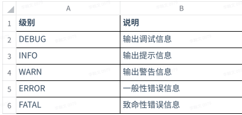

# MyBatis

## 简介

`MyBatis`框架是一个实现半自动的`ORM`（对象关系映射技术）的持久化框架。(前身是`iBatis`)

> 目前使用的DB绝大部分是面向关系的，`RDBMS`（Relational Database Management System），关系数据库管理系统。
>
> 面向关系的主要特点体现在表与表之间的关系，都是依赖一个外键维护的。当从`DB`提取两张表或跟多的表时，需要通过关联查询，关联查询需要外键。
>
> `Java`是一门面向对象的语言，因而数据在`DB`和`Java`程序中进行交换时，会存在与同语言的沟通阻抗，就会用大量的`getter`和`setter`来解决这个问题。
>
> 大量`ORM`框架的出现，就是为了解决上述重复代码的问题：
>
> * 反射机制（获取类的属性相关信息，可以`setter`）
> * `IO`或者注解（解析处理数据库字段和`Java`类属性的映射关系）

`ORM`（Object Relational Mapping）对象关系映射，将Java中的一个对象与数据表中的行就一一对应。

`ORM`框架提供了实体类与数据表的映射关系，通过映射文件的配置，实现对象的持久化。

`MyBatis`特点

* 支持自定义`SQL`、存储过程
* 对原有的`JDBC`进行了封装，几乎消除了`JDBC`代码，让开发者只需关注`SQL`本身
* 支持XML和注解配置方式自定义完成`ORM`操作，实现结果映射

> 框架：软件半成品，完成软件开发过程中的通用操作，程序员只需要很少或者不用进行加工就能实现特定的功能，从而简化开发人员软件开发中的步骤，提高开发效率。

## 常用框架

* `MVC`框架：简化了`Servlet`的开发步骤

  `Struts、Struts2、SpringMVC`

* 持久层框架：完整数据库操作框架

  `Apache DBUtils、Hibernate、Spring JPA、Mybatis、EJB3.0`

* `Spring`框架

  `SSM：Spring SpringMvc MyBatis`

  `SSH：Spring Struts2 Hibernate`

## MyBatis依赖

~~~xml
<!-- https://mvnrepository.com/artifact/org.mybatis/mybatis -->
<dependency>
    <groupId>org.mybatis</groupId>
    <artifactId>mybatis</artifactId>
    <version>XXXX</version>
</dependency>

~~~

## 配置文件

mybatis-config.xml

~~~xml
<?xml version="1.0" encoding="UTF-8" ?>
<!DOCTYPE configuration
        PUBLIC "-//mybatis.org//DTD Config 3.0//EN"
        "http://mybatis.org/dtd/mybatis-3-config.dtd">
<configuration>

    <settings>
        <setting name="logImpl" value="STDOUT_LOGGING"/>
<!--        <setting name="logImpl" value="LOG4J2"/>-->
    </settings>

    <typeAliases>
        <!--给类型取简单的别名-->
        <typeAlias alias="Office" type="com.xxx.pojo.Office"/>
        <typeAlias alias="User" type="com.xxx.pojo.User"/>
        <typeAlias alias="Emp" type="com.xxx.pojo.Emp"/>
    </typeAliases>
    <!--可以配置多个描述DB的环境-->
    <environments default="mysql_hr">
        <environment id="mysql_hr">
            <!--事务管理默认使用JDBC的事务-->
            <transactionManager type="JDBC"/>
            <!--mybatis会使用一个轻量级的数据库连接池来管理连接-->
            <dataSource type="POOLED">
                <property name="driver" value="com.mysql.cj.jdbc.Driver"/>
                <property name="url"
                          value="jdbc:mysql://localhost:3306/sql_hr?rewriteBatchedStatements=true&amp;serverTimezone=GMT%2B8&amp;characterEncoding=utf8"/>
                <property name="username" value="root"/>
                <property name="password" value="admin"/>
            </dataSource>
        </environment>
    </environments>

    <!--注册各个映射文件（记载了SQL）-->
    <mappers>
       <mapper resource="mybatis/mapper/OfficeMapper.xml"/>
        <mapper resource="mybatis/mapper/UserMapper.xml"/>
        <mapper resource="mybatis/mapper/EmpMapper.xml"/>
        <package name="com.xxx.mybtis.mapper"/>
    </mappers>
</configuration>
~~~

> &需要使用 `&amp;`转义

### 映射文件

~~~xml
<?xml version="1.0" encoding="UTF-8" ?>
<!DOCTYPE mapper
        PUBLIC "-//mybatis.org//DTD Mapper 3.0//EN"
        "http://mybatis.org/dtd/mybatis-3-mapper.dtd">
<mapper namespace="mybatis.office">
    <!--namespace形同Java中的package，只要具有唯一性就行-->

    <!--该映射文件有一些简单的关于DB的字段映射到Java属性的默认实现：从snake命名法转化为小驼峰命名法-->

    <!--自定义映射关系-->
    <resultMap id="officeMap" type="com.qf.pojo.Office">
        <id property="officeId" column="office_id" />
        <result property="address" column="address"/>
        <result property="city" column="city"/>
        <result property="state" column="state"/>
    </resultMap>

    <!-- resultType:声明结果的返回类型-->
    <select id="findById" resultMap="officeMap">
        select * from offices where office_id = #{officeId}
    </select>
</mapper>
~~~

测试

~~~java
 try (
     SqlSession session = SqlSessionUtils.getSession()
 ) {
     // 参数1：在映射文件中的SQL语句的ID
     // 参数2：提交给#{id}这个占位符的实参
     Office office = session.selectOne("mybatis.office.findById", 1);
     System.out.println(office);
 }
~~~

## JDBC四要素

~~~java
String resource = "mybatis/mybatis-config.xml";
// 从配置文件中获取连接DB的重要信息（JDBC的4要素）
InputStream inputStream = Resources.getResourceAsStream(resource);
// 创建一个类似于DbUtils的工具类，它主要用来创建操作mybatis的api的session（对应jdbc的connection）
SqlSessionFactory sqlSessionFactory = new SqlSessionFactoryBuilder().build(inputStream);
System.out.println(sqlSessionFactory);
~~~

## 基于注解的实现

~~~java
public interface OfficeMapper {

    @Select("select * from offices where office_id = #{id}")
    Office findById(Integer id);
}
~~~

进行注册

~~~xml
<mappers>
    <!--<mapper resource="mybatis/mapper/OfficeMapper.xml"/>-->
    <package name="com.qf.mybtis.mapper"/>
</mappers>
~~~

测试

~~~java
 try (
     SqlSession session = SqlSessionUtils.getSession()
 ) {
     // OfficeMapper mapper = session.getMapper(OfficeMapper.class);
     // Office office = mapper.findById(1);
     // System.out.println(office);
     UserMapper mapper = session.getMapper(UserMapper.class);
     User user = mapper.findById(1);
     System.out.println(user);
 }
~~~

> 使用Mapper风格进行查询的时候，框架不会对snake命名做默认的映射

### \#{}和${}的区别

* `${key}` 表⽰获取参数，先获取参数的值拼接到`SQL`语句中，再编译执⾏`SQL`语句;可能引起`SQL`注⼊ 问题 
* `#{key} `表⽰获取参数，先完成`SQL`编译(预编译)，预编译之后再将获取的参数设置到`SQL`与中 ，可 以避免`SQL`注⼊问题

## 日志

在`MyBatis`中，我们可以在配置文件中增加一项配置，让其在运行期间输出相应的日志，方便在程序出现问题的对bug进行重现、排查。

在`mybatis-config.xml`中增加以下配置，使用默认的`Sytem.out.println()`在控制台输出运行信息

~~~xml
<settings>
    <setting name="logImpl" value="STDOUT_LOGGING"/>
</settings>
~~~

还可以使用更专业的第三方专门负责输出日志的框架

~~~xml
<settings>
    <setting name="logImpl" value="LOG4J2"/>
</settings>
~~~

使用`Log4j2`，不光是可以在控制台输出日志，也可以把日志根据具体的文件体积滚动输出到指定的文件中去

~~~xml
<dependency>
    <groupId>org.apache.logging.log4j</groupId>
    <artifactId>log4j-api</artifactId>
    <version>2.18.0</version>
</dependency>
<dependency>
    <groupId>org.apache.logging.log4j</groupId>
    <artifactId>log4j-core</artifactId>
    <version>2.18.0</version>
</dependency>
~~~

log4j2.xml

~~~xml
<?xml version="1.0" encoding="UTF-8"?>
<Configuration>
    <Appenders>
        <Console name="Console" target="SYSTEM_OUT">
            <!-- 日志等级 debug info warn error -->
            <PatternLayout pattern="%d{YYYY-MM-dd HH:mm:ss} [%t] %-5level %logger{36} - %msg%n"/>
        </Console>
    </Appenders>

    <Loggers>
        <Logger name="com.example" level="INFO"/>
        <Root level="debug">
            <AppenderRef ref="Console"/>
        </Root>
    </Loggers>
</Configuration>
~~~

### 日志输出级别

根据输出的⽇志信息的重要程度分为5个级别

