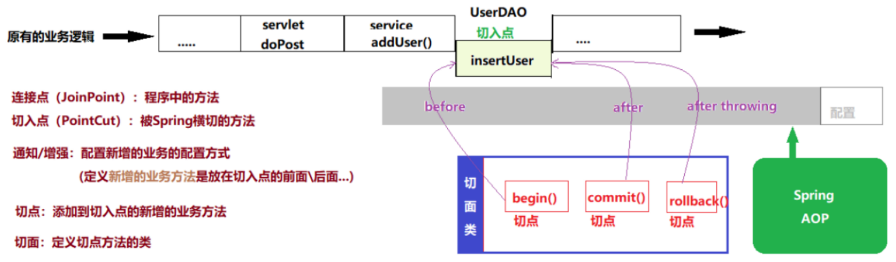
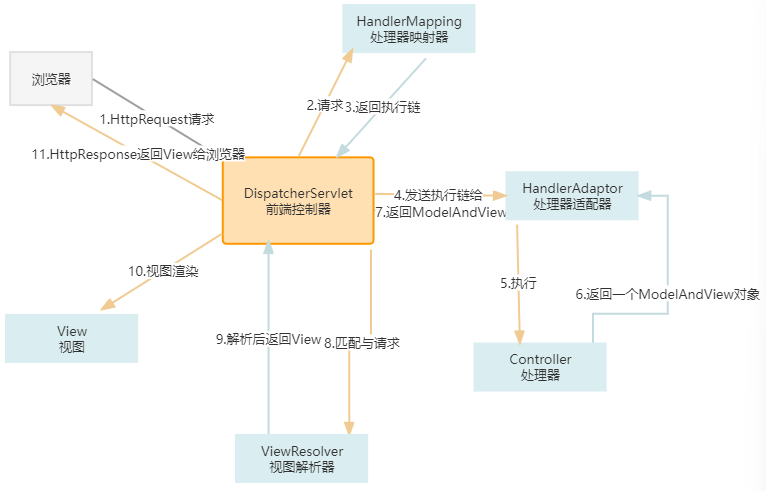
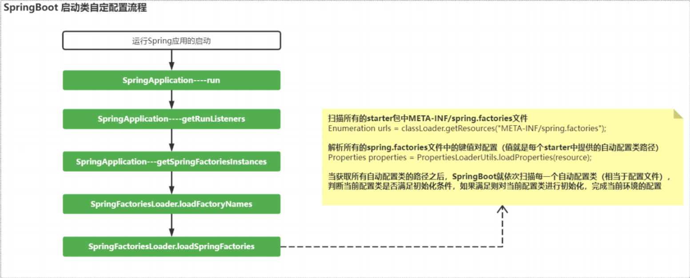

# Spring

https://www.cnblogs.com/doudouxiaoye/p/5693399.html

## 简介

Spring是目前最流行的Java框架，他里面集成了大量的工具以及一些开箱即用的解决方案。

Spring是一个轻量级的控制反转和面向切面的容器框架，用来解决企业项目开发的复杂问题——解耦。

* 轻量级：体积小，对代码没有入侵性
* 控制反转：`IoC`（InverseofControl），把创建对象的工作交给Spring完成，Spring在创建对象的时候同时可以完成对象属性复制（DI）
* 面向切面：`AOP`（AspectOrientedProgramming）面向切面编程，可以再不改变原有业务逻辑的情况下实现对业务的增强（**AOP并没有帮助我们解决任何新的问题，它只是提供了一种更好的办法，能够用更少的工作量来解决现有的一些问题，使得系统更加健壮，可维护性更好**）
* 容器：实例（beans）的容器，管理创建的对象

## Spring架构

* CoreContainer

  Spring容器组件，用于完成实例的创建和管理

  > core
  >
  > beans实例管理
  >
  > context容器上下文

* AOP

  SpringAOP组件，实现面向切面编程

* Web

  SpringWeb组件实际指的是SpringMVC框架，实现Web项目MVC控制

  > web（Spring对web项目的支持）
  >
  > webmvc(SpringMVC组件)

* DataAccess

  Spring数据访问组件，也是⼀个基于JDBC封装的持久层框架（即使没有mybatis，Spring也可以完成持久化操作）

* Test

  Spring的单元测试组件，提供了Spring环境下的单元测试⽀持

## SpringProjects

* SpringBoot脚手架
* SpringFramework基础核心框架
* SpringData数据持久化的方案
* SpringCloud微服务
* SpringSecurity权限框架

针对不同的技术领域，Spring都提供了非常完善的解决方案，不光是官方的还是第三方的，都可以使用Spring的规范接入进来。

## SpringFramework

### SpringCore

Spring是一个Bean（实例化）的容器框架。（bean就是能提供服务的或者功能的类）

Spring主要在系统中承担这样的一些职责：

* 管理bean的生命周期（负责创建和销毁这些bean）
* 负责调度bean来提供服务
* 维护和管理多个bean之间的关系

由此Spring官宣的重要特性：

* IoC：InverceofControl（控制反转）
* DI：DependencyInjection（依赖注入）
* AOP：AspectOrientedProgramming（面向切面编程）

### IoC

`IoC`(`Inversion-of-Control`)模式是关于提供任何类型的`callback`（控制反应），而不是直接行动。`DI`(`Dependency-Injection`)模式是`IoC`模式的一个更具体的版本，旨在从代码中移除依赖项。

> 每个`DI`实现都可以考虑`IoC`，但不应该调用它`IoC`，因为实现依赖注入比回调更难（不要通过使用通用术语“`IoC`”来降低产品的价值）。

IoC（控制反转），以前是由开发人员自己来创建和销毁对象，但使用Spring的时候，可以把这个工作交给Spring容器来处理。

#### 基于XML风格

SpringIoC容器组件，可以完成对象的创建、对象属性赋值、对象管理

配置文件

~~~xml
<?xmlversion="1.0"encoding="UTF-8"?>
<beansxmlns="http://www.springframework.org/schema/beans"
xmlns:xsi="http://www.w3.org/2001/XMLSchema-instance"
xsi:schemaLocation="
http://www.springframework.org/schema/beans
http://www.springframework.org/schema/beans/spring-beans.xsd">
<!--对于⼀个xml⽂件如果作为框架的配置⽂件，需要遵守框架的配置规则-->
<!--通常⼀个框架为了让开发者能够正确的配置，都会提供xml的规范⽂件（dtd\xsd）-->

<!--配置service这个bean-->
<beanid="helloService"class="com.example.springbootdemo.ioc.xml.HelloService"></bean>
</beans>
~~~

~~~java
ClassPathXmlApplicationContextcontext=newClassPathXmlApplicationContext("spring/config.xml");
//根据id来获取对应bean的实例
HelloServicehelloService=(HelloService)context.getBean("helloService");
helloService.hello();
~~~

容器还提供了一些其他功能特性：

- 单例模式
- 根据配置调用指定的初始化和销毁方法

#### 基于注解

SpringIoC的使⽤，需要我们通过XML将类声明给Spring容器进⾏管理，从⽽通过Spring⼯⼚完成对象的创建及属性值的注⼊；

Spring除了提供基于XML的配置⽅式，同时提供了基于注解的配置：直接在实体类中添加注解声明给Spring容器管理，以简化开发步骤

配置文件

~~~xml
<?xmlversion="1.0"encoding="UTF-8"?>
<beansxmlns="http://www.springframework.org/schema/beans"
xmlns:xsi="http://www.w3.org/2001/XMLSchema-instance"
xmlns:context="http://www.springframework.org/schema/context"
xsi:schemaLocation="http://www.springframework.org/schema/beans
http://www.springframework.org/schema/beans/spring-beans.xsd
http://www.springframework.org/schema/context
http://www.springframework.org/schema/context/spring-context.xsd">
<!--声明使⽤注解配置-->
<context:annotation-config/>
<!--声明Spring⼯⼚注解的扫描范围-->
<context:component-scanbase-package="com.qfedu.beans"/>
</beans>
~~~

常用注解

* @Component

  类注解，声明此类被Spring容器进⾏管理，相当于bean标签的作⽤

  @Component(value="stu")value属性⽤于指定当前bean的id，相当于bean标签的id属性；value属性也可以省略，如果省略当前类的id默认为类名⾸字⺟改⼩写

  除了@Component之外@Service、@Controller、@Repository这三个注解也可以将类声明给Spring管理，他们主要是语义上的区别

  >  @Controller注解主要声明将控制器类配置给Spring管理，例如Servlet
  >
  > @Service注解主要声明业务处理类配置Spring管理，Service接⼝的实现类
  >
  > @Repository直接主要声明持久化类配置给Spring管理，DAO接⼝
  >
  > @Component除了控制器、servcie和DAO之外的类⼀律使⽤此注解声明

* `@Scope`

  类注解，⽤于声明当前类单例模式还是⾮单例模式，相当于`bean`标签的`scope`属性

  `@Scope`("`prototype`")表⽰声明当前类为⾮单例模式（默认单例模式）

* `@Lazy`

  类注解，⽤于声明⼀个单例模式的`Bean`是否为懒汉模式

  `@Lazy(true)`表⽰声明为懒汉模式，默认为饿汉模式

* `@PostConstruct`

  ⽅法注解，声明⼀个⽅法为当前类的初始化⽅法（在构造器之后执⾏），相当于`bean`标签的`init-method`属性

* `@PreDestroy`

  ⽅法注解，声明⼀个⽅法为当前类的销毁⽅法（在对象从容器中释放之前执⾏），相当于`bean`标签的`destorymethod`属性

* `@Autowired`

  属性注解、⽅法注解（`set`⽅法），声明当前属性⾃动装配，默认`byType`

  `@Autowired(required=false)`通过`requried`属性设置当前⾃动装配是否为必须（默认必须⸺如果没有找到类型与属性类型匹配的bean则抛出异常）

  > `byType`、`ref`引⽤

* `@Resource`

  属性注解，也⽤于声明属性⾃动装配

  默认装配⽅式为`byName`，如果根据`byName`没有找到对应的`bean`，则继续根据`byType`寻找对应的`bean`，根据`byType`如果依然没有找到`Bean`或者找到不⽌⼀个类型匹配的`bean`,则抛出异常。

### DI

依赖注入，依赖，就是一类的功能实现会需要另外一些类来完成。

> 在代码重用的时候，组合优先于继承
>
> 主要是继承对于类型有限定（在重用代码之前，这个类已经是另一个类的子类了）

`Spring`容器加载完配置文件后，通过反射创建类的对象，并给属性赋值。

三种注入方式：

`set`方法注入、构造器注入、接口注入（不常用）

* `Set`方法注入：在`bean`标签中通过配置`property`标签给属性赋值，实际上就是通过反射调用`set`方法完成属性的注入。
* 构造器注入：即通过构造函数完成依赖关系的设定,容器通过调用类的构造方法将其所需的依赖关系注入其中。

> 有何不同
>
> 接口注入：具备侵入性，它要求组件必须与特定的接口相关联，因此并不被看好，实际使用有限。
>
> `set`注入：通过`setter`方法设定依赖关系更加直观。如果依赖关系较为复杂，那么构造子注入模式的构造函数也会相当庞大，而此时设值注入模式则更为简洁。如果用到了第三方类库，可能要求我们的组件提供一个默认的构造函数，此时构造子注入模式也不适用。
>
> 构造器注入：在构造期间完成一个完整的、合法的对象。所有依赖关系在构造函数中集中呈现。依赖关系在构造时由容器一次性设定，组件被创建之后一直处于相对“不变”的稳定状态。只有组件的创建者关心其内部依赖关系，对调用者而言，该依赖关系处于“黑盒”之中。
>
> 构造方法注入和`setter`方法注入因为其侵入性较弱，且易于理解和使用，所以是现在使用最多的注入方式；而接口注入因为侵入性较强，近年来已经不流行了

### AOP

#### 代理模式

优点：将通⽤性的⼯作都交给代理对象完成，被代理对象只需专注⾃⼰的核⼼业务。

> 1.被代理类中只⽤关注核⼼业务的实现，将通⽤的管理型逻辑（事务管理、⽇志管理）和业务逻辑分离
>
> 2.将通⽤的代码放在代理类中实现，提供了代码的复⽤性
>
> 3.通过在代理类添加业务逻辑，实现对原有业务逻辑的扩展（增强）

##### 静态代理

为每一个需要代理的目标都编写一个代理类，静态代理简单直接，但是如果被关注的目标类非常多的话，那么编写代理类的工作量非常大。

##### 动态代理

动态代理，⼏乎可以为所有的类产⽣代理对象，一个代理实例（`Proxy`实例），可以代理任意多个目标对象

#### AOP

AspectOrientedProgramming⾯向切⾯编程，是⼀种利⽤“横切”的技术（底层使用的仍然是JDKProxy或者是CGLIB来产生代理实例），对原有的业务逻辑进⾏拦截，并且可以在这个拦截的横切⾯上添加特定的业务逻辑，对原有的业务进⾏增强。

基于动态代理实现在不改变原有业务的情况下对业务逻辑进⾏增强

#### AOP开发步骤

1、创建切面类，在切面类定义切点方法

2、将切面类配置给Spring容器

3、声明切入点

4、配置AOP的通知策略（就是声明将切⾯类中的切点⽅法如何织⼊到切⼊点）

> before、after、after-throwing、after-returning、around

#### AOP使用注意事项

如果要使⽤Springaop⾯向切⾯编程，调⽤切⼊点⽅法的对象必须通过Spring容器获取

如果⼀个类中的⽅法被声明为切⼊点并且织⼊了切点之后，通过Spring容器获取该类对象，实则获取到的是⼀个代理对象

如果⼀个类中的⽅法没有被声明为切⼊点，通过Spring容器获取的就是这个类真实创建的对象

#### 事务

切面逻辑：在项目中与具体的业务逻辑没有直接关联的逻辑，这样的逻辑在各个模块中用线条连接起来，就可以形成一个面

切点：具体在什么地点应用切面逻辑

Aspect-OrientedProgramming，就是面向切面编程，它使用动态生成字节码的技术，能创建关注目标的代理对象，从而把具体的代理逻辑和切面逻辑解耦。

面向切面编程，基于其特点，可以被应用于事务、监控、输出日志、权限控制，更加具体一点的业务逻辑埋点（统计某一个页面的访问总数）、费用折扣（平台级别的买200送20、花呗分期中计算当期应付多少钱）

配置包含了事务管理的bean

~~~xml
<beanid="txManager"class="org.springframework.jdbc.datasource.DataSourceTransactionManager">
<propertyname="dataSource"ref="ds"/>
</bean>
~~~

> 这个管理器中，主要是包含了具体的JDBC的事务管理实现，而MyBatis又是基于JDBC的，这个类在`AOP`实际上就是`切面逻辑`

配置事务通知，告知具体的代理对象，哪些方法需要应用事务，哪些不需要

~~~xml
<!--配置通知bean：事务的传播特性-->
<tx:adviceid="advice1"transaction-manager="txManager">
<tx:attributes>
<tx:methodname="select*"propagation="SUPPORTS"isolation="REPEATABLE_READ"/>
<tx:methodname="query*"propagation="SUPPORTS"/>
<tx:methodname="find*"propagation="SUPPORTS"/>
<tx:methodname="save*"propagation="REQUIRED"/>
<tx:methodname="insert*"propagation="REQUIRED"/>
<tx:methodname="update*"propagation="REQUIRED"/>
<tx:methodname="delete*"propagation="REQUIRED"/>
<tx:methodname="del*"propagation="REQUIRED"/>
</tx:attributes>
</tx:advice>
~~~

- SUPPORTS表示如果该方法被内嵌到另一个含有事务的方法中进行调用，则支持事务，否则，不应用事务
- REQUIRED必须应用事务，如果被内嵌到另一个含有事务的方法中进行调用，则沿用上层事务
- isolation：数据库的隔离级别，默认就是`RR`

配置切面

~~~xml
<!--配置切面：切点(where)+执行什么样的切面逻辑(dowhat)-->
<aop:config>
<!--配置通知者-->
<aop:advisoradvice-ref="advice1"pointcut="execution(*com.example.service..*Service.*(..))"/>
</aop:config>
~~~

- advice-ref：指向某一个事务通知，因为通知里面有具体的哪些方法应用事务，哪些不应用的信息
- pointcut：通过表达式，回答这样一个问题：具体事务的边界在哪里？但是它回答这个具体的切点，颗粒度一般指向到某一个具体的类，具体的方法是否应用事务，由通知来回答
- 之前的before（开启事务）和after-returning（提交事务）、after（释放连接资源）、after-throwing（回滚事务），都已经整合到`DataSourceTransactionManager+TransactionTemplate`

## Spring作用域

* **singleton:默认值，bean在每个Springioc容器中只有一个实例。**

  ~~~xml
  <beanid="类名"class="实体类路径"scope="singleton"lazy-init="true"></bean>
  ~~~

* **prototype**：一个bean的定义可以有多个实例。

  ~~~xml
  <beanid="类名"class="实体类路径"scope="prototype"></bean>
  ~~~

* **request**：每次http请求都会创建一个bean，该作用域仅在基于web的SpringApplicationContext情形下有效。

* **session**：在一个HTTPSession中，一个bean定义对应一个实例。该作用域仅在基于web的SpringApplicationContext情形下有效。

* **global-session**：在一个全局的HTTPSession中，一个bean定义对应一个实例。该作用域仅在基于web的SpringApplicationContext情形下有效。

## SpringBean的声明周期⽅法

在bean标签中通过init-method属性指定当前bean的初始化⽅法，初始化⽅法在构造器执⾏之后执⾏，通过destroy-method属性指定当前bean的销毁⽅法，销毁⽅法在对象销毁之前执⾏

## Spring自动装配

⾃动装配：Spring在实例化当前bean的时候从Spring容器中找到匹配的实例赋值给当前bean的属性

⾃动装配策略有两种：

* byName根据当前Bean的属性名在Spring容器中寻找匹配的对象，如果根据name找打了bean但是类型不匹配则抛出异常

  ~~~xml
  <beanid="clazz"class="com.xxxx.bean.Clazz"></bean>
  <beanid="stu2"class="com.xxxx.bean.Student"autowire="byName"></bean>
  ~~~

* byType根据当前Bean的属性类型在Spring容器中寻找匹配的对象，如果根据类型找到了多个bean也会抛出异常

  ~~~xml
  <beanid="clazz"class="com.xxxx.bean.Clazz"></bean>
  <beanid="stu2"class="com.xxxx.bean.Student"autowire="byType"></bean>
  ~~~

## Spring事务管理

* 事务就是对一系列的数据库操作（比如插入多条数据）进行统一的提交或回滚操作，如果插入成功，那么一起成功，如果中间有一条出现异常，那么回滚之前的所有操作。这样可以防止出现脏数据，防止数据库数据出现问题。
* **Spring的声明式事务通常是指在配置文件中对事务进行配置声明**，其中包括了很多声明属性，它是通过SpringProxy帮你做代理，自己不用额外的写代码，只要在Spring配置文件中声明即可；通常用在数据库的操作里面；
* **编程式事务就是指通过硬编码的方式做事务处理**，这种处理方式需要写代码，事务中的逻辑可以自己定制；可以是数据库的东东，也可以是其他的操作。
* **Spring中也有自己的事务管理机制，一般是使用TransactionMananger进行管理，**可以通过Spring的注入来完成此功能。

# SpringMVC

* Spring配备构建Web应用的全功能MVC框架。Spring可以很便捷地和其他MVC框架集成，如Struts，Spring的MVC框架用控制反转把业务对象和控制逻辑清晰地隔离。它也允许以声明的方式把请求参数和业务对象绑定。

* SpringMVC是一个基于MVC的Web框架。SpringMVC是Spring框架的一个模块，SpringMVC和Spring无需通过中间整合层进行整合。

## 优势

* 严格遵守了MVC分层思想
* 采⽤了松耦合、插件式结构；相⽐较于我们封装的BaseServlet以及其他的⼀些MVC框架来说更灵活、更具扩展性
* SpringMVC是基于Spring的扩展、提供了⼀套完善的MVC注解
* SpringMVC在数据绑定、视图解析都提供了多种处理⽅式，可灵活配置
* SpringMVC对RESTfulURL设计⽅法提供了良好的⽀持

## 核心工作

* 接收并解析请求
* 处理请求
* 数据渲染、响应请求

## SpringMVC的请求处理流程

SpringMVC通过前端控制器（DispatcherServlet）拦截并处理⽤⼾请求的

> 1. 用户通过浏览器发起 HttpRequest 请求到前端控制器 (DispatcherServlet)。
>
> 2. DispatcherServlet 将用户请求发送给处理器映射器 (HandlerMapping)。
>
> 3. 处理器映射器 (HandlerMapping)会根据请求，找到负责处理该请求的处理器，并将其封装为处理器执行链 返回 (HandlerExecutionChain) 给 DispatcherServlet
>
> 4. DispatcherServlet 会根据 处理器执行链 中的处理器，找到能够执行该处理器的处理器适配器(HandlerAdaptor)    --注，处理器适配器有多个
>
> 5. 处理器适配器 (HandlerAdaptoer) 会调用对应的具体的 Controller
>
> 6. Controller 将处理结果及要跳转的视图封装到一个对象 ModelAndView 中并将其返回给处理器适配器 (HandlerAdaptor)
>
> 7. HandlerAdaptor 直接将 ModelAndView 交给 DispatcherServlet ，至此，业务处理完毕
>
> 8. 业务处理完毕后，我们需要将处理结果展示给用户。于是DisptcherServlet 调用 ViewResolver，将 ModelAndView 中的视图名称封装为视图对象
>
> 9. ViewResolver 将封装好的视图 (View) 对象返回给 DIspatcherServlet
>
> 10. DispatcherServlet 调用视图对象，让其自己 (View) 进行渲染（将模型数据填充至视图中），形成响应对象 (HttpResponse)
>
> 11. 前端控制器 (DispatcherServlet) 响应 (HttpResponse) 给浏览器，展示在页面上。

## 核心组件

* DispatchServlet前端控制器、总控制器

  用于接收请求，协同各组件工作、响应请求

* HandlerMapping处理器映射器

  用于负责根据用户请求的URL找到对应的Handler

  可以根据需要配置多个处理器映射

* HandlerAdapter处理器适配器

  用于处理处理器映射器解析的用户请求的调用链，通过适配器完成Handler的调用

* Handler处理器控制器

  由开发工程师根据业务需求进行开发，用于处理请求

* ModelAndView视图模型

  用于封装处理器返回的数据以相应的视图

* ViewResolver视图解析器

  用于对ModelAndView进行解析

  可以根据需要配置多个视图解析器

# SpringBoot

SpringBoot采⽤了习惯优于配置/约定⼤于配置的理念快速搭建项⽬的开发环境，开发者⽆需或者进⾏很少的配置就可以快速的将项⽬运⾏起来。

* 习惯优于配置：在项⽬框架整合过程中，配置⽂件⼏乎都是相同的（习惯），因此我们可以预先将这些配置定义好，当需要整合时直接引⽤预先定义的配置。 

* 随着动态语⾔的流⾏，Java语⾔开发显得越来越笨重：配置繁琐、开发效率低、项⽬部署变得复杂、集成第三⽅技术难度⼤,在这种情况下，SpringBoot就应运⽽⽣。

## 优势

* 能够零配置快速搭建项目
* 对主流的第三方框架提供了无配置集成（springBoot内置了配置）
* 项目可以独立运行，无需单独配置Servlet容器（SpringBoot搭建的web项目内置了Tomcat）
* 提高了开发效率、部署效率
* SpringBoot提供了运行监控的日志系统
* SpringBoot与云原生有天然的集成（Spring Cloud）

## 缺点

* 由于配置都是内置的，报错定位难度大（使用简单，极易上手、精通难）
* 传统项目微服务改造难

## 自动配置

SpringBoot应⽤从启动类的主⽅法启动

SpringBoot⾃动配置是通过加载⾃动配置类，判断配置类的初始化条件，满⾜条件则对配置类进⾏初始化来完成的。

### 启动类注解

@SpringBootApplication实际指代的是⼀组注解。

*  @ComponentScan注解，声明Spring容器的组件加载范围⸺启动类所在的包。 
*  @EnableAutoConfiguration注解，声明开启SpringBoot的⾃动配置。 
* @SpringBootConfiguration注解，声明启动类同时为Spring的配置类（在配置类中定义⽅法，在⽅法上添加@Bean注解，就可以将⽅法返回的对象存放到Spring容器）。

