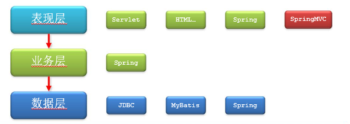
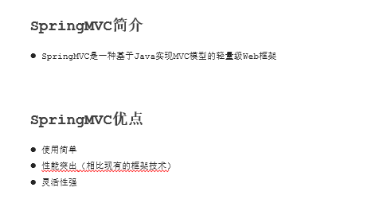
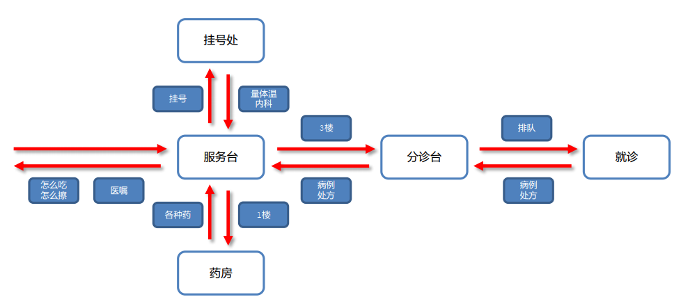
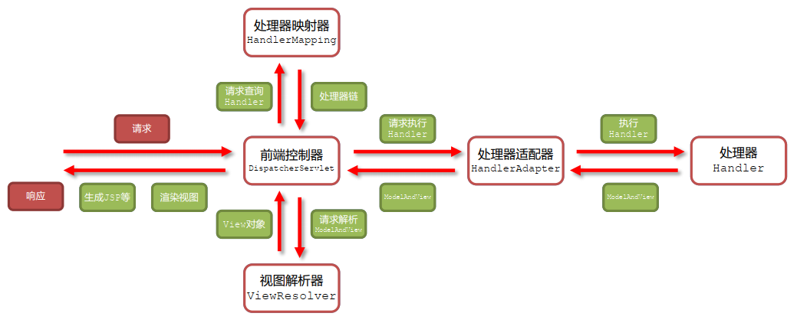
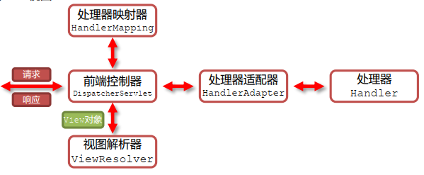
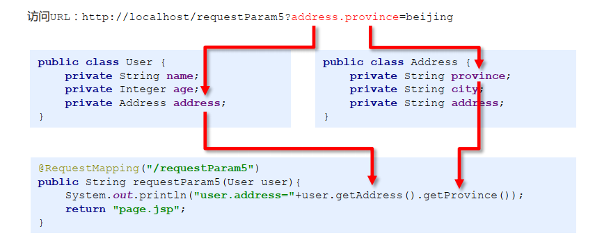
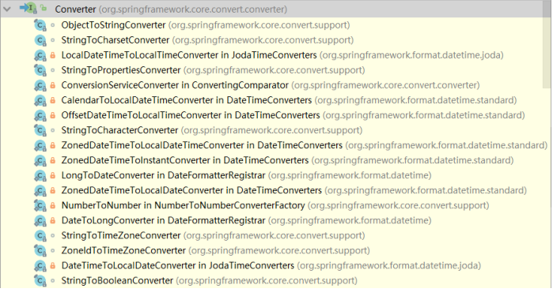

# 1 SpringMVC 概述

**三层架构**    

- 表现层：负责数据展示

-  业务层：负责业务处理

- 数据层：负责数据操作  



MVC（Model View Controller），一种用于设计创建Web应用程序表现层的模式

- Model（模型）：数据模型，用于封装数据

-  View（视图）：页面视图，用于展示数据

* jsp  
* html

Controller（控制器）：处理用户交互的调度器，用于根据用户需求处理程序逻辑

* Servlet
* SpringMVC

  




# 2 入门案例

## 2.1 入门案例制作

①导入SpringMVC相关坐标

```xml
<!-- servlet3.1规范的坐标 -->
<dependency>
    <groupId>javax.servlet</groupId>
    <artifactId>javax.servlet-api</artifactId>
    <version>3.1.0</version>
    <scope>provided</scope>
</dependency>
<!--jsp坐标-->
<dependency>
    <groupId>javax.servlet.jsp</groupId>
    <artifactId>jsp-api</artifactId>
    <version>2.1</version>
    <scope>provided</scope>
</dependency>
<!--spring的坐标-->
<dependency>
    <groupId>org.springframework</groupId>
    <artifactId>spring-context</artifactId>
    <version>5.1.9.RELEASE</version>
</dependency>
<!--spring web的坐标-->
<dependency>
    <groupId>org.springframework</groupId>
    <artifactId>spring-web</artifactId>
    <version>5.1.9.RELEASE</version>
</dependency>
<!--springmvc的坐标-->
<dependency>
    <groupId>org.springframework</groupId>
    <artifactId>spring-webmvc</artifactId>
    <version>5.1.9.RELEASE</version>
</dependency>
```

②定义表现层业务处理器Controller，并配置成spring的bean（等同于Servlet）

```java
@Controller
public class UserController {

    public void save(){
        System.out.println("user mvc controller is running ...");
    }
}
```

```xml
<?xml version="1.0" encoding="UTF-8"?>
<beans xmlns="http://www.springframework.org/schema/beans"
       xmlns:context="http://www.springframework.org/schema/context"
       xmlns:xsi="http://www.w3.org/2001/XMLSchema-instance"
       xsi:schemaLocation="http://www.springframework.org/schema/beans http://www.springframework.org/schema/beans/spring-beans.xsd
        http://www.springframework.org/schema/context
        http://www.springframework.org/schema/context/spring-context.xsd">
    <!--扫描加载所有的控制类类-->
    <context:component-scan base-package="com.itheima"/>

</beans>
```

③web.xml中配置SpringMVC核心控制器，用于将请求转发到对应的具体业务处理器Controller中（等同于Servlet配置）

```xml
<servlet>
    <servlet-name>DispatcherServlet</servlet-name>
    <servlet-class>org.springframework.web.servlet.DispatcherServlet</servlet-class>
    <init-param>
        <param-name>contextConfigLocation</param-name>
        <param-value>classpath*:spring-mvc.xml</param-value>
    </init-param>
</servlet>
<servlet-mapping>
    <servlet-name>DispatcherServlet</servlet-name>
    <url-pattern>/</url-pattern>
</servlet-mapping>
```

④设定具体Controller的访问路径（等同于Servlet在web.xml中的配置）

```java
//设定当前方法的访问映射地址
@RequestMapping("/save")
public void save(){
    System.out.println("user mvc controller is running ...");
}
```

⑤设置返回页面  

```java
//设定当前方法的访问映射地址
@RequestMapping("/save")
//设置当前方法返回值类型为String，用于指定请求完成后跳转的页面
public String save(){
    System.out.println("user mvc controller is running ...");
    //设定具体跳转的页面
    return "success.jsp";
}
```


## 2.2 入门案例工作流程分析  

* 服务器启动
  1. 加载web.xml中DispatcherServlet
  2. 读取spring-mvc.xml中的配置，加载所有com.itheima包中所有标记为bean的类
  3. 读取bean中方法上方标注@RequestMapping的内容
* 处理请求
  1. DispatcherServlet配置拦截所有请求 /
  2. 使用请求路径与所有加载的@RequestMapping的内容进行比对
  3. 执行对应的方法
  4. 根据方法的返回值在webapp目录中查找对应的页面并展示  


## 2.3 SpringMVC 技术架构图







*  DispatcherServlet：前端控制器， 是整体流程控制的中心，由其调用其它组件处理用户的请求， 有
  效的降低了组件间的耦合性
* HandlerMapping：处理器映射器， 负责根据用户请求找到对应具体的Handler处理器
* Handler：处理器，业务处理的核心类，通常由开发者编写，描述具体的业务
* HandlAdapter：处理器适配器，通过它对处理器进行执行
* View Resolver：视图解析器， 将处理结果生成View视图
* View：视图，最终产出结果， 常用视图如jsp、 html  



# 3 基本配置

## 3.1 常规配置（Controller加载控制）

* SpringMVC的处理器对应的bean必须按照规范格式开发，未避免加入无效的bean可通过bean加载过滤器进
  行包含设定或排除设定，表现层bean标注通常设定为@Controller  

**xml方式**

```xml
<context:component-scan base-package="com.itheima">
    <context:include-filter
                            type="annotation"
                            expression="org.springframework.stereotype.Controller"/>
</context:component-scan>
```

### 3.1.1 静态资源加载

```xml
<!--放行指定类型静态资源配置方式-->
<mvc:resources mapping="/img/**" location="/img/"/>
<mvc:resources mapping="/js/**" location="/js/"/>
<mvc:resources mapping="/css/**" location="/css/"/>

<!--SpringMVC提供的通用资源放行方式-->
<mvc:default-servlet-handler/>
```

 

### 3.1.2 中文乱码处理 

  SpringMVC提供专用的中文字符过滤器，用于处理乱码问题  

  配置在 **web.xml** 里面

```XML
<!--乱码处理过滤器，与Servlet中使用的完全相同，差异之处在于处理器的类由Spring提供-->
<filter>
    <filter-name>CharacterEncodingFilter</filter-name>
    <filter-class>org.springframework.web.filter.CharacterEncodingFilter</filter-class>
    <init-param>
        <param-name>encoding</param-name>
        <param-value>UTF-8</param-value>
    </init-param>
</filter>
<filter-mapping>
    <filter-name>CharacterEncodingFilter</filter-name>
    <url-pattern>/*</url-pattern>
</filter-mapping>
```


## 3.2 注解驱动

*   使用注解形式转化SpringMVC核心配置文件为配置类  


```java
@Configuration
@ComponentScan(value = "com.itheima",includeFilters =
    @ComponentScan.Filter(type=FilterType.ANNOTATION,classes = {Controller.class})
    )
public class SpringMVCConfiguration implements WebMvcConfigurer{
    //注解配置放行指定资源格式
//    @Override
//    public void addResourceHandlers(ResourceHandlerRegistry registry) {
//        registry.addResourceHandler("/img/**").addResourceLocations("/img/");
//        registry.addResourceHandler("/js/**").addResourceLocations("/js/");
//        registry.addResourceHandler("/css/**").addResourceLocations("/css/");
//    }

    //注解配置通用放行资源的格式
    @Override
    public void configureDefaultServletHandling(DefaultServletHandlerConfigurer configurer) {
        configurer.enable();;
    }
}
```

*   基于servlet3.0规范，自定义Servlet容器初始化配置类，加载SpringMVC核心配置类  


```java
public class ServletContainersInitConfig extends AbstractDispatcherServletInitializer {
    //创建Servlet容器时，使用注解的方式加载SPRINGMVC配置类中的信息，并加载成WEB专用的			           //ApplicationContext对象
    //该对象放入了ServletContext范围，后期在整个WEB容器中可以随时获取调用
    @Override
    protected WebApplicationContext createServletApplicationContext() {
        AnnotationConfigWebApplicationContext ctx = new AnnotationConfigWebApplicationContext();
        ctx.register(SpringMVCConfiguration.class);
        return ctx;
    }

    //注解配置映射地址方式，服务于SpringMVC的核心控制器DispatcherServlet
    @Override
    protected String[] getServletMappings() {
        return new String[]{"/"};
    }

    @Override
    protected WebApplicationContext createRootApplicationContext() {
        return null;
    }

    //乱码处理作为过滤器，在servlet容器启动时进行配置，相关内容参看Servlet零配置相关课程
    @Override
    public void onStartup(ServletContext servletContext) throws ServletException {
        super.onStartup(servletContext);
        CharacterEncodingFilter cef = new CharacterEncodingFilter();
        cef.setEncoding("UTF-8");
        FilterRegistration.Dynamic registration = servletContext.addFilter("characterEncodingFilter", cef);
        registration.addMappingForUrlPatterns(EnumSet.of(DispatcherType.REQUEST,DispatcherType.FORWARD,DispatcherType.INCLUDE),false,"/*");
    }
}
```

  删除web.xml
  删除spring-mvc.xml  

 **小节**
 基于servlet3.0规范，配置Servlet容器初始化配置类，初始化时加载SpringMVC配置类
 转化SpringMVC核心配置文件
 转化为注解（例如： spring处理器加载过滤）
 转化为bean进行加载
 按照标准接口进行开发并加载（例如：中文乱码处理、静态资源加载过滤）  

# 4 请求

## 4.1 普通类型参数传参

  参数名与处理器方法形参名保持一致  

  访问URL： http://localhost/requestParam1?name=itheima&age=14  

```java
@RequestMapping("/requestParam1")
public String requestParam1(String name ,String age){
    System.out.println("name="+name+",age="+age);
    return "page.jsp";
}
```

 **@RequestParam** 的使用
 类型： 形参注解
 位置：处理器类中的方法形参前方
 作用：绑定请求参数与对应处理方法形参间的关系  

```java
@RequestMapping("/requestParam2")
public String requestParam2(@RequestParam(
                            name = "userName",
                            required = true,
                            defaultValue = "itheima") String name){
    
    System.out.println("name="+name);
    return "page.jsp";
}
```

## 4.2 POJO类型参数传参

当POJO中使用简单类型属性时， 参数名称与POJO类属性名保持一致  

访问URL： http://localhost/requestParam3?name=itheima&age=14  

**Controller**

```java
@RequestMapping("/requestParam3")
public String requestParam3(User user){
    System.out.println("name="+user.getName());
    return "page.jsp";
}
```

**POJO类**

```java
public class User {
    private String name;
    private Integer age;
    
    public String getName() {
        return name;
    }

    public void setName(String name) {
        this.name = name;
    }

    public Integer getAge() {
        return age;
    }

    public void setAge(Integer age) {
        this.age = age;
    }

}
```


**参数冲突**
 当POJO类型属性与其他形参出现同名问题时，将被同时赋值
 建议使用@RequestParam注解进行区分
访问URL： http://localhost/requestParam4?name=itheima&**age**=14  

```java
@RequestMapping("/requestParam4")
public String requestParam4(User user,String age){
    System.out.println("user.age="+user.getAge()+",age="+age);
    return "page.jsp";
}
```


**复杂POJO类型参数**
 当POJO中出现对象属性时，参数名称与对象层次结构名称保持一致  

  访问URL： http://localhost/requestParam5?address.province=beijing  

```java
public class User {
    private String name;
    private Integer age;

    private Address address;
    
    public Address getAddress() {
        return address;
    }

    public void setAddress(Address address) {
        this.address = address;
    }

    public String getName() {
        return name;
    }

    public void setName(String name) {
        this.name = name;
    }

    public Integer getAge() {
        return age;
    }

    public void setAge(Integer age) {
        this.age = age;
    }

}
```

```java
@RequestMapping("/requestParam5")
public String requestParam5(User user){
    System.out.println("user.address="+user.getAddress().getProvince());
    return "page.jsp";
}
```



**当POJO中出现List，保存对象数据，参数名称与对象层次结构名称保持一致，使用数组格式描述集合中对象的位置**  

访问URL： http://localhost/requestParam7?addresses[0].province=bj&addresses[1].province=tj  

```java
public class User {
    private String name;
    private Integer age;
    private List<Address> addresses;
}

public class Address {
    private String province;
    private String city;
    private String address;
}
```

```java
@RequestMapping("/requestParam7")
public String requestParam7(User user){
    System.out.println("user.addresses="+user.getAddress());
    return "page.jsp";
}
```

 **当POJO中出现Map，保存对象数据，参数名称与对象层次结构名称保持一致，使用映射格式描述集合中对象的位置**  

 访问URL： http://localhost/requestParam8?addressMap[’home’].province=bj&addressMap[’job’].province=tj  

```java
public class User {
    private String name;
    private Integer age;
    private Map<String,Address> addressMap;
}
public class Address {
    private String province;
    private String city;
    private String address;
}
```

```java
@RequestMapping("/requestParam8")
public String requestParam8(User user){
    System.out.println("user.addressMap="+user.getAddressMap());
    return "page.jsp";
}
```

## 4.3 数组与集合类型参数传参

**数组类型参数**

请求参数名与处理器方法形参名保持一致，且请求参数数量＞ 1个  

访问URL： http://localhost/requestParam9?nick=Jockme&nick=zahc  

```java
@RequestMapping("/requestParam9")
public String requestParam9(String[] nick){
    System.out.println(nick[0]+","+nick[1]);
    return "page.jsp";
}
```

**集合类型参数**
 保存简单类型数据，请求参数名与处理器方法形参名保持一致，且请求参数数量＞ 1个
访问URL： http://localhost/requestParam10?nick=Jockme&nick=zahc

```java
@RequestMapping("/requestParam10")
public String requestParam10(@RequestParam("nick") List<String> nick){
    System.out.println(nick);
    return "page.jsp";
}
```

 注意： SpringMVC默认将List作为对象处理，赋值前先创建对象，然后将nick作为对象的属性进行处理。由于
List是接口，无法创建对象，报无法找到构造方法异常；修复类型为可创建对象的ArrayList类型后，对象可
以创建，但没有nick属性，因此数据为空。此时需要告知SpringMVC的处理器nick是一组数据，而不是一个单
一数据。通过@RequestParam注解，将数量大于1个names参数打包成参数数组后， SpringMVC才能识别该数
据格式，并判定形参类型是否为数组或集合，并按数组或集合对象的形式操作数据。  

 **小节**
 请求POJO类型参数获取
 POJO的简单属性
 POJO的对象属性
 POJO的集合属性（存储简单数据）
 POJO的集合属性（存储对象数据）
 名称冲突问题  

## 4.4 类型转换器

SpringMVC对接收的数据进行自动类型转换，该工作通过Converter接口实现  



* **标量转换器**
   StringToBooleanConverter String→Boolean
   ObjectToStringConverter Object→String
   StringToNumberConverterFactory String→Number（ Integer、 Long等）
   NumberToNumberConverterFactory Number子类型之间(Integer、 Long、 Double等)
   StringToCharacterConverter String→java.lang.Character
   NumberToCharacterConverter Number子类型(Integer、 Long、 Double等)→java.lang.Character
   CharacterToNumberFactory java.lang.Character→Number子类型(Integer、 Long、 Double等)
   StringToEnumConverterFactory String→enum类型
   EnumToStringConverter enum类型→String
   StringToLocaleConverter String→java.util.Local
   PropertiesToStringConverter java.util.Properties→String
   StringToPropertiesConverter String→java.util.Properties  

* **集合、数组相关转换器**
   ArrayToCollectionConverter 数组→集合（ List、 Set）
   CollectionToArrayConverter 集合（ List、 Set） →数组
   ArrayToArrayConverter 数组间
   CollectionToCollectionConverter 集合间（ List、 Set）
   MapToMapConverter Map间
   ArrayToStringConverter 数组→String类型
   StringToArrayConverter String→数组， trim后使用“,”split
   ArrayToObjectConverter 数组→Object
   ObjectToArrayConverter Object→单元素数组
   CollectionToStringConverter 集合（ List、 Set） →String
   StringToCollectionConverter String→集合（ List、 Set）， trim后使用“,”split
   CollectionToObjectConverter 集合→Object
   ObjectToCollectionConverter Object→单元素集合  
*  **默认转换器**
   ObjectToObjectConverter Object间
   IdToEntityConverter Id→Entity
   FallbackObjectToStringConverter Object→String  

* **SpringMVC对接收的数据进行自动类型转换，该工作通过Converter接口实现**  

  

## 4.5 日期类型格式转换  

* **声明自定义的转换格式并覆盖系统转换格式**  

  ```xml
  <!--5.启用自定义Converter-->
  <mvc:annotation-driven conversion-service="conversionService"/>
  <!--1.设定格式类型Converter，注册为Bean，受SpringMVC管理-->
  <bean id="conversionService"
        class="org.springframework.format.support.FormattingConversionServiceFactoryBean">
      <!--2.自定义Converter格式类型设定，该设定使用的是同类型覆盖的思想-->
      <property name="formatters">
          <!--3.使用set保障相同类型的转换器仅保留一个，避免冲突-->
          <set>
              <!--4.设置具体的格式类型-->
              <bean class="org.springframework.format.datetime.DateFormatter">
                  <!--5.类型规则-->
                  <property name="pattern" value="yyyy-MM-dd"/>
              </bean>
          </set>
      </property>
  </bean>
  ```

* **日期类型格式转换（简化版）**
   名称： @DateTimeFormat
   类型： 形参注解、成员变量注解
   位置：形参前面 或 成员变量上方
   作用：为当前参数或变量指定类型转换规则
   范例：  

  ```java
  public String requestParam12(@DateTimeFormat(pattern = "yyyy-MM-dd") Date date){
      System.out.println("date="+date);
      return "page.jsp";
  }
  ```

  ```java
  @DateTimeFormat(pattern = "yyyy-MM-dd")
  private Date birthday;
  ```

* 注意：依赖注解驱动支持  

    <mvc:annotation-driven />  


## 4.6 自定义类型转换器

* 自定义类型转换器，实现Converter接口，并制定转换前与转换后的类型

  ```xml
  <!--1.将自定义Converter注册为Bean，受SpringMVC管理-->
  <bean id="myDateConverter" class="com.itheima.converter.MyDateConverter"/>
  <!--2.设定自定义Converter服务bean-->
  <bean id="conversionService"
        class="org.springframework.context.support.ConversionServiceFactoryBean">
      <!--3.注入所有的自定义Converter，该设定使用的是同类型覆盖的思想-->
      <property name="converters">
          <!--4.set保障同类型转换器仅保留一个，去重规则以Converter<S,T>的泛型为准-->
          <set>
              <!--5.具体的类型转换器-->
              <ref bean="myDateConverter"/>
          </set>
      </property>
  </bean>
  ```

  ```java
  //自定义类型转换器，实现Converter接口，接口中指定的泛型即为最终作用的条件
  //本例中的泛型填写的是String，Date，最终出现字符串转日期时，该类型转换器生效
  public class MyDateConverter implements Converter<String, Date> {
      //重写接口的抽象方法，参数由泛型决定
      public Date convert(String source) {
          DateFormat df = new SimpleDateFormat("yyyy-MM-dd");
          Date date = null;
          //类型转换器无法预计使用过程中出现的异常，因此必须在类型转换器内部捕获，不允许抛出，框架无法预计此类异常如何处理
          try {
              date = df.parse(source);
          } catch (ParseException e) {
              e.printStackTrace();
          }
          return date;
      }
  }
  ```

  

* **通过注册自定义转换器，将该功能加入到SpringMVC的转换服务ConverterService中**  

  ```xml
  <!--开启注解驱动，加载自定义格式化转换器对应的类型转换服务-->
  <mvc:annotation-driven conversion-service="conversionService"/>
  ```

  

## 4.7 请求映射 @RequestMapping

### 4.7.1 方法注解

* 名称： @RequestMapping
   类型： 方法注解 
   位置：处理器类中的方法定义上方
   作用：绑定请求地址与对应处理方法间的关系
   范例：
   访问路径： /requestURL1  

```java
@Controller
@RequestMapping("/user")
public class UserController {
    @RequestMapping("/requestURL2")
    public String requestURL2() {
        return "page.jsp";
    }
}
```

### 4.7.2 类注解

**名称： @RequestMapping**
 类型： 类注解
 位置：处理器类定义上方
 作用：为当前处理器中所有方法设定公共的访问路径前缀
 范例：
 访问路径： /user/requestURL1

```java
@Controller
@RequestMapping("/user")
public class UserController {
    @RequestMapping("/requestURL2")
    public String requestURL2() {
        return "page.jsp";
    }
}  
```

* 常用属性

  ```java
  @RequestMapping(
      value="/requestURL3", //设定请求路径，与path属性、 value属性相同
      method = RequestMethod.GET, //设定请求方式
      params = "name", //设定请求参数条件
      headers = "content-type=text/*", //设定请求消息头条件
      consumes = "text/*", //用于指定可以接收的请求正文类型（MIME类型）
      produces = "text/*" //用于指定可以生成的响应正文类型（MIME类型）
  )
  public String requestURL3() {
      return "/page.jsp";
  }
  ```

  

# 5 响应

## 5.1 页面跳转

* 转发（默认）

```java
@RequestMapping("/showPage1")
public String showPage1() {
    System.out.println("user mvc controller is running ...");
    return "forward:page.jsp";
}
```

*  重定向

```
@RequestMapping("/showPage2")
public String showPage2() {
System.out.println("user mvc controller is running ...");
return "redirect:page.jsp";
}
```

 注意：页面访问地址中所携带的   **/**  

## 5.2 页面访问快捷设定 (InternalResourceViewResolver)

  展示页面的保存位置通常固定，且结构相似，可以设定通用的访问路径，简化页面配置格式  

```java
<bean class="org.springframework.web.servlet.view.InternalResourceViewResolver">
    <property name="prefix" value="/WEB-INF/pages/"/>
    <property name="suffix" value=".jsp"/>
/bean>
```

```java
public String showPage3() {
    return "page";
}
```

  **如果未设定了返回值，使用void类型，则默认使用访问路径作页面地址的前缀后缀**  

```java
//最简页面配置方式，使用访问路径作为页面名称，省略返回值
@RequestMapping("/showPage5")
public void showPage5() {
    System.out.println("user mvc controller is running ...");
}
```

## 5.3 带数据页面跳转

*   方式一：使用HttpServletRequest类型形参进行数据传递  

  ```java
  @RequestMapping("/showPageAndData1")
  public String showPageAndData1(HttpServletRequest request) {
      request.setAttribute("name","itheima");
      return "page";
  }
  ```

  

*   方式二：使用Model类型形参进行数据传递  

  ```java
  @RequestMapping("/showPageAndData2")
  public String showPageAndData2(Model model) {
      model.addAttribute("name","itheima");
      Book book = new Book();
      book.setName("SpringMVC入门实战");
      book.setPrice(66.6d);
      model.addAttribute("book",book);
      return "page";
  }
  ```

  

*   方式三：使用ModelAndView类型形参进行数据传递，将该对象作为返回值传递给调用者  

  ```java
  //使用ModelAndView形参传递参数，该对象还封装了页面信息
  @RequestMapping("/showPageAndData3")
  public ModelAndView showPageAndData3(ModelAndView modelAndView) {
      //ModelAndView mav = new ModelAndView();    替换形参中的参数
      Book book  = new Book();
      book.setName("SpringMVC入门案例");
      book.setPrice(66.66d);
      //添加数据的方式，key对value
      modelAndView.addObject("book",book);
      //添加数据的方式，key对value
      modelAndView.addObject("name","Jockme");
      //设置页面的方式，该方法最后一次执行的结果生效
      modelAndView.setViewName("page");
      //返回值设定成ModelAndView对象
      return modelAndView;
  }
  ```

## 5.4 返回json数据

*   方式一：基于response返回数据的简化格式，返回JSON数据  

  ```java
  //使用jackson进行json数据格式转化
  @RequestMapping("/showData3")
  @ResponseBody
  public String showData3() throws JsonProcessingException {
      Book book  = new Book();
      book.setName("SpringMVC入门案例");
      book.setPrice(66.66d);
  
      ObjectMapper om = new ObjectMapper();
      return om.writeValueAsString(book);
  }
  ```

*    使用SpringMVC提供的消息类型转换器将对象与集合数据自动转换为JSON数据    

  ```java
  //使用SpringMVC注解驱动，对标注@ResponseBody注解的控制器方法进行结果转换，由于返回值为引用类型，自动调用jackson提供的类型转换器进行格式转换
  @RequestMapping("/showData4")
  @ResponseBody
  public Book showData4() {
      Book book  = new Book();
      book.setName("SpringMVC入门案例");
      book.setPrice(66.66d);
      return book;
  }
  ```

    需要手工添加信息类型转换器  

  ```xml
  <bean class="org.springframework.web.servlet.mvc.method.annotation.RequestMappingHandlerAdapter">
      <property name="messageConverters">
          <list>
              <bean class="org.springframework.http.converter.json.MappingJackson2HttpMessageConverter"/>
          </list>
      </property>
  </bean
  ```

*   方式三：使用SpringMVC注解驱动简化配置  

  ```xml
  <!--开启springmvc注解驱动，对@ResponseBody的注解进行格式增强，追加其类型转换的功能，具体实现由MappingJackson2HttpMessageConverter进行-->
  <mvc:annotation-driven/>
  ```

  

# 6 Servlet相关接口-Servlet相关接口替换方案

  **HttpServletRequest / HttpServletResponse / HttpSession**  

*   **SpringMVC提供访问原始Servlet接口API的功能，通过形参声明即可**  

  ```java
  @RequestMapping("/servletApi")
  public String servletApi(HttpServletRequest request,
                           HttpServletResponse response, HttpSession session){
      System.out.println(request);
      System.out.println(response);
      System.out.println(session);
      request.setAttribute("name","itheima");
      System.out.println(request.getAttribute("name"));
      return "page.jsp";
  }
  ```

*   **Head数据获取**  

   名称： @RequestHeader
   类型： 形参注解
   位置：处理器类中的方法形参前方
   作用：绑定请求头数据与对应处理方法形参间的关系
   范例：

  ```java
  @RequestMapping("/headApi")
  public String headApi(@RequestHeader("Accept-Language") String head){
      System.out.println(head);
      return "page.jsp";
  }  
  ```

*   **Cookie数据获取**  

   名称： @CookieValue
   类型： 形参注解
   位置：处理器类中的方法形参前方
   作用：绑定请求Cookie数据与对应处理方法形参间的关系
   范例：

  ```java
  @RequestMapping("/cookieApi")
  public String cookieApi(@CookieValue("JSESSIONID") String jsessionid){
      System.out.println(jsessionid);
      return "page.jsp";
  }  
  ```

*   **Session数据获取**  

   名称： @SessionAttribute
   类型： 形参注解
   位置：处理器类中的方法形参前方
   作用：绑定请求Session数据与对应处理方法形参间的关系
   范例：

  ```java
  @RequestMapping("/sessionApi")
  public String sessionApi(@SessionAttribute("name") String name){
      System.out.println(name);
      return "page.jsp";
  }  
  ```

*   **Session数据设置（了解）**  

   名称： @SessionAttributes
   类型： 类注解
   位置：处理器类上方
   作用：声明放入session范围的变量名称，适用于Model类型数据传参
   范例：

  ```java
  @Controller
  @SessionAttributes(names={"name"})
  public class ServletController {
      @RequestMapping("/setSessionData2")
      public String setSessionDate2(Model model) {
          model.addAttribute("name", "Jock2");
          return "page.jsp";
      }
  }  
  ```

*   **注解式参数数据封装底层原理**  

   数据的来源不同，对应的处理策略要进行区分
   Head
   Cookie
   Session
   SpringMVC使用策略模式进行处理分发
   顶层接口： HandlerMethodArgumentResolver
   实现类： ……  