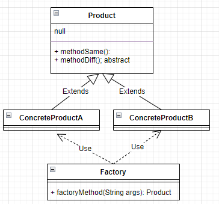
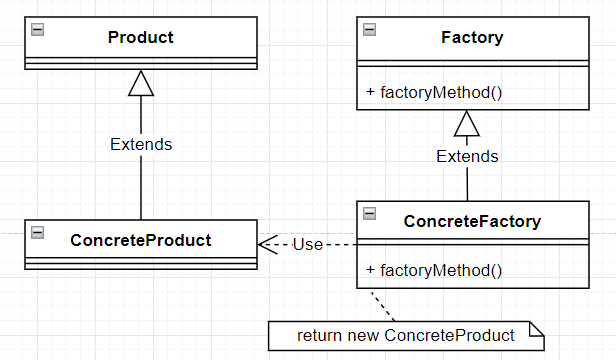
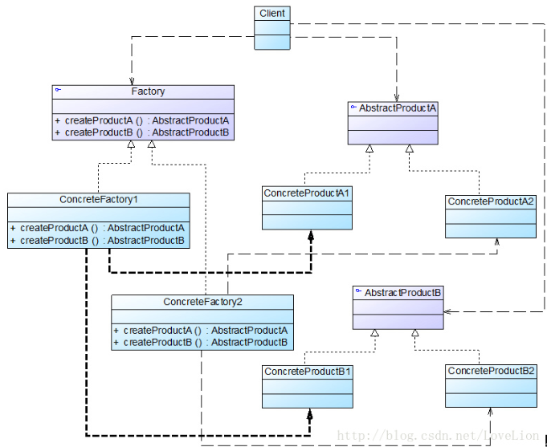
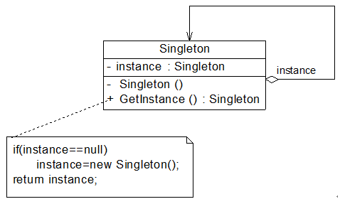

# 设计模式

## 面向对象设计原则

### 单一职责原则

https://blog.csdn.net/lovelion/article/details/7536542

> **单一职责原则(Single Responsibility Principle, SRP)：一个类只负责一个功能领域中的相应职责，或者可以定义为：就一个类而言，应该只有一个引起它变化的原因。**

主要是实现代码的高内聚、低耦合。

虽是最简单的原则，但有时最难运用的，因为不是拥有较强的的设计分析能力和相关的开发经验的设计人员很难将一个类的具体职责分离出来。

### 开闭原则

https://blog.csdn.net/lovelion/article/details/7537584

> **开闭原则(Open-Closed Principle, OCP)：一个软件实体应当对扩展开放，对修改关闭。即软件实体应尽量在不修改原有代码的情况下进行扩展。**

主要是为软件开发提供稳定的系统设计架构。当出现新的需求时，扩展时无需修改原有的代码，使得软件系统在拥有适应性和灵活性的同时具备较好的稳定性和延续性；同时也可相应的降低软件开发成本。

实现开闭原则的关键是抽象化，**对系统进行抽象化设计**；为系统定义一个相对稳定的抽象层，可以将不同的实现行为转移到具体的实现层中。很多面向对象编程语言中都提供了接口、抽象类等机制，可以通过它们定义系统的抽象层，再通过具体类来进行扩展。如果需要修改系统的行为，无须对抽象层进行任何改动，只需要增加新的具体类来实现新的业务功能即可，实现在不修改已有代码的基础上扩展系统的功能，达到开闭原则的要求。

### 里氏代换原则

https://blog.csdn.net/lovelion/article/details/7540445

> **里氏代换原则(Liskov Substitution Principle, LSP)：所有引用基类（父类）的地方必须能透明地使用其子类的对象。**

里氏代换原则是实现开闭原则的重要方式之一，由于使用基类对象的地方都可以使用子类对象，因此**在程序中尽量使用基类类型来对对象进行定义，而在运行时再确定其子类类型，用子类对象来替换父类对象**。

**在传递参数时、定义成员变量、定义局部变量、确定方法返回类型时都可使用里氏代换原则。**

里氏代换原则通俗的说：**子类可以扩展父类的功能，但不能改变父类原有的功能**。

**使用里氏代换原则时需注意：**

> 1. 子类的所有方法必须在父类中声明，或子类必须实现父类中声明的所有方法。根据里氏代换原则，为了保证系统的扩展性，在程序中通常使用父类来进行定义，如果一个方法只存在子类中，在父类中不提供相应的声明，则无法在以父类定义的对象中使用该方法。
> 2. 我们在运用里氏代换原则时，尽量把父类设计为抽象类或者接口，让子类继承父类或实现父接口，并实现在父类中声明的方法，运行时，子类实例替换父类实例，我们可以很方便地扩展系统的功能，同时无须修改原有子类的代码，增加新的功能可以通过增加一个新的子类来实现。里氏代换原则是开闭原则的具体实现手段之一。
> 3. Java语言中，在编译阶段，Java编译器会检查一个程序是否符合里氏代换原则，这是一个与实现无关的、纯语法意义上的检查，但Java编译器的检查是有局限的。

### 依赖倒转原则

https://blog.csdn.net/lovelion/article/details/7562783

> **依赖倒转原则(Dependency Inversion Principle, DIP)：抽象不应该依赖于细节，细节应当依赖于抽象。换言之，要针对接口编程，而不是针对实现编程。**
>
> 总结：
>
> * **高层次的模块不应该依赖于低层次的模块，他们都应该依赖于抽象。**
>
> * **抽象不应该依赖于具体，具体应该依赖于抽象。**

依赖倒转原则要求我们在程序代码中传递参数时或在关联关系中，尽量引用层次高的抽象层类，即使用接口和抽象类进行变量类型声明、参数类型声明、方法返回类型声明，以及数据类型的转换等，而不要用具体类来做这些事情。为了保证原则的应用，一个具体的类应只实现接口或抽象类中声明过的方法。

实现开闭原则的关键是抽象化，并且从抽象化导出具体化实现，如果说开闭原则是面向对象设计的目标的话，那么依赖倒转原则就是面向对象设计的主要手段，对抽象层进行编程，从而满足开闭原则的要求。

实现依赖倒转原则，主要是针对抽象层进行编程，将具体类的对象通过依赖注入（Dependency Injection, DI）的方式注入到其他对象中去，依赖注入指的是当一个对象与其他对象发生依赖关系是，通过抽象来注入所依赖的对象。常用依赖注入：**构造注入、设值注入（Setter 注入）、接口注入，**构造注入是指通过**构造函数来传入具体类的对象**，设值注入是指**通过Setter方法来传入具体类的对象**，而接口注入是**指通过在接口中声明的业务方法来传入具体类的对象**。这些方法在定义时使用的是抽象类型，在运行时再传入具体类型的对象，由子类对象来覆盖父类对象。

> 在大多数情况下，这三个设计原则会同时出现，**开闭原则是目标，里氏代换原则是基础，依赖倒转原则是手段**，它们相辅相成，相互补充，目标一致，只是分析问题时所站角度不同而已。

### 接口隔离原则

https://blog.csdn.net/lovelion/article/details/7562842

> **接口隔离原则(Interface Segregation Principle, ISP)：使用多个专门的接口，而不使用单一的总接口，即客户端不应该依赖那些它不需要的接口。**

当一个接口太大时，我们需要将它分割成一些更细小的接口，使用该接口的客户端仅需知道与之相关的方法即可。**每一个接口应该承担一种相对独立的角色，不干不该干的事，该干的事都要干。**

这里的“接口”往往有两种不同的含义：一种是指一个类型所具有的方法特征的集合，仅仅是一种逻辑上的抽象；另外一种是指某种语言具体的“接口”定义，有严格的定义和结构，比如Java语言中的interface。具体上面链接。

> 注意：
>
> 在使用接口隔离原则时，要注意控制接口的粒度，不能太大，也不能太小。太大背离了接口隔离原则，灵活性差，使用不方便；太小容易造成接口泛滥，不利于维护

### 合成复用原则

https://blog.csdn.net/lovelion/article/details/7563441

> **合成复用原则(Composite Reuse Principle, CRP)：尽量使用对象组合，而不是继承来达到复用的目的。**
>
> 又称为组合/聚合复用原则(`Composition/Aggregate Reuse Principle, CARP`)

在一个新的对象里面通过关联关系（组合、集合）来使用一些已有的对象，成为对象的一部分；新对象通过调用已有对象的方法达到复用功能的目的。简言之：**复用时要尽量使用组合/聚合关系（关联关系），少用继承**。

在面向对象设计中，可以通过两种方法在不同的环境中复用已有的设计和实现，即通过**组合/聚合关系或通过继承**，但首先应该考虑使用组合/聚合，组合/聚合可以使系统更加灵活，降低类与类之间的耦合度，一个类的变化对其他类造成的影响相对较少；其次才考虑继承，在使用继承时，需要严格遵循里氏代换原则，有效使用继承会有助于对问题的理解，降低复杂度，而滥用继承反而会增加系统构建和维护的难度以及系统的复杂度，因此需要慎重使用继承复用。

### 迪米特法则

https://blog.csdn.net/lovelion/article/details/7563445

> **迪米特法则(Law of Demeter, LoD)：一个软件实体应当尽可能少地与其他实体发生相互作用。**

迪米特法则可降低系统的耦合度，使类与类之间保持松散的耦合关系。

> 迪米特法则还有几种定义形式，包括：**不要和“陌生人”说话**、**只与你的直接朋友通信**等，在迪米特法则中，对于一个对象，其朋友包括以下几类：
>
> * 当前对象本身(this)；
> *  以参数形式传入到当前对象方法中的对象；
> * 当前对象的成员对象；
> *  如果当前对象的成员对象是一个集合，那么集合中的元素也都是朋友；
> * 当前对象所创建的对象。
>
>  任何一个对象，如果满足上面的条件之一，就是当前对象的“朋友”，否则就是“陌生人”。在应用迪米特法则时，一个对象只能与直接朋友发生交互，不要与“陌生人”发生直接交互，这样做可以降低系统的耦合度，一个对象的改变不会给太多其他对象带来影响。

迪米特法则要求我们在设计系统时，**应该尽量减少对象之间的交互，如果两个对象之间不必彼此直接通信，那么这两个对象就不应当发生任何直接的相互作用，如果其中的一个对象需要调用另一个对象的某一个方法的话，可以通过第三者转发这个调用**。简言之，**就是通过引入一个合理的第三者来降低现有对象之间的耦合度。**

  在将迪米特法则运用到系统设计中时，要注意下面的几点：**在类的划分上，应当尽量创建松耦合的类，类之间的耦合度越低，就越有利于复用，一个处在松耦合中的类一旦被修改，不会对关联的类造成太大波及；在类的结构设计上，每一个类都应当尽量降低其成员变量和成员函数的访问权限；在类的设计上，只要有可能，一个类型应当设计成不变类；在对其他类的引用上，一个对象对其他对象的引用应当降到最低。**

## 六种创建型模式

https://blog.csdn.net/LoveLion/article/details/17517213

### 简单工厂模式

https://blog.csdn.net/lovelion/article/details/9300549

> **简单工厂模式(Simple Factory Pattern)：定义一个工厂类，它可以根据参数的不同返回不同类的实例，被创建的实例通常都具有共同的父类。因为在简单工厂模式中用于创建实例的方法是静态(static)方法，因此简单工厂模式又被称为静态工厂方法(Static Factory Method)模式，它属于类创建型模式。**

要点：

**当你需要什么，只需要传入一个正确的参数，就可以获取你所需要的对象，而无须知道其创建细节**。简单工厂模式结构比较简单，其核心是工厂类的设计，结构图

  在简单工厂模式结构图中包含如下几个角色：

> * Factory（工厂角色）：工厂角色即工厂类，它是简单工厂模式的核心，负责实现创建所有产品实例的内部逻辑；工厂类可以被外界直接调用，创建所需的产品对象；在工厂类中提供了静态的工厂方法`factoryMethod()`，它的返回类型为抽象产品类型Product。   
> * Product（抽象产品角色）：它是工厂类所创建的所有对象的父类，封装了各种产品对象的公有方法，它的引入将提高系统的灵活性，使得在工厂类中只需定义一个通用的工厂方法，因为所有创建的具体产品对象都是其子类对象。   
> * `ConcreteProduct`（具体产品角色）：它是简单工厂模式的创建目标，所有被创建的对象都充当这个角色的某个具体类的实例。每一个具体产品角色都继承了抽象产品角色，需要实现在抽象产品中声明的抽象方法。

#### 总结

简单工厂模式提供专门的工厂类用于创建对象，将对象的创建和使用分开，它作为一种最简单的工厂模式在软件开发中得到了较为广泛的应用。

优点：

> 1. 工厂类包含必要的判断逻辑，可以决定在什么时候创建哪一个产品类的实例，客户端可以免除直接创建产品对象的职责，而仅仅“消费”产品，简单工厂模式实现了对象创建和使用的分离。(实现复用)
> 2. 客户端无须知道所创建的具体产品类的类名，只需要知道具体产品类所对应的参数即可，对于一些复杂的类名，通过简单工厂模式可以在一定程度减少使用者的记忆量。(实现了封装和部分解耦)
> 3. 通过引入配置文件，可以在不修改任何客户端代码的情况下更换和增加新的具体产品类，在一定程度上提高了系统的灵活性。

缺点：

> 1. 由于工厂类集中了所有产品的创建逻辑，职责过重，一旦不能正常工作，整个系统都要受到影响。
> 2.  使用简单工厂模式势必会增加系统中类的个数（引入了新的工厂类），增加了系统的复杂度和理解难度。
> 3.  系统扩展困难，一旦添加新产品就不得不修改工厂逻辑，在产品类型较多时，有可能造成工厂逻辑过于复杂，不利于系统的扩展和维护。
> 4. 简单工厂模式由于使用了静态工厂方法，造成工厂角色无法形成基于继承的等级结构。

适用

> 1. 工厂类负责创建的对象比较少，由于创建的对象较少，不会造成工厂方法中的业务逻辑太过复杂。
> 2. 客户端只知道传入工厂类的参数，对于如何创建对象并不关心。

简单工厂模式虽然简单，但存在一个很严重的问题。**当系统中需要引入新产品时，由于静态工厂方法通过所传入参数的不同来创建不同的产品，这必定要修改工厂类的源代码，将违背“开闭原则”**。

### 工厂模式

https://blog.csdn.net/lovelion/article/details/9306745

>  **工厂方法模式(Factory Method Pattern)：定义一个用于创建对象的接口，让子类决定将哪一个类实例化。工厂方法模式让一个类的实例化延迟到其子类。工厂方法模式又简称为工厂模式(Factory Pattern)，又可称作虚拟构造器模式(Virtual Constructor Pattern)或多态工厂模式(Polymorphic Factory Pattern)。工厂方法模式是一种类创建型模式。**

要点：

**不再提供一个统一的工厂类来创建所有的产品对象，而是针对不同的产品提供不同的工厂，系统提供一个与产品等级结构对应的工厂等级结构**。 

工厂方法模式提供一个抽象工厂接口来声明抽象工厂方法，而由其子类来具体实现工厂方法，创建具体的产品对象。工厂方法模式结构图：

工厂方法模式结构图中包含如下几个角色：

> * Product（抽象产品）：它是定义产品的接口，是工厂方法模式所创建对象的超类型，也就是产品对象的公共父类。
> * ConcreteProduct（具体产品）：它实现了抽象产品接口，某种类型的具体产品由专门的具体工厂创建，具体工厂和具体产品之间一一对应。
> * Factory（抽象工厂）：在抽象工厂类中，声明了工厂方法(Factory Method)，用于返回一个产品。抽象工厂是工厂方法模式的核心，所有创建对象的工厂类都必须实现该接口。（抽象工厂可以是接口，也可以是抽象类或者具体类）
> * ConcreteFactory（具体工厂）：它是抽象工厂类的子类，实现了抽象工厂中定义的工厂方法，并可由客户端调用，返回一个具体产品类的实例。（具体工厂类实现抽象工厂方法，因为抽象工厂中声明了工厂方法但并未实现工厂方法，具体由子类实现）

与简单工厂模式相比，工厂方法模式最重要的区别是引入了抽象工厂角色，抽象工厂可以是接口，也可以是抽象类或者具体类

> **Java反射(Java Reflection)**是指在程序运行时获取已知名称的类或已有对象的相关信息的一种机制，包括类的方法、属性、父类等信息，还包括实例的创建和实例类型的判断等。在反射中使用最多的类是Class，Class类的实例表示正在运行的Java应用程序中的类和接口，其forName(String className)方法可以返回与带有给定字符串名的类或接口相关联的 Class对象，再通过Class对象的newInstance()方法创建此对象所表示的类的一个新实例，即通过一个类名字符串得到类的实例。如创建一个字符串类型的对象

#### 总结

工厂方法模式是简单工厂模式的延伸，它继承了简单工厂模式的优点，同时还弥补了简单工厂模式的不足。工厂方法模式是使用频率最高的设计模式之一，是很多开源框架和API类库的核心模式。

优点：

> 1. 在工厂方法模式中，工厂方法用来创建客户所需要的产品，同时还向客户隐藏了哪种具体产品类将被实例化这一细节，用户只需要关心所需产品对应的工厂，无须关心创建细节，甚至无须知道具体产品类的类名。
> 2.  基于工厂角色和产品角色的多态性设计是工厂方法模式的关键。它能够让工厂可以自主确定创建何种产品对象，而如何创建这个对象的细节则完全封装在具体工厂内部。工厂方法模式之所以又被称为多态工厂模式，就正是因为所有的具体工厂类都具有同一抽象父类。
> 3. 使用工厂方法模式的另一个优点是在系统中加入新产品时，无须修改抽象工厂和抽象产品提供的接口，无须修改客户端，也无须修改其他的具体工厂和具体产品，而只要添加一个具体工厂和具体产品就可以了，这样，系统的可扩展性也就变得非常好，完全符合“开闭原则”。

缺点：

> 1. 客户端不知道它所需要的对象的类。在工厂方法模式中，客户端不需要知道具体产品类的类名，只需要知道所对应的工厂即可，具体的产品对象由具体工厂类创建，可将具体工厂类的类名存储在配置文件或数据库中。
> 2. 抽象工厂类通过其子类来指定创建哪个对象。在工厂方法模式中，对于抽象工厂类只需要提供一个创建产品的接口，而由其子类来确定具体要创建的对象，利用面向对象的多态性和里氏代换原则，在程序运行时，子类对象将覆盖父类对象，从而使得系统更容易扩展。

适用：

> * 客户端不知道它所需要的对象的类。在工厂方法模式中，客户端不需要知道具体产品类的类名，只需要知道所对应的工厂即可，具体的产品对象由具体工厂类创建，可将具体工厂类的类名存储在配置文件或数据库中。
> * 抽象工厂类通过其子类来指定创建哪个对象。在工厂方法模式中，对于抽象工厂类只需要提供一个创建产品的接口，而由其子类来确定具体要创建的对象，利用面向对象的多态性和里氏代换原则，在程序运行时，子类对象将覆盖父类对象，从而使得系统更容易扩展。

工厂方法模式通过引入工厂等级结构，解决了简单工厂模式中工厂类职责太重的问题，但由于工厂方法模式中的每个工厂只生产一类产品，可能会导致系统中存在大量的工厂类，势必会增加系统的开销。

### 抽象工厂模式

> **抽象工厂模式(Abstract Factory Pattern)：提供一个创建一系列相关或相互依赖对象的接口，而无须指定它们具体的类。抽象工厂模式又称为`Kit`模式，它是一种对象创建型模式。**

要点：

抽象工厂模式为创建一组对象提供了一种解决方案。与工厂方法模式相比，抽象工厂模式中的具体工厂不只是创建一种产品，它负责创建一族产品。抽象工厂模式结构图：

抽象工厂模式结构图中包含如下几个角色：

> * AbstractFactory（抽象工厂）：它声明了一组用于创建一族产品的方法，每一个方法对应一种产品。(抽象工厂可以是接口，也可以是抽象类或者具体类)
> *  ConcreteFactory（具体工厂）：它实现了在抽象工厂中声明的创建产品的方法，生成一组具体产品，这些产品构成了一个产品族，每一个产品都位于某个产品等级结构中。
> *  AbstractProduct（抽象产品）：它为每种产品声明接口，在抽象产品中声明了产品所具有的业务方法。
> *  ConcreteProduct（具体产品）：它定义具体工厂生产的具体产品对象，实现抽象产品接口中声明的业务方法。

抽象工厂模式最大的缺点：***在抽象工厂模式中，增加新的产品族很方便，但是增加新的产品等级结构很麻烦***，抽象工厂模式的这种性质称为***“开闭原则”的倾斜性***。“

#### 总结

优点：

> * 抽象工厂模式隔离了具体类的生成，使得客户并不需要知道什么被创建。由于这种隔离，更换一个具体工厂就变得相对容易，所有的具体工厂都实现了抽象工厂中定义的那些公共接口，因此只需改变具体工厂的实例，就可以在某种程度上改变整个软件系统的行为。
> * 当一个产品族中的多个对象被设计成一起工作时，它能够保证客户端始终只使用同一个产品族中的对象。
> * 增加新的产品族很方便，无须修改已有系统，符合“开闭原则”。

缺点：

> 增加新的产品等级结构麻烦，需要对原有系统进行较大的修改，甚至需要修改抽象层代码，这显然会带来较大的不便，违背了“开闭原则”。

适用：

> * 一个系统要独立于它的产品的创建、组合和表示时。 
> * 一个系统要由多个产品系列中的一个来配置时。 
> * 需要强调一系列相关的产品对象的设计以便进行联合使用时。 
> * 产品等级结构稳定，设计完成之后，不会向系统中增加新的产品等级结构或者删除已有的产品等级结构。

### 单例模式

> **单例模式(Singleton Pattern)：确保某一个类只有一个实例，而且自行实例化并向整个系统提供这个实例，这个类称为单例类，它提供全局访问的方法。单例模式是一种对象创建型模式。**

要点：

一是某个类只能有一个实例；二是它必须自行创建这个实例；三是它必须自行向整个系统提供这个实例。

 单例模式是结构最简单的设计模式一，在它的核心结构中只包含一个被称为单例类的特殊类。单例模式结构图：

单例模式结构图中只包含一个单例角色：

> Singleton（单例）：在单例类的内部实现只生成一个实例，同时它提供一个静态的getInstance()工厂方法，让客户可以访问它的唯一实例；为了防止在外部对其实例化，将其构造函数设计为私有；在单例类内部定义了一个Singleton类型的静态对象，作为外部共享的唯一实例。

三种单例类分别是**饿汉式单例、懒汉式单例以及IoDH**。

> * 饿汉式单例类在类被加载时就将自己实例化，它的优点在于无须考虑多线程访问问题，可以确保实例的唯一性；从调用速度和反应时间角度来讲，由于单例对象一开始就得以创建，因此要优于懒汉式单例。但是无论系统在运行时是否需要使用该单例对象，由于在类加载时该对象就需要创建，因此从资源利用效率角度来讲，饿汉式单例不及懒汉式单例，而且在系统加载时由于需要创建饿汉式单例对象，加载时间可能会比较长。
> * 懒汉式单例类在第一次使用时创建，无须一直占用系统资源，实现了延迟加载，但是必须处理好多个线程同时访问的问题，特别是当单例类作为资源控制器，在实例化时必然涉及资源初始化，而资源初始化很有可能耗费大量时间，这意味着出现多线程同时首次引用此类的机率变得较大，需要通过双重检查锁定等机制进行控制，这将导致系统性能受到一定影响。
> * **Initialization Demand Holder (IoDH)，既可以实现延迟加载，又可以保证线程安全，不影响系统性能，不失为一种最好的Java语言单例模式实现方式**（其缺点是与编程语言本身的特性相关，很多面向对象语言不支持IoDH）。

#### 总结

单例模式作为一种目标明确、结构简单、理解容易的设计模式，在软件开发中使用频率相当高，在很多应用软件和框架中都得以广泛应用。

优点：

> 1. 单例模式提供了对唯一实例的受控访问。因为单例类封装了它的唯一实例，所以它可以严格控制客户怎样以及何时访问它。
> 2. 由于在系统内存中只存在一个对象，因此可以节约系统资源，对于一些需要频繁创建和销毁的对象单例模式无疑可以提高系统的性能。
> 3. 允许可变数目的实例。基于单例模式我们可以进行扩展，使用与单例控制相似的方法来获得指定个数的对象实例，既节省系统资源，又解决了单例单例对象共享过多有损性能的问题。

缺点

> 1. 由于单例模式中没有抽象层，因此单例类的扩展有很大的困难。单例类的职责过重，在一定程度上违背了“单一职责原则”。
> 2. 因为单例类既充当了工厂角色，提供了工厂方法，同时又充当了产品角色，包含一些业务方法，将产品的创建和产品的本身的功能融合到一起。
> 3. 现在很多面向对象语言(如Java、C#)的运行环境都提供了自动垃圾回收的技术，因此，如果实例化的共享对象长时间不被利用，系统会认为它是垃圾，会自动销毁并回收资源，下次利用时又将重新实例化，这将导致共享的单例对象状态的丢失。

 适用

> 1. 系统只需要一个实例对象，如系统要求提供一个唯一的序列号生成器或资源管理器，或者需要考虑资源消耗太大而只允许创建一个对象。
> 2. 客户调用类的单个实例只允许使用一个公共访问点，除了该公共访问点，不能通过其他途径访问该实例。