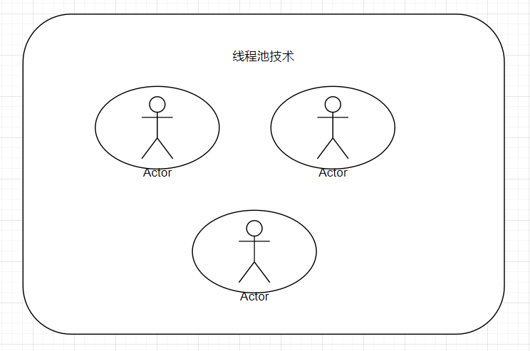
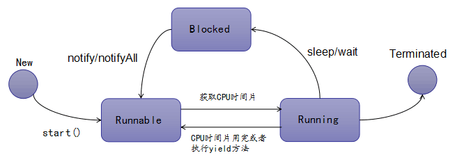

# 项目案例：商品秒杀

## 需求分析

秒杀商品项目，需满足以下需求：

* 顾客通过页面上的购买连接，抢购商品（每个顾客只能抢购一个）。
* 可以同时有多个用户抢购同一款商品。
* 商品总量不变。
* 顾客点击按钮也可能抢购不到，没有库存时，不能点击按钮。

## Version 1.0

### 建模

先创建数据库表，然后在创建相应的实体类。

* 用户表：用于记录用户的个人信息 ，主要作为用户在当前网站系统中的唯一标识。
* 用户账户表：用于记录某一用户的当前时刻余额。
* 商品表：用来记录 商品的基本信息。
* 订单表：用来记录某一时刻用户购买完商品后生成的商品信息。

在DB中创建相应的实例（schema），通常来说，一个项目（中小型）一个`schema`

具体实体类代码见项目。

> 在订单表中，按理论知识，应该创建两个外键约束，但是为了开发和测试方便，一般不在DB中创建外键，而是用`Java`逻辑保障其外键的关联性。

### 概要设计

主要是由经验丰富的开发人员完成，根据对客户需求的理解，把用户的需求翻译成开发人员自己的语音。

可以先自己构造一个用户使用场景：

* 首页：展示商品的基本信息，提供按钮让顾客，进行点击购买。
* 当顾客点击按钮后，后台会完成购买过程。
* 当购买成功后，会在结果页面（`result.jsp`），显示购买成功；反之，提供购买失败信息。

在概要设计过程中，前端和后端（或其他岗位开发人员），都应该生产一些“东西”来检验流程和结果是否朝着健康的方向发展。

* 界面原型：Axure产品、UI（界面设计）、前端开发
* 后台接口：后端

对于后端开发，一般使用`interface`来完成“后台接口”。

> 为什么要用`interface`来做一步呢？直接写一个抽象类或者类，打打草稿不就行了吗

* 接口语言，已经逐渐不再是后台开发才懂的语言，而且可以借助一些开源的工具后者框架（swagger、伪接口语言），把`interface`转换成其他的岗位可以看懂的语言。
* 开发人员在设计接口的过程中，主要思考输入有哪些、返回什么数据（格式）、大致的逻辑（尤其是核心逻辑：`SQL`），无论这个功能是否能实现，开发人员在这个环节能尽早发现问题。

一旦设计出前端用户`API`，那么后台人员就可以开始和前端开发人员对接《用户接口》

### 详细设计

详细设计直白的理解，就是对前面阶段设计较为抽象的、笼统的用户接口，进行细化和分解，最终，把后续所需的方法大致的定义出来，然后通过写文档的方式，把这些方法需要做什么，都记录好。

在开发过程中，接口各自承担的职责以及相应的代码地位，开发人员很难从包名、类型名称上看出其主要的职责是做什么的，或者说他们之间是否有区别。因而可以通过分层思想继续划分，类似于部门、模块的单位进行的代码管理：

* `web`层：用于直接处理前端用户提交的请求
  * `api`包中的接口，主要用于和前端开发人员对接、交付
  * `controller`就是对`api`的实现
* `service`层：有称之为逻辑层、业务层，主要针对某一个特定的领域、模型、表做一些聚合度较高的相关操作，`impl`是业务层的具体实现方式。

### 编码

根据详细设计中的接口和相关实现类的规划，基本实现需求分析中的需求。

> 关于异常处理问题：方法调用链很长，而且每一个方法都有异常发生，这就会使得每个方法中都写`try-catch`，会显得代码很臃肿。

* 我们在没有特殊要求的情况下，可以把这些异常都往外层`throws`
* 比较容易对各种类型的错误进行分类集中处理

### 事务处理

以前我们是在一个连接中管理事务的，那么要做到这一点，我们基于以前的知识，有2种做法：

1. 把`connection`提升到`controller`层
2. 把`controller`的控制逻辑下潜到`dao`中

这两种做法都不合适，因为调整后，代码逻辑的内容从性质上来说，与当前类型的定位不匹配，形同，让老板上一线，或者让员工管理整个公司不合适的道理一样。

> 解决方案：将多个对`DB`的操作，包含到一个独立的事务单元（`ACID`）

事务的基本Java语法：

~~~java
// 开启事务
try{
    Connection con = DbUtils.getConnection();
	con.setAutoCommit(false);
	// 多个DML操作
	con.commit();
} catch(Exception e) {
    e.printStacktrace();
    con.rollback();
}
~~~

现有一个问题不太好处理，不同的DB的操作是封装在不同的`Dao`中的，如何将它们聚合到一起，集中进行管理。

可以使用过滤器、模板设计方法。

> 上述事务管理逻辑的底层思想是：多个操作应该使用同一个会话（`session`，是`DB`的一个术语，对应Java程序的`Connection`）来进行操作，我可以借助`JDK`提供的一个工具类来实现：
>
> ~~~java
> // ThreadLocal 能实现某个类型的对象在一个线程所经由的范围中保持“有且只有一个”
> ThreadLocal<Object> container = new ThreadLocal<>();
> // 放
> container.set(new Object()); // 以当前线程的id作为key存放一个对象
> // 拿
> container.get(); // 以当前线程的id作为key获取对象
> ~~~

`ThreadLocal`主要作用：用来在线程之间做数据隔离的（不同的线程，使用不同的资源；相同的线程，可以再系统中的任意一个地方使用同一个资源）。

关键代码：

~~~java
public static Connection getConnectionInLocal() {
    // 先查看local中之前有无创建过连接
    Connection con = local.get();
    if (con != null) return con;// if中的逻辑不要太多
    con = getConnection();
    // 存起来，留给下一次使用
    local.set(con);
    return con;
}
~~~

注意如下问题：

- 第一次操作，需要开启事务（`con.setAutoCommit(false)`）。
- 前面所有的操作，都不应关闭连接，只有最后一次才关闭。

上述代码存在如下问题：

- 因为在第4次的数据库操作中，我们已经关闭了连接，但是在`controller`中捕获了异常，然后尝试去对连接进行回滚操作，因此，会出现问题（连接关闭以后是不能做任何操作的）。
- `controller`是一个调度者，它去使用`Dao`所使用的工具，这是不恰当的（代码入侵、代码污染）。

> 事务管理的要点：（事务管理的边界到底定义在哪一层合适）
>
> * DAO层，以表为操作对象，但在实际开发中，操作表的时候，应尽量在一个方法中，只发送一条SQL语句，DAO方法最小颗粒度（细粒度）以SQL为一个基本单位。
> * Service层，称为服务层、业务层，这个逻辑里面，是以客户的行业基准所声明的各种业务术语为基准单位的，由于甲方术语翻译成Java代码，跨了行业和语种，因此它的一个术语对应的动作，绝大部分时候都会包含多个DAO的指令（方法）。
> * Controller，后台控制层，他主要负责接口的路径映射。
>
> 根据以上的定位，事务管理的边界通常定义在服务层、业务层。

## Version 2.0***

### 面向其切面编程（Aspect-Oriented Programming）

https://juejin.cn/post/6844903511835017223

https://blog.csdn.net/q982151756/article/details/80513340

https://www.cnblogs.com/zhugenqiang/archive/2008/07/27/1252761.html

当我们在项目中发现，有这样的一种逻辑，它与具体的业务逻辑没有直接关系，而且它会分布在各个模块，代码的形态基本固定，因此从侧面去观察它们出现的位置，连点成线，最终形态上非常像是一个切面，这样的逻辑，称之为切面。

这样的切面逻辑，可以单独提炼出来，让所有的共用，这种编程方式，成为`AOP`，即面向切面编程。

> `AOP`为`Aspect Oriented Programming`的缩写，意为：面向切面编程，通过预编译方式和运行期动态代理实现程序功能的统一维护的一种技术。`AOP`是`OOP`的延续，是软件开发中的一个热点，也是`Spring`框架中的一个重要内容，是函数式编程的一种衍生范型。利用`AOP`可以对业务逻辑的各个部分进行隔离，从而使得业务逻辑各部分之间的耦合度降低，提高程序的可重用性，同时提高了开发的效率。

### AOP相关定义

* `Aspect`（切面）： `Aspect `声明类似于 Java 中的类声明，在 `Aspect `中会包含着一些 `Pointcut `以及相应的 `Advice`。
* `Joint point`（连接点）：表示在程序中明确定义的点，典型的包括方法调用，对类成员的访问以及异常处理程序块的执行等等，它自身还可以嵌套其它` joint point`。
* `Pointcut`（切点）：表示一组` joint point`，这些` joint point` 或是通过逻辑关系组合起来，或是通过通配、正则表达式等方式集中起来，它定义了相应的 `Advice `将要发生的地方。
* `Advice`（增强）：`Advice `定义了在 `Pointcut `里面定义的程序点具体要做的操作，它通过 before、after 和 around 来区别是在每个` joint point` 之前、之后还是代替执行的代码。
* `Target`（目标对象）：织入 `Advice `的目标对象.。
* `Weaving`（织入）：将 `Aspect `和其他对象连接起来, 并创建 `Adviced object` 的过

### AOP注解与使用

* `@Aspect`：声明切面，标记类
* `@Pointcut`(切点表达式)：定义切点，标记方法
* `@Before`(切点表达式)：前置通知，切点之前执行
* `@Around`(切点表达式)：环绕通知，切点前后执行
* `@After`(切点表达式)：后置通知，切点之后执行
* `@AfterReturning`(切点表达式)：返回通知，切点方法返回结果之后执行
* `@AfterThrowing`(切点表达式)：异常通知，切点抛出异常时执行

> @Pointcut、@Before、@Around、@After、@AfterReturning、@AfterThrowing需要在切面类中使用，即在使用@Aspect的类中。

## Version 3.0

### 多线程

#### 造数

为了模拟真实并发场景，首先准备大量的用户及相应的用户账户信息

~~~java
public void batchSave(List<User> list) throws SQLException {
    int batchSize = 1000; // 小批次 大部分数据库对于单条SQL语句使用的缓存是有限制的
    PreparedStatement ps = null;
    try {
        Connection con = DbUtils.getConnectionInLocal();
        ps = con.prepareStatement("insert into `user` values(null,?,'admin')");
        for (int i = 1; i <= list.size(); i++) {
            ps.setString(1, list.get(i - 1).getUsername());
            ps.addBatch(); // 把这个要插入的数据单独封装好放到该批次中

            if (i % batchSize == 0) ps.executeBatch(); // 发送这个批次的数据到db端
        }
        ps.executeBatch(); // 处理零头
    } finally {
        close(ps, null);
    }
}
~~~

```java
public List<User> init(int size) {
    List<User> list = new ArrayList<>();
    for (int i = 0; i < size; i++) {
        list.add(new User(null, RandomUtils.randomString(), null));
    }
    return list;
}
```

```java
public void batchSave() {
    List<User> userList = init(100000);
    template.doInTransaction(() -> {
        dao.batchSave(userList);
        return null;
    });
}
```

#### 确定线程多开模式

创建线程的几种方式

1. 编写一个Thread的子类

   ~~~java
   class MyThread extends Thread {
       // 重写父类的run方法
       @Override
       public void run() {
           // 该线程中需要执行的逻辑
       }
   }
   // new MyThread().start();
   // 因为Java语法是有一个“单根继承”限制的，意味着一个类只能有一个直接的父亲
   // 而我们开发项目功能的时候，有些组件的编写（比如Servlet、Dao）它们是需要继承一些框架中的基础组件的，这样就会导致我们很难用上述的代码模型来开辟多线程
   ~~~

2. 实现Runnable接口

   ~~~java
   class MyTask implements Runnable {
       @Override
       public void run() {
           // 该线程中需要执行的逻辑
       }
   }
   // new Thread(new MyTask()).start();
   // 由于这个任务所在的类是通过实现接口来编写任务的，因此我们可以继续根据项目的需要让这个类继承其它类或者实现其它更多的接口，类型的限定性没有第一种强。
   ~~~

   其实所谓的`Thread`有2层含义，第一个即我们开辟线程的时候，`JVM`会开辟一定的内存空间，并且会雇佣一个工人（`worker`），这个工人实际上就对应到了`CPU`的处理器（`Processor`），第二个即当程序运行的时候，我们需要传递一个具体需要完成的任务（`Task`）,调度器会在运行期间把这个任务交给具体的工人来完成。

   因此当这个线程启动的时候，实际上是由某一个具体的工人来完成我们传递给`Thread`的一个非常具体事情（`run`方法的具体实现）

   上述的写法又有2种变化形式

   ~~~java
   // 匿名内部类
   new Thread(new Runnable() {
       @Override
       public void run() {
           // 该线程中需要执行的逻辑
       }
   }).start();
   
   // lambda表达式
   new Thread(() -> {
       // 该线程中需要执行的逻辑
   }).start();
   ~~~

3. 使用线程池

   上述2种实例化线程的技术，仍然存在一些小问题：当提交任务的数量足够多的时候，每一次`JVM`都需要为这个线程申请空间，聘用工人，而当这个任务结束的时候，又将它们释放掉，如此往复，是非常消耗资源的。因此就诞生了线程池技术（`Thread Pool`）

   

   我们可以事先先创建一个容器，在这个容器提前申请好内存空间，聘用足够多的工人，然后当有人提交了任务的时候，我们就找一个闲置的工人来完成，任务做完以后，该工人和对应的内存空间并不会立即释放掉，而是原地待命，等候下一个任务。

   ~~~java
   Executors.newFixedThreadPool(3); // 创建指定数量线程的线程池
   Executors.newSingleThreadExecutor(); // 创建单线程的线程池
   ExecutorService pool = Executors.newCachedThreadPool();// 创建带缓存的线程池
   pool.submit(()->{}); // 提交任务
   pool.shutdown(); // 已经提交的任务会执行完毕，但是不允许提交新的任务了
   ~~~

   还有一个在项目中的用途比较特殊，而且更常用

   ~~~java
   ScheduledExecutorService scheduled = Executors.newScheduledThreadPool(3);// 创建一个可以执行定时（延时）任务的线程池
   scheduled.schedule(()->{}, 3 , TimeUnit.SECONDS); // 3秒后执行
   scheduled.scheduleAtFixedRate(); // 按照固定的频率来执行
   scheduled.scheduleWithFixedDelay();// 按照固定的延时来执行
   ~~~

   > 线程池只是解决了以什么样合理的方式来创建线程

4. CompletableFuture

   当我们的项目中，需要创建多个任务，并且这些任务之间有复杂的衔接关系，那么`CompletableFuture`就非常合适

### 面试中多线程考点：

> 1. 线程的生命周期
>
>    包括：新建、就绪、运行、阻塞、销毁。
>
>    * 新建：就是刚使用`new`方法，`new`出来的线程；
>    * 就绪：就是调用的线程的`start()`方法后，这时候线程处于等待`CPU`分配资源阶段，准先抢到`CPU`资源，准开始执行；
>    * 运行：当就绪的线程被调度并获得`CPU`资源时，便进入运行状态，`run()`方法定义了线程的操作和功能
>    * 阻塞：在运行状态的时候，可能因为某些原因导致运行状态的线程变成了阻塞状态，比如`sleep()`、`wait()`之后线程就处于了阻塞状态，这个时候需要其他机制将处于阻塞状态的线程唤醒，比如调用`notify()`或者`notifyAll()`方法。唤醒的线程不会立刻执行`run`方法，它们要再次等待`CPU`分配资源进入运行状态
>    * 销毁：如果线程正常执行完毕后或线程被提前强制性的终止或出现异常导致结束，那么线程就要被销毁，释放资源
>
>    
>
> 2. 线程的几种实例化的方式，及各自优缺点
>
>    https://blog.csdn.net/qq_43012792/article/details/106649740
>
>    **1. 继承Thread类；**
>
>    **2. 实现Runnable接口；**
>
>    **3. 实现Callable接口，实例化FutureTask类；**
>
>    **4. 创建线程池（以下用Executor框架实现）**
>
> 3. `sleep`与`wait`的区别
>
>    https://blog.csdn.net/hudaJY/article/details/89057626
>
>    来自不同的类
>
>    - `wait()`来自Object类
>    - `sleep()`来自Thread类
>
>    锁的释放时机不同
>
>    - `wait()`方法**在等待的过程中会释放锁**
>    - `sleep()`方法**在等待的过程中不会释放锁**
>
>    使用的范围
>
>    - `wait()`方法**必须在同步代码块中使用**
>    - `sleep()`方法**可以在任何地方使用**
>
>    捕获异常的不同
>
>    - `wait()`方法**不需要捕获异常**
>    - `sleep()`方法**需要捕获异常**
>
> 4. sync的工作原理
>
> 5. 显式锁和隐式锁
>
>    https://juejin.cn/post/7037301044225212429
>
>    底层不同
>
>    * synchronized 是java中的关键字，是JVM层面的锁。
>    * ReentrantLock 是是JDK5以后出现的具体的类。使用lock是调用对应的API。
>    * 我们通过Javap命令来查看调用二者的汇编指令：
>    * 可以看出 synchronized 是底层是通过monitorenter进行加锁，通过monitorexit来退出锁的。
>    * ReentrantLock 对象是通过调用对应的API方法来获取锁和释放锁的。
>
>    其他锁：https://blog.csdn.net/guoguo527/article/details/118004077

DB在执行写操作的时候，不是并行的，而是序列化的（排队来操作的，Serializable）。

要解决这个问题，必须在Java中也采用类似于排队操作的技术：同步锁

1. synchronized修饰符修饰方法
2. synchronized语句块
3. 显式锁（`ReentrantLock`）

使用了同步锁以后，运行情况为：当A线程没有执行完最后一条SQL的时候，其它线程是不能访问被同步的代码逻辑的（查询商品库存信息、查询用户账户余额、更新商品库存、更新用户账户余额、新增订单记录），形成了以上所有操作都变成了一个独立的原子操作`Atomic`（不能被其它线程打断的）

## Version 4.0

### 悲观锁与乐观锁

* 悲观锁是基于一种悲观的态度类来防止一切数据冲突，它是以一种预防的姿态在修改数据之前把数据锁住，然后再对数据进行读写，在它释放锁之前任何人都不能对其数据进行操作，直到前面一个人把锁释放后下一个人数据加锁才可对数据进行加锁，然后才可以对数据进行操作，一般数据库本身锁的机制都是基于悲观锁的机制实现的;

> 特点：可以完全保证数据的独占性和正确性，因为每次请求都会先对数据进行加锁， 然后进行数据操作，最后再解锁，而加锁释放锁的过程会造成消耗，所以性能不高;

* 乐观锁是对于数据冲突保持一种乐观态度，操作数据时不会对操作的数据进行加锁（这使得多个任务可以并行的对数据进行操作），只有到数据提交的时候才通过一种机制来验证数据是否存在冲突(一般实现方式是通过加版本号然后进行版本号的对比方式实现);

>特点：乐观锁是一种并发类型的锁，其本身不对数据进行加锁通而是通过业务实现锁的功能，不对数据进行加锁就意味着允许多个请求同时访问数据，同时也省掉了对数据加锁和解锁的过程，这种方式因为节省了悲观锁加锁的操作，所以可以一定程度的的提高操作的性能，不过在并发非常高的情况下，会导致大量的请求冲突，冲突导致大部分操作无功而返而浪费资源，所以在高并发的场景下，乐观锁的性能却反而不如悲观锁。

Version 5.0

~~~java
public Result kill(Integer productId, Integer userId) {
  return template.doInTransaction(() -> {
      // 更新之前的一些查询：查询库存、版本、用户账户
      if (!productService.updateProduct(product)) {// fixme lock
            System.out.println(userId + "抢购失败，进行重试...");
            return kill(productId, userId);
      }
      // 更新库存、更新用户账户
  }
}
~~~

但是使用上述重试机制的时候，容易出现下面两个问题：

- 重复读：MySQL的默认的隔离级别为“可重复读”（`Repeatable Read`，简称RR），在一次事务操作中，一条相同的记录，不可能读出2个不同的结果。因此，第一次查出某一个版本号为1，更新失败以后，再次去查询这条记录的版本号，依然会为1（刻舟求剑）
- JVM在运行期间，是会申请一定的内存的，而且是有限的，每一次调用一个方法，都会在内存中消耗一部分用来保存这个方法中所用到的值或者变量，因此只要调用的方法次数足够大，总会让内存不够用，JVM会抛出`StackOverFlow`，内存溢出（内存不够用的意思）
