# JavaWeb

## 1. 网络编程

### 1.1 网络编程基础

在学习Java网络编程之前，我们先来了解什么是计算机网络。

计算机网络是指两台或更多的计算机组成的网络，在同一个网络中，任意两台计算机都可以直接通信，因为所有计算机都需要遵循同一种网络协议。

那什么是互联网呢？互联网是网络的网络（internet），即把很多计算机网络连接起来，形成一个全球统一的互联网。

对某个特定的计算机网络来说，它可能使用网络协议ABC，而另一个计算机网络可能使用网络协议XYZ。如果计算机网络各自的通讯协议不统一，就没法把不同的网络连接起来形成互联网。因此，为了把计算机网络接入互联网，就必须使用TCP/IP协议。

TCP/IP协议泛指互联网协议，其中最重要的两个协议是TCP协议和IP协议。只有使用TCP/IP协议的计算机才能够联入互联网，使用其他网络协议（例如NetBIOS、AppleTalk协议等）是无法联入互联网的。

### 1.2 IP地址

在互联网中，一个IP地址用于唯一标识一个网络接口（Network Interface）。一台联入互联网的计算机肯定有一个IP地址，但也可能有多个IP地址。

IP地址分为IPv4和IPv6两种。IPv4采用32位地址，类似`101.202.99.12`，而IPv6采用128位地址，类似`2001:0DA8:100A:0000:0000:1020:F2F3:1428`。IPv4地址总共有2^32个（大约42亿），而IPv6地址则总共有2^128个（大约340万亿亿亿亿），IPv4的地址目前已耗尽，而IPv6的地址是根本用不完的。

IP地址又分为公网IP地址和内网IP地址。公网IP地址可以直接被访问，内网IP地址只能在内网访问。内网IP地址类似于：

- 192.168.x.x
- 10.x.x.x

有一个特殊的IP地址，称之为本机地址，它总是`127.0.0.1`。

IPv4地址实际上是一个32位整数。例如：

```ascii
106717964 = 0x65ca630c
          = 65  ca  63 0c
          = 101.202.99.12
```

如果一台计算机只有一个网卡，并且接入了网络，那么，它有一个本机地址`127.0.0.1`，还有一个IP地址，例如`101.202.99.12`，可以通过这个IP地址接入网络。

如果一台计算机有两块网卡，那么除了本机地址，它可以有两个IP地址，可以分别接入两个网络。通常连接两个网络的设备是路由器或者交换机，它至少有两个IP地址，分别接入不同的网络，让网络之间连接起来。

如果两台计算机位于同一个网络，那么他们之间可以直接通信，因为他们的IP地址前段是相同的，也就是网络号是相同的。网络号是IP地址通过子网掩码过滤后得到的。例如：

某台计算机的IP是`101.202.99.2`，子网掩码是`255.255.255.0`，那么计算该计算机的网络号是：

```
IP = 101.202.99.2
Mask = 255.255.255.0
Network = IP & Mask = 101.202.99.0
```

每台计算机都需要正确配置IP地址和子网掩码，根据这两个就可以计算网络号，如果两台计算机计算出的网络号相同，说明两台计算机在同一个网络，可以直接通信。如果两台计算机计算出的网络号不同，那么两台计算机不在同一个网络，不能直接通信，它们之间必须通过路由器或者交换机这样的网络设备间接通信，我们把这种设备称为网关。

网关的作用就是连接多个网络，负责把来自一个网络的数据包发到另一个网络，这个过程叫路由。

所以，一台计算机的一个网卡会有3个关键配置：

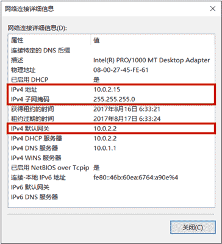

- IP地址，例如：`10.0.2.15`
- 子网掩码，例如：`255.255.255.0`
- 网关的IP地址，例如：`10.0.2.2`

### 1.3 域名

因为直接记忆IP地址非常困难，所以我们通常使用域名访问某个特定的服务。域名解析服务器DNS负责把域名翻译成对应的IP，客户端再根据IP地址访问服务器。

用`nslookup`可以查看域名对应的IP地址：

```
$ nslookup baidu.com
Server:  xxx.xxx.xxx.xxx
Address: xxx.xxx.xxx.xxx#53

Non-authoritative answer:
Name:    www.baidu.com
Address: 47.99.33.223
```

有一个特殊的本机域名`localhost`，它对应的IP地址总是本机地址`127.0.0.1`。

### 1.4 网络模型

由于计算机网络从底层的传输到高层的软件设计十分复杂，要合理地设计计算机网络模型，必须采用分层模型，每一层负责处理自己的操作。OSI（Open System Interconnect）网络模型是ISO组织定义的一个计算机互联的标准模型，注意它只是一个定义，目的是为了简化网络各层的操作，提供标准接口便于实现和维护。这个模型从上到下依次是：

- 应用层，提供应用程序之间的通信；
- 表示层：处理数据格式，加解密等等；
- 会话层：负责建立和维护会话；
- 传输层：负责提供端到端的可靠传输；
- 网络层：负责根据目标地址选择路由来传输数据；
- 链路层和物理层：负责把数据进行分片并且真正通过物理网络传输，例如，无线网、光纤等。

互联网实际使用的TCP/IP模型并不是对应到OSI的7层模型，而是大致对应OSI的5层模型：

| OSI    | TCP/IP     |
| :----- | :--------- |
| 应用层 | 应用层     |
| 表示层 |            |
| 会话层 |            |
| 传输层 | 传输层     |
| 网络层 | IP层       |
| 链路层 | 网络接口层 |
| 物理层 |            |

### 1.5 常用协议

IP协议是一个分组交换，它不保证可靠传输。而TCP协议是传输控制协议，它是面向连接的协议，支持可靠传输和双向通信。TCP协议是建立在IP协议之上的，简单地说，IP协议只负责发数据包，不保证顺序和正确性，而TCP协议负责控制数据包传输，它在传输数据之前需要先建立连接，建立连接后才能传输数据，传输完后还需要断开连接。TCP协议之所以能保证数据的可靠传输，是通过接收确认、超时重传这些机制实现的。并且，TCP协议允许双向通信，即通信双方可以同时发送和接收数据。

TCP协议也是应用最广泛的协议，许多高级协议都是建立在TCP协议之上的，例如HTTP、SMTP等。

UDP协议（User Datagram Protocol）是一种数据报文协议，它是无连接协议，不保证可靠传输。因为UDP协议在通信前不需要建立连接，因此它的传输效率比TCP高，而且UDP协议比TCP协议要简单得多。

选择UDP协议时，传输的数据通常是能容忍丢失的，例如，一些语音视频通信的应用会选择UDP协议。

## 2. TCP

### 2.1 简介

在开发网络应用程序的时候，我们又会遇到Socket这个概念。Socket是一个抽象概念，一个应用程序通过一个Socket来建立一个远程连接，而Socket内部通过TCP/IP协议把数据传输到网络：

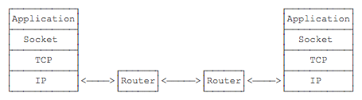

Socket、TCP和部分IP的功能都是由操作系统提供的，不同的编程语言只是提供了对操作系统调用的简单的封装。例如，Java提供的几个Socket相关的类就封装了操作系统提供的接口。

为什么需要Socket进行网络通信？因为仅仅通过IP地址进行通信是不够的，同一台计算机同一时间会运行多个网络应用程序，例如浏览器、QQ、邮件客户端等。当操作系统接收到一个数据包的时候，如果只有IP地址，它没法判断应该发给哪个应用程序，所以，操作系统抽象出Socket接口，每个应用程序需要各自对应到不同的Socket，数据包才能根据Socket正确地发到对应的应用程序。

一个Socket就是由IP地址和端口号（范围是0～65535）组成，可以把Socket简单理解为IP地址加端口号。端口号总是由操作系统分配，它是一个0～65535之间的数字，其中，小于1024的端口属于*特权端口*，需要管理员权限，大于1024的端口可以由任意用户的应用程序打开。


使用Socket进行网络编程时，本质上就是两个进程之间的网络通信。其中一个进程必须充当服务器端，它会主动监听某个指定的端口，另一个进程必须充当客户端，它必须主动连接服务器的IP地址和指定端口，如果连接成功，服务器端和客户端就成功地建立了一个TCP连接，双方后续就可以随时发送和接收数据。

因此，当Socket连接成功地在服务器端和客户端之间建立后：

- 对服务器端来说，它的Socket是指定的IP地址和指定的端口号；
- 对客户端来说，它的Socket是它所在计算机的IP地址和一个由操作系统分配的随机端口号。

### 2.2 服务端

要使用Socket编程，我们首先要编写服务器端程序。Java标准库提供了`ServerSocket`来实现对指定IP和指定端口的监听。`ServerSocket`的典型实现代码如下：

```java
public class Server {
    public static void main(String[] args) throws IOException {
        ServerSocket ss = new ServerSocket(6666); // 监听指定端口
        System.out.println("server is running...");
        for (;;) {
            Socket sock = ss.accept();
            System.out.println("connected from " + sock.getRemoteSocketAddress());
            Thread t = new Handler(sock);
            t.start();
        }
    }
}

class Handler extends Thread {
    Socket sock;

    public Handler(Socket sock) {
        this.sock = sock;
    }

    @Override
    public void run() {
        try (InputStream input = this.sock.getInputStream()) {
            try (OutputStream output = this.sock.getOutputStream()) {
                handle(input, output);
            }
        } catch (Exception e) {
            try {
                this.sock.close();
            } catch (IOException ioe) {
            }
            System.out.println("client disconnected.");
        }
    }

    private void handle(InputStream input, OutputStream output) throws IOException {
        var writer = new BufferedWriter(new OutputStreamWriter(output, StandardCharsets.UTF_8));
        var reader = new BufferedReader(new InputStreamReader(input, StandardCharsets.UTF_8));
        writer.write("hello\n");
        writer.flush();
        for (;;) {
            String s = reader.readLine();
            if (s.equals("bye")) {
                writer.write("bye\n");
                writer.flush();
                break;
            }
            writer.write("ok: " + s + "\n");
            writer.flush();
        }
    }
}
```

服务器端通过代码：

```java
ServerSocket ss = new ServerSocket(6666);
```

在指定端口`6666`监听。这里我们没有指定IP地址，表示在计算机的所有网络接口上进行监听。

如果`ServerSocket`监听成功，我们就使用一个无限循环来处理客户端的连接：

```java
for (;;) {
    Socket sock = ss.accept();
    Thread t = new Handler(sock);
    t.start();
}
```

注意到代码`ss.accept()`表示每当有新的客户端连接进来后，就返回一个`Socket`实例，这个`Socket`实例就是用来和刚连接的客户端进行通信的。由于客户端很多，要实现并发处理，我们就必须为每个新的`Socket`创建一个新线程来处理，这样，主线程的作用就是接收新的连接，每当收到新连接后，就创建一个新线程进行处理。

我们在多线程编程的章节中介绍过线程池，这里也完全可以利用线程池来处理客户端连接，能大大提高运行效率。

如果没有客户端连接进来，`accept()`方法会阻塞并一直等待。如果有多个客户端同时连接进来，`ServerSocket`会把连接扔到队列里，然后一个一个处理。对于Java程序而言，只需要通过循环不断调用`accept()`就可以获取新的连接。

### 2.3 客户端

相比服务器端，客户端程序就要简单很多。一个典型的客户端程序如下：

```java
public class Client {
    public static void main(String[] args) throws IOException {
        Socket sock = new Socket("localhost", 6666); // 连接指定服务器和端口
        try (InputStream input = sock.getInputStream()) {
            try (OutputStream output = sock.getOutputStream()) {
                handle(input, output);
            }
        }
        sock.close();
        System.out.println("disconnected.");
    }

    private static void handle(InputStream input, OutputStream output) throws IOException {
        var writer = new BufferedWriter(new OutputStreamWriter(output, StandardCharsets.UTF_8));
        var reader = new BufferedReader(new InputStreamReader(input, StandardCharsets.UTF_8));
        Scanner scanner = new Scanner(System.in);
        System.out.println("[server] " + reader.readLine());
        for (;;) {
            System.out.print(">>> "); // 打印提示
            String s = scanner.nextLine(); // 读取一行输入
            writer.write(s);
            writer.newLine();
            writer.flush();
            String resp = reader.readLine();
            System.out.println("<<< " + resp);
            if (resp.equals("bye")) {
                break;
            }
        }
    }
}
```

客户端程序通过：

```java
Socket sock = new Socket("localhost", 6666);
```

连接到服务器端，注意上述代码的服务器地址是`"localhost"`，表示本机地址，端口号是`6666`。如果连接成功，将返回一个`Socket`实例，用于后续通信。

### 2.4 Socket流

当Socket连接创建成功后，无论是服务器端，还是客户端，我们都使用`Socket`实例进行网络通信。因为TCP是一种基于流的协议，因此，Java标准库使用`InputStream`和`OutputStream`来封装Socket的数据流，这样我们使用Socket的流，和普通IO流类似：

```java
// 用于读取网络数据:
InputStream in = sock.getInputStream();
// 用于写入网络数据:
OutputStream out = sock.getOutputStream();
```

最后我们重点来看看，为什么写入网络数据时，要调用`flush()`方法。

如果不调用`flush()`，我们很可能会发现，客户端和服务器都收不到数据，这并不是Java标准库的设计问题，而是我们以流的形式写入数据的时候，并不是一写入就立刻发送到网络，而是先写入内存缓冲区，直到缓冲区满了以后，才会一次性真正发送到网络，这样设计的目的是为了提高传输效率。如果缓冲区的数据很少，而我们又想强制把这些数据发送到网络，就必须调用`flush()`强制把缓冲区数据发送出去。

> 练习：使用Socket实现服务器和客户端通信

## 3. UDP

### 3.1 简介

和TCP编程相比，UDP编程就简单得多，因为UDP没有创建连接，数据包也是一次收发一个，所以没有流的概念。

在Java中使用UDP编程，仍然需要使用Socket，因为应用程序在使用UDP时必须指定网络接口（IP）和端口号。注意：UDP端口和TCP端口虽然都使用0~65535，但他们是两套独立的端口，即一个应用程序用TCP占用了端口1234，不影响另一个应用程序用UDP占用端口1234。

### 3.2 服务端

在服务器端，使用UDP也需要监听指定的端口。Java提供了`DatagramSocket`来实现这个功能，代码如下：

```java
DatagramSocket ds = new DatagramSocket(6666); // 监听指定端口
for (;;) { // 无限循环
    // 数据缓冲区:
    byte[] buffer = new byte[1024];
    DatagramPacket packet = new DatagramPacket(buffer, buffer.length);
    ds.receive(packet); // 收取一个UDP数据包
    // 收取到的数据存储在buffer中，由packet.getOffset(), packet.getLength()指定起始位置和长度
    // 将其按UTF-8编码转换为String:
    String s = new String(packet.getData(), packet.getOffset(), packet.getLength(), StandardCharsets.UTF_8);
    // 发送数据:
    byte[] data = "ACK".getBytes(StandardCharsets.UTF_8);
    packet.setData(data);
    ds.send(packet);
}
```

服务器端首先使用如下语句在指定的端口监听UDP数据包：

```java
DatagramSocket ds = new DatagramSocket(6666);
```

如果没有其他应用程序占据这个端口，那么监听成功，我们就使用一个无限循环来处理收到的UDP数据包：

```java
for (;;) {
    ...
}
```

要接收一个UDP数据包，需要准备一个`byte[]`缓冲区，并通过`DatagramPacket`实现接收：

```java
byte[] buffer = new byte[1024];
DatagramPacket packet = new DatagramPacket(buffer, buffer.length);
ds.receive(packet);
```

假设我们收取到的是一个`String`，那么，通过`DatagramPacket`返回的`packet.getOffset()`和`packet.getLength()`确定数据在缓冲区的起止位置：

```java
String s = new String(packet.getData(), packet.getOffset(), packet.getLength(), StandardCharsets.UTF_8);
```

当服务器收到一个DatagramPacket后，通常必须立刻回复一个或多个UDP包，因为客户端地址在DatagramPacket中，每次收到的DatagramPacket可能是不同的客户端，如果不回复，客户端就收不到任何UDP包。

发送UDP包也是通过`DatagramPacket`实现的，发送代码非常简单：

```java
byte[] data = ...
packet.setData(data);
ds.send(packet);
```

### 3.3 客户端

和服务器端相比，客户端使用UDP时，只需要直接向服务器端发送UDP包，然后接收返回的UDP包：

```java
DatagramSocket ds = new DatagramSocket();
ds.setSoTimeout(1000);
ds.connect(InetAddress.getByName("localhost"), 6666); // 连接指定服务器和端口
// 发送:
byte[] data = "Hello".getBytes();
DatagramPacket packet = new DatagramPacket(data, data.length);
ds.send(packet);
// 接收:
byte[] buffer = new byte[1024];
packet = new DatagramPacket(buffer, buffer.length);
ds.receive(packet);
String resp = new String(packet.getData(), packet.getOffset(), packet.getLength());
ds.disconnect();
```

客户端打开一个`DatagramSocket`使用以下代码：

```java
DatagramSocket ds = new DatagramSocket();
ds.setSoTimeout(1000);
ds.connect(InetAddress.getByName("localhost"), 6666);
```

客户端创建`DatagramSocket`实例时并不需要指定端口，而是由操作系统自动指定一个当前未使用的端口。紧接着，调用`setSoTimeout(1000)`设定超时1秒，意思是后续接收UDP包时，等待时间最多不会超过1秒，否则在没有收到UDP包时，客户端会无限等待下去。这一点和服务器端不一样，服务器端可以无限等待，因为它本来就被设计成长时间运行。

注意到客户端的`DatagramSocket`还调用了一个`connect()`方法“连接”到指定的服务器端。不是说UDP是无连接的协议吗？为啥这里需要`connect()`？

这个`connect()`方法不是真连接，它是为了在客户端的`DatagramSocket`实例中保存服务器端的IP和端口号，确保这个`DatagramSocket`实例只能往指定的地址和端口发送UDP包，不能往其他地址和端口发送。这么做不是UDP的限制，而是Java内置了安全检查。

如果客户端希望向两个不同的服务器发送UDP包，那么它必须创建两个`DatagramSocket`实例。

后续的收发数据和服务器端是一致的。通常来说，客户端必须先发UDP包，因为客户端不发UDP包，服务器端就根本不知道客户端的地址和端口号。

如果客户端认为通信结束，就可以调用`disconnect()`断开连接：

```java
ds.disconnect();
```

注意到`disconnect()`也不是真正地断开连接，它只是清除了客户端`DatagramSocket`实例记录的远程服务器地址和端口号，这样，`DatagramSocket`实例就可以连接另一个服务器端。

## 4. HTTP

### 4.1 简介

什么是HTTP？HTTP就是目前使用最广泛的Web应用程序使用的基础协议，例如，浏览器访问网站，手机App访问后台服务器，都是通过HTTP协议实现的。

HTTP是HyperText Transfer Protocol的缩写，翻译为超文本传输协议，它是基于TCP协议之上的一种请求-响应协议。

我们来看一下浏览器请求访问某个网站时发送的HTTP请求-响应。当浏览器希望访问某个网站时，浏览器和网站服务器之间首先建立TCP连接，且服务器总是使用`80`端口和加密端口`443`，然后，浏览器向服务器发送一个HTTP请求，服务器收到后，返回一个HTTP响应，并且在响应中包含了HTML的网页内容，这样，浏览器解析HTML后就可以给用户显示网页了。一个完整的HTTP请求-响应如下：

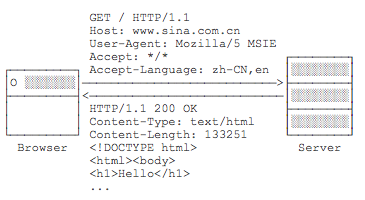

HTTP请求的格式是固定的，它由HTTP Header和HTTP Body两部分构成。第一行总是`请求方法 路径 HTTP版本`，例如，`GET / HTTP/1.1`表示使用`GET`请求，路径是`/`，版本是`HTTP/1.1`。

后续的每一行都是固定的`Header: Value`格式，我们称为HTTP Header，服务器依靠某些特定的Header来识别客户端请求，例如：

- Host：表示请求的域名，因为一台服务器上可能有多个网站，因此有必要依靠Host来识别请求是发给哪个网站的；
- User-Agent：表示客户端自身标识信息，不同的浏览器有不同的标识，服务器依靠User-Agent判断客户端类型是IE还是Chrome，是Firefox还是一个Python爬虫；
- Accept：表示客户端能处理的HTTP响应格式，`*/*`表示任意格式，`text/*`表示任意文本，`image/png`表示PNG格式的图片；
- Accept-Language：表示客户端接收的语言，多种语言按优先级排序，服务器依靠该字段给用户返回特定语言的网页版本。

如果是`GET`请求，那么该HTTP请求只有HTTP Header，没有HTTP Body。如果是`POST`请求，那么该HTTP请求带有Body，以一个空行分隔。一个典型的带Body的HTTP请求如下：

```
POST /login HTTP/1.1
Host: www.example.com
Content-Type: application/x-www-form-urlencoded
Content-Length: 30

username=hello&password=123456
```

`POST`请求通常要设置`Content-Type`表示Body的类型，`Content-Length`表示Body的长度，这样服务器就可以根据请求的Header和Body做出正确的响应。

此外，`GET`请求的参数必须附加在URL上，并以URLEncode方式编码，例如：`http://www.example.com/?a=1&b=K%26R`，参数分别是`a=1`和`b=K&R`。因为URL的长度限制，`GET`请求的参数不能太多，而`POST`请求的参数就没有长度限制，因为`POST`请求的参数必须放到Body中。并且，`POST`请求的参数不一定是URL编码，可以按任意格式编码，只需要在`Content-Type`中正确设置即可。常见的发送JSON的`POST`请求如下：

```
POST /login HTTP/1.1
Content-Type: application/json
Content-Length: 38

{"username":"bob","password":"123456"}
```

HTTP响应也是由Header和Body两部分组成，一个典型的HTTP响应如下：

```
HTTP/1.1 200 OK
Content-Type: text/html
Content-Length: 133251

<!DOCTYPE html>
<html><body>
<h1>Hello</h1>
...
```

响应的第一行总是`HTTP版本 响应代码 响应说明`，例如，`HTTP/1.1 200 OK`表示版本是`HTTP/1.1`，响应代码是`200`，响应说明是`OK`。客户端只依赖响应代码判断HTTP响应是否成功。HTTP有固定的响应代码：

- 1xx：表示一个提示性响应，例如101表示将切换协议，常见于WebSocket连接；
- 2xx：表示一个成功的响应，例如200表示成功，206表示只发送了部分内容；
- 3xx：表示一个重定向的响应，例如301表示永久重定向，303表示客户端应该按指定路径重新发送请求；
- 4xx：表示一个因为客户端问题导致的错误响应，例如400表示因为Content-Type等各种原因导致的无效请求，404表示指定的路径不存在；
- 5xx：表示一个因为服务器问题导致的错误响应，例如500表示服务器内部故障，503表示服务器暂时无法响应。

当浏览器收到第一个HTTP响应后，它解析HTML后，又会发送一系列HTTP请求，例如，`GET /logo.jpg HTTP/1.1`请求一个图片，服务器响应图片请求后，会直接把二进制内容的图片发送给浏览器：

```
HTTP/1.1 200 OK
Content-Type: image/jpeg
Content-Length: 18391

????JFIFHH??XExifMM?i&??X?...(二进制的JPEG图片)
```

因此，服务器总是被动地接收客户端的一个HTTP请求，然后响应它。客户端则根据需要发送若干个HTTP请求。

对于最早期的HTTP/1.0协议，每次发送一个HTTP请求，客户端都需要先创建一个新的TCP连接，然后，收到服务器响应后，关闭这个TCP连接。由于建立TCP连接就比较耗时，因此，为了提高效率，HTTP/1.1协议允许在一个TCP连接中反复发送-响应，这样就能大大提高效率：

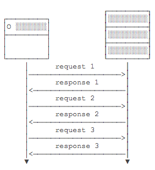

因为HTTP协议是一个请求-响应协议，客户端在发送了一个HTTP请求后，必须等待服务器响应后，才能发送下一个请求，这样一来，如果某个响应太慢，它就会堵住后面的请求。

所以，为了进一步提速，HTTP/2.0允许客户端在没有收到响应的时候，发送多个HTTP请求，服务器返回响应的时候，不一定按顺序返回，只要双方能识别出哪个响应对应哪个请求，就可以做到并行发送和接收：


可见，HTTP/2.0进一步提高了效率。

### 4.2 HTTP编程

既然HTTP涉及到客户端和服务器端，和TCP类似，我们也需要针对客户端编程和针对服务器端编程。

本节我们不讨论服务器端的HTTP编程，因为服务器端的HTTP编程本质上就是编写Web服务器，这是一个非常复杂的体系，也是JavaEE开发的核心内容，我们在后面的章节再仔细研究。

本节我们只讨论作为客户端的HTTP编程。

因为浏览器也是一种HTTP客户端，所以，客户端的HTTP编程，它的行为本质上和浏览器是一样的，即发送一个HTTP请求，接收服务器响应后，获得响应内容。只不过浏览器进一步把响应内容解析后渲染并展示给了用户，而我们使用Java进行HTTP客户端编程仅限于获得响应内容。

我们来看一下Java如何使用HTTP客户端编程。

Java标准库提供了基于HTTP的包，但是要注意，早期的JDK版本是通过`HttpURLConnection`访问HTTP，典型代码如下：

```java
URL url = new URL("http://www.example.com/path/to/target?a=1&b=2");
HttpURLConnection conn = (HttpURLConnection) url.openConnection();
conn.setRequestMethod("GET");
conn.setUseCaches(false);
conn.setConnectTimeout(5000); // 请求超时5秒
// 设置HTTP头:
conn.setRequestProperty("Accept", "*/*");
conn.setRequestProperty("User-Agent", "Mozilla/5.0 (compatible; MSIE 11; Windows NT 5.1)");
// 连接并发送HTTP请求:
conn.connect();
// 判断HTTP响应是否200:
if (conn.getResponseCode() != 200) {
    throw new RuntimeException("bad response");
}		
// 获取所有响应Header:
Map<String, List<String>> map = conn.getHeaderFields();
for (String key : map.keySet()) {
    System.out.println(key + ": " + map.get(key));
}
// 获取响应内容:
InputStream input = conn.getInputStream();
...
```

上述代码编写比较繁琐，并且需要手动处理`InputStream`，所以用起来很麻烦。

从Java 11开始，引入了新的`HttpClient`，它使用链式调用的API，能大大简化HTTP的处理。

我们来看一下如何使用新版的`HttpClient`。首先需要创建一个全局`HttpClient`实例，因为`HttpClient`内部使用线程池优化多个HTTP连接，可以复用：

```java
static HttpClient httpClient = HttpClient.newBuilder().build();
```

使用`GET`请求获取文本内容代码如下：

```java
import java.net.URI;
import java.net.http.*;
import java.net.http.HttpClient.Version;
import java.time.Duration;
import java.util.*;

public class Main {
    // 全局HttpClient:
    static HttpClient httpClient = HttpClient.newBuilder().build();

    public static void main(String[] args) throws Exception {
        String url = "https://www.sina.com.cn/";
        HttpRequest request = HttpRequest.newBuilder(new URI(url))
            // 设置Header:
            .header("User-Agent", "Java HttpClient").header("Accept", "*/*")
            // 设置超时:
            .timeout(Duration.ofSeconds(5))
            // 设置版本:
            .version(Version.HTTP_2).build();
        HttpResponse<String> response = httpClient.send(request, HttpResponse.BodyHandlers.ofString());
        // HTTP允许重复的Header，因此一个Header可对应多个Value:
        Map<String, List<String>> headers = response.headers().map();
        for (String header : headers.keySet()) {
            System.out.println(header + ": " + headers.get(header).get(0));
        }
        System.out.println(response.body().substring(0, 1024) + "...");
    }
}
```

如果我们要获取图片这样的二进制内容，只需要把`HttpResponse.BodyHandlers.ofString()`换成`HttpResponse.BodyHandlers.ofByteArray()`，就可以获得一个`HttpResponse<byte[]>`对象。如果响应的内容很大，不希望一次性全部加载到内存，可以使用`HttpResponse.BodyHandlers.ofInputStream()`获取一个`InputStream`流。

要使用`POST`请求，我们要准备好发送的Body数据并正确设置`Content-Type`：

```java
String url = "http://www.example.com/login";
String body = "username=bob&password=123456";
HttpRequest request = HttpRequest.newBuilder(new URI(url))
    // 设置Header:
    .header("Accept", "*/*")
    .header("Content-Type", "application/x-www-form-urlencoded")
    // 设置超时:
    .timeout(Duration.ofSeconds(5))
    // 设置版本:
    .version(Version.HTTP_2)
    // 使用POST并设置Body:
    .POST(BodyPublishers.ofString(body, StandardCharsets.UTF_8)).build();
HttpResponse<String> response = httpClient.send(request, HttpResponse.BodyHandlers.ofString());
String s = response.body();
```

可见发送`POST`数据也十分简单。

> 练习：请使用GET、POST各编写一个请求案例

## 5. Web开发

### 5.1 简介

今天我们访问网站，使用App时，都是基于Web这种Browser/Server模式，简称BS架构，它的特点是，客户端只需要浏览器，应用程序的逻辑和数据都存储在服务器端。浏览器只需要请求服务器，获取Web页面，并把Web页面展示给用户即可。

Web页面具有极强的交互性。由于Web页面是用HTML编写的，而HTML具备超强的表现力，并且，服务器端升级后，客户端无需任何部署就可以使用到新的版本，因此，BS架构升级非常容易。

### 5.2 HTTP协议

在Web应用中，浏览器请求一个URL，服务器就把生成的HTML网页发送给浏览器，而浏览器和服务器之间的传输协议是HTTP，所以：

- HTML是一种用来定义网页的文本，会HTML，就可以编写网页；
- HTTP是在网络上传输HTML的协议，用于浏览器和服务器的通信。

HTTP协议是一个基于TCP协议之上的请求-响应协议，它非常简单，我们先使用Chrome浏览器查看新浪首页，然后选择View - Developer - Inspect Elements就可以看到HTML：

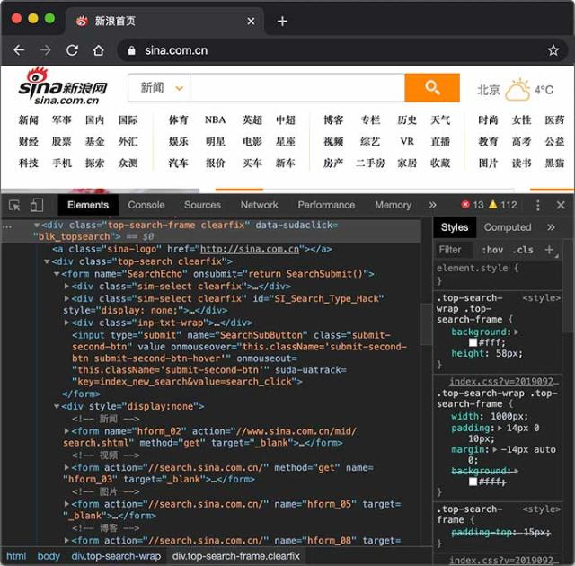

切换到Network，重新加载页面，可以看到浏览器发出的每一个请求和响应：

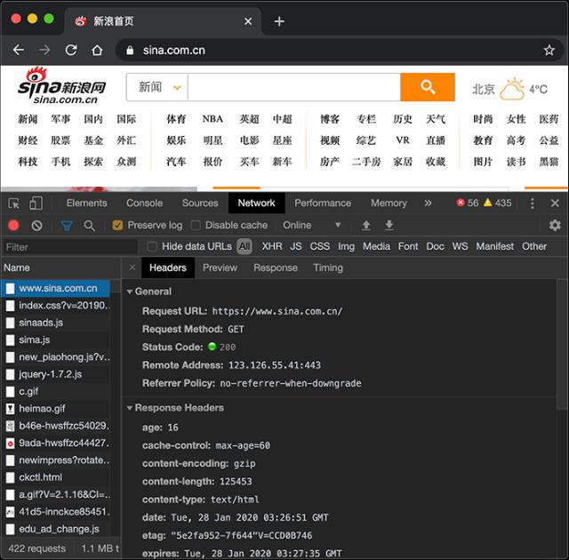

>  使用Chrome浏览器可以方便地调试Web应用程序。

对于Browser来说，请求页面的流程如下：

1. 与服务器建立TCP连接；
2. 发送HTTP请求；
3. 收取HTTP响应，然后把网页在浏览器中显示出来。

浏览器发送的HTTP请求如下：

```
GET / HTTP/1.1
Host: www.sina.com.cn
User-Agent: Mozilla/5.0 xxx
Accept: */*
Accept-Language: zh-CN,zh;q=0.9,en-US;q=0.8
```

其中，第一行表示使用`GET`请求获取路径为`/`的资源，并使用`HTTP/1.1`协议，从第二行开始，每行都是以`Header: Value`形式表示的HTTP头，比较常用的HTTP Header包括：

- Host: 表示请求的主机名，因为一个服务器上可能运行着多个网站，因此，Host表示浏览器正在请求的域名；
- User-Agent: 标识客户端本身，例如Chrome浏览器的标识类似`Mozilla/5.0 ... Chrome/79`，IE浏览器的标识类似`Mozilla/5.0 (Windows NT ...) like Gecko`；
- Accept：表示浏览器能接收的资源类型，如`text/*`，`image/*`或者`*/*`表示所有；
- Accept-Language：表示浏览器偏好的语言，服务器可以据此返回不同语言的网页；
- Accept-Encoding：表示浏览器可以支持的压缩类型，例如`gzip, deflate, br`。

服务器的响应如下：

```
HTTP/1.1 200 OK
Content-Type: text/html
Content-Length: 21932
Content-Encoding: gzip
Cache-Control: max-age=300

<html>...网页数据...
```

服务器响应的第一行总是版本号+空格+数字+空格+文本，数字表示响应代码，其中`2xx`表示成功，`3xx`表示重定向，`4xx`表示客户端引发的错误，`5xx`表示服务器端引发的错误。数字是给程序识别，文本则是给开发者调试使用的。常见的响应代码有：

- 200 OK：表示成功；
- 301 Moved Permanently：表示该URL已经永久重定向；
- 302 Found：表示该URL需要临时重定向；
- 304 Not Modified：表示该资源没有修改，客户端可以使用本地缓存的版本；
- 400 Bad Request：表示客户端发送了一个错误的请求，例如参数无效；
- 401 Unauthorized：表示客户端因为身份未验证而不允许访问该URL；
- 403 Forbidden：表示服务器因为权限问题拒绝了客户端的请求；
- 404 Not Found：表示客户端请求了一个不存在的资源；
- 500 Internal Server Error：表示服务器处理时内部出错，例如因为无法连接数据库；
- 503 Service Unavailable：表示服务器此刻暂时无法处理请求。

从第二行开始，服务器每一行均返回一个HTTP头。服务器经常返回的HTTP Header包括：

- Content-Type：表示该响应内容的类型，例如`text/html`，`image/jpeg`；
- Content-Length：表示该响应内容的长度（字节数）；
- Content-Encoding：表示该响应压缩算法，例如`gzip`；
- Cache-Control：指示客户端应如何缓存，例如`max-age=300`表示可以最多缓存300秒。

HTTP请求和响应都由HTTP Header和HTTP Body构成，其中HTTP Header每行都以`\r\n`结束。如果遇到两个连续的`\r\n`，那么后面就是HTTP Body。浏览器读取HTTP Body，并根据Header信息中指示的`Content-Type`、`Content-Encoding`等解压后显示网页、图像或其他内容。

通常浏览器获取的第一个资源是HTML网页，在网页中，如果嵌入了JavaScript、CSS、图片、视频等其他资源，浏览器会根据资源的URL再次向服务器请求对应的资源。

关于HTTP协议的详细内容，请参考[HTTP权威指南](https://www.amazon.cn/dp/B00M2DKYRC/)一书，或者[Mozilla开发者网站](https://developer.mozilla.org/zh-CN/docs/Web/HTTP)。

我们在前面介绍的HTTP编程是以客户端的身份去请求服务器资源。现在，我们需要以服务器的身份响应客户端请求，编写服务器程序来处理客户端请求通常就称之为Web开发。

### 5.3 编者HTTP Server

我们来看一下如何编写HTTP Server。一个HTTP Server本质上是一个TCP服务器，我们先用TCP编程的多线程实现的服务器端框架：

```java
public class Server {
    public static void main(String[] args) throws IOException {
        ServerSocket ss = new ServerSocket(8080); // 监听指定端口
        System.out.println("server is running...");
        for (;;) {
            Socket sock = ss.accept();
            System.out.println("connected from " + sock.getRemoteSocketAddress());
            Thread t = new Handler(sock);
            t.start();
        }
    }
}

class Handler extends Thread {
    Socket sock;

    public Handler(Socket sock) {
        this.sock = sock;
    }

    public void run() {
        try (InputStream input = this.sock.getInputStream()) {
            try (OutputStream output = this.sock.getOutputStream()) {
                handle(input, output);
            }
        } catch (Exception e) {
            try {
                this.sock.close();
            } catch (IOException ioe) {
            }
            System.out.println("client disconnected.");
        }
    }

    private void handle(InputStream input, OutputStream output) throws IOException {
        var reader = new BufferedReader(new InputStreamReader(input, StandardCharsets.UTF_8));
        var writer = new BufferedWriter(new OutputStreamWriter(output, StandardCharsets.UTF_8));
        // TODO: 处理HTTP请求
    }
}
```

只需要在`handle()`方法中，用Reader读取HTTP请求，用Writer发送HTTP响应，即可实现一个最简单的HTTP服务器。编写代码如下：

```java
private void handle(InputStream input, OutputStream output) throws IOException {
    System.out.println("Process new http request...");
    var reader = new BufferedReader(new InputStreamReader(input, StandardCharsets.UTF_8));
    var writer = new BufferedWriter(new OutputStreamWriter(output, StandardCharsets.UTF_8));
    // 读取HTTP请求:
    boolean requestOk = false;
    String first = reader.readLine();
    if (first.startsWith("GET / HTTP/1.")) {
        requestOk = true;
    }
    for (;;) {
        String header = reader.readLine();
        if (header.isEmpty()) { // 读取到空行时, HTTP Header读取完毕
            break;
        }
        System.out.println(header);
    }
    System.out.println(requestOk ? "Response OK" : "Response Error");
    if (!requestOk) {
        // 发送错误响应:
        writer.write("HTTP/1.0 404 Not Found\r\n");
        writer.write("Content-Length: 0\r\n");
        writer.write("\r\n");
        writer.flush();
    } else {
        // 发送成功响应:
        String data = "<html><body><h1>Hello, world!</h1></body></html>";
        int length = data.getBytes(StandardCharsets.UTF_8).length;
        writer.write("HTTP/1.0 200 OK\r\n");
        writer.write("Connection: close\r\n");
        writer.write("Content-Type: text/html\r\n");
        writer.write("Content-Length: " + length + "\r\n");
        writer.write("\r\n"); // 空行标识Header和Body的分隔
        writer.write(data);
        writer.flush();
    }
}
```

这里的核心代码是，先读取HTTP请求，这里我们只处理`GET /`的请求。当读取到空行时，表示已读到连续两个`\r\n`，说明请求结束，可以发送响应。发送响应的时候，首先发送响应代码`HTTP/1.0 200 OK`表示一个成功的200响应，使用`HTTP/1.0`协议，然后，依次发送Header，发送完Header后，再发送一个空行标识Header结束，紧接着发送HTTP Body，在浏览器输入`http://localhost:8080/`就可以看到响应页面.

HTTP目前有多个版本，`1.0`是早期版本，浏览器每次建立TCP连接后，只发送一个HTTP请求并接收一个HTTP响应，然后就关闭TCP连接。由于创建TCP连接本身就需要消耗一定的时间，因此，HTTP 1.1允许浏览器和服务器在同一个TCP连接上反复发送、接收多个HTTP请求和响应，这样就大大提高了传输效率。

我们注意到HTTP协议是一个请求-响应协议，它总是发送一个请求，然后接收一个响应。能不能一次性发送多个请求，然后再接收多个响应呢？HTTP 2.0可以支持浏览器同时发出多个请求，但每个请求需要唯一标识，服务器可以不按请求的顺序返回多个响应，由浏览器自己把收到的响应和请求对应起来。可见，HTTP 2.0进一步提高了传输效率，因为浏览器发出一个请求后，不必等待响应，就可以继续发下一个请求。

HTTP 3.0为了进一步提高速度，将抛弃TCP协议，改为使用无需创建连接的UDP协议，目前HTTP 3.0仍然处于实验阶段。

### 5.4 Servlet入门

在上一节中，我们看到，编写HTTP服务器其实是非常简单的，只需要先编写基于多线程的TCP服务，然后在一个TCP连接中读取HTTP请求，发送HTTP响应即可。

但是，要编写一个完善的HTTP服务器，以HTTP/1.1为例，需要考虑的包括：

- 识别正确和错误的HTTP请求；
- 识别正确和错误的HTTP头；
- 复用TCP连接；
- 复用线程；
- IO异常处理；
- ...

这些基础工作需要耗费大量的时间，并且经过长期测试才能稳定运行。如果我们只需要输出一个简单的HTML页面，就不得不编写上千行底层代码，那就根本无法做到高效而可靠地开发。

因此，在JavaEE平台上，处理TCP连接，解析HTTP协议这些底层工作统统扔给现成的Web服务器去做，我们只需要把自己的应用程序跑在Web服务器上。为了实现这一目的，JavaEE提供了Servlet API，我们使用Servlet API编写自己的Servlet来处理HTTP请求，Web服务器实现Servlet API接口，实现底层功能：

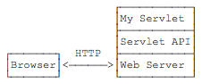

我们来实现一个最简单的Servlet：

```java
// WebServlet注解表示这是一个Servlet，并映射到地址/:
@WebServlet(urlPatterns = "/")
public class HelloServlet extends HttpServlet {
    protected void doGet(HttpServletRequest req, HttpServletResponse resp)
            throws ServletException, IOException {
        // 设置响应类型:
        resp.setContentType("text/html");
        // 获取输出流:
        PrintWriter pw = resp.getWriter();
        // 写入响应:
        pw.write("<h1>Hello, world!</h1>");
        // 最后不要忘记flush强制输出:
        pw.flush();
    }
}
```

一个Servlet总是继承自`HttpServlet`，然后覆写`doGet()`或`doPost()`方法。注意到`doGet()`方法传入了`HttpServletRequest`和`HttpServletResponse`两个对象，分别代表HTTP请求和响应。我们使用Servlet API时，并不直接与底层TCP交互，也不需要解析HTTP协议，因为`HttpServletRequest`和`HttpServletResponse`就已经封装好了请求和响应。以发送响应为例，我们只需要设置正确的响应类型，然后获取`PrintWriter`，写入响应即可。

现在问题来了：Servlet API是谁提供？

Servlet API是一个jar包，我们需要通过Maven来引入它，才能正常编译。编写`pom.xml`文件如下：

```xml
<project xmlns="http://maven.apache.org/POM/4.0.0"
    xmlns:xsi="http://www.w3.org/2001/XMLSchema-instance"
    xsi:schemaLocation="http://maven.apache.org/POM/4.0.0 http://maven.apache.org/maven-v4_0_0.xsd">
    <modelVersion>4.0.0</modelVersion>
    <groupId>com.itranswarp.learnjava</groupId>
    <artifactId>web-servlet-hello</artifactId>
    <packaging>war</packaging>
    <version>1.0-SNAPSHOT</version>

    <properties>
        <project.build.sourceEncoding>UTF-8</project.build.sourceEncoding>
        <project.reporting.outputEncoding>UTF-8</project.reporting.outputEncoding>
        <maven.compiler.source>11</maven.compiler.source>
        <maven.compiler.target>11</maven.compiler.target>
        <java.version>11</java.version>
    </properties>

    <dependencies>
        <dependency>
            <groupId>javax.servlet</groupId>
            <artifactId>javax.servlet-api</artifactId>
            <version>4.0.0</version>
            <scope>provided</scope>
        </dependency>
    </dependencies>

    <build>
        <finalName>hello</finalName>
    </build>
</project>
```

注意到这个`pom.xml`与前面我们讲到的普通Java程序有个区别，打包类型不是`jar`，而是`war`，表示Java Web Application Archive：

```xml
<packaging>war</packaging>
```

引入的Servlet API如下：

```xml
<dependency>
    <groupId>javax.servlet</groupId>
    <artifactId>javax.servlet-api</artifactId>
    <version>4.0.0</version>
    <scope>provided</scope>
</dependency>
```

注意到`<scope>`指定为`provided`，表示编译时使用，但不会打包到`.war`文件中，因为运行期Web服务器本身已经提供了Servlet API相关的jar包。

我们还需要在工程目录下创建一个`web.xml`描述文件，放到`src/main/webapp/WEB-INF`目录下（固定目录结构，不要修改路径，注意大小写）。文件内容可以固定如下：

```xml
<!DOCTYPE web-app PUBLIC
 "-//Sun Microsystems, Inc.//DTD Web Application 2.3//EN"
 "http://java.sun.com/dtd/web-app_2_3.dtd">
<web-app>
  <display-name>Archetype Created Web Application</display-name>
</web-app>
```

整个工程结构如下：

```ascii
web-servlet-hello
├── pom.xml
└── src
    └── main
        ├── java
        │   └── com
        │       └── itranswarp
        │           └── learnjava
        │               └── servlet
        │                   └── HelloServlet.java
        ├── resources
        └── webapp
            └── WEB-INF
                └── web.xml
```

运行Maven命令`mvn clean package`，在`target`目录下得到一个`hello.war`文件，这个文件就是我们编译打包后的Web应用程序。

现在问题又来了：我们应该如何运行这个`war`文件？

普通的Java程序是通过启动JVM，然后执行`main()`方法开始运行。但是Web应用程序有所不同，我们无法直接运行`war`文件，必须先启动Web服务器，再由Web服务器加载我们编写的`HelloServlet`，这样就可以让`HelloServlet`处理浏览器发送的请求。

因此，我们首先要找一个支持Servlet API的Web服务器。常用的服务器有：

- [Tomcat](https://tomcat.apache.org/)：由Apache开发的开源免费服务器；
- [Jetty](https://www.eclipse.org/jetty/)：由Eclipse开发的开源免费服务器；
- [GlassFish](https://javaee.github.io/glassfish/)：一个开源的全功能JavaEE服务器。

还有一些收费的商用服务器，如Oracle的[WebLogic](https://www.oracle.com/middleware/weblogic/)，IBM的[WebSphere](https://www.ibm.com/cloud/websphere-application-platform/)。

无论使用哪个服务器，只要它支持Servlet API 4.0（因为我们引入的Servlet版本是4.0），我们的war包都可以在上面运行。这里我们选择使用最广泛的开源免费的Tomcat服务器。

要运行我们的`hello.war`，首先要[下载Tomcat服务器](https://tomcat.apache.org/download-90.cgi)，解压后，把`hello.war`复制到Tomcat的`webapps`目录下，然后切换到`bin`目录，执行`startup.sh`或`startup.bat`启动Tomcat服务器：

```shell
$ ./startup.sh 
Using CATALINA_BASE:   .../apache-tomcat-9.0.30
Using CATALINA_HOME:   .../apache-tomcat-9.0.30
Using CATALINA_TMPDIR: .../apache-tomcat-9.0.30/temp
Using JRE_HOME:        .../jdk-11.jdk/Contents/Home
Using CLASSPATH:       .../apache-tomcat-9.0.30/bin/bootstrap.jar:...
Tomcat started.
```

在浏览器输入`http://localhost:8080/hello/`即可看到`HelloServlet`的输出：

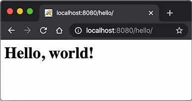

细心的童鞋可能会问，为啥路径是`/hello/`而不是`/`？因为一个Web服务器允许同时运行多个Web App，而我们的Web App叫`hello`，因此，第一级目录`/hello`表示Web App的名字，后面的`/`才是我们在`HelloServlet`中映射的路径。

那能不能直接使用`/`而不是`/hello/`？毕竟`/`比较简洁。

答案是肯定的。先关闭Tomcat（执行`shutdown.sh`或`shutdown.bat`），然后删除Tomcat的webapps目录下的所有文件夹和文件，最后把我们的`hello.war`复制过来，改名为`ROOT.war`，文件名为`ROOT`的应用程序将作为默认应用，启动后直接访问`http://localhost:8080/`即可。

实际上，类似Tomcat这样的服务器也是Java编写的，启动Tomcat服务器实际上是启动Java虚拟机，执行Tomcat的`main()`方法，然后由Tomcat负责加载我们的`.war`文件，并创建一个`HelloServlet`实例，最后以多线程的模式来处理HTTP请求。如果Tomcat服务器收到的请求路径是`/`（假定部署文件为ROOT.war），就转发到`HelloServlet`并传入`HttpServletRequest`和`HttpServletResponse`两个对象。

因为我们编写的Servlet并不是直接运行，而是由Web服务器加载后创建实例运行，所以，类似Tomcat这样的Web服务器也称为Servlet容器。

在Servlet容器中运行的Servlet具有如下特点：

- 无法在代码中直接通过new创建Servlet实例，必须由Servlet容器自动创建Servlet实例；
- Servlet容器只会给每个Servlet类创建唯一实例；
- Servlet容器会使用多线程执行`doGet()`或`doPost()`方法。

复习一下Java多线程的内容，我们可以得出结论：

- 在Servlet中定义的实例变量会被多个线程同时访问，要注意线程安全；
- `HttpServletRequest`和`HttpServletResponse`实例是由Servlet容器传入的局部变量，它们只能被当前线程访问，不存在多个线程访问的问题；
- 在`doGet()`或`doPost()`方法中，如果使用了`ThreadLocal`，但没有清理，那么它的状态很可能会影响到下次的某个请求，因为Servlet容器很可能用线程池实现线程复用。

因此，正确编写Servlet，要清晰理解Java的多线程模型，需要同步访问的必须同步。

> 练习：给`HelloServlet`增加一个URL参数，例如传入`http://localhost:8080/?name=Bob`，能够输出`Hello, Bob!`。

### 5.5 Servlet进阶

一个Web App就是由一个或多个Servlet组成的，每个Servlet通过注解说明自己能处理的路径。例如：

```java
@WebServlet(urlPatterns = "/hello")
public class HelloServlet extends HttpServlet {
    ...
}
```

上述`HelloServlet`能处理`/hello`这个路径的请求。

 早期的Servlet需要在web.xml中配置映射路径，但最新Servlet版本只需要通过注解就可以完成映射。

因为浏览器发送请求的时候，还会有请求方法（HTTP Method）：即GET、POST、PUT等不同类型的请求。因此，要处理GET请求，我们要覆写`doGet()`方法：

```java
@WebServlet(urlPatterns = "/hello")
public class HelloServlet extends HttpServlet {
    @Override
    protected void doGet(HttpServletRequest req, HttpServletResponse resp) throws ServletException, IOException {
        ...
    }
}
```

类似的，要处理POST请求，就需要覆写`doPost()`方法。

如果没有覆写`doPost()`方法，那么`HelloServlet`能不能处理`POST /hello`请求呢？

我们查看一下`HttpServlet`的`doPost()`方法就一目了然了：它会直接返回405或400错误。因此，一个Servlet如果映射到`/hello`，那么所有请求方法都会由这个Servlet处理，至于能不能返回200成功响应，要看有没有覆写对应的请求方法。

一个Webapp完全可以有多个Servlet，分别映射不同的路径。例如：

```java
@WebServlet(urlPatterns = "/hello")
public class HelloServlet extends HttpServlet {
    ...
}

@WebServlet(urlPatterns = "/signin")
public class SignInServlet extends HttpServlet {
    ...
}

@WebServlet(urlPatterns = "/")
public class IndexServlet extends HttpServlet {
    ...
}
```

浏览器发出的HTTP请求总是由Web Server先接收，然后，根据Servlet配置的映射，不同的路径转发到不同的Servlet：

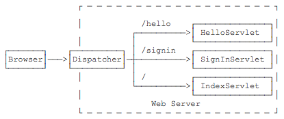

这种根据路径转发的功能我们一般称为Dispatch。映射到`/`的`IndexServlet`比较特殊，它实际上会接收所有未匹配的路径，相当于`/*`，因为Dispatcher的逻辑可以用伪代码实现如下：

```java
String path = ...
if (path.equals("/hello")) {
    dispatchTo(helloServlet);
} else if (path.equals("/signin")) {
    dispatchTo(signinServlet);
} else {
    // 所有未匹配的路径均转发到"/"
    dispatchTo(indexServlet);
}
```

所以我们在浏览器输入一个`http://localhost:8080/abc`也会看到`IndexServlet`生成的页面。

#### 5.5.1 HttpServletRequest

`HttpServletRequest`封装了一个HTTP请求，它实际上是从`ServletRequest`继承而来。最早设计Servlet时，设计者希望Servlet不仅能处理HTTP，也能处理类似SMTP等其他协议，因此，单独抽出了`ServletRequest`接口，但实际上除了HTTP外，并没有其他协议会用Servlet处理，所以这是一个过度设计。

我们通过`HttpServletRequest`提供的接口方法可以拿到HTTP请求的几乎全部信息，常用的方法有：

- getMethod()：返回请求方法，例如，`"GET"`，`"POST"`；
- getRequestURI()：返回请求路径，但不包括请求参数，例如，`"/hello"`；
- getQueryString()：返回请求参数，例如，`"name=Bob&a=1&b=2"`；
- getParameter(name)：返回请求参数，GET请求从URL读取参数，POST请求从Body中读取参数；
- getContentType()：获取请求Body的类型，例如，`"application/x-www-form-urlencoded"`；
- getContextPath()：获取当前Webapp挂载的路径，对于ROOT来说，总是返回空字符串`""`；
- getCookies()：返回请求携带的所有Cookie；
- getHeader(name)：获取指定的Header，对Header名称不区分大小写；
- getHeaderNames()：返回所有Header名称；
- getInputStream()：如果该请求带有HTTP Body，该方法将打开一个输入流用于读取Body；
- getReader()：和getInputStream()类似，但打开的是Reader；
- getRemoteAddr()：返回客户端的IP地址；
- getScheme()：返回协议类型，例如，`"http"`，`"https"`；

此外，`HttpServletRequest`还有两个方法：`setAttribute()`和`getAttribute()`，可以给当前`HttpServletRequest`对象附加多个Key-Value，相当于把`HttpServletRequest`当作一个`Map<String, Object>`使用。

调用`HttpServletRequest`的方法时，注意务必阅读接口方法的文档说明，因为有的方法会返回`null`，例如`getQueryString()`的文档就写了：

```
... This method returns null if the URL does not have a query string...
```

#### 5.5.2 HttpServletResponse

`HttpServletResponse`封装了一个HTTP响应。由于HTTP响应必须先发送Header，再发送Body，所以，操作`HttpServletResponse`对象时，必须先调用设置Header的方法，最后调用发送Body的方法。

常用的设置Header的方法有：

- setStatus(sc)：设置响应代码，默认是`200`；
- setContentType(type)：设置Body的类型，例如，`"text/html"`；
- setCharacterEncoding(charset)：设置字符编码，例如，`"UTF-8"`；
- setHeader(name, value)：设置一个Header的值；
- addCookie(cookie)：给响应添加一个Cookie；
- addHeader(name, value)：给响应添加一个Header，因为HTTP协议允许有多个相同的Header；

写入响应时，需要通过`getOutputStream()`获取写入流，或者通过`getWriter()`获取字符流，二者只能获取其中一个。

写入响应前，无需设置`setContentLength()`，因为底层服务器会根据写入的字节数自动设置，如果写入的数据量很小，实际上会先写入缓冲区，如果写入的数据量很大，服务器会自动采用Chunked编码让浏览器能识别数据结束符而不需要设置Content-Length头。

但是，写入完毕后调用`flush()`却是必须的，因为大部分Web服务器都基于HTTP/1.1协议，会复用TCP连接。如果没有调用`flush()`，将导致缓冲区的内容无法及时发送到客户端。此外，写入完毕后千万不要调用`close()`，原因同样是因为会复用TCP连接，如果关闭写入流，将关闭TCP连接，使得Web服务器无法复用此TCP连接。

 写入完毕后对输出流调用flush()而不是close()方法！

有了`HttpServletRequest`和`HttpServletResponse`这两个高级接口，我们就不需要直接处理HTTP协议。注意到具体的实现类是由各服务器提供的，而我们编写的Web应用程序只关心接口方法，并不需要关心具体实现的子类。

#### 5.5.3 Servlet多线程模型

一个Servlet类在服务器中只有一个实例，但对于每个HTTP请求，Web服务器会使用多线程执行请求。因此，一个Servlet的`doGet()`、`doPost()`等处理请求的方法是多线程并发执行的。如果Servlet中定义了字段，要注意多线程并发访问的问题：

```java
public class HelloServlet extends HttpServlet {
    private Map<String, String> map = new ConcurrentHashMap<>();

    protected void doGet(HttpServletRequest req, HttpServletResponse resp) throws ServletException, IOException {
        // 注意读写map字段是多线程并发的:
        this.map.put(key, value);
    }
}
```

对于每个请求，Web服务器会创建唯一的`HttpServletRequest`和`HttpServletResponse`实例，因此，`HttpServletRequest`和`HttpServletResponse`实例只有在当前处理线程中有效，它们总是局部变量，不存在多线程共享的问题。

#### 5.5.4 重定向与转发

`Redirect`，重定向是指当浏览器请求一个URL时，服务器返回一个重定向指令，告诉浏览器地址已经变了，麻烦使用新的URL再重新发送新请求。

例如，我们已经编写了一个能处理`/hello`的`HelloServlet`，如果收到的路径为`/hi`，希望能重定向到`/hello`，可以再编写一个`RedirectServlet`：

```java
@WebServlet(urlPatterns = "/hi")
public class RedirectServlet extends HttpServlet {
    protected void doGet(HttpServletRequest req, HttpServletResponse resp) throws ServletException, IOException {
        // 构造重定向的路径:
        String name = req.getParameter("name");
        String redirectToUrl = "/hello" + (name == null ? "" : "?name=" + name);
        // 发送重定向响应:
        resp.sendRedirect(redirectToUrl);
    }
}
```

如果浏览器发送`GET /hi`请求，`RedirectServlet`将处理此请求。由于`RedirectServlet`在内部又发送了重定向响应，因此，浏览器会收到如下响应：

```
HTTP/1.1 302 Found
Location: /hello
```

当浏览器收到302响应后，它会立刻根据`Location`的指示发送一个新的`GET /hello`请求，这个过程就是重定向：

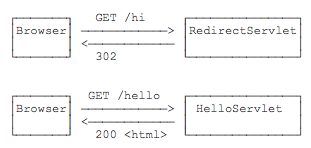

观察Chrome浏览器的网络请求，可以看到两次HTTP请求：


并且浏览器的地址栏路径自动更新为`/hello`。

重定向有两种：一种是302响应，称为临时重定向，一种是301响应，称为永久重定向。两者的区别是，如果服务器发送301永久重定向响应，浏览器会缓存`/hi`到`/hello`这个重定向的关联，下次请求`/hi`的时候，浏览器就直接发送`/hello`请求了。

重定向有什么作用？重定向的目的是当Web应用升级后，如果请求路径发生了变化，可以将原来的路径重定向到新路径，从而避免浏览器请求原路径找不到资源。

`HttpServletResponse`提供了快捷的`redirect()`方法实现302重定向。如果要实现301永久重定向，可以这么写：

```java
resp.setStatus(HttpServletResponse.SC_MOVED_PERMANENTLY); // 301
resp.setHeader("Location", "/hello");
```

`Forward`，是指内部转发。当一个Servlet处理请求的时候，它可以决定自己不继续处理，而是转发给另一个Servlet处理。

例如，我们已经编写了一个能处理`/hello`的`HelloServlet`，继续编写一个能处理`/morning`的`ForwardServlet`：

```java
@WebServlet(urlPatterns = "/morning")
public class ForwardServlet extends HttpServlet {
    protected void doGet(HttpServletRequest req, HttpServletResponse resp) throws ServletException, IOException {
        req.getRequestDispatcher("/hello").forward(req, resp);
    }
}
```

`ForwardServlet`在收到请求后，它并不自己发送响应，而是把请求和响应都转发给路径为`/hello`的Servlet，即下面的代码：

```java
req.getRequestDispatcher("/hello").forward(req, resp);
```

后续请求的处理实际上是由`HelloServlet`完成的。这种处理方式称为转发（Forward），我们用流程图画出来如下：

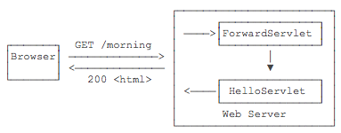

转发和重定向的区别在于，转发是在Web服务器内部完成的，对浏览器来说，它只发出了一个HTTP请求：

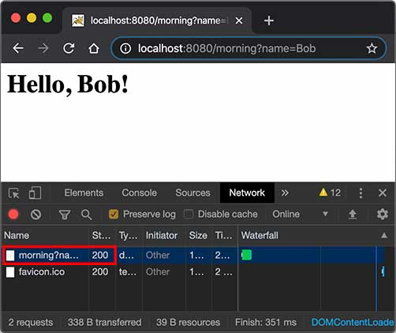

注意到使用转发的时候，浏览器的地址栏路径仍然是`/morning`，浏览器并不知道该请求在Web服务器内部实际上做了一次转发。

> 练习：请使用转发和重定向各完成一个案例

#### 5.5.5 Session & Cookie

在Web应用程序中，我们经常要跟踪用户身份。当一个用户登录成功后，如果他继续访问其他页面，Web程序如何才能识别出该用户身份？

因为HTTP协议是一个无状态协议，即Web应用程序无法区分收到的两个HTTP请求是否是同一个浏览器发出的。为了跟踪用户状态，服务器可以向浏览器分配一个唯一ID，并以Cookie的形式发送到浏览器，浏览器在后续访问时总是附带此Cookie，这样，服务器就可以识别用户身份。

> Session

我们把这种基于唯一ID识别用户身份的机制称为Session。每个用户第一次访问服务器后，会自动获得一个Session ID。如果用户在一段时间内没有访问服务器，那么Session会自动失效，下次即使带着上次分配的Session ID访问，服务器也认为这是一个新用户，会分配新的Session ID。

JavaEE的Servlet机制内建了对Session的支持。我们以登录为例，当一个用户登录成功后，我们就可以把这个用户的名字放入一个`HttpSession`对象，以便后续访问其他页面的时候，能直接从`HttpSession`取出用户名：

```java
@WebServlet(urlPatterns = "/signin")
public class SignInServlet extends HttpServlet {
    // 模拟一个数据库:
    private Map<String, String> users = Map.of("bob", "bob123", "alice", "alice123", "tom", "tomcat");

    // GET请求时显示登录页:
    protected void doGet(HttpServletRequest req, HttpServletResponse resp) throws ServletException, IOException {
        resp.setContentType("text/html");
        PrintWriter pw = resp.getWriter();
        pw.write("<h1>Sign In</h1>");
        pw.write("<form action=\"/signin\" method=\"post\">");
        pw.write("<p>Username: <input name=\"username\"></p>");
        pw.write("<p>Password: <input name=\"password\" type=\"password\"></p>");
        pw.write("<p><button type=\"submit\">Sign In</button> <a href=\"/\">Cancel</a></p>");
        pw.write("</form>");
        pw.flush();
    }

    // POST请求时处理用户登录:
    protected void doPost(HttpServletRequest req, HttpServletResponse resp) throws ServletException, IOException {
        String name = req.getParameter("username");
        String password = req.getParameter("password");
        String expectedPassword = users.get(name.toLowerCase());
        if (expectedPassword != null && expectedPassword.equals(password)) {
            // 登录成功:
            req.getSession().setAttribute("user", name);
            resp.sendRedirect("/");
        } else {
            resp.sendError(HttpServletResponse.SC_FORBIDDEN);
        }
    }
}
```

上述`SignInServlet`在判断用户登录成功后，立刻将用户名放入当前`HttpSession`中：

```java
HttpSession session = req.getSession();
session.setAttribute("user", name);
```

在`IndexServlet`中，可以从`HttpSession`取出用户名：

```java
@WebServlet(urlPatterns = "/")
public class IndexServlet extends HttpServlet {
    protected void doGet(HttpServletRequest req, HttpServletResponse resp) throws ServletException, IOException {
        // 从HttpSession获取当前用户名:
        String user = (String) req.getSession().getAttribute("user");
        resp.setContentType("text/html");
        resp.setCharacterEncoding("UTF-8");
        resp.setHeader("X-Powered-By", "JavaEE Servlet");
        PrintWriter pw = resp.getWriter();
        pw.write("<h1>Welcome, " + (user != null ? user : "Guest") + "</h1>");
        if (user == null) {
            // 未登录，显示登录链接:
            pw.write("<p><a href=\"/signin\">Sign In</a></p>");
        } else {
            // 已登录，显示登出链接:
            pw.write("<p><a href=\"/signout\">Sign Out</a></p>");
        }
        pw.flush();
    }
}
```

如果用户已登录，可以通过访问`/signout`登出。登出逻辑就是从`HttpSession`中移除用户相关信息：

```java
@WebServlet(urlPatterns = "/signout")
public class SignOutServlet extends HttpServlet {
    protected void doGet(HttpServletRequest req, HttpServletResponse resp) throws ServletException, IOException {
        // 从HttpSession移除用户名:
        req.getSession().removeAttribute("user");
        resp.sendRedirect("/");
    }
}
```

对于Web应用程序来说，我们总是通过`HttpSession`这个高级接口访问当前Session。如果要深入理解Session原理，可以认为Web服务器在内存中自动维护了一个ID到`HttpSession`的映射表，我们可以用下图表示：


而服务器识别Session的关键就是依靠一个名为`JSESSIONID`的Cookie。在Servlet中第一次调用`req.getSession()`时，Servlet容器自动创建一个Session ID，然后通过一个名为`JSESSIONID`的Cookie发送给浏览器：

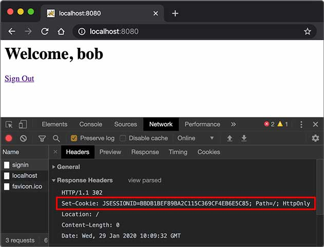

这里要注意的几点是：

- `JSESSIONID`是由Servlet容器自动创建的，目的是维护一个浏览器会话，它和我们的登录逻辑没有关系；
- 登录和登出的业务逻辑是我们自己根据`HttpSession`是否存在一个`"user"`的Key判断的，登出后，Session ID并不会改变；
- 即使没有登录功能，仍然可以使用`HttpSession`追踪用户，例如，放入一些用户配置信息等。

除了使用Cookie机制可以实现Session外，还可以通过隐藏表单、URL末尾附加ID来追踪Session。这些机制很少使用，最常用的Session机制仍然是Cookie。

使用Session时，由于服务器把所有用户的Session都存储在内存中，如果遇到内存不足的情况，就需要把部分不活动的Session序列化到磁盘上，这会大大降低服务器的运行效率，因此，放入Session的对象要小，通常我们放入一个简单的`User`对象就足够了：

```java
public class User {
    public long id; // 唯一标识
    public String email;
    public String name;
}
```

在使用多台服务器构成集群时，使用Session会遇到一些额外的问题。通常，多台服务器集群使用反向代理作为网站入口：

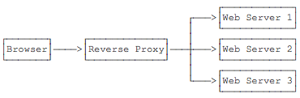

如果多台Web Server采用无状态集群，那么反向代理总是以轮询方式将请求依次转发给每台Web Server，这会造成一个用户在Web Server 1存储的Session信息，在Web Server 2和3上并不存在，即从Web Server 1登录后，如果后续请求被转发到Web Server 2或3，那么用户看到的仍然是未登录状态。

要解决这个问题，方案一是在所有Web Server之间进行Session复制，但这样会严重消耗网络带宽，并且，每个Web Server的内存均存储所有用户的Session，内存使用率很低。

另一个方案是采用粘滞会话（Sticky Session）机制，即反向代理在转发请求的时候，总是根据JSESSIONID的值判断，相同的JSESSIONID总是转发到固定的Web Server，但这需要反向代理的支持。

无论采用何种方案，使用Session机制，会使得Web Server的集群很难扩展，因此，Session适用于中小型Web应用程序。对于大型Web应用程序来说，通常需要避免使用Session机制。

> Cookie

实际上，Servlet提供的`HttpSession`本质上就是通过一个名为`JSESSIONID`的Cookie来跟踪用户会话的。除了这个名称外，其他名称的Cookie我们可以任意使用。

如果我们想要设置一个Cookie，例如，记录用户选择的语言，可以编写一个`LanguageServlet`：

```java
@WebServlet(urlPatterns = "/pref")
public class LanguageServlet extends HttpServlet {

    private static final Set<String> LANGUAGES = Set.of("en", "zh");

    protected void doGet(HttpServletRequest req, HttpServletResponse resp) throws ServletException, IOException {
        String lang = req.getParameter("lang");
        if (LANGUAGES.contains(lang)) {
            // 创建一个新的Cookie:
            Cookie cookie = new Cookie("lang", lang);
            // 该Cookie生效的路径范围:
            cookie.setPath("/");
            // 该Cookie有效期:
            cookie.setMaxAge(8640000); // 8640000秒=100天
            // 将该Cookie添加到响应:
            resp.addCookie(cookie);
        }
        resp.sendRedirect("/");
    }
}
```

创建一个新Cookie时，除了指定名称和值以外，通常需要设置`setPath("/")`，浏览器根据此前缀决定是否发送Cookie。如果一个Cookie调用了`setPath("/user/")`，那么浏览器只有在请求以`/user/`开头的路径时才会附加此Cookie。通过`setMaxAge()`设置Cookie的有效期，单位为秒，最后通过`resp.addCookie()`把它添加到响应。

如果访问的是https网页，还需要调用`setSecure(true)`，否则浏览器不会发送该Cookie。

因此，务必注意：浏览器在请求某个URL时，是否携带指定的Cookie，取决于Cookie是否满足以下所有要求：

- URL前缀是设置Cookie时的Path；
- Cookie在有效期内；
- Cookie设置了secure时必须以https访问。

我们可以在浏览器看到服务器发送的Cookie：

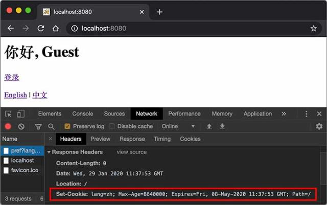

如果我们要读取Cookie，例如，在`IndexServlet`中，读取名为`lang`的Cookie以获取用户设置的语言，可以写一个方法如下：

```java
private String parseLanguageFromCookie(HttpServletRequest req) {
    // 获取请求附带的所有Cookie:
    Cookie[] cookies = req.getCookies();
    // 如果获取到Cookie:
    if (cookies != null) {
        // 循环每个Cookie:
        for (Cookie cookie : cookies) {
            // 如果Cookie名称为lang:
            if (cookie.getName().equals("lang")) {
                // 返回Cookie的值:
                return cookie.getValue();
            }
        }
    }
    // 返回默认值:
    return "en";
}
```

可见，读取Cookie主要依靠遍历`HttpServletRequest`附带的所有Cookie。

### 5.6 JSP

我们从前面的章节可以看到，Servlet就是一个能处理HTTP请求，发送HTTP响应的小程序，而发送响应无非就是获取`PrintWriter`，然后输出HTML：

```java
PrintWriter pw = resp.getWriter();
pw.write("<html>");
pw.write("<body>");
pw.write("<h1>Welcome, " + name + "!</h1>");
pw.write("</body>");
pw.write("</html>");
pw.flush();
```

只不过，用PrintWriter输出HTML比较痛苦，因为不但要正确编写HTML，还需要插入各种变量。如果想在Servlet中输出一个类似新浪首页的HTML，写对HTML基本上不太可能。

那有没有更简单的输出HTML的办法？我们可以使用JSP。

JSP是Java Server Pages的缩写，它的文件必须放到`/src/main/webapp`下，文件名必须以`.jsp`结尾，整个文件与HTML并无太大区别，但需要插入变量，或者动态输出的地方，使用特殊指令`<% ... %>`。

我们来编写一个`hello.jsp`，内容如下：

```jsp
<html>
<head>
    <title>Hello World - JSP</title>
</head>
<body>
    <%-- JSP Comment --%>
    <h1>Hello World!</h1>
    <p>
    <%
         out.println("Your IP address is ");
    %>
    <span style="color:red">
        <%= request.getRemoteAddr() %>
    </span>
    </p>
</body>
</html>
```

整个JSP的内容实际上是一个HTML，但是稍有不同：

- 包含在`<%--`和`--%>`之间的是JSP的注释，它们会被完全忽略；
- 包含在`<%`和`%>`之间的是Java代码，可以编写任意Java代码；
- 如果使用`<%= xxx %>`则可以快捷输出一个变量的值。

JSP页面内置了几个变量：

- out：表示HttpServletResponse的PrintWriter；
- session：表示当前HttpSession对象；
- request：表示HttpServletRequest对象。

这几个变量可以直接使用。

访问JSP页面时，直接指定完整路径。例如，`http://localhost:8080/hello.jsp`，浏览器显示如下：


JSP和Servlet有什么区别？其实它们没有任何区别，因为JSP在执行前首先被编译成一个Servlet。在Tomcat的临时目录下，可以找到一个`hello_jsp.java`的源文件，这个文件就是Tomcat把JSP自动转换成的Servlet源码：

```java
package org.apache.jsp;
import ...

public final class hello_jsp extends org.apache.jasper.runtime.HttpJspBase
    implements org.apache.jasper.runtime.JspSourceDependent,
               org.apache.jasper.runtime.JspSourceImports {

    ...

    public void _jspService(final javax.servlet.http.HttpServletRequest request, final javax.servlet.http.HttpServletResponse response)
        throws java.io.IOException, javax.servlet.ServletException {
        ...
        out.write("<html>\n");
        out.write("<head>\n");
        out.write("    <title>Hello World - JSP</title>\n");
        out.write("</head>\n");
        out.write("<body>\n");
        ...
    }
    ...
}
```

可见JSP本质上就是一个Servlet，只不过无需配置映射路径，Web Server会根据路径查找对应的`.jsp`文件，如果找到了，就自动编译成Servlet再执行。在服务器运行过程中，如果修改了JSP的内容，那么服务器会自动重新编译。

#### 5.6.1 JSP高级功能

JSP的指令非常复杂，除了`<% ... %>`外，JSP页面本身可以通过`page`指令引入Java类：

```jsp
<%@ page import="java.io.*" %>
<%@ page import="java.util.*" %>
```

这样后续的Java代码才能引用简单类名而不是完整类名。

使用`include`指令可以引入另一个JSP文件：

```jsp
<html>
<body>
    <%@ include file="header.jsp"%>
    <h1>Index Page</h1>
    <%@ include file="footer.jsp"%>
</body>
```

#### 5.6.2 JSP Tag

JSP还允许自定义输出的tag，例如：

```jsp
<c:out value = "${sessionScope.user.name}"/>
```

JSP Tag需要正确引入taglib的jar包，并且还需要正确声明，使用起来非常复杂，对于页面开发来说，*不推荐*使用JSP Tag，因为我们后续会介绍更简单的模板引擎，这里我们不再介绍如何使用taglib。

> 练习：编写一个简单的JSP文件，输出当前日期和时间

### 5.7 MVC

我们通过前面的章节可以看到：

- Servlet适合编写Java代码，实现各种复杂的业务逻辑，但不适合输出复杂的HTML；
- JSP适合编写HTML，并在其中插入动态内容，但不适合编写复杂的Java代码。

能否将两者结合起来，发挥各自的优点，避免各自的缺点？

答案是肯定的。我们来看一个具体的例子。

假设我们已经编写了几个JavaBean：

```java
public class User {
    public long id;
    public String name;
    public School school;
}

public class School {
    public String name;
    public String address;
}
```

在`UserServlet`中，我们可以从数据库读取`User`、`School`等信息，然后，把读取到的JavaBean先放到HttpServletRequest中，再通过`forward()`传给`user.jsp`处理：

```java
@WebServlet(urlPatterns = "/user")
public class UserServlet extends HttpServlet {
    protected void doGet(HttpServletRequest req, HttpServletResponse resp) throws ServletException, IOException {
        // 假装从数据库读取:
        School school = new School("No.1 Middle School", "101 South Street");
        User user = new User(123, "Bob", school);
        // 放入Request中:
        req.setAttribute("user", user);
        // forward给user.jsp:
        req.getRequestDispatcher("/WEB-INF/user.jsp").forward(req, resp);
    }
}
```

在`user.jsp`中，我们只负责展示相关JavaBean的信息，不需要编写访问数据库等复杂逻辑：

```java
<%@ page import="com.itranswarp.learnjava.bean.*"%>
<%
    User user = (User) request.getAttribute("user");
%>
<html>
<head>
    <title>Hello World - JSP</title>
</head>
<body>
    <h1>Hello <%= user.name %>!</h1>
    <p>School Name:
    <span style="color:red">
        <%= user.school.name %>
    </span>
    </p>
    <p>School Address:
    <span style="color:red">
        <%= user.school.address %>
    </span>
    </p>
</body>
</html>
```

请注意几点：

- 需要展示的`User`被放入`HttpServletRequest`中以便传递给JSP，因为一个请求对应一个`HttpServletRequest`，我们也无需清理它，处理完该请求后`HttpServletRequest`实例将被丢弃；
- 把`user.jsp`放到`/WEB-INF/`目录下，是因为`WEB-INF`是一个特殊目录，Web Server会阻止浏览器对`WEB-INF`目录下任何资源的访问，这样就防止用户通过`/user.jsp`路径直接访问到JSP页面；
- JSP页面首先从`request`变量获取`User`实例，然后在页面中直接输出，此处未考虑HTML的转义问题，有潜在安全风险。

我们在浏览器访问`http://localhost:8080/user`，请求首先由`UserServlet`处理，然后交给`user.jsp`渲染：


我们把`UserServlet`看作业务逻辑处理，把`User`看作模型，把`user.jsp`看作渲染，这种设计模式通常被称为MVC：Model-View-Controller，即`UserServlet`作为控制器（Controller），`User`作为模型（Model），`user.jsp`作为视图（View），整个MVC架构如下：

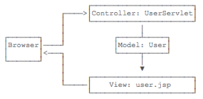

使用MVC模式的好处是，Controller专注于业务处理，它的处理结果就是Model。Model可以是一个JavaBean，也可以是一个包含多个对象的Map，Controller只负责把Model传递给View，View只负责把Model给“渲染”出来，这样，三者职责明确，且开发更简单，因为开发Controller时无需关注页面，开发View时无需关心如何创建Model。

MVC模式广泛地应用在Web页面和传统的桌面程序中，我们在这里通过Servlet和JSP实现了一个简单的MVC模型，但它还不够简洁和灵活，后续我们会介绍更简单的Spring MVC开发。

> 练习：请使用MVC编写一个简单的案例

### 5.8 MVC进阶

### 5.9 Filter

在一个比较复杂的Web应用程序中，通常都有很多URL映射，对应的，也会有多个Servlet来处理URL。

我们考察这样一个论坛应用程序：

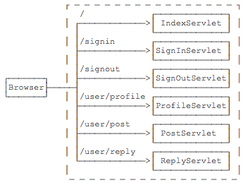

各个Servlet设计功能如下：

- IndexServlet：浏览帖子；
- SignInServlet：登录；
- SignOutServlet：登出；
- ProfileServlet：修改用户资料；
- PostServlet：发帖；
- ReplyServlet：回复。

其中，ProfileServlet、PostServlet和ReplyServlet都需要用户登录后才能操作，否则，应当直接跳转到登录页面。

我们可以直接把判断登录的逻辑写到这3个Servlet中，但是，同样的逻辑重复3次没有必要，并且，如果后续继续加Servlet并且也需要验证登录时，还需要继续重复这个检查逻辑。

为了把一些公用逻辑从各个Servlet中抽离出来，JavaEE的Servlet规范还提供了一种Filter组件，即过滤器，它的作用是，在HTTP请求到达Servlet之前，可以被一个或多个Filter预处理，类似打印日志、登录检查等逻辑，完全可以放到Filter中。

例如，我们编写一个最简单的EncodingFilter，它强制把输入和输出的编码设置为UTF-8：

```java
@WebFilter(urlPatterns = "/*")
public class EncodingFilter implements Filter {
    public void doFilter(ServletRequest request, ServletResponse response, FilterChain chain)
            throws IOException, ServletException {
        System.out.println("EncodingFilter:doFilter");
        request.setCharacterEncoding("UTF-8");
        response.setCharacterEncoding("UTF-8");
        chain.doFilter(request, response);
    }
}
```

编写Filter时，必须实现`Filter`接口，在`doFilter()`方法内部，要继续处理请求，必须调用`chain.doFilter()`。最后，用`@WebFilter`注解标注该Filter需要过滤的URL。这里的`/*`表示所有路径。

添加了Filter之后，整个请求的处理架构如下：


还可以继续添加其他Filter，例如LogFilter：

```java
@WebFilter("/*")
public class LogFilter implements Filter {
    public void doFilter(ServletRequest request, ServletResponse response, FilterChain chain)
            throws IOException, ServletException {
        System.out.println("LogFilter: process " + ((HttpServletRequest) request).getRequestURI());
        chain.doFilter(request, response);
    }
}
```

多个Filter会组成一个链，每个请求都被链上的Filter依次处理：

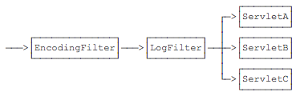

有些细心的童鞋会问，有多个Filter的时候，Filter的顺序如何指定？多个Filter按不同顺序处理会造成处理结果不同吗？

答案是Filter的顺序确实对处理的结果有影响。但遗憾的是，Servlet规范并没有对`@WebFilter`注解标注的Filter规定顺序。如果一定要给每个Filter指定顺序，就必须在`web.xml`文件中对这些Filter再配置一遍。

注意到上述两个Filter的过滤路径都是`/*`，即它们会对所有请求进行过滤。也可以编写只对特定路径进行过滤的Filter，例如`AuthFilter`：

```java
@WebFilter("/user/*")
public class AuthFilter implements Filter {
    public void doFilter(ServletRequest request, ServletResponse response, FilterChain chain)
            throws IOException, ServletException {
        System.out.println("AuthFilter: check authentication");
        HttpServletRequest req = (HttpServletRequest) request;
        HttpServletResponse resp = (HttpServletResponse) response;
        if (req.getSession().getAttribute("user") == null) {
            // 未登录，自动跳转到登录页:
            System.out.println("AuthFilter: not signin!");
            resp.sendRedirect("/signin");
        } else {
            // 已登录，继续处理:
            chain.doFilter(request, response);
        }
    }
}
```

注意到`AuthFilter`只过滤以`/user/`开头的路径，因此：

- 如果一个请求路径类似`/user/profile`，那么它会被上述3个Filter依次处理；
- 如果一个请求路径类似`/test`，那么它会被上述2个Filter依次处理（不会被AuthFilter处理）。

再注意观察`AuthFilter`，当用户没有登录时，在`AuthFilter`内部，直接调用`resp.sendRedirect()`发送重定向，且没有调用`chain.doFilter()`，因此，当用户没有登录时，请求到达`AuthFilter`后，不再继续处理，即后续的Filter和任何Servlet都没有机会处理该请求了。

可见，Filter可以有针对性地拦截或者放行HTTP请求。

如果一个Filter在当前请求中生效，但什么都没有做：

```java
@WebFilter("/*")
public class MyFilter implements Filter {
    public void doFilter(ServletRequest request, ServletResponse response, FilterChain chain)
            throws IOException, ServletException {
        // TODO
    }
}
```

那么，用户将看到一个空白页，因为请求没有继续处理，默认响应是200+空白输出。

 如果Filter要使请求继续被处理，就一定要调用chain.doFilter()！

如果我们使用上一节介绍的MVC模式，即一个统一的`DispatcherServlet`入口，加上多个Controller，这种模式下Filter仍然是正常工作的。例如，一个处理`/user/*`的Filter实际上作用于那些处理`/user/`开头的Controller方法之前。

### 5.10 Listener

除了Servlet和Filter外，JavaEE的Servlet规范还提供了第三种组件：Listener。

Listener顾名思义就是监听器，有好几种Listener，其中最常用的是`ServletContextListener`，我们编写一个实现了`ServletContextListener`接口的类如下：

```java
@WebListener
public class AppListener implements ServletContextListener {
    // 在此初始化WebApp,例如打开数据库连接池等:
    public void contextInitialized(ServletContextEvent sce) {
        System.out.println("WebApp initialized.");
    }

    // 在此清理WebApp,例如关闭数据库连接池等:
    public void contextDestroyed(ServletContextEvent sce) {
        System.out.println("WebApp destroyed.");
    }
}
```

任何标注为`@WebListener`，且实现了特定接口的类会被Web服务器自动初始化。上述`AppListener`实现了`ServletContextListener`接口，它会在整个Web应用程序初始化完成后，以及Web应用程序关闭后获得回调通知。我们可以把初始化数据库连接池等工作放到`contextInitialized()`回调方法中，把清理资源的工作放到`contextDestroyed()`回调方法中，因为Web服务器保证在`contextInitialized()`执行后，才会接受用户的HTTP请求。

很多第三方Web框架都会通过一个`ServletContextListener`接口初始化自己。

除了`ServletContextListener`外，还有几种Listener：

- HttpSessionListener：监听HttpSession的创建和销毁事件；
- ServletRequestListener：监听ServletRequest请求的创建和销毁事件；
- ServletRequestAttributeListener：监听ServletRequest请求的属性变化事件（即调用`ServletRequest.setAttribute()`方法）；
- ServletContextAttributeListener：监听ServletContext的属性变化事件（即调用`ServletContext.setAttribute()`方法）；

> ServletContext

一个Web服务器可以运行一个或多个WebApp，对于每个WebApp，Web服务器都会为其创建一个全局唯一的`ServletContext`实例，我们在`AppListener`里面编写的两个回调方法实际上对应的就是`ServletContext`实例的创建和销毁：

```
public void contextInitialized(ServletContextEvent sce) {
    System.out.println("WebApp initialized: ServletContext = " + sce.getServletContext());
}
```

`ServletRequest`、`HttpSession`等很多对象也提供`getServletContext()`方法获取到同一个`ServletContext`实例。`ServletContext`实例最大的作用就是设置和共享全局信息。

此外，`ServletContext`还提供了动态添加Servlet、Filter、Listener等功能，它允许应用程序在运行期间动态添加一个组件，虽然这个功能不是很常用。