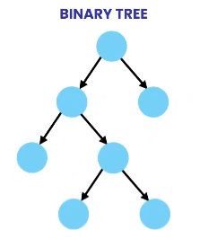

# MySQL

## 1. 简介

### 1.1 什么是数据库

`Database`，数据库就是可快速访问的以某种格式存储的数据集合。

为了管理数据库，我们使用`DBMS`（DataBase Management System，数据库管理系统）来对之进行管理。

我们访问`DBMS`给它指令去查询或者修改数据，`DBMS`会执行我们的指令并将结果返回给我们。

现在市场上有很多数据库管理系统，根据特征它们分为：

- 关系型（`Relational`）：，数据保存在彼此相互关联的表格中，我们可以使用`SQL`（Structured Query Language）来进行操作。常见的`RDBMS`有MySQL、Oracle、MS SQLServer等，每个`DBMS`都有各自优化的`SQL`语言，但所有这些系统的语言都类似，都遵从标准的`SQL`规范
- 非关系型（`NoSQL`）：没有表格和彼此的关系，不支持`SQL`，但它们也有自己的查询语言。


在本课程中，我们将会学习`MySQL`这款`RDBMS`，它开源，并且拥有很大的市场占有率，广泛应用于各类企业级项目。

> `SQL`最早是由`IBM`公司在20世纪70年代发明的，最后演变为一种统一的结构化查询语言规范。

### 1.2 安装

### 1.3 创建数据库

运行`create_database.sql`脚本，着重了解`customers`和`orders`表

## 2. 单表查询

### 2.1 select查询

```sql
select * from customers;
select * from customers where customer_id=1;
select * from customers order by 
```

- Select：用来挑选要查询的列
- from：查询哪一张表
- where：声明查询条件
- order：根据哪些字段进行排序

一条完整的SQL是由多个子句组成的，各个子句都是需要按照指定的顺序排列的，否则会出现语法错误而无法执行。

### 2.2 select子句

```sql
-- 挑选指定的列进行查询
select first_name,last_name from customers;

-- 列与列可以调换顺序，结果展示的时候也会出现相应的变化
select last_name,first_name from customers;

-- 特定的列可以结合数学表达式一起使用
select first_name,last_name,points,points*0.9 from customers;

-- 为了在查看数据的时候方便对某列进行理解，可以对列使用as取别名
select first_name,last_name,points,points*0.9 as discount from customers;

-- 如果别名中含有空格，需要使用单引号包含起来
select first_name,last_name,points,points*0.9 as '折 扣' from customers;

-- 使用distinct修饰列名进行去重查询
select distinct state from customers;

-- 练习：查询商品表（名称、单价、1.1倍单价-别名‘新单价’）
```

### 2.3 where子句

`where`子句用来对查询结果根据条件进行筛选：

- 首先遍历所有结果
- 然后对每一条结果，应用条件进行检测
- 如果条件满足（`true`），就会返回这条记录到最终结果集

```sql
-- >、>=、<、<=、=、!=、<>
select * from customers where points>3000;
select * from customers where state='VA';
select * from customers where birth_date>'1990-01-01';

-- 练习：查询2019年发生的所有订单

-- 使用and、or、not组合多个条件
select * from customers where birth_date>'1990-01-01' and points>1000;
select * from customers where birth_date>'1990-01-01' or points>1000;

-- and优先级大于or
select * from customers where birth_date>'1990-01-01' or points>1000 and state='va';

-- 使用括号让语义更清晰
select * from customers where birth_date>'1990-01-01' or (points>1000 and state='va');
-- not取反
select * from customers where not(birth_date>'1990-01-01' or points>1000);
select * from customers where (birth_date<='1990-01-01' and points<=1000);

-- 练习：查询订单明细表，提取订单编号为6，且总价大于30的记录

-- in表示一定范围
select * from customers where state in('va','ga','fl');
select * from customers where state not in('va','ga','fl');

-- 练习：查询商品表，提取库存为49、38或72的记录

-- between，包含左右边界值
select * from customers where points between 1000 and 3000;

-- 练习：查询客户中生日在1990/1/1到2000/1/1之间的所有记录

-- like进行模糊查询，%任意多个任意字符 _任意一个字符
select * from customers where last_name like 'b%'; -- 以b开头
select * from customers where last_name like '%b%'; -- 含有b字母
select * from customers where last_name like '%b'; -- 以b结尾

-- 练习：查询客户信息，地址中包含trail或avenue

-- 练习：查询客户信息，电话号码以9结尾的

-- 正则表达式查询
-- ^ 字符串开始
-- $ 字符串结束
-- | 逻辑或
select * from customers where last_name regexp '^field|mac';
select * from customers where last_name regexp 'field$|mac';
select * from customers where last_name regexp '[gim]e';
select * from customers where last_name regexp '[a-h]e';

-- 练习
-- first_name 中有 elka 或 ambur
-- last_name 中有 ey 或 on
-- last_name 以 my 开头 或 包含 se
-- last_name 包含 br 或 bu

-- null查询
select * from customers where phone is null;
select * from customers where phone is not null;

-- 练习 找出没有发货的订单

```

### 2.4 order by子句

```sql
select * from customers order by first_name;
select * from customers order by first_name desc;
select * from customers order by state,first_name;

-- 练习 查询订单编号为2的订单详情，按照订单总价降序排列
```

### 2.5 limit子句（分页查询）

```sql
-- limit size;
-- limit offset, size
select * from customers limit 0,3;

-- 练习 找出积分前三的用户

```

## 3. 多表查询

### 3.1 内连接

```sql
-- 查询订单和相应的客户信息
select order_id,o.customer_id,first_name,last_name
	from orders o join customers c
	on o.customer_id = c.customer_id;
	
-- 练习 查询订单详情表，显示商品名称信息
```

### 3.2 自连接

```sql
-- 查询每个员工和他们的管理者
select e.employee_id,e.first_name,m.employee_id,m.first_name
	from employee e join employee m
	on e.reports_to = m.employee_id;
```

### 3.3 合并多个表

```sql
-- 查询订单表，同时显示相应的客户信息和订单状态信息
select o.order_id,o.order_date,c.first_name,c.last_name,os.name
	from orders o
	join customers c on o.customer_id = c.customer_id
	join order_statuses os on o.status = os.order_status_id;
	
-- 练习 查询支付表，同时显示支付方式和客户信息

```

### 3.4 组合关联查询

在`order_items`中，`order_id`和`product_id`是不足以单独标示唯一性的，必须组合起来才能。也即是表中的数据，不存在两个完全一样的组合。

```sql
select *
	from order_items oi
	join order_item_notes oin
	on oi.order_id = oin.order_id and oi.product_id = oin.product_id;
```

### 3.5 隐式关联查询

```sql
select * from orders o,customers c where o.customer_id = c.customer_id;
```

### 3.6 外连接

```sql
select c.customer_id,c.first_name,o.order_id
	from customer c
	left join orders o
	on c.customer_id = o.customer_id
	order by c.customer_id;
```

在`SQL`中分为左连接和右连接两种，当为左连接查询时，左表的记录无论连接条件是否成立，都会作为结果返回，右连接同理。

```sql
-- 练习 查询商品及其订购的次数和数量
```

### 3.7 多表外连接

```sql
-- 查询 商品的订购数量与相应的物流信息
select c.customer_id,c.first_name,o.order_id,s.name
	from customer c
	left join orders o
	on c.customer_id = o.customer_id
	left join shippers s
	on o.shipper_id = s.shipper_id
	order by c.customer_id;
	
-- 练习 查询订单及其相应的客户和物流状态信息
```

### 3.8 自外连接

```sql
-- 查询所有的雇员及其管理者
select e.employee_id,e.first_name,m.first_name
	from employees e
	left join employees m
	on e.employee_id = m.employee_id;
```

### 3.9 using从句

```sql
select o.order_id,c.first_name
	from orders o
	join customers c
	-- on o.customer_id = c.customer_id
	using (customer_id);
	
-- 同样适用于组合关联查询
select * from order_items io join order_item_notes oin using (order_id,product_id);

-- 练习 查询支付表，显示对应的客户和支付方式信息
```

### 3.10 自然连接

```sql
select * from customers natural join orders;
```

在自然连接中，数据库会自动匹配相同的列作为连接条件

### 3.11 交叉连接

```sql
select c.first_name,p.name from customers c cross join products p;
select c.first_name,p.name from customers c , products p;
```

在交叉连接中，左表的每条记录都会与右表的每条记录进行连接。

### 3.12 联合查询

联合查询用来连接两个查询结果集

```sql
select order_id,order_date, 'active' from orders where order_date>='2019-01-01'
union
select order_id,order_date, 'archived' from orders where order_date<'2019-01-01'

-- 也可以用来联合不同的表
select first_name from customers
union
select name from shippers;
```

> 需要注意的是每个查询返回的列数要一致

```sql
-- 练习 根据用户的积分进行金银铜的分级
```

## 4. 增删改

### 4.1 列属性

- Column：列名称，一般用蛇形命名法
- Datatype：数据类型
- PK：主键，每一张表都有主键
- NN：非空属性
- AI：自动增长列
- Default：默认值

### 4.2 insert

```sql
-- 插入一行数据
insert into customers 
	values(default,'John','Smith','2020-01-01',null,'address','city','CA',200);
	
insert into customers (first_name,last_name,birth_date,address,city,state)
	values('John','Smith','2020-01-01','address','city','CA');
	
-- 在插入数据的时候，对应的列名可以打乱顺序，相应的values部分，也应该相应调整顺序

-- 插入多行数据
insert into shippers(name) values('shipper1'),('shipper2');

-- 练习 向products表中插入3条记录

-- 向多张表插入数据
insert into orders(customer_id,order_date,status)
	values(1,'2021-06-01',1);

insert into order_items 
	values(last_insert_id(),1,1,2.95),(last_insert_id(),2,1,3.95);
	
-- copy一张表的数据
create table orders_archived as
	select * from orders;
	
insert into orders_archived 
	select * from orders where order_date<'1990-01-01';
	
-- 练习 copy invoices表，client_id替换为名字，payment_date不为null

```

### 4.3 update

```sql
-- 更新一条记录
update invoices 
	set payment_total=10,payment_date='2020-03-01' where invoice_id=1;

update invoices 
	set payment_total=invoice_total*0.5,payment_date=due_date where invoice_id=3;
	
-- 更新多条记录语法与上一致，只是条件不一样，在开发中比较少见，谨慎使用

-- 练习 更新customers表，给1990年之前生的客户+50分

-- 使用子查询进行更新
update invoices 
	set payment_total=10,payment_date='2020-03-01' 
	where invoice_id=(select client_id from clients where name='Myworks');
	
update invoices 
	set payment_total=10,payment_date='2020-03-01' 
	where invoice_id in(select client_id from clients where state in('CA','NY'));
	
-- 练习 更新orders表coments为金牌客户，条件为客户积分超过3000分
```

### 4.4 delete

```sql
delete from invoices where invoice_id=1;

delete from invoices 
	where client_id=(select client_id from clients where name='Myworks');
```

## 5. 统计查询

### 5.1 聚合函数

聚合函数属于内置函数的一种，它需要接收一些参数，然后再合并为一个结果。

```sql
select
		max(invoice_total),min(invoice_total),avg(invoice_total),
		sum(invoice_total),count(invoice_total) 
		from invoices;
		
-- 注意，以上函数只能作用于非空的列，并且重复值也会计算在内
select count(*) from invoices; 
select count(distinct client_id) from invoices;

-- 练习 查询2019年上半年、下半年及整年的总销售额invoice_total、总收款额payment_total、总应收额
```

### 5.2 分组查询

```sql
-- 按照客户对销售总额进行分组查询
select client_id,sum(invoice_total) as total_sales from invoices
	where invoice_date>='2019-07-01'
	group by client_id
	order by total_sales desc;
	
-- 按照州和城市对销售总额进行分组查询
select state,city,sum(invoice_total) as total_sales 
	from invoices i
	join clients using(client_id)
	group by state,city

-- 练习 根据日期、付款方式对付款总额进行分组查询

-- having子句
-- 根据客户id对销售总额进行分组查询，筛选出付款总额大于500的数据
select client_id,sum(invoice_total) as total_sales
	from invoices
	group by client_id
	having total_sales>500;
	
-- 根据客户id对销售总额进行分组查询，筛选出付款总额大于500的数据，且发票总数大于5的数据
select client_id,sum(invoice_total) as total_sales,count(*) as numbers
	from invoices
	group by client_id
	having total_sales>500 and numbers>5;
	
-- 查询客户在VA，且开销大于100元的客户信息

-- with rollup
select client_id,sum(invoice_total) as total_sales from invoices
	group by client_id
	with rollup;
-- rollup 操作符只作用于聚合函数列

select state,city,sum(invoice_total) as total_sales 
	from invoices i
	join clients using(client_id)
	group by state,city with rollup;
	
-- 查询各种支付方式的累计值（使用rollup操作符的时候，group by不能用别名）
```


## 6. 高级查询

### 6.1 子查询

子查询就是包含在另一个查询语句里面的查询

```sql
-- 查询价格比Lettuce(id=3)贵的商品
select * from products 
	where unit_price > (select unit_price from products where product_id=3);
	
-- 练习 查询工资高于平均水平的员工信息
```

### 6.2 in

```sql
-- 查询从来没有订单的商品信息
select * from products
	where product_id not in (select distinct product_id from order_items);
	
-- 练习 查询没有发票记录的客户
```

### 6.3 子查询 vs 连接查询

```sql
-- 查询没有发票记录的客户
select * from clients left join invoices using(client_id) where invoice_id is null;
```

几乎所有的子查询都可以使用连接查询来实现，在具体使用哪一种查询时，我们主要从以下两个方面来考虑：

- 查询性能
- 查询语句的可读性

```sql
-- 练习 找出订购了生菜的客户信息（使用两种查询方式来实现）
```

### 6.4 all & any(some)

```sql
-- 查询所有大于id=3的客户发票金额（取最大）的发票记录
select * from invoices where invoice_total >
	(select max(invocie_total) from invoices where client_id=3);

select * from invoices where invoice_total >
	all (select invocie_total from invoices where client_id=3);
	
-- 查询所有大于id=3的客户发票金额（只要大于其中某一条）的发票记录
select * from invoices where invoice_total >
	any (select invoice_total from invoices where client_id=3);

-- 查询至少有2条发票记录的客户
select * from clients where client_id in
	(select client_id from invocies group by client_id having count(*)>=2);
	
select * from clients where client_id = any
	(select client_id from invocies group by client_id having count(*)>=2);
```

### 6.5 关联子查询

子查询的条件关联到主查询，子查询不能独立执行。

```sql
-- 查询薪资水平高于部门平均水平的员工信息
select * from employees e where salary > 
	(select avg(salary) from employees where office_id = e.office_id);
```

- 非关联子查询：子查询条件独立，先进行子查询，然后进行主查询，子查询只进行一次。
- 关联子查询：子查询条件关联外部记录，因此先进行主查询，然后进行子查询。由于子查询会执行多次，如果数据量大的话，查询性能会较慢。

```sql
-- 练习 查询客户发票记录中高于这个当前客户平均发票金额水平的所有发票记录
```

### 6.6 exists

```sql
-- 找出有发票记录的客户信息
select * from clients where client_id in (select distinct client_id from invoices);

select * from clients c where
	exists (select client_id from invoices where client_id = c.client_id);
```

如果在`in`后面的子查询返回的是一个较大的结果集，那么使用`exists`会相对性能较好。因为针对后者，子查询是不会将结果集返回给外部查询，而只是检测结果的真假。

```sql
-- 练习 查询从未被订购过的商品信息
```

### 6.7 select从句中的子查询

```sql
-- 查询每条发票记录的金额、平均发票金额以及两者的差额
select invoice_id,invoice_total,
	(select avg(invoice_total) from invoices) as invoice_avg,
	invoice_total - (select invoice_avg) as diff
	from invoices
	
-- 练习 查询客户的id、名称、总销售额、平均销售额及两者差额
```

### 6.8 from从句中的子查询

```sql
-- 从上述练习所述的查询中，提炼出有发票记录的数据
select * from (
	select client_id,name,
		(select sum(invoice_total) from invoices where client_id = c.client_id) total,
    (select avg(invoice_total) from invoices) avg,
    (select total-avg) diff
    from clients c
) summary where total is not null;
```

> 我们可以把子查询所查到的记录当作一个虚拟表，基于它，可以继续查询、连接查询等。

## 7. 函数*

### 7.1 数字函数

```sql
-- 四舍五入
select round(5.6);
select round(5.67,1);
-- 截断
select truncate(5.67,1);
-- 天花板与地板
select ceiling(5.6);
select floor(5.6);
-- 绝对值
select abs(-20);
-- 随机数 0-1
select rand();
```

### 7.2 字符串函数

```sql
-- 获取长度
select length('abc');
-- 大小写
select upper('abc');
select lower('ABC');
-- 去空格 ltrim trim rtrim
-- 左右截取字符串
select left('abcd',2);
-- 任意位置截取字符串
select substring('abcdefg',2,3);
-- 返回第一次出现字符的位置
select locate('abcdea');
-- 替换
select replace('asdfg','a','x');
-- 合并字符串
select concat('sda','open');
```

### 7.3 日期函数

```sql
-- 获取当前时间
select now(),curdate(),curtime();
-- 获取日期年月日 year month day hour minute second dayname monthname
select year(now());
select extract(year from now());

-- 日期格式化
select date_format(now(),'%M %d %Y')
select time_format(now(),'%H:%i %p')

-- 日期加减计算
select date_add(now(),interval 1 day);
select date_sub(now(),interval 1 day);
-- 日期间隔
select datediff('2020-01-01','2020-02-01'); -- 天数
select time_to_sec('09:00'); -- 0点到某时间点的秒数

```

参考文档：[https://dev.mysql.com/doc/refman/8.0/en/date-and-time-functions.html#function_date-format](https://dev.mysql.com/doc/refman/8.0/en/date-and-time-functions.html#function_date-format)

### 7.4 其它

```sql
-- 转换null
select order_id,
	ifnull(shipper_id,'没有记录'),
	coalesce(shipper_id,comments,'没有记录') -- 返回这一串值中第一个不为null的值
	from orders;
-- 条件函数
select order_id,order_date,
	if(
    year(order_date)=year(now()), -- 测试条件
    'active', -- true
    'archived' -- false
  )
	from orders;
-- 多条件
select order_id,order_date,
	case
    when year(order_date)=year(now()) then 'active'
    when year(order_date)=year(now())-1 then 'last year'
    when year(order_date)<year(now())-1 then 'archived'
   	else 'future'
  end as category
	from orders;
```

## 8. 视图*

我们可以把相对复杂的查询，变成视图，然后在后续的查询中进行复用，这样可以大大的简化后续的查询工作。

创建视图的好处：

- 简化查询
- 防止表设计修改带来的影响（转而修改视图）
- 限制对原始表数据的访问

### 8.1 创建视图

```sql
-- 将客户的销售总额创建为视图
create view client_sales as
select c.client_id,c.name,sum(invoice_total) as total_sales
	from clients c join invoices i using(client_id)
	group by client_id,name;
	
-- 基于视图进行查询
select * from client_sales where total_sales > 5000;
```

视图就是虚拟的表，但是视图不会保存数据。视图只是基于某些条件显示的表数据。

```sql
-- 练习 创建一个体现客户收支平衡（invoice_total,payment_total）的视图
```

### 8.2 删除与修改

```sql
drop view client_sales;
create or replace view xxx as ...;
```

### 8.3 通过视图更新数据

```sql
-- 当创建视图的时候不包含以下内容，我们可以通过它来更新数据
-- distinct
-- 聚合函数
-- group by / having
-- union

-- insert update delete 同一般的表
```

### 8.4 with option check

```sql
create or replace view invoice_balance as
select invoice_id,name,client_id,invoice_total,payment_total,(invoice_total-payment_total) from invoices where (invoice_total-payment_total)>0;

-- 当执行下面的语句时，这条记录会从视图中“消失”（因为不满足视图条件）
update invoice_balance set payment_total=invoice_total where invoice_id=1;

-- 为了避免上述情况发生
create or replace view invoice_balance as
select invoice_id,name,client_id,invoice_total,payment_total,(invoice_total-payment_total) from invoices where (invoice_total-payment_total)>0
with check option;
```


## 9. 存储过程*

存储过程的特点：

- 存储过程就是在数据库中保存代码块的对象
- 大多数数据库都会有对存储过程的优化手段，使得存储过程运行的比普通SQL快一些
- 在存储过程中可以加入安全检测

### 9.1 创建

```sql
delimiter $$
create procedure get_clients()
begin
	select * from clients;
end $$
delimiter ;

-- 调用
call get_clients();
-- drop procedure if exists get_clients;
```

### 9.2 参数

#### 9.2.1 输入

```sql
delimiter &&
create procedure get_clients_by_state(state char(2))
begin
	select * from clients c where c.state = state;
end$$
delimiter ;

call get_clients_by_state('CA');

-- 设置默认值
delimiter &&
create procedure get_clients_by_state(state char(2))
begin
	if state is null then
		set state = 'CA';
  end if;
	select * from clients c where c.state = state;
end$$
delimiter ;

-- 其它条件
delimiter &&
create procedure get_clients_by_state(state char(2))
begin
	if state is null then
		select * from clients;
  else
		select * from clients c where c.state = state;
	end if;
	-- select * from clients c where c.state = ifnull(state,c.state);
end$$
delimiter ;

-- 校验
delimiter &&
create procedure make_payment
	(invoice_id int,payment_amount decimal(9,2),payment_date date)
begin
	if payment_amount < 0 then
		signal sqlstate '22003' set message_text = '非法金额';
	end if;
	update invoices i
	set i.payment_total = payment_amount,
	i.payment_date = payment_date
	where i.invoice_id = invoice_id;
end$$
delimiter ;
```

#### 9.2.2 输出

```sql
delimiter $$
create procedure get_unpaid_invoices
	(client_id int,out invoice_count int,out invoice_total decimal(9,2))
begin
	select count(*),sum(invoice_total) from invoices i 
		into invoice_count,invoice_total
		where i.client_id = client_id and payment_total = 0;
end$$
delimiter ;
```

### 9.3 变量

```sql
set @invoice_count = 0;
set @invoice_total = 0;
call get_unpaid_invoices(3,@invoice_count,@invoice_total);
select @invoice_count,@invoice_total;

-- 在存储过程中使用变量
delimiter $$
create procedure get_risk
	()
begin
	declare risk decimal(9,2) default 0;
	declare invoice_count int;
	declare invoice_total decimal(9,2);
	select count(*),sum(invoice_total)
		into invoice_count,invoice_total
	from invoices i;
	set risk = invoice_total / invoice_count * 5;
	select risk;
end$$
delimiter ;
```

### 9.4 自定义函数

函数与存储过程类似，但是函数只能返回单一的值，不能反悔有行有列的结果集。

```sql
delimiter $$
create function get_risk(client_id int)
returns decimal(9,2)
-- deterministic 输入一样，结果必然一样
reads sql data -- 存在查询
-- modifies sql data 存在修改
begin
	declare risk decimal(9,2) default 0;
	declare invoice_count int;
	declare invoice_total decimal(9,2);
	select count(*),sum(invoice_total)
		into invoice_count,invoice_total
	from invoices i;
	where i.client_id = client_id;
	set risk = invoice_total / invoice_count * 5;
	return ifnull(risk,0);
end$$
delimiter ;
```


## 10. 触发器与事件*

`trigger`触发器，就是在插入、更新、删除语句的前后，会自动执行的代码块。通常，我们用触发器来保持数据的连贯性。

例如：每当支付表中新增一条记录，那么发票表中应收款字段应该作出相应更新。

### 10.1 创建

```sql
delimiter $$
create trigger payments_after_insert
	after insert on payments -- 在新增后发生，before表示在动作之前发生
	for each row -- 对每一个新增的行都有效
begin
	-- new 表示刚新增的数据，同时old 可以用在更新和删除上，表示原先老的数据
	update invoices set payment_total = payment_total + new.amount
		where invoice_id = new.invoice_id;
end $$
delimiter ;

delimiter $$
create trigger payments_after_delete
	after delete on payments -- 在新增后发生，before表示在动作之前发生
	for each row -- 对每一个新增的行都有效
begin
	-- new 表示刚新增的数据，同时old 可以用在更新和删除上，表示原先老的数据
	update invoices set payment_total = payment_total - old.amount
		where invoice_id = new.invoice_id;
end $$
delimiter ;
```

### 10.2 显示与删除

```sql
-- 显示当前所有触发器
show triggers;
-- 删除
drop trigger if exists payments_after_delete;
```

### 10.3 记录日志

```sql
create talbe payments_audit
(
  client_id int 	not null,
  date			date	not null,
  amount		decimal(9,2) not null,
  action_type	varchar(50)	not null,
  action_date	datetime	not null
  
);

delimiter $$
create trigger payments_after_insert
	after insert on payments -- 在新增后发生，before表示在动作之前发生
	for each row -- 对每一个新增的行都有效
begin
	-- new 表示刚新增的数据，同时old 可以用在更新和删除上，表示原先老的数据
	update invoices set payment_total = payment_total + new.amount
		where invoice_id = new.invoice_id;
	-- 记录日志
	insert into payments_audit
		values(new.client_id,new.date,new.amount,'insert',now());
end $$
delimiter ;

delimiter $$
create trigger payments_after_delete
	after delete on payments -- 在新增后发生，before表示在动作之前发生
	for each row -- 对每一个新增的行都有效
begin
	-- new 表示刚新增的数据，同时old 可以用在更新和删除上，表示原先老的数据
	update invoices set payment_total = payment_total - old.amount
		where invoice_id = new.invoice_id;
	-- 记录日志
	insert into payments_audit
		values(old.client_id,old.date,old.amount,'delete',now());
end $$
delimiter ;
```

### 10.4 事件

`events`事件就是一个任务、或者一段sql代码，它是按照所定的计划来执行的，它可以只执行一次，或者按照固定的时间间隔来执行。使用事件，我们可以简化数据库的维护工作，比如删除状态数据，对数据进行备份，或者生成报表数据。

```sql
-- 查看事件环境变量
show variables like 'event%';

-- 打开事件选项
set global event_scheduler = on;

-- 创建
delimiter $$
create event yearly_delete_stale_audit_rows
on schedule
	-- at '2021-08-01' 具体时间执行一次
	every 1 year starts '2021-08-01' ends '2031-08-01'
do begin
	delete from payments_audit where action_date < now() - interval 1 year;
end $$
delimiter ;
```

### 10.5 查看、删除与修改

```sql
-- 查看
show events like 'yearly%';

-- 删除
drop event if exists yearly_delete_stale_audit_rows;

-- 修改
delimiter $$
alter event yearly_delete_stale_audit_rows
on schedule
	-- at '2021-08-01' 具体时间执行一次
	every 1 year starts '2021-08-01' ends '2031-08-01'
do begin
	delete from payments_audit where action_date < now() - interval 1 year;
end $$
delimiter ;

-- 临时禁用与启用
alter event yearly_delete_stale_audit_rows disable; -- enable
```

## 11. 事务与并发

### 11.1 简介

事务就是一组负责某一部分工作的SQL代码，所有的语句必须成功执行，否则事务就会失败。

例如：银行转帐，包含从一个账户转出金额，从一个账户转入金额，这两个槽走都必须成功执行，否则就会出现账户不平衡，如果只有某一个操作成功，那么就需要进行回滚或者撤销所有操作。

事务使用的场景：我们希望所有的修改都要完成，并将它们视为一个整体操作。

例如：我们需要在订单发生的时候，既要向订单表中新增一条记录，还需要向订单明细表中添加记录。如果其中一个操作成功，而另一个操作失败，那么就会得到一个不完整的订单信息。

事务的特性`ACID`：

- `Atomicity`原子性，事务就像原子一样，各个操作合为一体，不可拆分
- `Consistency`一致性，我们的数据永远保持一致，例如我们不会保存没有商品的订单信息。
- `Isolation`隔离性，事务之间是相互隔离的，特别是它们要修改同一个数据的时候，它们之间互相不受影响。如果多个事务要修改同一份数据，这个数据就会被锁定，每次只能有一个事务有权修改。
- `Durability`持久性，一旦一个事务被提交，它的修改就是永久性的，任何特殊情况比如停电，都不会影响这种数据修改。

### 11.2 创建

```sql
-- 创建订单信息
start transaction;

insert into orders(customer_id,order_date,status)
	values(1,'2019-01-01',1);
	
insert into order_items values(last_insert_id(),1,1,1);

commit;

-- 如果在向order_items表插入数据的时候断开数据库连接，那么前面的操作都将回滚

-- MySQL默认将所有单独的CRUD语句包装成一个事务，并且执行自动提交
show variables like 'autocommit%';
```

### 11.3 并发与锁定

在现实中，一个数据有可能被多个用户同时进行访问或者修改，这就是我们所说的并发。

```sql
-- 窗口1
start transaction;
update customers set points = points + 10 where customer_id = 1;
commit;

-- 窗口2
start transaction;
update customers set points = points + 10 where customer_id = 1;
commit;

-- 当窗口1执行完update但是并未提交时，执行窗口2的代码至update，会发现一只处于等待状态
-- 当我们执行第一次更新的时候，MySQL将数据锁定了，如果其它的事务想要更新同一条数据，它就需要等待，直到第一个事务提交或者回滚来释放锁。
```

并发带来的问题：

- `Lost Updates`丢失修改：当2个事务修改同一份数据而不使用锁时，会发生这种情况，后一个事务的修改会把前一次事务的修改覆盖掉。
- `Dirty Reads`脏读：事务读取还没有提交的数据时，事务A对数据发生了修改，而事务B在A提交之前读取了A修改的数据，但是最后A回滚了，那么B读取的数据就是无效的。
- `Non-repeating Reads`不可重复读：在一次事务A中2次读取同一份数据，但是事务B在A的2次读取之间对这份数据进行了修改和提交，那么事务A的2次读取结果将会不一样。
- `Phanton Reads`幻读：事务B对数据进行了修改，在B提交之前，事务A根据条件查询出若干条记录，但是在B提交之后，使得某些数据之前不符合A的要求，但是B修改提交后符合要求了。


### 11.4 事务隔离级别

|                  | Lost Updates | Dirty Reads | Non-repeating Reads | Phanton Reads |
| :--------------: | :----------: | :---------: | :-----------------: | :-----------: |
| Read Uncommitted |              |             |                     |               |
|  Read Committed  |              |      Y      |                     |               |
| Repeatable Read* |      Y       |      Y      |          Y          |               |
|   Serializable   |      Y       |      Y      |          Y          |       Y       |

事务隔离级别越高，使用的锁也会越多，越需要牺牲性能和体验

```sql
-- 查看事务隔离级别
show variables like 'transaction_isolation';

-- 修改
set transaction isolation level serializable; -- 下一次事务生效
set session transaction isolation level serializable; -- 只在当前会话生效
set global transaction isolation level serializable; -- 全局生效
```

#### 11.4.1 Read uncommitted

脏读演示

```sql
-- session 1
set transaction isolation level read uncommitted;
select points from customers where customer_id = 1;

-- session 2
start transaction;
update customers set points = points + 10 where customer_id = 1;
commit;
```

#### 11.4.2 Read Committed

不可重复读演示：

```sql
-- session 1
set transaction isolation level read committed;
start transaction;
select points from customers where customer_id = 1;
select points from customers where customer_id = 1;
commit;

-- session 2
start transaction;
start transaction;
update customers set points = points + 10 where customer_id = 1;
commit;
```

#### 11.4.3  Repeatable Reads

幻读演示：

```sql
-- session 1
set transaction isolation level repeatable read;
start transaction;
select * from customers where state = 'VA';
commit;

-- session 2
start transaction;
start transaction;
update customers set state = 'VA' where customer_id = 1;
commit;
```

#### 11.4.4 Serializable

```sql
-- session 1
set transaction isolation level serializable;
start transaction;
select * from customers where state = 'VA';
commit;

-- session 2
start transaction;
start transaction;
update customers set state = 'VA' where customer_id = 1;
commit;
```

### 11.5 死锁

死锁发生在所有事务都无法完成的情况下，因为每一个事务都持有另一个事务所需要的锁。所有事务都让对方等待，不会释放自己的锁。

```sql
-- session 1
start transaction;
update customers set state = 'VA' where customer_id = 1;
update orders set status = 1 where order_id = 1;
commit;

-- session 2
start transaction;
update orders set status = 1 where order_id = 1;
update customers set state = 'VA' where customer_id = 1;
commit;

-- MySQL在遇到deadlock的时候，会自动回滚2个事务
```

## 12. 数据类型*

### 12.1 字符串

- char：用来存放固定长度的字符串
- varchar：存放可变长度的字符串，65535个字符，64KB
- mediumtext：16MB
- longtext：4GB
- tinytext：255bytes
- text：64KB

英文字符：1个字节，欧洲及中东字符：2个字节，亚洲字符：3个字节（如果一列数据的长度是10个单位的字符，那么MySQL就会为它声明30个byte的空间）

### 12.2 数字

整数

- tinyint：1byte [-128,127]
- Unsigned tinting：[0,255]
- Smallint：2bytes [-32k,32k]
- Mediumint：3bytes [-8M,8M]
- int：4bytes [-2B,2B]
- Bigint：8bytes [-9z,9z]

小数

- decimal(p,s)：p-有效位数，s-小数位数，dec、numeric、fixed都是一样
- float：4bytes
- double：8bytes

### 12.3 布尔值

bool / boolean用来表示布尔值，它实际上是用tinyint实现的，因此`true`等价于`1`，`false`等价于`0`

### 12.4 枚举与Set

某一列的值为有限个数，就可以使用枚举表示：enum('S' , 'M' , 'L')

Set与枚举类似

### 12.5 日期与时间

- date：年月日
- time：时分秒
- datetime：8bytes
- timestamp：4bytes（2038年）
- year

### 12.6 blob

用来保存二进制数据

- tinyblob	255b
- blob 65KB
- Mediumblob 16MB
- longblob 4GB

### 12.7 json

```sql
update xxx set yy = '
{
	"key1":value,
	"key2":[1,2,3]
}
' where z = 1;

update xxx set yy = json_object(k1,v1,k2,json_array(1,2,3),k3,json_object('name','jack')) where z = 1;

select json_extract(yy,'$.k1') from xxx;
select yy -> '$.k1' from xxx;
select yy -> '$.k2[0]' from xxx;
select yy ->> '$.k3.name' from xxx;

update xxx set yy = json_set(yy,'$.k1') where z = 1;
update xxx set yy = json_remove(yy,'$.k4') where z = 1;
```


## 13. 数据库设计

### 13.1 数据建模

设计一个数据保存到数据库的过程，包含以下4个步骤：

1. 理解并分析需求（充分与产品经理、行业专家、终端客户进行交流）
2. 概念性建模：将业务中的事物和事情具体化，并将它们的关系确定下来。概念性建模是业务的一个可视化表现，它可以帮助你和各种业务需求保持一致。
3. 逻辑化建模：不受数据库语言约束的抽象模型，它只展示表和列
4. 实体建模：某个特定数据库系统中用来实现逻辑建模的实践，它需要用到具体的数据类型

### 13.2 概念性建模

创建一个网站用来销售在线课程：一个用户可以创建账户，并且订购若干课程；每门课有各种标签，比如前段或者后端。

首先用概念性模型来表示实体、或者事物、需求中的概念以及他们彼此的关系。

这样的概念，比如有：学生 / 课程等，我们需要一个方式来将这些实体可视化，可以使用`ER图`或者`UML`


我们用它来理解需求，并和产品经理沟通

> 建模是一个迭代的过程，我们不可能第一次就设计出完美的结构，需要在需求和设计之间往复并不断调整

### 13.3 逻辑化建模

逻辑化建模，是独立于特定的数据库系统的，它是一种抽象的描述，来表示实体和数据结构的关系，因此比概念性建模细节更多


### 13.5 实体建模

实体建模s，就是某个特定的数据库系统对逻辑建模的实现


`Primary Key`主键，就是一个字段，唯一标识了表中的每一条记录

`Foreign Key`外键，就是在一个表中，引用了父表的某一列（一般是主键）数据

`Foreign Key Constraints`外键约束


### 13.6 数据库规范化

数据库规范化/归一化，是检查我们设计数据库设计的一个过程，能确保我们遵守了杜绝重复数据所需的某些原则。通常有7条规则，或者说7个范式，每个规则都假设已经实现了前一规则，我们只需要做到前3个范式就行了。

1. 第一范式：每个单元格都应该是单一值，并且列不重复

   `courses`的tags列不太符合这个范式

   

2. 第二范式：没有依赖任何关系的其它子集的非主键字段。通俗来说，即是，每个表都应该是单一功能的，它能且仅能表示一个实体，这个表的所有字段都是用来描述这个特定实体的。

   

3. 第三范式：所有表中的字段都只依赖主键，与任何其它的字段值无关。即，一个表中的字段不应该由表中的其它字段推导而来。

### 13.7 创建数据库相关工具集

创建数据库：Database -> Forward Engineer

同步模型：Database -> Synchronize Model

反转引擎：Database -> Reverse Engineer

### 13.8 Project


航班Flight / 乘客Passenger / 航空公司Airline / 机场Airport / 机票Ticket

### 13.9 DDL

#### 13.9.1 创建数据库

```sql
create database if not exists sql_store2;

drop database if exists sql_test1;
```

#### 13.9.2 创建与修改表

```sql
drop table if exists customers;
create table if not exists customers
(
  customer_id int primary key auto_increment,
  first_name varchar(50) not null,
  points int not null default 0,
  email varchar(255) not null unique
);

-- 修改表
alter table customers
	add last_name varchar(50) not null after first_name,
	add city varchar(50) not null,
	modify column first_name varchar(50) default 'xxx',
	drop points;
	
-- 创建关系
create table orders
(
	order_id int primary key,
  customer_id int not null,
  foreign key fk_orders_customers (customer_id) 
  	references customers (customer_id)
  	on update cascade
  	on delete no action
)
```


#### 13.9.3 主外键约束

```sql
alter table orders
	add primary key (order_id),
	drop primary key,
	drop foreign key fk_orders_customers,
	add foreign key fk_orders_customers (customer_id)
		references customers (customer_id)
		on update cascade
		on delete no action;
```

#### 13.9.4 字符集

```sql
show charset;
-- utf8支持绝大多数语言
-- collation约定字符集中的字符是如何排序的

create database db_name character set utf8;
alter database db_name character set utf8;

create table tb_name() character set utf8;
alter table tb_name character set utf8;

create table tb_name
(
  name varchar(50) character set utf8 not null
)
```

### 13.10 存储引擎

不同的引擎取决于我们要保存什么数据，或者我们需要使用什么功能

```sql
show engines;
```

常见的2个存储引擎

- MyISAM：较老，5.5以前用的比较主流

- InnoDB：现今主流，支持事务

```sql
alter table customers engine = innodb;
```

## 14. 索引

### 14.1 简介

索引对于大型或者高并发的数据库非常有用，因为它可以显著提高数据库的访问速度。

索引实际上是数据结构，是数据库引擎用于快速检索数据的，就像我们使用的通讯录，通过通讯录，我们可以快速找到某人地址、电话、邮箱、等联系信息。因为通讯录的目录是根据用户的姓名排列的，数据库使用相类似的原理来索引数据。

如果没有索引的话，要通过某列作为条件来定位某一条记录，需要从第一条记录开始遍历所有数据，如果只有几千条，速度尚可，但对于上百万甚至更多的数据，这种通过遍历查找的性能就会非常差。

我们可以通过生成所在列的索引来优化，就像是生成了一个字典，在这个字典中，只保存了所在列的条目以及对应的记录存储的地址，数据库可以通过索引快速的找到对应条目，然后在使用对应的存储地址读取相应的记录。

大部分情况下，这个字典的体积都比较小，可以直接放在内存中进行操作，这比从磁盘中读取数据然后再遍历会快很多。

使用索引的代价：

- 它增加了数据库的大小，因为它需要和表一起保存
- 增加了写操作的时间，每次我们增删改数据时，数据库会自动更新索引，这会影响到当前操作的效率

> 因此，我们只需要给特别重要的查询添加索引

在内部，索引是以`Binary Tree`二叉树的结构存在的，在这个“字典”中搜索指定的条目，形同二分查找法（这也是为何遍历这个字典比直接遍历全表的速度要快的原因之一）：



### 14.2 创建索引

```sql
-- 查看执行SQL的执行计划
explain select customer_id from customers where state = 'CA';

-- 在state列上创建索引
create index idx_state on customers(state);

-- 练习 编写一个查询points大于1000的SQL，然后查看执行计划，然后通过创建索引来优化结果。

-- 查看索引
show indexes in customers;

-- 分析表语句（重新创建这个表的统计数据）
analyze table customers;

-- 我们在创建主键的时候，数据库会自动在这个列上创建cluster index（聚合索引），一张表只能有一个聚合索引
-- 其它索引统称为secondary index（从索引）
-- 从技术上说，不管何时创建从索引，MySQL会自动将主键添加到从属索引
-- 当我们给两个表创建外键关联时，MySQL也会自动为外键创建索引，便于更快速的连接表


-- 删除索引
drop index idx_state on customers;
```

### 14.3 Prefix Index 前缀索引

当我们给字符串的字段，比如`char / varchar / text / blob`创建索引时，索引会占用大量空间，因此性能表现并不好，小的索引更好，因为它们可以被装载进内存，运行更快。

我们不用将这列的所有字符都放到索引中，只需要索引前几个字符

```sql
create index idx_last_name on customers(last_name(10));

-- 具体多少位数？需要包含可以唯一标识每条记录的字数

select count(*) from customers;
select count(distinct left(last_name,10)) from customers;

```

### 14.4 Full-text Index 全文索引

```sql
select * from posts where title like '%react redux%' or body like '%react redux%'
```

当使用上述SQL进行查询时，随着记录的增多，以及字段的长度不断变大，效率非常慢，而且搜索出的结果在两个词上的顺序是完全匹配的。我们搜索百度或谷歌的逻辑并非这样，顺序可以打乱，甚至两个词中间还隔了好些个词汇。对于这种场景，使用全文索引尤为合适。

全文索引，从内容上几乎包含了整个字符串，但是它会去掉所有的副词和介词类似于in on the等等，它保存的基本就是一组词语，对于每个词，它保存了这个词的出处，以便于后续快速定位到相应的记录。

```sql
-- 创建全文索引
create fulltext index idx_title_body on posts(title,body);

-- 使用全文索引进行查询
select * from posts where match(title,body) against('react redux');

-- 查看结果于搜索关键字的关联度
select *, match(title,body) against('react redux') 
	from posts where match(title,body) against('react redux');
	
-- 自然语言模式（默认模式） 布尔模式(-表示排除项，+表示必须包含项 ""表示指定顺序)
select * from posts where match(title,body) against('react -redux +form' in boolean mode);

select * from posts 
	where match(title,body) against('"handling a form"' in boolean mode);
```

### 14.5 Composite Index 组合索引

```sql
explain select customer_id from customers where state='CA' and points>1000;

-- 虽然我们之前分别在state和points上创建了索引，但是MySQL在最终查询的时候，只会用到一个索引
-- 首先会使用state上的索引快速找出CA的记录，然后针对这些记录进行遍历，最后返回points合乎要求的记录

create index idx_state_points on customers(state,points);

-- 在MySQL中，组合索引最多能包含16列
```

使用原则：

- 将查询条件中最常用的列放在前面
- 将高唯一性的列放在前面
- 结合实际情况，多进行测试

```sql
explain select customer_id from customers
	where state = 'CA' and last_name like 'A%';

select count(distinct state) from customers;
select count(distinct last_name) from customers;

create index idx_state_last_name on customers(state,last_name);
create index idx_last_name_state on customers(last_name,state);

-- 使用指定索引进行查询
explain select customer_id from customers
	use index idx_last_name_state
	where state = 'NY' and last_name like 'A%';
```

### 14.6 索引失效

```sql
-- or 
explain select customer_id from customers where state = 'CA' or points>1000;

explain 
select customer_id from customers where state = 'CA'
union
select customer_id from customers where points>1000;

-- 表达式
explain select customer_id from customers where points+10>1000;
```

### 14.7 排序

```sql
explain select customer_id from customers order by state;
explain select customer_id from customers order by first_name;

-- filesort是一个非常消耗资源(io + cpu)的操作，可以通过如下指令查看查询消耗
show status like 'last_query_cost';

-- 同时需要注意排序的顺序，尤其是利用组合索引排序的时候

-- (a,b)
-- a
-- a,b
-- a desc,b desc
-- b?
```

### 14.8 索引覆盖

当我们给一个列创建索引的时候，索引中会保存主键、存储地址、索引列的值

```sql
explain select * from customers order by state;
```

因此，在创建索引时：

- 首先应该关注`where`查询条件，给条件中常用的字段创建合适的索引，这样可以收窄检索范围
- 然后关注`order by`
- 最后关注`select`

## 15. 权限管理

```sql
-- 创建用户

create user jack@127.0.0.1 identified by 'admin';
create user jack@'%.thinkaboutai.com' identified by 'admin';
create user jack identified by 'admin'identified by 'admin';

-- 查看用户
select * from mysql.user;

-- 删除用户
drop user jack@127.0.0.1;

-- 修改密码
set password for jack = 'admin';
set password = 'admin'; -- 修改自己密码

-- 授权
-- 1.对于一般的web程序，只要给予读和写的权限就足够了
create user shop_app identified by 'admin';
grant select,insert,update,delete,execute
	on sql_store.*
	to shop_app@127.0.0.1;
-- 2.DBA，即 DataBase Administrator，数据库管理员
grant all on *.* to jack;

-- 查看权限
show grants for jack;

-- 收回权限
grant create view on sql_store.* to shop_app;
revoke create view on sql_store.* from shop_app;
```

