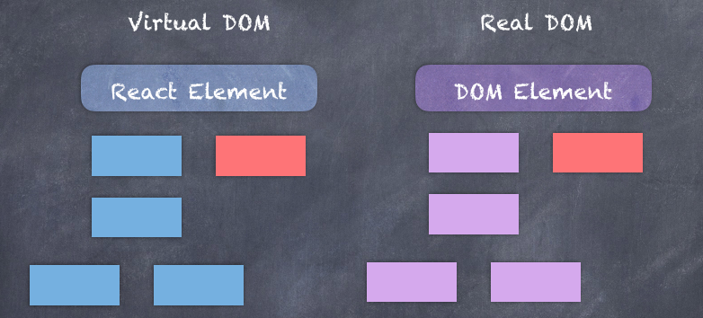
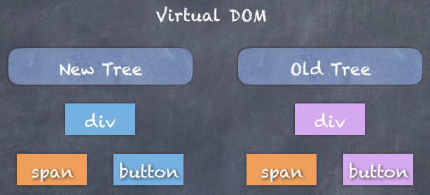
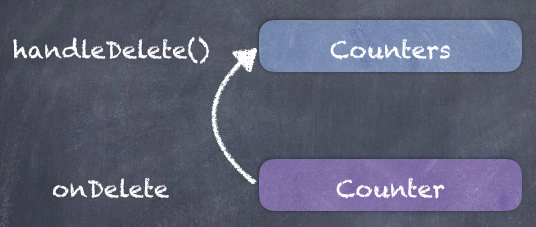
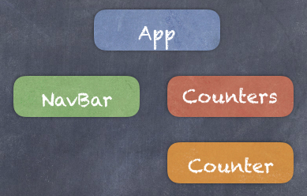
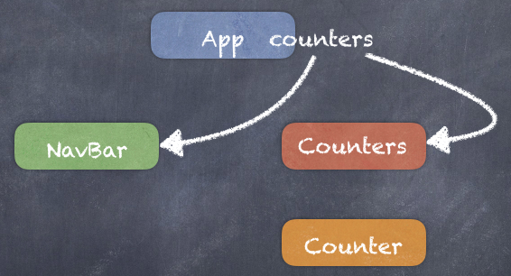

# React 快速入门

## 1. 简介

### 1.1 React是什么

`React` 是一个快速创建可交互用户界面的 `Javascript`库（Library），由 Facebook 在 2011 年推出，是现今最受欢迎的 Javascript 用户界面库之一。

### 1.2 核心概念

React 的核心是`Component`（组件）,组件实际上就是一段用户界面代码。在使用 React 创建程序的时候，我们实际创建的是一组独立的、可重用的组件，然后将它们组合成复杂的用户界面。

每个 React 程序至少有一个组件，也就是根组件。这个组件代表了整个应用程序，可以包含很多子组件。因此，每个 React 程序从结构上来看，实际上就是一个组件树。

例如：类似于京东、淘宝网页是由...等组件组成的，每个组件就是一个小的用户界面，我们可以单独的构建这个组件，然后把它们放在一起来构建更复杂的用户界面。其编写 React 程序的过程就非常类似于搭乐高积木这样的游戏。

从技术实现上，组件是由 Javascript 中的`class`（类）实现的：

```javascript
// class语法实际上属于构造函数的一个战术外皮
function Student(name){
	
	//定义属性
	this.stuName = name;

	//方法
	this.study = function(){};
}

// 使用构造函数来创建Student类型的一个对象
let s1 = new Student("Jack");

class Student {
  
  stuName = null;

	//构造器
	constructor(name){
    stuName = name;
  }

	study(){
    
  }
  
}


class NavBar {
  // 保存组件的属性等状态
  state = {};
	// 根据具体的数据，在浏览器中渲染出相应的组件模样
	// 该方法输出的是具体的 React Element，它对应的就是网页上的 DOM 元素
	render(){ // 渲染 draw
    
  }
}
```



React 在内存中保持着一个轻量级的与 `Real DOM`（真实 DOM）对应的元素的树状结构，即`Virtual DOM`（虚拟 DOM）。

当我们改变一个组件的状态的时候，我们就得到了一个新的 React 元素，React 会拿之前的组件（包含其子组件）与之比较，对比出差异，并更新浏览器中的 DOM 元素，以确保信息保持同步。这种方式相对于我们通过 Javascript 代码直接操作浏览器的 真实DOM 元素更高效。

> 直接通过 Javascript 操作浏览器的真实DOM元素，非常消耗系统内存资源。而 React 框架会通过性能较为高效的算法，来保证在修改页面DOM元素的时候，更快的比对出修改前后的差异，然后作出最小的修改，让信息同步更有效率。这也是为什么这个库（ Liberary ）称为 React（反应）的原因。

与其它框架（ Framework ）相比，例如 `Angular`、`Vue`，这些框架也有类似于组件的概念，但它们提供的是更为完善的前端解决方案，较为庞杂。而`React`只是一个库（ Liberary ），它只关注“显示”部分的内容，即确保视图与数据更高效的同步，不多也不少。

## 2. 环境搭建

安装 `NodeJS`

NodeJS官网：[https://nodejs.org/en/](https://nodejs.org/en/)

我们主要是用 NodeJS 中的`npm`工具来对项目的资源包进行管理，由于 npm 的官方服务器连接速度较慢，需要配置 npm 的淘宝镜像：

```shell
npm config set registry https://registry.npm.taobao.org
```

## 3. 快速上手

### 3.1 项目初始化

`React`开源项目在`Github`中的地址：[https://github.com/facebook/react](https://github.com/facebook/react)

首先使用`npx create-react-app`指令创建一个名为`shopping-cart`的`React`项目

> npx是npm的升级版

```shell
npx create-react-app shopping-cart
```

创建好以后，在`VSCode`中打开这个项目。

> 为了更好的得到代码智能提示，安装`Simple React Snippets`插件。

### 3.2 启动项目

在`VSCode`的命令行中输入：

```shell
npm start
```

- node-modules：第三方的库，比如react、bootstrap
- public：存放html、jpeg等静态资源
- src：源代码

### 3.3 Hello world

找到程序的入口文件`index.js`，注释掉所有代码，编写如下内容：

```jsx
import React from "react";
import ReactDOM from "react-dom";

const element = <h1>Hello world!</h1>;
ReactDOM.render(element, document.getElementById("root"));
```

## 4. Component

### 4.1 创建Counter组件

在项目`src`目录下创建`components`文件夹，在其下创建`counter.jsx`文件。

> jsx属于结合`javascript`和`xml`的一门扩展语言，可以让我们直接在`javascript`中操作`html`元素，在项目使用babel编译以后，会转换成传统浏览器能识别的代码。

```jsx
// imrc
import React, { Component } from "react";

// cc
class Counter extends Component {
	// state = {  }
	render() {
		return <h1>Hello</h1>;
	}
}

export default Counter;
```

在`index.js`中导入并使用这个组件：

```jsx
import Counter from "./components/counter";

import reportWebVitals from "./reportWebVitals";

ReactDOM.render(
	<React.StrictMode>
		<Counter />
	</React.StrictMode>,
	document.getElementById("root")
);
```

### 4.2 子元素

在`counter`组件中继续创建其它按钮：

```jsx
class Counter extends Component {
	// state = {  }
	render() {
		return (
			<div>
				<h1>Hello</h1>
				<button>Increment</button>
			</div>
		);
	}
}
```

在渲染方法中，如果需要创建多个元素，这些元素需要被一个顶层元素（比如`div`）包含起来。

如果不想使用`div`标签的话，可以使用`React.Fragment`标签：

```jsx
class Counter extends Component {
	// state = {  }
	render() {
		return (
			<React.Fragment>
				<h1>Hello</h1>
				<button>Increment</button>
			</React.Fragment>
		);
	}
}
```

### 4.3 state

`state`是`react`组件中一个特殊的属性，它里面可以定义这个组件所需要用到的所有数据

```jsx
class Counter extends Component {
	state = {
		count: 0,
	};
	render() {
		return (
			<React.Fragment>
				<span>{this.state.count}</span>
				<button>Increment</button>
			</React.Fragment>
		);
	}
}
```

`{}`是在`jsx`中用来获取值的一种语法，又称胡子（`mustache`）语法，在其中可以使用任意符合`javascript`语法的变量、表达式或者有返回值的函数：

```jsx
class Counter extends Component {
	state = {
		count: 0,
		// imgUrl: "https://picsum.photos/200",
	};
	render() {
		return (
			<React.Fragment>
				{/*  */}
				<span>{this.formatCount()}</span>
				<button>Increment</button>
			</React.Fragment>
		);
	}
	formatCount() {
		// const count = this.state.count;
		const { count } = this.state;
		return count === 0 ? "Zero" : count;
	}
}
```

### 4.4 安装bootstrap

在`VSCode`的控制台输入如下指令安装`bootstrap`

```shell
npm i bootstrap
```

在`index.js`入口文件中导入样式

```jsx
import "bootstrap/dist/css/bootstrap.css";
```

给标签增加样式

```jsx
<span className="badge bg-primary">{this.formatCount()}</span>
```

### 4.5 动态渲染样式

为了让标签元素在不同条件下，展示效果有所不同，我们可以添加逻辑来动态修改样式，为此，在`Counter`组件中添加如下方法：

```jsx
getBadgeClasses() {
  let classes = "badge m-2 bg-";
  classes += this.state.count === 0 ? "warning" : "primary";
  return classes;
}
```

在标签元素中调用该逻辑来动态设置样式：

```jsx
<span className={this.getBadgeClasses()}>{this.formatCount()}</span>
```

### 4.6 渲染列表

要渲染一个列表出来，首先需要在状态中定义好相关的数据：

```jsx
state = {
  count: 1,
  tags: ["tag1", "tag2", "tag3"],
};
```

然后在`render`方法中编写循环逻辑：

```jsx
return (
  <React.Fragment>
    <span className={this.getBadgeClasses()}>{this.formatCount()}</span>
    <button className="btn btn-secondary btn-sm">Increment</button>
    <ul>
      {this.state.tags.map((tag) => (
        <li>{tag}</li>
      ))}
    </ul>
  </React.Fragment>
);
```

运行以后，我们会在浏览器控制台看到如下警告信息：

```shell
# Warning: Each child in a list should have a unique "key" prop.
```

由于`React`是通过`Virtual DOM`来同步数据的，一旦数据更新，会在前后的`DOM`树之间比对不同，一旦发现有改变，将会定位到相关的节点进行更新，因此，DOM 节点需要一个唯一的标识符用来进行定位。

因此列表项需要进一步修改为：

```jsx
<li key={tag}>{tag}</li>
```

> 这个`key`属性只要保证在列表项这个范围具有唯一性即可，而无需在整个页面上保持唯一。

### 4.7 条件渲染

需求：当`tags`有数据的时候就进行渲染，如果没有，则显示相应提示信息

首先编写条件渲染逻辑，在`Counter`组件中新增方法：

```jsx
renderTags() {
  if (!this.state.tags || this.state.tags.length === 0) return <p>没有tag数据。</p>;
  return (
    <ul>
      {this.state.tags.map((tag) => (
        <li key={tag}>{tag}</li>
      ))}
    </ul>
  );
}
```

然后在render方法中直接进行调用即可：

```jsx
render() {
  return (
    <React.Fragment>
      {/*  */}
      <span className={this.getBadgeClasses()}>{this.formatCount()}</span>
      <button className="btn btn-secondary btn-sm">Increment</button>
      {this.renderTags()}
    </React.Fragment>
  );
}
```

### 4.8 事件处理

所有的`react`元素都有基于`DOM`事件的属性，这些属性都以`on`作为前缀：

```jsx
<button
  onClick={this.handleIncrement}
  className="btn btn-secondary btn-sm"
  >
```

在`Counter`中添加对应的方法：

```jsx
handleIncrement() {
  console.log("...", this.state.count);
}
```

当我们在测试点击事件的时候，会发现，方法虽然被调用了，但是无法获取到`state`中的属性

### 4.9 绑定事件句柄

造成上述结果的原因在于，在`Javascript`中，函数中的`this`指代的是调用该方法的句柄，它取决于你如何调用函数。

- 当我们通过对象的方式来调用方法时，`this`指代的是这个调用方法的对象:

```jsx
obj.method();
```

- 而函数以独立的方式调用，并且开启了`StrictMode`（严格模式），`this`为`undefined`。

我们可以通过绑定`this`来解决这个问题：

```jsx
handleIncrement = () => {
  console.log("...", this.state.count);
};
```

> 箭头函数的特点：它不会重新绑定`this`对象，它们只会继承当前上下文中的`this`，即我们在哪里定义了这个函数，这个函数中的`this`就指向谁。

### 4.10 更新state

在react中，我们不能直接更新状态：

```jsx
handleIncrement = () => {
  this.state.count++;
};
```

当我们通过上述方式修改状态时，会出现`Do not mutate state directly. Use setState()`的提示，该警告的意思希望我们通过`setState`方法来对状态进行修改。

> 直接修改的话，实际上状态已经被修改了，但是`react`并不知道，为了解决这个问题，我们需要通过继承自`Component`的方法`setState`来对状态进行修改，这个方法将会告诉`react`，状态已经刚更新，然后让`react`去同步更新视图，基于这点，浏览器的`真实 DOM`也会根据`Virtual DOM`来进行更新。

```jsx
handleIncrement = () => {
  this.setState({ count: this.state.count + 1 });
};
```

我们传递给方法的参数为一个对象，与状态中同名的键值对将会被覆盖，也即是更新。（不同名的键值对，视作在状态中新增属性）

当我们点击按钮的时候，在`react`内部的具体工作原理：

- 通过事件处理函数调用`setState`方法，这个方法告诉`react`对状态进行更新

- `react`会计划对`render`方法进行一次异步调用，`render`方法会返回一个新的`react`元素。

- 在此时，`Virtual DOM`会有新老两个树状结构，`react`会逐一进行对比，查看并定位哪里进行了修改，在此例中，`span`元素发生了改变，因为`count`这个状态值修改了，所以，最终它会找到`真实DOM`，找到对应的元素，对它进行更新，使之与`Virtual DOM`保持同步。

  

> 除了 span 以外，其它地方都没有发生改变（局部更新），这个效率是非常高的。

### 4.11 传递事件参数

在给事件传递参数的时候，我们再次可以使用箭头函数：

```jsx
<button
  onClick={() => this.handleIncrement(1)}
  className="btn btn-secondary btn-sm"
  >
```

相应的方法为：

```jsx
handleIncrement = (productId) => {
  console.log(productId);
  this.setState({ count: this.state.count + 1 });
};
```

> 练习：
>
> 请使用现有的知识完成此前的`todo`列表案例：
>
> - 展示所有待办事项
> - 点击每一行的删除按钮时，删除对应的这行记录

## 5. 组合Components

每个`react`程序都基本是由组件树组成的，我们可以将组件组合在一起，去构建更复杂的用户 UI 。

### 5.1 创建组合组件

在`components`文件夹中新增组件：

```jsx
import React, { Component } from "react";
import Counter from "./counter";

class Counters extends Component {
	state = {
		counters: [
			{ id: 1, value: 0 },
			{ id: 2, value: 0 },
			{ id: 3, value: 0 },
			{ id: 4, value: 0 },
		],
	};
	render() {
		return (
			<div>
				{this.state.counters.map((counter) => (
					<Counter key={counter.id} />
				))}
			</div>
		);
	}
}

export default Counters;
```

同时，记得将入口文件`index.js`中的`Counter`，修改为`Counters`。

### 5.2 在组合组件之间传递数据

在上述案例中，我们给每一个`Counter`组件设置了一个`key`属性，同理，我们可以给其设置其它属性：

```jsx
<Counter key={counter.id} value={counter.value} selected={true} />
```

然后在`Counter`的`render`方法中增加如下调试语句：

```jsx
console.log(this.props);
```

每个`react`组件都有一个叫`props`的属性，它是一个`Javascript`对象，拥有我们向这个组件传递的所有属性。`key`比较特殊，它不会成为`props`属性的一员，它是`React`自用的。

基于上述机制，`Counter`可以修改为：

```jsx
import React, { Component } from "react";

class Counter extends Component {
	state = {
		value: this.props.value,
	};

	handleIncrement = () => {
		this.setState({ value: this.state.value + 1 });
	};

	render() {
		return (
			<div>
				<span className={this.getBadgeClasses()}>{this.formatCount()}</span>
				<button
					onClick={this.handleIncrement}
					className="btn btn-secondary btn-sm"
				>
					Increment
				</button>
			</div>
		);
	}

	getBadgeClasses() {
		let classes = "badge m-2 bg-";
		classes += this.state.value === 0 ? "warning" : "primary";
		return classes;
	}

	formatCount() {
		const { value } = this.state;
		return value === 0 ? "Zero" : value;
	}
}

export default Counter;
```

### 5.3 props vs state

- `props`就是我们给组件传递的数据，它是组件的输入数据，我们在组件内部不能修改，只能读取。
- `state`是组件局部或者私有的数据容器，其它组件是不能访问这个组件的状态的，它完全只能在组件内部被访问。

### 5.4 发起与处理事件

给`Counter`组件添加删除按钮：

```jsx
<button
  onClick={this.handleDelete}
  className="btn btn-danger btn-sm m-2"
  >
  Delete
</button>
```

新增删除逻辑：

```jsx
handleDelete = () => {};
```

分析问题：

每个组件都有自己的状态，只有自己能编辑自己的状态。因此，当执行删除某一个`Counter`操作的时候，需要删除`Counters`组件`state`中`counters`数组中对应的元素，而这个操作只应当由`Counters`组件自己来完成。

解决办法：

由`Counter`组件发起一个删除事件，然后在`Counters`组件中执行具体的删除逻辑



在`Counters`中新增删除逻辑：

```jsx
	handleDelete = (counterId) => {
		
	};
```

通过`props`传递数据：

```jsx
<Counter
  onDelete={this.handleDelete}
  key={counter.id}
  id={counter.id}
  value={counter.value}
  />
```

在`Counter`中发起删除事件：

```jsx
<button
  onClick={() => this.props.onDelete(this.props.id)}
  className="btn btn-danger btn-sm m-2"
  >
```

> 代码优化：简化传参

```jsx
<Counter
  onDelete={this.handleDelete}
  key={counter.id}
  counter={counter}
  />
```

### 5.5 单一数据来源原则

添加重置按钮

在Counters组件中添加相应的重置按钮：

```jsx
<button
  onClick={this.handleReset}
  className="btn btn-primary btn-sm m-2"
  >
  Reset
</button>
```

相应的重置逻辑：

```jsx
handleReset = () => {
  const counters = this.state.counters.map((c) => {
    c.value = 0;
    return c;
  });
  this.setState({ counters });
};
```

当我们点击重置按钮时，会发现程序没有任何重置效果。

原因：

我们的`Counters`组件有一个`counters`数组，而每一个`Counter`组件都有自己的`value`属性，这个`value`没有与`counters`数组中对应的`counter`对象的`value`保持一致。

```jsx
state = {
  value: this.props.counter.value,
};
```

虽然在`Counter`组件中有这样的逻辑，但是这个逻辑只在实例创建的时候执行一次。可以理解为每个`Counter`子组件维护了一个自己的`state`，而重置事件改变的是父组件的`state`。

解决办法：

我们需要删除子组件`Counter`中的`state`，然后建立唯一的数据源。

### 5.6 受控组件

将`Counter`的`state`删除，只使用props来接收组件所需的数据，这种类型的组件为受控组件。


受控组件没有自己的`state`，它所有的数据都来自`props`，之后，在数据需要修改的时候发起事件，这种组件是完全被其父组件控制的。

Counter

```jsx
import React, { Component } from "react";

class Counter extends Component {
	handleIncrement = () => {
		this.setState({ value: this.state.value + 1 });
	};

	render() {
		return (
			<div>
				<span className={this.getBadgeClasses()}>{this.formatCount()}</span>
				<button
					onClick={() => this.props.onIncrement(this.props.counter)}
					className="btn btn-secondary btn-sm"
				>
					Increment
				</button>
				<button
					onClick={() => this.props.onDelete(this.props.counter.id)}
					className="btn btn-danger btn-sm m-2"
				>
					Delete
				</button>
			</div>
		);
	}

	getBadgeClasses() {
		let classes = "badge m-2 bg-";
		classes += this.props.counter.value === 0 ? "warning" : "primary";
		return classes;
	}

	formatCount() {
		const { value } = this.props.counter;
		return value === 0 ? "Zero" : value;
	}
}

export default Counter;
```

Counters

```jsx
import React, { Component } from "react";
import Counter from "./counter";

class Counters extends Component {
	state = {
		counters: [
			{ id: 1, value: 2 },
			{ id: 2, value: 3 },
			{ id: 3, value: 4 },
			{ id: 4, value: 5 },
		],
	};

	handleIncrement = (counter) => {
		const counters = [...this.state.counters];
		const index = counters.indexOf(counter);
		counters[index] = { ...counter };
		counters[index].value++;
		this.setState({ counters });
	};

	handleDelete = (counterId) => {
		const counters = this.state.counters.filter((c) => c.id !== counterId);
		this.setState({ counters });
	};

	handleReset = () => {
		const counters = this.state.counters.map((c) => {
			c.value = 0;
			return c;
		});
		this.setState({ counters });
	};

	render() {
		return (
			<div>
				<button
					onClick={this.handleReset}
					className="btn btn-primary btn-sm m-2"
				>
					Reset
				</button>
				{this.state.counters.map((counter) => (
					<Counter
						onIncrement={this.handleIncrement}
						onDelete={this.handleDelete}
						key={counter.id}
						counter={counter}
					/>
				))}
			</div>
		);
	}
}

export default Counters;
```

### 5.7 多组件同步技术

为了新增导航条，需要调整组件结构为



NavBar

```jsx
import React, { Component } from "react";

class NavBar extends Component {
	render() {
		return (
			<nav className="navbar navbar-light bg-light">
				<div className="container-fluid">
					<a className="navbar-brand" href="#">
						Navbar
					</a>
				</div>
			</nav>
		);
	}
}

export default NavBar;
```

App

```jsx
import "./App.css";
import React, { Component } from "react";
import NavBar from "./components/navBar";
import Counters from "./components/counters";

class App extends Component {
	state = {};
	render() {
		return (
			<React.Fragment>
				<NavBar />
				<div className="container">
					<Counters />
				</div>
			</React.Fragment>
		);
	}
}

export default App;
```

分析问题：

在`NavBar`中需要统计所有的`counters`信息，但是`counters`目前维护在`Counters`组件中，`Narbar`和`Counters`组件是平级关系，而不是上下父子组件关系，因此无法通过`props`传递数据。

解决办法：

将`counters`属性提升到父组件`App`中，形成如下结构：



App

```jsx
import "./App.css";
import React, { Component } from "react";
import NavBar from "./components/navBar";
import Counters from "./components/counters";

class App extends Component {
	state = {
		counters: [
			{ id: 1, value: 2 },
			{ id: 2, value: 3 },
			{ id: 3, value: 4 },
			{ id: 4, value: 5 },
		],
	};

	handleIncrement = (counter) => {
    //...
	};

	handleDelete = (counterId) => {
		//...
	};

	handleReset = () => {
		//...
	};

	render() {
		return (
			<React.Fragment>
				<NavBar />
				<div className="container">
					<Counters
            counters={this.state.counters}
						onReset={this.handleReset}
						onIncrement={this.handleIncrement}
						onDelete={this.handleDelete}
					/>
				</div>
			</React.Fragment>
		);
	}
}

export default App;

```

Counters

```jsx
import React, { Component } from "react";
import Counter from "./counter";

class Counters extends Component {
	render() {
		return (
			<div>
				<button
					onClick={this.props.onReset}
					className="btn btn-primary btn-sm m-2"
				>
					Reset
				</button>
				{this.props.counters.map((counter) => (
					<Counter
						key={counter.id}
						counter={counter}
						onIncrement={this.props.onIncrement}
						onDelete={this.props.onDelete}
					/>
				))}
			</div>
		);
	}
}

export default Counters;
```

在`App`组件中给`NavBar`传递统计参数：

```jsx
<NavBar
  total={this.state.counters.filter((c) => c.value !== 0).length}
  />
```

在`NavBar`中显示结果：

```jsx
<a className="navbar-brand" href="#">
  Navbar{" "}
  <span className="badge rounded-pill bg-secondary">
    {this.props.total}
  </span>
</a>
```

### 5.8 无状态功能组件

对于`NavBar`这种，没有`state`，没有事件句柄，仅有一个`render`方法，在这种情况下，我们可以将该组件转换为无状态功能组件。

```jsx
import React, { Component } from "react";

const NavBar = (props) => {
	return (
		<nav className="navbar navbar-light bg-light">
			<div className="container-fluid">
				<a className="navbar-brand" href="#">
					Navbar{" "}
					<span className="badge rounded-pill bg-secondary">{props.total}</span>
				</a>
			</div>
		</nav>
	);
};

export default NavBar;
```

> 参数析构：可以利用对象的析构技术，从参数中析构出对应的属性

```jsx
const NavBar = ({ total }) => {
	return (
		<nav className="navbar navbar-light bg-light">
			<div className="container-fluid">
				<a className="navbar-brand" href="#">
					Navbar{" "}
					<span className="badge rounded-pill bg-secondary">{total}</span>
				</a>
			</div>
		</nav>
	);
};
```

### 5.9 减少按钮

Counter

```jsx
render() {
  return (
    <div className="row">
      <div className="col-1">
        <span className={this.getBadgeClasses()}>{this.formatCount()}</span>
      </div>
      <div className="col">
        <button
          onClick={() => this.props.onIncrement(this.props.counter)}
          className="btn btn-secondary btn-sm"
          >
          +
        </button>
        <button
          onClick={() => this.props.onDecrement(this.props.counter)}
          className="btn btn-secondary btn-sm m-2"
          disabled={this.props.counter.value === 0 ? "disabled" : ""}
          >
          -
        </button>
        <button
          onClick={() => this.props.onDelete(this.props.counter.id)}
          className="btn btn-danger btn-sm"
          >
          Delete
        </button>
      </div>
    </div>
  );
}
```

Counters

```jsx
<Counter
  key={counter.id}
  counter={counter}
  onIncrement={this.props.onIncrement}
  onDecrement={this.props.onDecrement}
  onDelete={this.props.onDelete}
  />
```

App

```jsx
handleDecrement = (counter) => {
  const counters = [...this.state.counters];
  const index = counters.indexOf(counter);
  counters[index] = { ...counter };
  counters[index].value--;
  this.setState({ counters });
};
```

```jsx
<Counters
  counters={this.state.counters}
  onReset={this.handleReset}
  onIncrement={this.handleIncrement}
  onDecrement={this.handleDecrement}
  onDelete={this.handleDelete}
  />
```

## 6. 项目工作流

### 6.1 需求分析

确定做什么项目，项目中应该包含哪些模块，每个模块需要实现什么样的`UI`（User Interface，用户界面）和功能。产出《需求说明书》、原型（Axure）

### 6.2 设计阶段

技术选型，CTO

产出《概要设计》《详细设计书》 

### 6.3 编码阶段

初中级工程师会一边写代码实现功能，一边给代码配备相应说明书

### 6.4 测试

### 6.5 交付 & 部署

> 3、4、5是把一个大型的项目切割成很多小阶段、小模块，迭代进行的

在交付期间，产出项目的操作手册，并派出相关人员对甲方用户进行培训。

