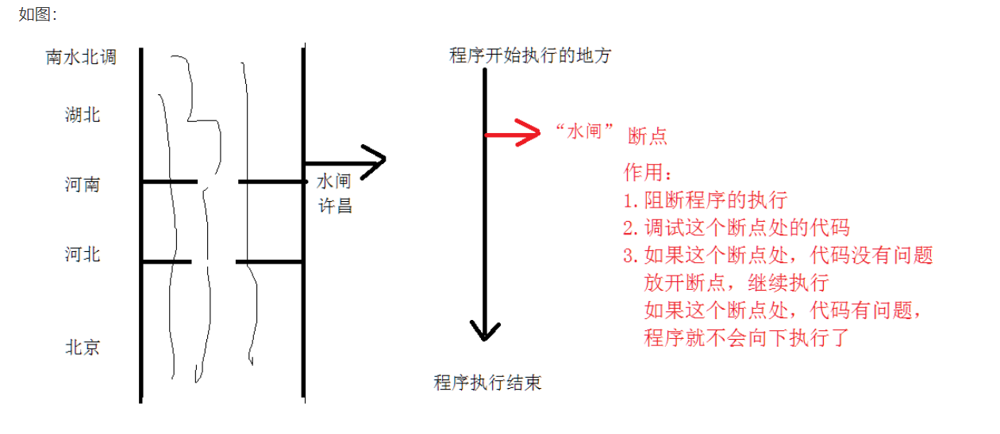
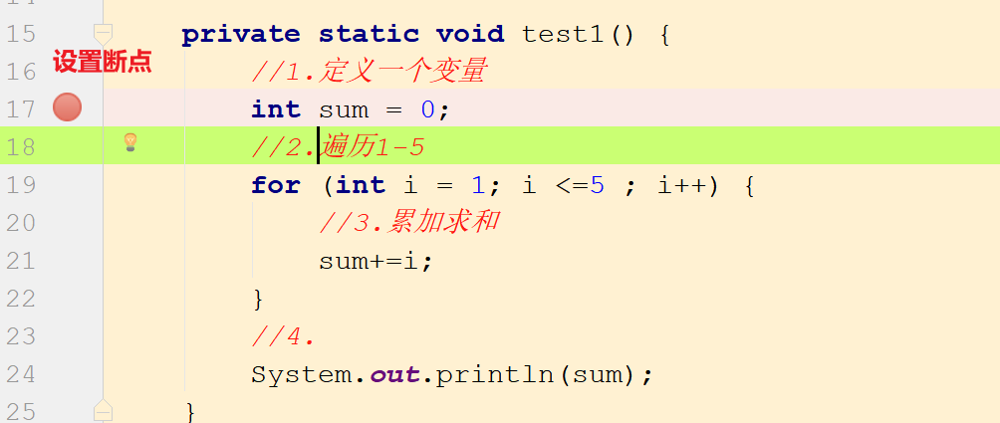
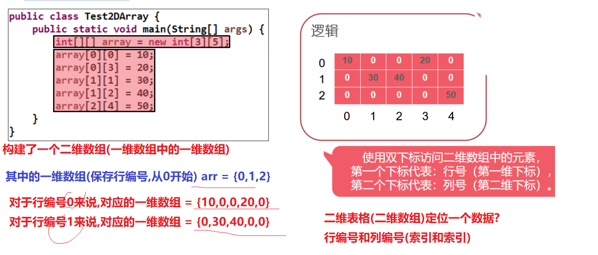
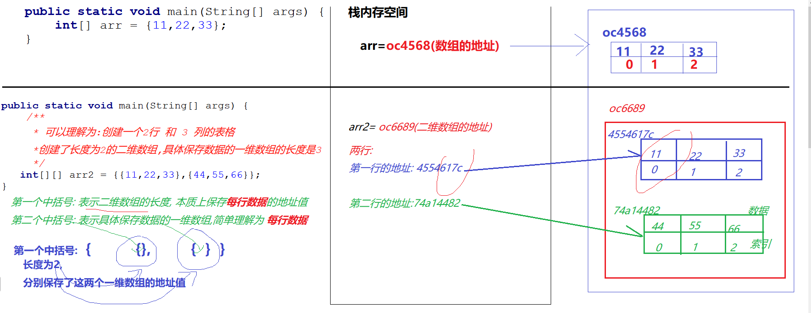

今日内容:

1. DeBug

2. 案例: 一维数组案例

3. Arrays工具类

4. 二维数组

   定义,取值,赋值,索引,二维数组在内存存储情况等

5. 案例: 二维数组案例

   1. 打印每组的学生姓名
   2. 给每组分配学生的编号
   3. 通过组号,来获取对应的组里面的学生姓名

6. 排序算法(正序,倒序): 冒泡排序, 选择排序,插入排序


# 一. DeBug

## 1.1 DeBug概述

​    DEBUG是计算机排除故障的意思。马克2号（Harvard Mark II）编制程序的格蕾丝·霍珀（Grace Hopper）是一位美国海军准将及计算机科学家，同时也是世界最早的一批程序设计师之一。有一天，她在调试设备时出现故障，拆开[继电器](https://baike.baidu.com/item/继电器/728330)后，发现有只[飞蛾](https://baike.baidu.com/item/飞蛾/38074)被夹扁在触点中间，从而“卡”住了机器的运行。于是，霍珀诙谐地把程序故障统称为“臭虫（[BUG](https://baike.baidu.com/item/BUG/3353935)）”，把排除程序故障叫DEBUG，而这奇怪的“称呼”，竟成为后来计算机领域的专业行话。如[DOS](https://baike.baidu.com/item/DOS/32025)系统中的调试程序，程序名称就叫DEBUG。DEBUG在[windows](https://baike.baidu.com/item/windows)系统中也是极其重要的调试作。

总结:

1. Bug: 指的程序中的故障(程序中的异常或者错误)
2. DeBug: 通过调试程序,排除程序中的故障

## 1.2 BreakPoints断点

* DeBug对程序进行调试,在调试时,需要将程序停下来.

* 怎么让程序停下来, 通过设置断点,让程序停下来

* BreakPoints断点概述

  指的阻断程序执行的"收费站,水闸",那么"收费站,水闸"就是所谓的断点.

* 实际生活场景

  

* 总结

  1. 断点: 通过在程序中设置断点, 才能阻断程序的执行

  2. 调试时,如果发现断点附近处的程序出现了故障(清楚了程序的问题所在),后面的程序就不在执行了

     如果断点处程序没有故障,放开断点,让程序继续向下执行,继续调试

## 1.3 常见的菜单按钮(菜单按钮有对应快捷键)说明

如图:


## **1.4 演示Debug**

* 案例一:求1-5之间的和. 断点调试

* 

  

  

## 1.5 小结

* 断点调试前提:  DeBug方式启动程序

* 断点执行流程

  1. 以debug的方式运行程序
  2. 点击箭头向下图标 (按F8或者F7，如果不好用（fn+f8,fn+f7）)
  3. 程序一直一步一步的向下执行
  4. 如果在执行到某一步程序不向下执行了，说明这一步代码有问题
  5. 如果程序最终执行完毕，说明程序一般没有问题。

* 注意

  调试如果发现程序不能继续向下执行了,说明此处的位置,代码出现了bug.


# 二. 案例: 一维数组

## 案例一： 喝酒令(逢七跳过)

需求： 

规则是：从任意一个数字开始报数，当你要报的数字包含7或者是7的倍数时都要说：过。 

为了帮助大家更好的玩这个游戏，这里我们直接在控制台打印出1-100之间的满足逢七必过

规则的数据。 这样，大家将来在玩游戏的时候，就知道哪些数据要说：过

~~~~java
/*
    案例一： 喝酒令(逢七跳过)
    需求:
       说数字1-100, 说出的数字不能包含7或者是7的倍数
    案例二: 去除数组中的重复元素
 */
public class Demo1 {
    public static void main(String[] args) {
        int[] seven = getSeven();
    }
    //1.定义一个方法: 将包含7的数字或者7的倍数的数字判断出来,存到数组里面.
    public static  int[] getSeven(){
        //0.创建一个数组
        int[] arr = new int[100];
        //1.遍历1-100
        for (int i = 1; i <=100 ; i++) {
            //2.遍历的数字里面: 判断包含7或者是7的倍数
            //3.求出个位数字
            int unit = i%10;
            //4.求出十位数字
            int decade = (i/10)%10;
            //5.数字是7的倍数
            boolean flag1 = (unit==7);//个位是7
            boolean flag2 = (decade==7);//十位是7
            boolean flag3= (i%7==0);//是7的位数
            //6.判断数字中包含7或者是7的倍数
            if(flag1 || flag2 || flag3){
                arr[i]=i;
            }
        }


        return arr;
    }
    public  static  void test(){
        int i=17;
        int unit = i%10;
        int decade = (i/10)%10;
        System.out.println("个位数字:"+unit+",十位数字:"+decade);
    }
}

~~~~


## 案例二:         不死神兔

需求：

有一对兔子，从出生后第3个月起每个月都生一对兔子，小兔子长到第三个月后每个月又生一对兔子， 

假如兔子都不死，问第二十个月的兔子对数为多少？注意（小兔子：一公一母）

1月份，  2月份， 3月份,  4月份 ,5月份, 6月份，7月份

1		1            2       3         5           8           13----

~~~~java
/**
 * 案例二: 不死神兔
 * 有一对兔子，从出生后第3个月起每个月都生一对兔子，小兔子长到第三个月后每个月又生一对兔子，
   假如兔子都不死，问第二十个月的兔子对数为多少？注意（小兔子：一公一母）
  1月份，  2月份， 3月份,  4月份 ,5月份, 6月份，7月份
 1		1            2       3         5           8           13----
 */
public class Demo3 {
    public static void main(String[] args) {
        int by = getBy(20);
        System.out.println(by);
    }
    //1.定义方法: 第20个斐波那契数列的数字
    /**
     * @param count:指的第几个位置
     * @return:第count个斐波那契数列的数字
     */
    public static  int getBy(int count){
        //1.定义一个数组,长度为count
        int[] arr = new int[count];
        //2.取出索引为0, 和 1的数字
        arr[0]=1;
        arr[1]=1;
        //3.从索引2的位置开始遍历, 后面的索引位置的数字=(i-1)+(i-2)
        for (int i = 2; i < arr.length; i++) {
            arr[i]=arr[i-1]+arr[i-2];
        }
        return arr[count-1];
    }
}

~~~~


## 案例三：数组元素求和(省略)

需求：

有这样的一个数组，元素是{68,27,95,88,171,996,51,210}。求出该数组中满足要求的元素和， 

要求是：求和的元素个位和十位都不能是7，并且只能是偶数

## 案例四：判断两个数组是否相同

需求：定义一个方法，用于比较两个数组的内容是否相同

思路:

1. 长度相同
2. 同一索引处的数据相同

~~~~java
/**
 * 演示：两个数组是否一样
 * 思路：
        1. 两个数组的长度是否一致，如果不一致：肯定不是相同的数组
        2. 两个数组的元素是否一致，只要有一个不一致：肯定不是相同的数组
    相同的数组：长度一致，数组的所有元素都一样,并且索引值也一样

 */
public class Demo5 {
    public static void main(String[] args) {
        //1.准备两个数组
        int[] arr1 = {1,2,3};
        int[] arr2 = {1,3,2};
        boolean flag = judgeArrIsSame(arr1, arr2);
        System.out.println("数组是否相同："+flag);
    }
    //1.定义一个方法：需要参数（就是传递两个数组），需要返回值（返回值类型：boolean）
    public static  boolean  judgeArrIsSame(int[] arr1,int[] arr2){
       //1.判断两个数组的长度是否一致
        int length1 = arr1.length;//数组1的长度
        int length2 = arr2.length;//数组2的长度
        if(length1 != length2){
            return  false;//不是相同的数组
        }
        //2.判断两个数组中的元素是否一致：
        //在外侧循环： 遍历数组arr1
        for (int i = 0; i < arr1.length; i++) {
             int arr1Element = arr1[i];
             int arr2Element = arr2[i];
             if(arr1Element != arr2Element){
                 return  false;
             }
        }

        //3.说明两个数组相同：
        return true;
    }
}

~~~~


## 案例五：查找元素在数组中出现的索引位置

~~~~java
  //1.定义一个方法：不需要参数（数字是键盘录入的），返回值：录入数字对应的索引值
    public static  int   getIndex(){
        //1.导入包名，创建scaner对象，调用方法，录入数字
        Scanner sc = new Scanner(System.in);
        System.out.print("请录入一个数字：");
        //2.定义一个变量，接收录入的数字
        int number = sc.nextInt();
       //3.遍历数组，判断录入的数字 和 数组中的元素是否一致
        int[] arr ={19, 28, 37, 46, 50};
        //4.定义一个变量，来接收录入数字对应的索引值
        int index= -1;
        for (int i = 0; i < arr.length; i++) {
            int  ele  = arr[i];
            if(ele==number){
                index = i;//匹配到了，将i赋值给index
                break;//结束循环
            }
        }
        return index;
    }
~~~~


## 案例六：评委打分

需求：评委录入6个分数，去掉最高分，去掉最低分，求平均值

实现思路：

1. 定义一个方法：获取录入分数的最高分
2. 定义一个方法：获取录入分数的最低分
3. 定义一个方法：获取录入的6个分数的总和
4. 计算avg =  (总分-最高分-最低分)/4

~~~~java
public class Demo3 {
    public static void main(String[] args) {
        //1.导包，创建scannner，录入6个分数，存到数组里面
        Scanner sc = new Scanner(System.in);
        int[] arr = new int[6];
        for(int i=0;i<6;i++){
            System.out.println("请"+(i+1)+"评委打分：");
            int score = sc.nextInt();//录入的分数：
            arr[i]=score;//将评委打的分数存到数组里面
        }
        //2.依次调用下面的方法
        int avg = getAvg(arr);
        System.out.println("个人综合得分："+avg);
    }
    //4.定义一个求平均值的方法
    public  static  double getAvg(int[] arr){
        //1.调用获取最大分数，最小分数，总和的方法
        int max = getMax(arr);
        int min = getMin(arr);
        int sum = getSum(arr);
        double sum2 = sum;
        double avg = (sum2-max-min)/(arr.length-2);
        return  avg;
    }

    //1.定义一个方法：获取录入分数的最高分
    public static  int getMax(int[] arr){
        //1.定义一个临时变量，接收最大值
        int max= arr[0];
        //2.遍历数组，依次和max比较，如果比max大，需要将值重新赋值给max
        for (int i = 0; i < arr.length; i++) {
             if(arr[i]>=max){
                 max= arr[i];
             }
        }
        return  max;
    }
    //2.定义一个方法：获取录入分数的最低分
    public static  int getMin(int[] arr){
        //1.定义一个临时变量，接收最大值
        int min= arr[0];
        //2.遍历数组，依次和min比较，如果比min小，需要将值重新赋值给min
        for (int i = 0; i < arr.length; i++) {
            if(arr[i]<=min){
                min = arr[i];
            }
        }
        return  min;
    }
    //3.定义一个方法：获取录入分数的总分
    public static  int getSum(int[] arr){
        int sum=0;
        for (int i = 0; i < arr.length; i++) {
            int i1 = arr[i];
            sum+=i1;
        }
        return  sum;
    }
}

~~~~

# 三. Arrays工具类

## 1.1  Arrays工具类概述

- 该类包含用于操作数组的各种方法（如排序和搜索）。 该类还包含一个静态工厂，可以将数组视为列表。 
- 总结
  1. "遍历"数组
  2. 对数组进行排序
  3. 对数组进行比较,判断是否是相同的数组
  4. 将数组转成集合

## 1.2 常用api

* 遍历数组的方法

  ~~~~java
  Arrays类定义的方法:  toString(类型[] 数组名称);// 遍历的数组类型是任意的
  ~~~~

* 对数组进行排序(Arrays底层使用的快速排序算法)

  ~~~~java
  Arrays类定义的方法:
  sort(类型[] 数组名称);// 对数值类型的数组进行排序.
  sort(T[] a, Comparator<? super T> c);//根据对象里面的数值属性进行排序,在排序时指定Comparator(了解)
  ~~~~

* 对数组进行比较,判断是否是相同的数组

  ~~~~java
  Arrays类定义的方法:
  static boolean equals​(int[] a, int[] a2) 
  ~~~~

* 将数组转成集合

  ~~~~java
  static <T> List<T> asList(T... a) ;// a是可变参数,其实就是数组,将数组转成list集合
  ~~~~

  

**1.3 使用**

* 步骤一:  导入包

* 步骤二: 可以直接通过工具类, 来调用方法.

* 注意:

  Arrays工具类里面的方法都是被static修饰的, 特点可以直接通过类名调用,

  也可以通过对象调用(由于构造方法被私有化了,所以不能new).

  ~~~~java
  //源码如下:
  //这块了解即可, 明天讲面向对象详细讲.
  public class Arrays {
       //new 对象的方法, 被private修饰了,说明在类的外部不能使用, 也就是不能new
       private Arrays() {}
      //-----
  }
  ~~~~

  

* ~~~~~java
  public class Demo2 {
      public static void main(String[] args) {
          //1.定义一个数组
          int[] arr ={11,55,22,33};
          int[] arr2 = {55,11,22,33};
          System.out.println(Arrays.equals(arr,arr2));
          //2.数组进行排序
          Arrays.sort(arr);
          //3.遍历
          System.out.println(Arrays.toString(arr));
          //2.数组--->list(今天了解,后面详细讲)
          List<int[]> ints = Arrays.asList(arr);
      }
  }
  ~~~~~

  

# 四.  二维数组

## 1.1 二维数组介绍

 二维数组介绍: 一维数组中的一维数组.

可以把二维数组理解为二维表格(多行多列).

* 

* 案例: 打印班级编号,以及班级里面的组编号

  分析:

  使用二维数组保存数据

  1. 一位数组:保存班级编号,用索引表示

  2. 一位数组: 保存班级的组编号数据

     ~~~~~java
     /**
      * 需求: 遍历班级编号,同时把班级里面对应的组编号打印出来
      * 使用二维数组保存班级编号,和组的编号
      */
     public class Demo3 {
         public static void main(String[] args) {
             //1.创建一个二维数组
             /**
              *  班级编号,使用一维数组保存: {0,1},使用索引表示班级的编号
              * 组编号,使用一维数组保存数据: {1,2,3},{11,22,33}
              */
             int[][] arr = {{1,2,3},{11,22,33}};
             //2.获取数组的长度
             int classCard= arr.length;//2
             //System.out.println(2);
             //3.遍历班级的编号
             for (int i = 0; i <classCard ; i++) {
                 System.out.print("班级编号:"+i+",组编号:");
                 //4.获取班级对应的组编号数据
                 int[] groups = arr[i];
                 //5.遍历组编号数据
                 for (int j = 0; j <groups.length ; j++) {
                     //6.取出组编号
                     int groupCard = groups[j];
                     System.out.print(groupCard+",");
                 }
                 System.out.println();
             }
     
         }
     
         private static void test1() {
             String count1 = "{1,2,3}";
             String count2 = "{11,22,33}";
             String[] arr2 = {count1,count2};
             //遍历班级的编号以及班级对应的组编号
             for (int i = 0; i <arr2.length ; i++) {
                 //1.获取班级的编号
                 int classCard = i;
                 //2.打印班级编号
                 System.out.print("班级编号:"+i+",组编号:");
                 String groupCard = arr2[i];
                 System.out.println(groupCard);
             }
         }
     }
     ~~~~~

     

## 1.2 二维数组创建

* 方式一

  ~~~~java
  类型[][] 数组名称 ;
  数组名称= new [表示的索引][表示具体保存数据的一维数组的长度]
   或者
  类型[][] 数组名称 ;
  数组名称= {{表示具体的数据},{表示具体的数据},{表示具体的数据}};
  ~~~~

* 方式二:

  ~~~~java
  类型[][] 数组名称 = new 类型 [长度1][长度2]
   长度1 表示 另个一维数组的索引
   长度2:表示具体保存数据的一维数组的长度
  比如: 
  int[][] arr  = new int[2][3];
  比如: arr={{11,22,33},{100,200,300}}
  ~~~~

* 方式三:

  ~~~~java
  类型[行][列] 数组名称 = {{具体的数据},{具体的数据},{具体的数据}};
  [行]: 表示另一个一维数组的索引
  [列]: 表示具体保存数据的一维数组的长度
  ~~~~

* 方式四:

  ~~~~java
  类型[][] 数组名称 = new 类型[行][];//创建一个不规则的二维数组.
  ~~~~

* 代码如下

  ```java
  public class Demo4 {
      public static void main(String[] args) {
          //类型[][] 数组名称 ;
          //数组名称= {{表示具体的数据},{表示具体的数据},{表示具体的数据}};
          int[][] arr;
          arr =new int[2][2];
          //创建了一个长度为2的二维数组,那么具体保存数据的一维数组的长度是2
         int[][] arr2 = {{11,22},{33,44}}; 
         arr =arr2;
         //创建二维数组
          // arr3: 表示创建了长度为3的二维数组,具体保存数据的一位数组的长度不确定
          int[][] arr3 = new int[3][];
          //创建了一个 "3行", "每行数据个数不固定"的二维数组
          int[][] arr4 = {{1,1,1},{2,2,3},{6,6,6,7,10,1100}};
          arr3 = arr4;
      }
  }
  ```

## 1.3 二维数据在内存中的存储情况

* 回顾一维数组在内存的存储情况

  

## 1.4. 二维数组的使用

* 二维数组的特点

  1. 第一个中括号,可以理解为行号, 行号从0开始的

  2. 第二个中括号,可以理解为每行里面保存的具体数据, 那么数据对应的索引从0开始

     (注意: 每行的数据对应的索引都是从0开始的)

* 取值

  ~~~~java
  public static void main(String[] args) {
          //1.静态创建一个 2行, 每行 3 个数据的二维数组
          int[][] arr  = {{1,2,3},{4,5,6}};
          //2.取值
          //3. 取 第1行第1列的数据
          int f = arr[0][0];
          System.out.println(f);
          //4. 取 第2行第1列的数据
          int e = arr[1][0];
          System.out.println(e);
      }
  ~~~~

  

* 赋值

  ~~~~java
  public class Demo3 {
      public static void main(String[] args) {
          //1.动态创建长度为3的二维数组,每个一维数组里面保存的数据长度是4
          //2.动态创建一个3 行, 每行保存4个数据的二维表格
          int[][] arr = new int[3][4];
          //3.第1行1列索引处保存数据 100
          arr[0][0]=100;
          //4.第3行第4列索引处保存数据 200
          arr[2][3]=200;
          //5.取出第2行第2列的数据
          int data = arr[1][1];
          System.out.println(data);
          //6.取第3行第4个数据
          System.out.println(arr[2][3]);
      }
  }
  ~~~~

  

* 遍历

  ~~~~java
  public class Demo4 {
      public static void main(String[] args) {
          //1.静态创建一个长度为5,具体保存数据的一位数组的长度为2
          int[][] arr = {
                          {100,1000},// 0
                          {20,200},//1
                          {3,30},//2
                          {4,400},//3
                          {5,500}//4
                        };
          //2.遍历二维数组
          int len = arr.length;
          //3.遍历行
          for (int i = 0; i <len ; i++) {// 0,1,2,3,4
              System.out.print("行号:"+i+",每行的数据:[");
              //4.获取每行的数据
              int[] rowData = arr[i];
              //5.遍历一位数组里面的具体数据
              for (int ele : rowData) {
                  System.out.print(ele+",");
              }
              //6.每行数据遍历结束以后,打印换行
              System.out.print("]"+"\n");
  
  
          }
      }
  }
  ~~~~

  

## 1.5 案例: 组以及组对应 的学生

### 案例一:

打印每组学生的姓名

~~~~java
public class Demo1 {
    public static void main(String[] args) {
        //1.给定一个保存姓名的数组
        String[] names = {"小明","小花","小剑","小燕","熊爱辉","强中手"};
        //2.给定一个二维数组: 表示组号以及组里面人员编号
        int[][] groups={
                       {0,1},//0 ,表示第一组
                       {2,3},//1, 表示第二组
                       {4,5},//2, 表示第三组
                 };
        printName(names,groups);
    }

    //### 案例一:
    //打印每组学生的姓名
    /**
     * @param names: 表示班级里面的具体人员姓名
     * @param arr:
     *           第一个[] : 可以表示具体的组号(索引从0开始,组号+1)
     *           第二个[] : 可以用来保存每组学生的编号
     */
    public static  void printName(String[] names, int[][] arr){
        //1.获取多少组
        int groups = arr.length;
        //2.遍历组号
        for (int i = 0; i <groups ; i++) {
            //3.根据组号,获取每组里面学生的编号(保存姓名数组的索引值)
            int groupCard = i;
            System.out.print("组号:"+(groupCard+1)+",组员:");
            //4.获取每组里面的人员编号
            int[] namesIndex = arr[groupCard];
            //5.遍历学生的编号,获取对应的人员姓名
            for (int studentCard = 0; studentCard < namesIndex.length; studentCard++) {
                //6.可以获取到names数组的索引
                int nameIndex = namesIndex[studentCard];
                String  name = names[nameIndex];
                System.out.print(name+",");
            }
            //7.每组的学生打印结束后,换行
            System.out.println();
        }
    }
}

~~~~


### 案例二: 

**分析案例一存在问题:  如果最后一组人员不够, 代码有异常.**

**解决方案: 根据人名自动分组, 最后一组不管多少人,也分为一组.**

 给定一个学生姓名的数组, 按每组3人, 对学生进行分组

~~~~~java
/**
 *  给定一个学生姓名的数组, 按每组x人, 对学生进行分组,得到一个二维数组
 *  二维数组里面:
 *  1.第一个[] : 保存组号
 *  2.第二个[] : 保存每组人员的编号(从保存人员姓名的数组获取的)
 *    String[] names = {"小明","小花","小剑","小燕","熊爱辉"};
 *    int[][] arr =;
 *    第一个[] : 保存组号,组号的数据 = 人员姓名的个数/每组的人数
 *    第二个[] : 保存每组人员编号,来自于保存姓名数组的索引.
 *   组号:1,人员编号:0,1,
    组号:2,人员编号:2,3,
    组号:3,人员编号:4,5,
    组号:4,人员编号:6,0, 根据组的编号获取人员姓名时, 判断最后一组的人员编号是否0,不获取人员姓名
 */
public class Demo2 {
    public static void main(String[] args) {
        String[] names = {"小明","小花","小剑","小燕","熊爱辉","xxx","aaa"};
        int[][] groupsByNames = getGroupsByNames(names,2);
        for (int i = 0; i <groupsByNames.length ; i++) {
            System.out.print("组号:"+(i+1)+",人员编号:");
            int[] groupsByName = groupsByNames[i];
            for (int nameIndex : groupsByName) {
                System.out.print(nameIndex+",");
            }
            System.out.println();
        }
    }
    /**
     * @param names: 保存人员姓名的数组
     * @param count: 每组有多少人
     * @return: 返回的二维数组: 组号以及每组的人员编号(来自于names数组的索引)
     */
    public  static int[][] getGroupsByNames(String[] names,int count){
        //1.计算有多少组
         //1.1 获取总人数
        int persons = names.length;
        //1.2 计算有多少组 10个人, 每组3人,  9个人, 每组3人
        boolean flag = (persons%count==0);//判断能否整除
        int groups = flag? persons/count: (persons/count)+1;
        //2.创建一个二维数组,保存组号以及组里面的人员编号
        int[][] arr = new int[groups][count];
        //3.遍历组号,设置每组的人员编号
        //4.在外部定义一个计算器,来表示人员的编号
        int counter=0;
        for (int i = 0; i <groups ; i++) {
            //4.获取保存人员编号的数组
            int[] namesCard = arr[i];
            //5.遍历 人员编号数组, 设置 对应的人员编号
            for (int j = 0; j < namesCard.length; j++) {
                if(names.length-1<counter){
                    //处理方案时,如果计数器超出了names最大索引,设置0
                    arr[i][j]=0;
                }else{
                    arr[i][j]=counter;
                }

                counter=++;
            }
        }
        return arr;
    }
}

~~~~~

### 案例三:

给定一个组号,获取每组的人员姓名

~~~~java
/**
 *  给定一个学生姓名的数组, 按每组x人, 对学生进行分组,得到一个二维数组
 *  二维数组里面:
 *  1.第一个[] : 保存组号
 *  2.第二个[] : 保存每组人员的编号(从保存人员姓名的数组获取的)
 *    String[] names = {"小明","小花","小剑","小燕","熊爱辉"};
 *    int[][] arr =;
 *    第一个[] : 保存组号,组号的数据 = 人员姓名的个数/每组的人数
 *    第二个[] : 保存每组人员编号,来自于保存姓名数组的索引.
 *   组号:1,人员编号:0,1,
    组号:2,人员编号:2,3,
    组号:3,人员编号:4,5,
    组号:4,人员编号:6,0, 根据组的编号获取人员姓名时, 判断最后一组的人员编号是否0,不获取人员姓名
 */
public class Demo3 {
    public static void main(String[] args) {
        String[] names = {"小明","小花","小剑","小燕","熊爱辉","xxx","sss"};;
        String[] groupsByNames = getNamesByGroupCard(names, 4);
        System.out.println(Arrays.toString(groupsByNames));

    }
    /**
     *案例三:给定一个组号,获取每组的人员姓名, 人员默认按照每组2人,进行分组
     * @param names: 人名数组
     * @param groupId: 组号
     * @return
     */
    public static  String[] getNamesByGroupCard(String[] names,int groupId){
        //1.调用自动分组方法,获取组号以及组里面的人员编号信息
        int[][] groupsData = getGroupsByNames(names, 2);
        //2.根据组号,获取组对应的人员编号: 组号用索引表示的,所以组号要-1
        int[] namesIndex = groupsData[groupId-1];// 6,0
        //3.遍历人员组号,获取组里面的人员信息,并保存到每组的人名数组里面
        String[] groupNames = new String[namesIndex.length];
        for (int i = 0; i < namesIndex.length ; i++) {
            //4.获取names数组的索引值
            int index = namesIndex[i];
            if(groupId!=1){
                //不是第一组,且学生编号为0,那么不获取学生姓名
                if(index==0){
                  continue;
                }
                //不是第一组,学生编号也不为0,获取学生姓名添加
                groupNames[i]= names[index];
            }else{
                groupNames[i]= names[index];
            }
        }
        return groupNames;
    }
    /**
     * @param names: 保存人员姓名的数组
     * @param count: 每组有多少人
     * @return: 返回的二维数组: 组号以及每组的人员编号(来自于names数组的索引)
     */
    public  static int[][] getGroupsByNames(String[] names,int count){
        //1.计算有多少组
         //1.1 获取总人数
        int persons = names.length;
        //1.2 计算有多少组 10个人, 每组3人,  9个人, 每组3人
        boolean flag = (persons%count==0);//判断能否整除
        int groups = flag? persons/count: (persons/count)+1;
        //2.创建一个二维数组,保存组号以及组里面的人员编号
        int[][] arr = new int[groups][count];
        //3.遍历组号,设置每组的人员编号
        //4.在外部定义一个计算器,来表示人员的编号
        int counter=0;
        for (int i = 0; i <groups ; i++) {
            //4.获取保存人员编号的数组
            int[] namesCard = arr[i];
            //5.遍历 人员编号数组, 设置 对应的人员编号
            for (int j = 0; j < namesCard.length; j++) {
                if(names.length-1<counter){
                    //处理方案时,如果计数器超出了names最大索引,设置0
                    arr[i][j]=0;
                }else{
                    arr[i][j]=counter;
                }
                counter++;
            }
        }
        return arr;
    }
}

~~~~


# 五. 内容总结

* debug(掌握)
* 二维数组(理解,掌握)
* Arrays工具类(掌握)
* 排序算法(明天讲)