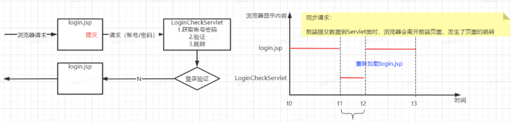
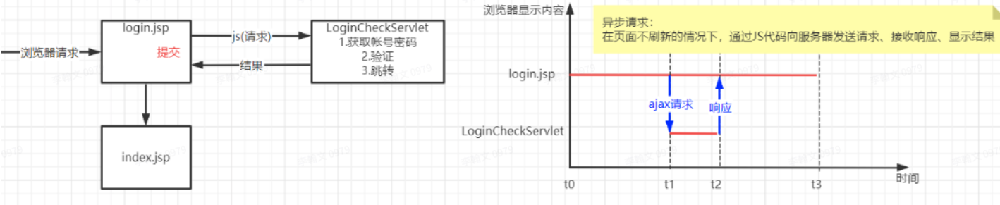

# AJAX&JSON

## AJAX

### 概念

`AJAX`（`Asynchronous JavaScript and XML`）异步`JS`与`XML`，指在网页使用`JavaScript`脚本实现前端与服务器的异步交换技术。再不刷新网页的的前提下实现和服务器 的数据交换。

AJAX不是一种编程语言，而是使用JavaScript代码实现前端和后端异步数据交换的技术。

### 同步与异步

* 同步请求

* 异步请求

### 使用场景

异步交互技术：适用于网页中显示大量数据，同时我们只想对一小部分数据进行更新（大部分数据不更新）的场景。

* 首页登录（系统首页有大量的数据显示，用户登录可以使用异步交互完成，避免首页刷新导致重新加载页面中的所有数据）
* 表单填写中：如省市区联动
* 注册功能中：检测用户名是否已存在

