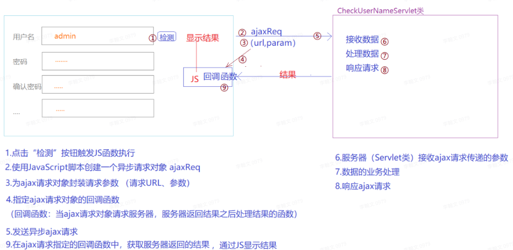

# AJAX&JSON

## AJAX

### 概念

`AJAX`（`Asynchronous JavaScript and XML`）异步`JS`与`XML`，指在网页使用`JavaScript`脚本实现前端与服务器的异步交换技术。再不刷新网页的的前提下实现和服务器 的数据交换。

AJAX不是一种编程语言，而是使用JavaScript代码实现前端和后端异步数据交换的技术。

### 同步与异步

* 同步请求


* 异步请求


### 使用场景

异步交互技术：适用于网页中显示大量数据，同时我们只想对一小部分数据进行更新（大部分数据不更新）的场景。

* 首页登录（系统首页有大量的数据显示，用户登录可以使用异步交互完成，避免首页刷新导致重新加载页面中的所有数据）
* 表单填写中：如省市区联动
* 注册功能中：检测用户名是否已存在

## AJAX实现

### 流程



### 原⽣JS实现ajax

#### 创建AJAX请求对象

##### 判断浏览器

`window.XMLHttpRequest`

##### 创建AJAX对象

* IE7+、FF、O、Safari、Chrome

```js
var ajaxReq = new XMLHttpRuquest();
```

* IE5/IE6

```js
var ajaxReq = new ActiveXObject("Microsoft.XMLHTTP");
```

##### 封装AJAX请求数据

* `open(method,url,asyn)`

1. `method `表示异步请求的请求方式（`GET|POST`）
2. `url `异步请求的目标路径
3. `asyn `是否异步（`true`异步(默认)，`false`同步）

* 封装参数

1. `get `请求，通过`url`传递参数

```js
ajaxReq.open("GET","url?key=value&key2=value2",true);
```

2. post请求，可以通过url传参，也可以通过请求正⽂传参

```js
ajaxReq.open("POST","url?key=value&key2=value2",true);
------------------------------------------------
//在封装请求数据时不设置参数
ajaxReq.open("POST","url",true);
//在发送请求时，使⽤请求正⽂传递参数
ajaxReq.send("key1=value1&key2=value2");
```

##### 指定AJAX回调函数

`ajaxReq`请求对象是有状态的，可以通过`ajaxReq.readyState`获取状态值 

`ajaxReq`请求对象的不同状态值表⽰异步交互的不同阶段

* `ajaxReq.readyState == 0 `表⽰`ajax`请求对象完成创建但并未初始化

* `ajaxReq.readyState == 1 `表⽰`ajax`请求对象完成初始化但未发送请求 
* `ajaxReq.readyState == 2 `表⽰`ajax`请求已经发送并到达服务器 
* `ajaxReq.readyState == 3 `表⽰服务器正在处理`ajax`请求（通信....） 
* `ajaxReq.readyState == 4` 表⽰服务器正处理完成，`ajax`请求对象已经成功获取响应结果

指定回调函数：

```js
//只要ajax请求状态发送变化，就会触发这个回调函数的执⾏
ajaxReq.onreadystatechange = callback;
//回调函数：处理结果
function callback(){
    if(ajaxReq.readyState == 4){
    //获取结果
    }
}
```

##### 发送ajax请求

通过ajax请求对象调⽤send(body) 

如果请求⽅式为GET

```js
ajaxReq.send(null);
```

如果请求⽅式为POST

```js
ajaxReq.send(null);
ajaxReq.send("key1=value1&key2=value2")
```

##### Servlet类响应ajax请求

```java
//3.通过response的输出流、响应ajax请求
response.setCharacterEncoding("utf-8");
PrintWriter out = response.getWriter();
out.println(str);
out.flush();
out.close();
```

##### 在回调函数中获取结果

```js
function callback(){
    //获取服务器响应结果的两个条件：
    //1.异步请求完成 ajaxReq.readyState == 4
    //2.http状态为200 ajaxReq.status == 200
    if(ajaxReq.readyState == 4 && ajaxReq.status == 200){
        //获取结果
        // 如果服务器响应的是⽂本数据（字符串），使⽤responseText属性接收
        var result = ajaxReq.responseText;
        // 如果服务器响应的是XML⽂件，使⽤responseXML属性接收
        // var doc = ajaxReq.responseXML;
        // 将获取的响应结果显⽰到⽹⻚的标签中
        document.getElementById("tipsLabel").innerHTML = result;
    }
}
```


