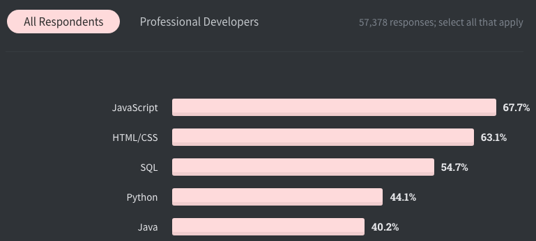
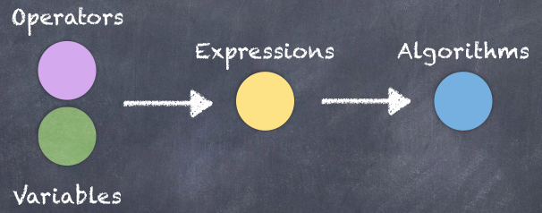

# Javascript 快速入门

## Part1 -- 基础语法

### 1. 简介

> Javascript是什么？

全世界最常见、最受欢迎的开发语言，其增长的速度一直位居前列。

Stackoverflow 2020调查报告：[https://insights.stackoverflow.com/survey/2020#technology](https://insights.stackoverflow.com/survey/2020#technology)



良好的市场环境，意味着较高的薪资水平：

职友网2020 前端岗位薪酬：[https://www.jobui.com/salary/quanguo-qianduankaifagongchengshi/](https://www.jobui.com/salary/quanguo-qianduankaifagongchengshi/)


> Javascript 能做什么？

在早期，主要用来开发基于浏览器的交互应用，但现在已能开发完整的基于PC端、移动端的完整应用，以及实时网络应用（聊天、视频流服务、游戏等）

> Javascript运行在什么地方？

- 浏览器的Javascript引擎，例如Chrome的v8，Firefox的SpiderMonkey
- Node（2009，Ryan基于开源的v8引擎开发的C++程序，可以用作后端服务）

> Javascript由哪些部分组成？

- ECMAScript，描述了该语言的语法和基本对象。
- 文档对象模型（DOM），描述处理网页内容的方法和接口。
- 浏览器对象模型（BOM），描述与浏览器进行交互的方法和接口。

### 2. 环境搭建

Visual Studio Code：[https://code.visualstudio.com/](https://code.visualstudio.com/)

其它的IDE：Sublime Text / Atom / Webstorm / HBuilder

安装Live server扩展（插件）：一个非常轻量级的网站服务器，可以让我们开发的时候，即时看到网站运行效果。

### 3. Helloworld

> 编写和组织Javascript有哪些形式？

- 行内格式
- 分离单独的文件

### 4. 变量和常量

#### 4.1 变量

使用变量可以临时的将数据保存在内存中，我们将数据保存在一处，并给它的内存地址一个名字，将来就可以用这个名字来访问这个数据了。

变量命名规则：

- 不能是保留字
- 变量名须有一定意义
- 可以使用英文字符以及“_”和“$”开头（首字母）
- 不能包含其它特殊字符，如空格和“-”
- 变量名是大小写敏感的

```javascript
// 语法格式：

// 步骤1: 声明
// let 变量名称;

// 步骤2: 初始化
// 变量名称 = 值;

// 简化为：
// let 变量名称 = 值;

let name = 'John';
let age;
age = 20;
let firstName, lastName;// 在一行声明多个变量，变量之间用“,”间隔
let score = 90, birthday = '2021-1-1';
```

> 最佳实践：使用骆驼（驼峰）命名法来定义变量，一行只定义一个变量。

```javascript
// xxxYyyZzz;
let userName, studentId, productDetail;
```

#### 4.2 常量

常量，即是不能修改的“变量”，如果你不需要重新赋值，常量就是最佳选择。

```javascript
const SLOGAN = 'Think About AI';
```

### 5. 数据类型

#### 5.1 原始数据类型

Primitive Types / Value Types，也称为值类型：

string / number / boolean / undefined / null / symbol / bigInt

我们可以通过`typeof`这个操作符，来获取某变量的数据类型

```javascript
let a = 1;
let b = "1";
let c = true;

if (typeof a === "number"){
  console.log("这是一个数字");
}
```


#### 5.2 动态语言

Javascript区别于其它很多语言的特点，就在于它是一门动态语言（Dynamic Language）。

> 静态语言：当一个变量被声明后，它的类型就不能修改了。可称为强类型语言。
>
> 动态语言：变量的类型可以在运行时改变，又称为弱类型语言。

```javascript
let flag = 'hello';
console.log(flag); // string
flag = 10;
console.log(flag); //number
```

#### 5.3 引用类型

引用类型主要有：object、function、array

##### 5.3.1 对象

在 Javascript 里，对象可以被看作是一组属性的集合。

```javascript
// 声明一个空对象
// let obj1 = {};


let stu = {
  // key: value, //键值对
  id : 1,
  name : 'Jack Ma'
};

console.log(stu);
```

获取对象属性的两种方式：

```javascript
stu.name = 'Mary'; // 对象.属性名
// stu[name] = 'Josh'; //把name当作一个变量
stu['name'] = 'Josh'; // 对象[属性名]
```

> 最佳实践：最常用的是直接使用`.`操作符来访问属性，但如果我们不知道要访问哪个属性时（它本身是个变量，看实际具体情况而定），我们可以使用中括号语法来进行访问。

##### 5.3.2 数组

数组，是用来存储和操作一组（多个）元素的容器。

```javascript
// 语法格式：
// let 变量名称 = [元素1, 元素2,... ];

// 定义一个空数组
// let arr1 = [];

let stus = ['张三','李四','王五'];
```

数组可以通过索引（下标）来进行访问特定的某一个元素：

```javascript
console.log(stus[0]);
```

> Tips：数组索引从 0 开始计数

Javascript语言的动态性，在数组上，还可以体现为数组中的元素可以是各种类型，并且，可以动态扩容（改变数组的长度）。而在某些语言中，这是不允许的。

```javascript
stus[2] = 1;// 把第3个元素修改成了一个数字
console.log(stus.length); // 3 length是数组这个对象的一个属性
stus[3] = '新增元素'; // 动态的添加一个新元素（第4个）
console.log(typeof stus); // object
```

##### 5.3.3 函数

function，是一组语句，用来执行某些任务，或者进行一些运算。

```javascript
// 语法格式：
// function 函数名称() {
//		// 语句
//}

//定义无参函数
function greeting(){
  console.log('Hi');
}

greet();
```

`function`是关键字

函数可以通过参数来接受输入：

```javascript
// 定义有参函数
// function 函数名称(参数1, 参数2,...) {}
// 参数就是这个函数专有的变量，只不过作用范围在函数的代码块区域。

function greet(name){
  console.log('Hi ' + name);
}

greet('John');
```

也可以返回运算的结果给调用方：

```javascript
// 定义有返回值的函数
function add(n1, n2){
  return n1 + n2;
}

let res = add(3, 7); // add这个函数的返回值，就会被res这个变量接受到
console.log(res); // console.log(add(3, 7));
```

### 6. 操作符

我们在变量和常量上使用操作符,就能形成表达式( Expressions ),从而实现一定的逻辑或者完成相应的算法.



操作符一共分为以下几种类型:

#### 6.1 算数运算符

```javascript
let x = 5;
let y = 3;
console.log(x + y);
console.log(x - y);
console.log(x * y);
console.log(x / y);
console.log(x % y); // 求模,求余数
console.log(x ** y); // 幂运算
```

自增与自减运算符

```javascript
console.log(++x); // 先自增,然后输出
console.log(x++); // 先输出,然后自增
console.log(x);

console.log(--x); // 先自减,然后输出
console.log(x--); // 先输出,然后自减
console.log(x);
```

#### 6.2 赋值运算符

```javascript
let x = 5;
// x = x + 3;
x += 3;
console.log(x);
```

#### 6.3 比较运算符

```javascript
let x = 1;
console.log(x > 1);
console.log(x >= 1);
console.log(x < 1);
console.log(x <= 1);

//严格比较:类型与值
console.log(x === 1);
console.log(x !== 1);
//松散比较(会出现类型转换,然后再比较值)
console.log(1 == "1");
console.log(true == "1");
```

三元运算符

```javascript
let score = 75;
let result = score >= 60 ? "及格" : "不及格";

// (logic expression)? value1 : value2;
console.log(result);
```

#### 6.4 逻辑运算符

```javascript
console.log(true && true);
console.log(true && false);
//用户积分大于等于90,并且消费金额大于等于500,即可享受折扣
let score = 100;
let amount = 1000;
let canOfferDiscount = score >= 90 && amount >= 500;

console.log(true || true);
console.log(false || true);
//用户积分大于等于90,或者消费金额大于等于500,即可享受折扣
//let canOfferDiscount = score >= 90 || amount >= 500;
console.log(canOfferDiscount);

let canNotOfferDiscount = !canOfferDiscount;
console.log(canNotOfferDiscount);
```

逻辑操作符操作非布尔值

```javascript
console.log(false || true);
console.log(false || 1);
console.log(false || "Jack");

//Falsy(类假值)
//false
//undefined
//null
//0
//''   长度为0的字符串 又称为空字符串
//NaN
function getValue() {
	// some code
	// return 1;
	return null;
}

let value = getValue() || 100;
console.log(value);
```

#### 6.5 位运算符

```javascript
// 8 bit => 1 byte bit位   byte字节 1024byte=1kb 1024kb = 1m
// 1 => 00000001
// 2 => 00000010
// | => 00000011 => 3
// & => 00000000 => 0
console.log(1 | 2);
console.log(1 & 2);

// read write execute
// r			00000100
// rw			00000110
// rwe		00000111

const read = 4;
const write = 2;
const execute = 1;

let my = 0;
//授权
my = my | read | write;
console.log(my);
//判断是否具有某个权限
const res = (my & write)? '可写' : '不可写';
console.log(res);
```

#### 6.6 运算符优先级

所有运算符都具有一定的优先级,除此以外,我们可以通过使用括号,来提升优先级.

```javascript
//let x = 1 + 2 * 3;
let x = (1 + 2) * 3;
console.log(x);
```

#### 6.7 练习

交换2个变量的值

```javascript
let a = 1;
let b = 2;

let c = a;
let a = b;
let b = c;
console.log(a, b);
```

### 7. 流程控制

#### 7.1 if-else vs switch-case

If-else

```javascript
let score = 75;
if (score >= 0 && score < 60) {
	console.log("不及格");
} else if (score >= 60 && score < 70) {
	console.log("及格");
} else if (score >= 70 && score <= 100) {
	console.log("优良");
} else {
	console.log("无效成绩");
}
```

switch-case

```javascript
let grade = "及格";
switch (grade) {
	case "不及格":
		console.log("C");
		break;
	case "及格":
		console.log("B");
		break;
	case "优良":
		console.log("A");
		break;
	default:
		console.log("无效等级");
		break;
}
```

#### 7.2 for

```javascript
for (let i = 0; i < 5; i++) {
	console.log("Hello world", i);
}

for (let i = 0; i <= 5; i++) {
	if (i % 2 !== 0) console.log(i);
}
```

#### 7.3 while vs do-while

while

```javascript
let i = 0;
while (i <= 5) {
	if (i % 2 !== 0) console.log(i);
	i++;
}
```

do-while

```javascript
let i = 0;
do {
	if (i % 2 !== 0) console.log(i);
	i++;
} while (i <= 5);
```

#### 7.4 for-in vs for-of

这两种循环，是在新的 `ES6`中增加的循环语法

for-in

```javascript
const person = {
	id: 1,
	name: "Jack",
};

for (const key in person) {
  // key 依次取到对象中的每一个属性名称
	console.log(key, person[key]);
}

const arr = ["a", "b", "c"];
for (const index in arr) {
  // index 会取到数组中的每一个索引，从0
	console.log(index, arr[index]);
}
```

for-of

```javascript
const arr = ["a", "b", "c"];
for (const item of arr) {
	console.log(item);
}
```

#### 7.5 break and continue

```javascript
let i = 0;
while (i <= 10) {
	// if (i === 5) break;
	if (i % 2 === 0) {
		i++;
		continue;
	}
	console.log(i);
	i++;
}
```

#### 7.6 练习

> 求最大值

输入两个数字，返回其中较大的一个数字

> fizzBuzz

输入一个数字，当其可以被 3 整除时，输出 fizz ，当其可以被 5 整除时，输出 buzz ，当其可以同时被 3 和 5 整除时，输出 fizzBuzz ，当其不是一个数字时，输出“不是一个数字”，其他情况直接输出传入的数字

> 超速罚分

假定公路限速 60 公里/小时，每超速 5 公里，记 1 分，驾照总分 12 分。输入一个速度，当没有扣分时，直接输出 OK ，当扣分时（且分数还没扣完），显示相应的扣分分数，如果 12 分扣完，显示“吊销驾照”。

> 奇数偶数

输入一个数字，显示 0 ～ ?这个数字之间所有的奇偶数情况

> 求和

输入一个数字，返回 0 ～ 这个数字之间所有能被 3 或 5 整除的数字之和

> 成绩统计

以数组方式传入学生各科成绩，根据学生的平均分,根据平均分来判定等级，输出学生成绩等级：0 ～ 60 C / 60 ～ 80 B / 80 ～ 100 A

> 输出星号

输入一个数字，输出一个基于该数字的等腰三角形

> 求素数

输入一个数字，输出 0 ～ 这个数字之间所有的素数

### 8. Object

#### 8.1 基本特点：

- 对象是键值对的集合
- 对象的各个属性高度关联
- 键值对的值可以为任意类型，可以是字符串、数字、布尔值，甚至是对象和函数

```javascript
const rect = {
	width: 100,
	height: 80,
	location: { x: 0, y: 0 },
  isVisible: true,
	draw: function () {
		console.log("draw");
	},
};
```


这种以对象的方式对数据进行封装和操作的方式，我们称为 `OOP` （ Object-oriented Programming ）。以对象的方式传递和处理数据会变得非常方便，它是目前非常主流的一种编程风格或者编程范式。

> 在Javascript中，对象的属性，还具有动态特性：对象在创建以后，可以动态的进行添加或者删除操作。

```javascript
rect.move = function () {
	console.log("move");
};

delete rect.isVisible;

console.log(rect);
```


#### 8.2 创建对象的方式

以 JSON 格式创建对象的语法非常简洁明了，但最大的弊端在于，创建多个同类对象的时候，对象的方法会出现重复定义的情况，这对于维护来讲，是非常不合理的，一旦需要修改的话，会需要对多处代码进行调整。

创建对象的方式，除开上述最基本的形式（ JSON ）以外，还有如下几种。

##### 8.2.1 工厂函数

```javascript
function createRect(width, height) {
	return {
		width,
		height,
		draw() {
			console.log("draw");
		},
	};
}

const r1 = createRect(100, 80);
const r2 = createRect(200, 100);
```

工厂函数，实际上也是使用 `{}`的语法来创建对象的，只不过通过 `函数` 这种形式，进行了代码逻辑的重用。

##### 8.2.2 构造函数

```javascript
function Rect(width, height) {
	this.width = width;
	this.height = height;
	this.draw = function () {
		console.log("draw");
	};
}

const r1 = new Rect(100, 80);
```


> new关键字的作用

- 创建一个新的空对象
- 将 `this` 指向这个空对象
- 最后将创建并初始化好的对象返回给调用者（ 即上例中 `r1` 这个常量 ）

> constructor属性

在 Javascript 中的对象，都具有一个 constructor 属性，它指向创建该对象的构造函数。使用 JSON 格式创建对象时（ 工厂函数 实际上也是间接使用了 JSON 来创建对象），它指向 Object 的构造函数。

以后，我们在程序中，可能会要求对各种对象进行类型检测，以便于后续针对不同类型的对象，让程序逻辑作出不同反应。可以通过如下的方式来检查类型：

```javascript
if ( obj instanceof Rect ) {
  // 亲子鉴定为真
}
```


#### 8.3 Object vs Function

每一个 Javascript 函数都是一个对象，具有属性和方法（ name 、length 参数的个数 ），同时它也是一个 `Function` 对象

```javascript
function Rect(width, height) {
	this.width = width;
	this.height = height;
	this.move = function () {
		console.log("move");
	};
}

const Rectangle = new Function(
	"width",
	"height",
	`
  this.width = width;
  this.height = height;
  this.move = function () {
    console.log('move');
  };
`
);

const r = new Rectangle(100, 80);
console.log(r);
r.move();
```

函数的方法

```javascript
const r1 = {};
Rect.call(r, 100, 80);
const r2 = {};
Rect.apply(r2, [100, 80]);

console.log(r1, r2);
```

`call` 和 `apply` 方法，和我们直接使用 `new` 关键字创建对象能起到相同的执行效果。

#### 8.4 Value vs Reference Types

- Value Types / Primitive Types（ 值类型 / 原始数据类型 / 基本数据类型 ）：
  - String / Number / Boolean / undefined / null / Symbol
- Reference Types（ 引用类型 ）：
  - Object / Function / Array

```javascript
let a = 10;
let b = a;

a = 20;
console.log(a, b);

//////////////////////////
let a = { value: 10 };
let b = a;

a.value = 20;
console.log(a, b);
```

> 两种数据类型在操作的时候，最大的区别在于：值类型的变量，存储的是数据的值，而引用类型存储的是对象的引用，也即是内存中的地址。

```javascript
let num = 10;

function change(num) {
	num++;
}

change(num);
console.log(num);
//////////////////////////
let obj = { value: 10 };

function change(obj) {
	obj.value++;
}

change(obj);
console.log(obj);
```

#### 8.5 对象的遍历

我们可以使用 `for-in` 来迭代对象的所有属性

```javascript
let person = {
	userName: "Jack",
	study() {
		console.log("study");
	},
};

for (const key in person) {
	console.log(key, person[key]);
}
```

也可以使用 `for-of` 

```javascript
for (const key of Object.keys(person)) {
	console.log(key, person[key]);
}

for (const entry of Object.entries(person)) {
	console.log(entry);
}
```

还可以使用 in 操作符来检查一个对象中是否存在某个属性

```javascript
if ("userName" in person) console.log("yes");
```

> 练习1

```javascript
// 1、使用JSON的方式来创建论坛的帖子这个对象(编号、标题、内容、日期)

// 2、使用工厂函数的方式来创建商品对象（编号、名称、价格）

// 3、使用2定义的函数创建出若干个商品对象,求这些商品的平均价格是多少。

// 4、用构造函数的方式来定义学生对象（编号、姓名、介绍-方法）

// 5、声明一个init函数，在函数中用for循环的方式来调用4中定义的构造函数，创建若干个学生，统一放到一个数组中（return 给调用方）

// 6、调用5定义的init方法，得到这个学生数组，然后再使用for循环，依次调用这个学生数组中，每一个学生的“介绍”方法。
```

> 练习2

```javascript
// 1. 定义一个有重复元素（数字类型的元素）的数组 arr ，编写一个函数去除掉重复元素
// 思路：把原先数组中的每一个元素，依次放到一个新数组中，在放进去之前，使用循环的方式来检查，这个新放入的元素与现在新数组中现有的元素是否“===”
// 2. 定义一个数组（数字类型的元素），编写一个函数，找到这个数组中最大的元素。
// 3. 使用三种创建对象的方式定义一个“圆”对象（r-半径，pi-3.14，calculateArea-计算圆面积的方法，calcRound-计算周长）
// 4. 百度“冒泡排序”，给定一个数组（元素都是数字），声明一个函数，对这个数组进行排序（小到大）

// 5. 已知学生对象格式如下:
// const stu = { id:xx , name:xx , gender: '男',score: [70,80,90]}
// score为成绩数组，分别为语数外三科成绩
// 编写一个名为find的函数，该函数接受一个学生数组，数组中的元素为学生类型，通过函数逻辑筛选出合乎以下条件的学生，封装成一个新数组返回给函数调用方
// 筛选条件：性别为男性，且平均成绩大于等于60分
```


#### 8.6 对象的克隆

> 为什么要使用对象的克隆？

```javascript
const obj1 = { id: 1, name: "a" };
// 这一次赋值，会导致两个变量的引用（内存地址）会指向内存中的同一个对象
const copy = obj1;

// 自身/对方做一个修改
// obj1.name = "b";
copy.gender = "female";

console.log(obj1);
```

结论：通过赋值进行的“克隆”，只要有一方对数据进行了修改，那么另一方也会收到影响。这不是我们要求的效果。（因为真正意义上的克隆，它们两者只是数据的值相等，但始终是互相独立的）

基于 `for-in`

```javascript
const copy = {};
for (const key in person) copy[key] = person[key];
```

基于 `Object.assign()` 方法

```javascript
const copy = Object.assign({}, person);
```

基于拆分操作符（ 展开操作符 ）

```javascript
const copy = { ...person };
```

#### 8.7 内置对象

MDN：[https://developer.mozilla.org/zh-CN/docs/Web/JavaScript](https://developer.mozilla.org/zh-CN/docs/Web/JavaScript)

##### 8.7.1 Math

```javascript
// Math.abs(-1); //1
// Math.ceil(1.1); //2 天花板值
// Math.floor(1.9); //1 地板值

// console.log(Math.max(2, 1, 7, -9));
// console.log(Math.min(2, 1, 7, -9));

// console.log(Math.round(1.5)); //四舍五入

// console.log(Math.random()); 0 ～ 1 之间的随机数（不包含1）

// 如果要返回 0～n（大于等于0，小于n）的随机整数
// max为整数
function getRandomInt(max) {
	return Math.floor(Math.random() * max);
}

// 返回 min ～ max（大于等于min，小于max） 的随机整数
// min和max都为整数
function getRandomInt(min, max) {
  return Math.floor(Math.random() * (max - min)) + min; //不含最大值，含最小值
}
```

其他常用方法：max / min / round ...

##### 8.7.2 String

> 转义字符

除了普通的可打印字符以外，一些有特殊功能的字符可以通过转义字符的形式放入字符串中

| Code                     | Output              |
| :----------------------- | :------------------ |
| `\0`                     | 空字符              |
| `\'`                     | 单引号              |
| `\"`                     | 双引号              |
| `\\`                     | 反斜杠              |
| `\n`                     | 换行                |
| `\r`                     | 回车                |
| `\v`                     | 垂直制表符          |
| `\t`                     | 水平制表符          |
| `\b`                     | 退格                |
| `\f`                     | 换页                |
| `\uXXXX`                 | unicode 码          |
| `\u{X}` ... `\u{XXXXXX}` | unicode codepoint   |
| `\xXX`                   | Latin-1 字符(x小写) |

> 模版字面量语法

模版字面量语法，允许在字符串中插入特殊字符（包含换行符）和字符串插值（ 占位符 ）。

```javascript
const msg = `Hello
world`;

const name = 'Jack';
const greet = `Hi,${name}`;

//同时，该插入值也可以是表达式
const a = 1;
const b = 2;
const res = `The result is ${a + b}`;
```

常用属性：length

常用方法：includes / startsWith / endWith / indexOf / replace / substring / trim

```javascript
const s1 = "helxxxlo";
// 在目标字符串s1中查找有无 x 这个字符串
console.log(s1.includes("x"));

// 从索引为2的位置开始查找
console.log(s1.includes("h", 2));

// 以...开始 
console.log(s1.startsWith("he"));
// 以...结束
console.log(s1.endsWith("lo"));


//返回第一次出现目标字符串的索引
console.log(s1.indexOf("l", 3));

//只替换找到的第一个，后续的忽略了
// const rep = s1.replace("x","y");
const rep = s1.replace(/x/gi, "y");
console.log(s1); //原始字符串不会改变
console.log(rep);

const s1 = "hello";
// 从s1截取 索引为1～末尾这个区间的字符串
// const s2 = s1.substring(1);
// 从s1截取 索引为1～3这个区间的字符串（不包含3这个索引位置的字符）
const s2 = s1.substring(1, 3);
console.log(s2);

//去掉左右两边的空格
const s2 = s1.trim();

//根据指定的符号切割字符串，变成一个数组
const s0 = "湖南 长沙 岳麓区";
const arr = s0.split(" ");
console.log(arr);

const s3 = "abcdefg";
console.log(s3.split(""));
```


练习

```javascript
const s = "abcdefghijklmnopqrstuvwxyzABCDEFGHIJKLMNOPQRSTUVWXYZ"
//1. 从上述字符串中随机挑选一个字符打印
//2. 从上述字符串中每次随机挑选3个字符拼成一个字符串打印
//3. 编写一个 createRandomString(n){} 的函数，随机产生一个长度为n的字符串 
```


##### 8.7.3 Date

```javascript
//new Date();
//new Date(value);
//new Date(dateString); // dataString 是符合ISO规范的一个日期字符串表现形式
//new Date(year, monthIndex [, day [, hours [, minutes [, seconds [, milliseconds]]]]]);

const now = new Date();
const date1 = new Date('December 17, 1995 03:24:00');
const date2 = new Date(2021, 0, 20);

// console.log(new Date()); // 默认获取现在这个时间

// console.log(new Date("May 13, 2021 21:24:00"));

// 1970-01-01 凌晨0点开始计数 到现在所经历的毫秒数
// let ms = new Date().getTime();

// const a = 24 * 60 * 60 * 1000;

// console.log(new Date(ms + a));

const d1 = new Date(2021, 5, 1, 23, 30, 0);
const d2 = new Date(2021, 5, 7, 23, 30, 0);

console.log(d2 - d1); //得到两者之间间隔的毫秒数，自行转换成天数、小时分钟等等。

//年月日
console.log(d2.getFullYear(), d2.getMonth(), d2.getDate());
// console.log(new Date().getDay());
//时分秒
console.log(d2.getHours(), d2.getMinutes(), d2.getSeconds());

//setter & getter
```

> Javascript中还有一个内置对象：arguments

```javascript
function test() {
	console.log(arguments); // 输出了一个长度为3的数组
}

test(1, 2, 3);
```

- 在 `Javascript` 中，引擎并不在意函数是否声明了参数，它的内部都可以通过内置对象 `arguments` 来接收
- `arguments`是一个数组，可以直接通过下标来访问某一个参数
- 因此，在表述上，我们把函数的参数都称之为“形参”，真正给参数传递的值叫“实参”

我们可以通过 `arguments`这个数组的长度来决定具体执行什么逻辑。

#### 8.8 练习

```javascript
// 1.创建两个对象，分别定义两个函数检查并比较它们是否相等（ 每个属性值是否都相等 / 地址相等 ）
// 2.为论坛帖子封装一个对象，使用构造函数来进行创建
// 3.定义一个函数，计算两个日期之间的间隔
// function between(d1, d2, flag){}
// between(d1, d2, 'd'); // y-年份 M-月份 d-天数 h-小时 m-分钟 s-秒数
```

### 9. 数组

Array 是用来存储和操作多个元素的容器

在程序中，我们对于数据的操作，从动作上来划分无非就是 `CRUD`（增删改查，create / research / update / delete）

#### 9.1 添加

```javascript
const arr = [1, 2];

//尾部
arr.push(3, 4);
console.log(arr);

//其实位置
arr.unshift(5, 6);
console.log(arr);

//中间位置
arr.splice(2, 0, "x");
console.log(arr);
//参数1:插入新元素的索引位置
//参数2:不删除元素，所以填写0
//参数3:要插入的元素，要插入的元素可以为多个，用逗号间隔
arr1.splice(2, 0, "x", "y", "z");
```

#### 9.2 查找

查找值类型元素

```javascript
const arr = [1, 2, 3, 1, 4];

console.log(arr.indexOf(1));
console.log(arr.indexOf("x"));

console.log(arr.lastIndexOf(1));

console.log(arr.includes(1));

console.log(arr.indexOf(1, 2));
```


查找引用类型元素

```javascript
const stuList = [
	{ id: 1, name: "a" },
	{ id: 2, name: "b" },
	{ id: 3, name: "c" },
];

//由于引用的地址不同，所以返回false
console.log(stuList.includes({ id: 2, name: "b" }));

//find方法，会依次（遍历）针对数组中的每一个元素，调用参数中的这个匿名函数
//一旦这个匿名函数返回true，就认为找到了
//此时，就会把这个符合条件的元素作为结果返回给调用方，并且中断循环
const student = stuList.find(function (stu) {
	return stu.name === "b";
});

console.log(student);


// function find(arr, fn) {
// 	let target = null;
// 	for (const item of arr) {
// 		if (fn(item)) {
// 			//fn这个函数返回true，证明找到了符合条件的元素
// 			target = item;
// 			break;
// 		}
// 		// return item;
// 	}
// 	return target;
// }

// const res = find(arr, function (item) {
// 	return item.name === "b";
// });

// console.log(res);

```

练习

```javascript
// 1. 编写一个function createRandomArray(num,max){} 返回一个随机的数组，里面都是数字
// num：表示创建的这个数组的长度
// max：表示数组中的元素范围在 0～max之间

// 2. 编写一个function findNum(min,max){}
// 在题目1创建的随机数组中，查找范围在min～max之间的元素，作为新数组返回

// createRandomArray(6,10)
// 例如 调用1这个函数（传参数6,10）得到这样一个随机数组： [0, 2, 7, 6, 3, 9]
// 例如 调用2这个函数（3,7）得到 [6, 3]
```


> Arrow function

在 ES6 中，当把一个函数作为参数传递给另一个函数时，可以使用箭头函数的语法。

```javascript
const student = stuList.find((stu) => stu.name === "b");
```

#### 9.3 移除

```javascript
const arr = [1, 2, 3, 4, 5];

const last = arr.pop();//删除末尾的元素
const first = arr.shift();//删除头部的元素
const mid = arr.splice(2, 1);// 从索引为2的这个地方开始（包含起点位置），删除1个元素
console.log(mid);
console.log(arr);
```


清空

```javascript
let arr = [1, 2, 3, 4, 5];
let copy = arr;

//方法1
arr = [];
//方法2
arr.length = 0;

console.log(arr);
console.log(copy);
```

#### 9.4 组合

```javascript
const arr1 = [1, 2];
const arr2 = [3, 4];

const arr = arr1.concat(arr2); // [1,2,3,4]
const slice = arr.slice(1, 3); // 切片
console.log(arr);
console.log(slice);
```


> Spread operator

在 ES6 中，可以使用展开操作符，让组合变得更简洁

```javascript
let arr = [...arr1, ...arr2];
arr = [...arr1, 'x', ...arr2];

//克隆
const copy = [...arr1];
```

#### 9.5 数组的迭代

```javascript
for (const item of arr) console.log(item);

arr.forEach((item, index) => console.log(index, item));
```

#### 9.6 连接与分割

```javascript
const arr = [1, 2, 3, 4];

const join = arr.join(","); //把数组中的元素用参数连接起来拼成一个字符串返回
console.log(join);

const date = "2021-03-20";
const items = date.split("-");
console.log(items);
```

#### 9.7 排序

值类型数组

```javascript
const arr = [4, 1, 3, 2];

arr.sort();
console.log(arr);
arr.reverse();
console.log(arr);
```

引用类型数组

```javascript
const arr = [
	{ id: 1, name: "Jack" },
	{ id: 2, name: "Rose" },
	{ id: 3, name: "Mike" },
];

arr.sort((a, b) => {// 比较 ascii码 的值
	if (a.name < b.name) return -1;
	if (a.name > b.name) return 1;
	return 0;
});
console.log(arr);
```

字符排序请参照

ASCII Table：[https://www.cs.cmu.edu/~pattis/15-1XX/common/handouts/ascii.html](https://www.cs.cmu.edu/~pattis/15-1XX/common/handouts/ascii.html)

#### 9.8 every与some

ES6 新增的数组方法

every：检测每个元素是否符合条件，即只要有一个不符合条件，即返回false（不会再往下检测元素），否则返回true。

some：检测是否至少有一个元素符合条件，即只要有一个符合条件，即返回true（不会再往下检测元素），否则返回false。

```javascript
const arr = [1, 2, 3];
const res = arr.every((value) => value >= 0);
console.log(res);
```

#### 9.9 筛选

```javascript
const res = arr.filter((value) => value >= 0);
console.log(res);
```

#### 9.10 数组映射

```javascript
const items = arr.map((item) => `<li>${item}</li>`);
console.log(items);
```

> 链式调用

filter 和 map都是以新数组的方式返回结果的，我们可以使用链式调用进行逻辑的组合使用

```javascript
const items = arr
	.filter((value) => value >= 2)
	.map((item) => `<li>${item}</li>`);
```

#### 9.11 reduce

```javascript
const arr = [1, 2, 3];
//第一次 total-0，item-1
//第二次 total-1，item-2
//第三次 total-3，item-3
const sum = arr.reduce((total, current) => total + current, 0);
//第一次 total-1 item-2
//第二次 total-3 item-3
const sum = arr.reduce((total, current) => total + current);
console.log(sum);
```

#### 9.12 练习

```javascript
//编写一个函数，接受min、max两个参数，产生元素为min～max之间的数字的一个数组（包含边界）

//编写一个函数，实现数组的includes功能

//从一个数组中剔除某一个元素或某一组元素

//编写一个函数，实现把arr数组中index处的元素偏移offset，其中arr、index、offset为参数
// [a,b,c,d,e]
// index 1 offset 2
// [a,c,d,b,e]
// function xxx(arr,index,offset){}

//统计一个数组中某元素出现的次数

//求一个数组中的最大值

//定制一个商品对象数组，筛选出价格大于某值，并根据价格降序排序，最后输出满足条件的商品名称
```


### 10. 函数

#### 10.1 函数声明与函数表达式

函数声明

```javascript
function walk() {
	console.log("walk");
}
```

函数表达式

```javascript
let run = function () {
	console.log("run");
};

let temp = run;
temp();
```

这种写法的特点：*以赋值表达式的写法来声明函数，最大的特点在与，能让我们意识到*函数本身也是一个 value （引用类型的值）

> Hoisting

函数声明与函数表达式在效果上是大体一致的，但是最大的区别，就在与函数声明中，函数可以在声明之前进行调用。原因就在于 Javascript 引擎在编译阶段会把函数声明提前到代码顶端，这就是 Hoisting 机制，也称为变量提升。

#### 10.2 arguments

Javascript 中的函数在执行时，是不关注参数的，也即我们在调用函数的时候，可以弹性的传递参数，但是根据函数的定义会有各种意想不到的结果，这也是 Javascript 语法灵活的一个体现方式。

同时，我们在函数内部，可以通过 `arguments` 这个内置变量来访问参数列表

```javascript
function sum(a, b) {
  console.log(arguments);
	return a + b;
}

console.log(sum(1));
console.log(sum(1, 2));
console.log(sum(1, 2, 3));
```

`arguments` 是一个可以迭代的对象，因此我们可以使用 for-of 来进行操作

```javascript
function sum() {
	let total = 0;
	for (const item of arguments) total += item;
	return total;
}

console.log(sum(1, 2, 3));
```

#### 10.3 剩余参数

剩余参数语法允许我们将一个不定数量的参数表示为一个数组

```javascript
function sum(...args) {
	return args.reduce((a, b) => a + b);
}

console.log(sum(1, 2, 3));
```

> 需要注意，剩余参数只能使用在最后一个参数上

```javascript
function sum(discount, ...args) {
	return args.reduce((a, b) => a + b) * (1 - discount);
}

console.log(sum(0.1, 1, 2, 3));
```

#### 10.4 默认参数

```javascript
function total(price, discount = 0.1, count = 1) {
	return price * (1 - discount) * count;
}

console.log(total(1000));
```

> 最佳实践：一旦给某一个参数设置默认值，则其后的参数也要设置。

#### 10.5 Getter & Setter

```javascript
const person = { // JSON
	firstName: "Michael",
	lastName: "Jordan",
	fullName() {
		return `${this.firstName} ${this.lastName}`;
	},
};

console.log(person.fullName());
```

在上述这个案例中，fullName 是作为一个方法进行调用的，并且不能反向设置属性的值。

在 ES6 中，我们可以通过定义 Getter 来获取属性值，通过 Setter 来设置属性值。

```javascript
const person = {
	firstName: "Michael",
	lastName: "Jordan",
	get fullName() {
		return `${this.firstName} ${this.lastName}`;
	},
	set fullName(value) {
		const arr = value.split(" ");
		this.firstName = arr[0];
		this.lastName = arr[1];
	},
};

person.fullName = "Jack Ma";
console.log(person.fullName);
console.log(person);
```

#### 10.6 try-catch

使用 try-catch 来对异常进行捕获

```javascript
const person = {
	firstName: "Michael",
	lastName: "Jordan",
	get fullName() {
		return `${this.firstName} ${this.lastName}`;
	},
	set fullName(value) {
		if (typeof value !== "string") throw new Error("非法参数");
		const arr = value.split(" ");
		if (arr.length !== 2) throw new Error("信息不完整");
		this.firstName = arr[0];
		this.lastName = arr[1];
	},
};

try {
	person.fullName = null;
} catch (e) {
	console.error(e);
}
```

#### 10.7 作用域

使用 `let`、`const` 定义变量和常量时，这个值的作用域就是定义它的代码块。`function`、`if` 和 `for` 等形成的语句块也是同理。

```javascript
{
  const msg = "Hello";
}
console.log(msg);
```

> 就近原则

当变量出现同名的时候，取最近的作用域定义的变量值。

> let vs var

`var` 最大的特点就在于它只能被 `function` 所形成的语句块限定作用域，`ES6` 以后不再推荐使用，建议使用 `let` 和 `const`。

#### 10.8 this

## Part2 -- OOP

### 1. 简介

> What is OOP?

> 4个核心概念

Encapsulation

Abstraction

Inheritance

Polymorphism

> 课程结构

### 2. Object

### 3. Prototype

### 4. Prototypical Inheritance

### 5. ES6 Class

### 6. Module

### 7.

## Part3 -- BOM & DOM

