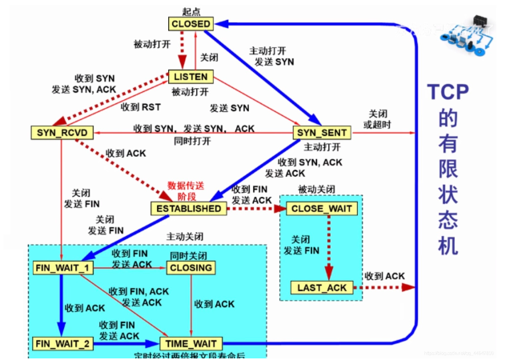
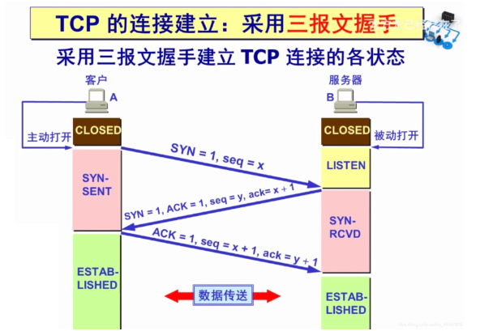
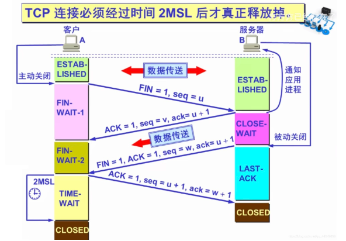

# Java基础

## 1、final关键字的作用

* 修饰的类不可被继承、修饰的方法不可被重写、修饰的变量不可被修改。
* 修饰引用类型，引用地址不可变，其指向的内容可以改变。
* 修饰的方法，`JVM`会将其内联，提高运行效率。
* 修饰的常量，在编译阶段会存入常量池。

## 2、abstract class 和interface的区别

* 抽象类（`abstract class`）
  * 声明方法存在而不实现的类（用于创建体现某些基本行为的类，声明该方法，却不类中实现该方法的类）。
  * 不能创建`abstract`类实例对象；可以创建一个抽象类型的变量，让其指向具体子类的实例对象。
  * 没有抽象构造方法和静态方法。
  * `Abstract`类的子类必须实现其父类声明的抽象方法，否则子类也必须声明为抽象方法。
* 接口（`interface`）
  * 抽象类的变体（抽象到极致的类）。
  * 接口中的所有方法都是抽象的（没有程序体），多继承可以通过接口实现。
  * 接口中只能定义`static final`的成员变量。
  * 接口的实现与子类相似，除了该实现类不能从接口定义中继承行为。
  * 当类实现特殊接口时，该类定义所有这种接口的方法。然后，该类可以在实现该接口的类的任何对象上调用接口的方法。有抽象类，该类允许使用接口作为引用变量的类型。通常动态连篇生效。引用可以转换到接口类型或从接口类型转换。
  * `instanceof`运算符可以判断某对象的类是否实现了接口。

## 3、Java集合类：list、set、queue、map、stack的特点与用法

* Map
  * 以键值对方式保存数据，`Key`键唯一不重复，一个键对应一个值，值可以重复。
  * `TreeMap`有序，`HashMap`无序
  * `Map`中的`Key`和 `Value`可以单独取出，`KeySet()`方法可以将所有的`keys`抽取成`Set`对象，`Values()`方法可以将所有的`value`抽取成一个集合。
* Set
  * 没有重复的元素，最多只能包含一个`null`元素，遍历方法有`Iterator`（单向）、`ListIterator`（双向）。`Set` 中没有同步方。
* List
  * 元素可以重复，可以在任意位置增删元素，遍历方法有`Iterator`（单向）、`ListIterator`（双向）。
* Queue
  * 遵从先进先出原则，使用时尽量不使用`add()`和`remove()`方法，使用`offer()`添加元素和`pull()`移除元素，好处时可以通过返回值来判断是否成功。`LinkedList`实现了`Queue`接口，`Queue`不允许添加`null`元素。
* Stack
  * 遵从先进后出原则，`Stack`继承自`Vector`，可以通过五个操作对类`Vector`进行扩展，可以将向量作为栈堆，常用的操作`push()`、`pop()`、`peek()` 取堆栈顶点，`empty()` 判断堆栈是否为空。

> 用法
>
> * 涉及堆栈、队列，可以使用`List`。
> * 快速插入和删除元素，可以使用`LinkedList`。
> * 快速随机访问元素，可以使用`ArrayList`

## 4、OOP三个基本特征

三个基本特征：封装、继承、多态

* 继承

  发生在子类与父类之间，子类通过继承获得父类的对象属性和方法。
  
* 封装

  将不想暴露的属性或实现封装起来，通过提供的接口或方法进行访问。通过封装，对象对内部数据提供了不同级别的保护，以防止篡改或错误使用对象私有部分。

* 多态

  同一个方法有不同的表现形式。多态存在的三个条件：继承、重写、父类引用指向子类对象。

## 5、访问修饰符以及不写诗的区别

* `public`当前项目下的所有类都可以访问
* `protected`当前包下的类和所有子类都可以访问（`protected`对于子类相当于时公开的，对于不同包没有父子类关系的类相当于私有的）
* `default`当前包下的所有类都可以访问（当没有写访问访问修饰符时默认时`default`，默认对同一包的其他类时公开的，不同包的其他类时私有的）
* `private `只能被当前类访问。

`Java`中，外部类只能是`public`或`default`，类的成员（包括内部类）的修饰符可以是四种修饰符的任意一种。

## 6、Integer

* 执行`Integer `a= 128，相当于`Integer a = Integer.valueOf(128)`，该过程称为自动装箱（基本类型自动装换为包装类的过程）。

* 在 Integer 中引⼊了 `IntegerCache `来缓存⼀定范围的值，`IntegerCache `默认情况下范围 为：`-128~127`。这个缓存范围时可以修改的，通过`JVM`启动参数： -`XX:AutoBoxCacheMax=<size> `来修改上限值.

## 7、最有效计算2乘以8

* 2 << 3。(左移 相当于乘以2的⼏次幂， n << m 相当于n乘2的m次幂)

* 进阶：通常情况下，可以认为位运算是性能最高的。

## 8、&和&&的区别

* `&&`：逻辑与运算符。当运算符左右两边的表达式都为 `true`，才返回 true。`同时`具有短路性，如果第 ⼀个表达式为 `false`，则直接返回 `false`。

* `&`：逻辑与运算符、按位与运算符。⽤于⼆进制的计算，只有对应的两个⼆进位均为`1`时，结果位才为`1 `，否则为`0`。

* 逻辑与运算符：`& `在⽤于逻辑与时，和 `&&` 的区别是不具有短路性。所在通常使⽤逻辑与运算符都会 使⽤ `&&`，⽽ `&` 更多的适⽤于位运算。

## 9、Java基本数据类型、String类型

* 8个：`byte、short、int、long、float、double、char、boolean`。
* `String`类不是基本数据类型，而且使用final修饰，不能被继承。
* 除了基本类型（primitive type），剩下的都是引用类型（reference type）。
* 基本数据类型：数据直接存储在栈上。
* 引用数据类型：数据存储在堆上，引用地址存储在栈上。

## 10、String和StringBuilder、StringBuffer的区别

* `String`：值被创建后就不能修改，任何对`String`的修改都会引发新的String对象生成。
* `StringBuilder`：值可以被修改，没有使⽤ `synchronized`，具有更⾼的性能，推荐优先使⽤（`StringBuffer`的非线性安全版）。
* `StringBuffer`：线程是安全的，值可以被修改，使⽤ `synchronized `来保证线程安全。

## 11、String s = "xyz" 和 String s = new String("xyz") 区别

* 两个语句都会先去字符串常量池中检查是否已经存在 “`xyz`”，如果有则直接使⽤，如果没有则会在常量池中创建 “`xyz`” 对象。
* `String s = new String("xyz") `还会通过 `new String() `在堆⾥创建⼀个内容与 "`xyz`" 相同的对象实例。
* 前者其实理解为被后者的所包含。

## 12、==和equals的区别

* `==`：运算符，用于比较基础类型变量和引用类型变量。
  * 基础类型变量：比较的的保存的值是否相同，类型不一定要相同。
  * 引用类型变量：比较的是两个对象的地址是否相同。
* `equals`：`Object `类中定义的⽅法，通常⽤于⽐较两个对象的值是否相等。
  * `equals `在 `Object `⽅法中其实等同于`==`，但是在实际的使⽤中，`equals `通常被重写⽤于⽐较两个对 象的值是否相同。

## 13、hashCode()和equals()的关系

当` a.equals(b) == true` 时，则 `a.hashCode() == b.hashCode()` 必然成⽴，反过来，当 `a.hashCode() == b.hashCode()` 时，`a.equals(b)` 不⼀定为` true`。

## 14、反射

* 反射：指运行状态中，任意一个类都能知道这个类的所有属性和方法；并且任意一个类都能调用它的任意一个方法；这种动态获取信息和调用对象方法的功能称为反射机制。

* 反射的四个核心类：

  * `java.lang.Class.java`：类对象
  * `java.lang.reflect.Constructor.java`：类的构造器对象； 
  * `java.lang.reflect.Method.java`：类的⽅法对象； 
  * `java.lang.reflect.Field.java`：类的属性对象；

* 反射作用

  * 操作因访问权限限制的属性和⽅法； 
  * 实现⾃定义注解；
  *  动态加载第三⽅jar包；
  * 按需加载类，节省编译和初始化`APK`的时间；

* 反射工作原理

  当一个`Java`项目编写完成之后，每个`java`文件都会被编译成`.class`文件，这些`Class`对象承载了这个类的所有信息，包括父类、接口、方法、属性等，这些`class`文件在程序运行的时候会被`ClassLoader`加载到虚拟机里面。当一个类被加载后，`Java`虚拟机会在内存中自动生产一个`Class`对象。我们通过`new`创建对象实际上是通过这些`Class`来创建。

反射的工作原理就是借助`Class.java`、`Constructor.java`、`Method.java`、`Field.java`这四个类，在程序运行的时动态访问和修改任何类的行为和状态。

## 15、深拷贝和浅拷贝的区别

* 两种数据类型
  * 基本数据类型：数据直接存储在栈里面。
  * 引用数据类型：数据存储在堆中，引用地址存储在栈中。
* 浅拷贝
  * 基础数据类型：直接复制数据值。
  * 引用数据类型：只是复制了对象的引用地址，新旧对象指向同一个地址（共用同一个内存），修改其中一个对象的值，另外一个也跟着改变。

* 深拷贝
  * 基础数据类型：直接复制数据值。
  * 引用数据类型：创建一个新的内存空间，里面复制相同的对象，新旧对象不共享内存，修改其中一个对象的值，不会影响另外一个。


> 深拷贝比浅拷贝的速度慢并且花销较大。

## 16、并发与并行的区别

* 并发：两个或多个事件在同一个时间间隔发生。
* 并行：两个或多个事件在同一时刻发生。

**并行**实际上是，同一时刻做多件事情；**并发**在同一时刻只会做一件事情，只是将时间切碎，交替做多件事情。

**并行**在多个处理器中存在，**并发**可以在单处理器和多处理器中都存在，**并发**能够在单处理器系统中存在是因为**并发**是**并⾏**的假象，**并⾏**要求程序能够同时执⾏多个操作，⽽**并发**只是要求程序假装同时执⾏多个操作（每个⼩时间⽚执⾏⼀个操作，多个操作快速切换执⾏）。

当系统有⼀个以上 `CPU `时，则线程的操作有可能⾮并发。当⼀个 `CPU `执⾏⼀个线程时，另⼀个 `CPU `可以执⾏另⼀个线程，两个线程互不抢占 `CPU `资源，可以同时进⾏，这种⽅式我们称之为并⾏ （`Parallel`）。 

**并发编程**的⽬标是充分的利⽤处理器的每⼀个核，以达到最⾼的处理性能。

## 17、值传递和引用传递

* 值传递：当⼀个对象被当作参数传递到⼀个⽅法后，此⽅法可改变这个对象的属性，并可返回变化后的结果。（**值传递传递的是真实内容的一个副本，对副本的操作不影响原内容，也就是形参怎么变化，不会影响实参对应的内容**）
* 引用传递：”引用”也就是指向真实内容的地址值，在方法调用时，实参的地址通过方法调用被传递给相应的形参，在方法体内，形参和实参指向同一块内存地址，对形参的操作会影响的真实内容。

> Java 中只有值传递，对于对象参数，值的内容是对象的引⽤。
>
> **如果是对基本数据类型的数据进行操作，由于原始内容和副本都是存储实际值，并且是在不同的栈区，因此形参的操作，不影响原始内容。**
>
> **如果是对引用类型的数据进行操作，分两种情况，一种是形参和实参保持指向同一个对象地址，则形参的操作，会影响实参指向的对象的内容。一种是形参被改动指向新的对象地址（如重新赋值引用），则形参的操作，不会影响实参指向的对象的内容。**

## 18、重载（Overload）和重写（Override）的区别

方法的重载和重写都是实现多态的方式，区别是重载实现的是编译时多态，重写实现的是运行时多态。

* 重载：一个类里面可以多个同名的方法，但其参数列表不同（类型不同、个数不同，顺序不同）
* 重写：发生在子类与父类之间，子类对父类的方法进行重写，参数不变，返回值类型可以的不同，但必须是父类返回值的派生类。（即方法和参数不变，逻辑重写）

重写的好处：子类可以根据需要，定义自己的行为。

> 注意：
>
> Constructor（构造器）不能被重写（override），但可以被重载（overload），所以一个类中可以有多个构造函数。
>
> ⽅法的返回值只是作为⽅法运⾏之后的⼀个“状态”，但是并不是所有调⽤都关注返回值，所以不能 将返回值作为重载的唯⼀区分条件。

## 19、Java 成员变量与静态变量的区别

* 成员变量存在于堆内存中；静态变量存在于方法区中
* 成员变量与对象共存亡，随对象创建而存在，随对象被回收而释放；静态变量与类共存亡，随类加载而存在，随类被消失而消失。
* 成员变量所属于对象，称为实例变量；静态变量所属于类，称为类变量。
* 成员变量只能被对象调用；静态变量可以被对象调用，也可以被类调用。

## 20、是否可以从⼀个静态（static）⽅法内部发出对⾮静态（non-static）⽅法的调⽤

两种情况，发出调用时是否显示创建了对象实例 。

* 没有显示创建对象实例：不可以发起调用，非静态方法只能被对象所调用，静态方法可以通过对象调用，也可以通过类名调用，所以静态方法被调用时，可能没有创建任何对象实例。因此通过静态⽅法内部发出对⾮静态⽅法的调⽤，此时可能⽆法知道⾮静态⽅法属于哪个对象。
* 显⽰创建对象实例：可以发起调⽤，在静态⽅法中显⽰的创建对象实例，则可以正常的调⽤。

## 21、初始化

* 静态变量只会初始化（执⾏）⼀次。 
* 当有⽗类时，完整的初始化顺序为：⽗类静态变量（静态代码块）->⼦类静态变量（静态代码 块）->⽗类⾮静态变量（⾮静态代码块）->⽗类构造器 ->⼦类⾮静态变量（⾮静态代码块）->⼦类构 造器 。

## 22、抽象类(abstract class)与接口(interface)的区别

* 抽象类只能单继承；接口可以多实现。
* 抽象类可以有构造方法；接口不能有构造方法。
* 抽象类可以有成员变量；接口没有成员变量，只有常量（默认就是 `public static final`）。
* 抽象类中可以包含⾮抽象的⽅法，在 Java 7 之前接⼝中的所有⽅法都是抽象的，在 Java 8 之 后，接⼝⽀持⾮抽象⽅法：default ⽅法、静态⽅法等。Java 9 ⽀持私有⽅法、私有静态⽅法。
* 抽象类中的抽象⽅法类型可以是任意修饰符，Java 8 之前接⼝中的⽅法只能是 public 类型，Java 9 ⽀持 private 类型。

设计思想的区别

* 接口是自上而下的抽象的过程，接口规范了某些行为，是对某一行为的抽象。需要某个行为时，就去实现某个接口，具体怎么实现，取决于自己。
* 抽象类是自下而上的抽象过程，抽象类提供了通用实现，是对某一事物的抽象。在写实现类时，发现某些实现类都具有几乎相同的实现，因此将这些相同的实现抽取出来成为抽象类，然后有一些差异点，可以通过提供抽象方法来支持自定义实现。

> 网上有个说法
>
> 普通类像亲爹，他有什么都是你的。
>
> 抽象类像叔伯，有一部分会给你，还能指导你做事的方法。
>
> 接口像干爹，可以给你指引方法，但是做成什么样的自己努力。

## 23、final关键字的用法

* 修饰类：不能作为父类被继承。一个类不能同时被声明为`abstract`和`final`。
* 修饰方法：不能被子类重写。
* 修饰变量：该变量在声明时必须给定初值，而且以后只能读取，不能修改。若变量是对象，则引用地址不可改，但对象的属性可以修改。

## 24、final、finally、finalize的区别

它们三是完全不想关的，只是有点像

* `final`如上。
* `finally`：是对Java异常处理机制的最佳补充，通常搭配try、catch使用，用于存放那些无论是否出现异常都会执行的代码 。在实际使用中，通常用来释放锁、数据库连接等资源，把资源 释放方法放到`finally`中，可以大程度上降低程序出错率。
* `finalize`：`Object`中的方法，在垃圾收集器将对象从内存中清除出去之前做必要的清理工作。但该方法仅作了解，在`Java9`中该方法已经被弃用，并添加新的`java.lang.ref.Cleaner`，提供了更加灵活有效的方法来释放资源。

## 25、try、catch、finally的使用

`try`、`catch`、`finally `的基础⽤法，在 `return `前会先执⾏ `finally `语句 块，所以是先输出 `finally `⾥的结果，再输出`try`或`catch`里面的`return`。(finally ⾥⾯使⽤ return 仅存在于⾯试题中，实际开发中千万不要这么⽤。)

## 26、Error和Exception的区别

都是`Throwable`的子类，用于表示程序出现不正常的情况。

区别：

* `Error`：表示系统级错误和程序出现不必处理的异常，是恢复不是不可能，但很难情况下的一种严重问题，如内存溢出，不可能指望程序能自己解决。
* `Exception`：表示需要捕捉或需要程序进行处理的异常，是一种设计或实现的问题，表示如果程序运行正常，从不会发生的情况。

## 27、JDK 1.8 后的新特性

* #### 接口默认方法

  `Java8` 允许给借口添加一个非抽象的方法实现，只需要使用`default`关键字修饰即可。

  从 J`ava8`开始，引⼊了接⼝默认⽅法，这样的好处也是很明显的，**⾸先解决了 `Java8 `以前版本接⼝兼容性问题**，同时对于我们以后的程序开发，也**可以在接⼝⼦类中直接使⽤接⼝默认⽅法**，⽽不再需要 在各个⼦类中各⾃实现响应接⼝⽅法。

  ```java
  public interface IMathOperation {
      /**
      * 定义接⼝默认⽅法 ⽀持⽅法形参
      */
      default void print(){
      	System.out.println("这是数值运算基本接⼝。。。");
      }
      /**
      * 定义静态默认⽅法
      */
      static void version(){
      	System.out.println("这是1.0版简易计算器");
      }
  }
  ```

  ```java
  public class MathOperationImpl implements IMathOperation {
      @Override
      public int add(int a, int b) {
          // ⼦类中可以直接调⽤⽗类接⼝默认⽅法
          IMathOperation.super.print();
          // 调⽤⽗类静态默认⽅法
          IMathOperation.version();
          return a+b;
      }
  }
  
  ```

* #### Lambda 表达式和函数式接口

  `Lambda `表达式本质上是一段匿名内部类，也可以是一段传递代码。`Lambda `允许把函数作为⼀个⽅法的参数（函数作为参数传递到⽅法中），使⽤ `Lambda `表达式使代码更加简洁，但是也不要滥⽤，否则会有可读性等问题，《Effective Java》作者 Josh Bloch 建议使⽤ `Lambda `表达式最好不要超过3⾏。

  匿名内部类

  ```java
  @Test
  public void test1(){
      Comparator<Integer> com = new Comparator<Integer>() {
          @Override
          public int compare(Integer o1, Integer o2) {
          	return Integer.compare(o1, o2);
          }
      };
      TreeSet<Integer> treeSet = new TreeSet<>(com);
  }
  ```

  `Lambda `表达式

  ~~~java
  Comparator<Integer> com = (x, y) -> Integer.compare(x, y);
  ~~~

  函数式接口

  `Lambda`表达式需要函数式接口的支持。

  函数式接口：只包含一个抽象方法的接口，称为函数是接口。（可以通过 `Lambda `表达式来创建该接⼝的对 象。（若 `Lambda`表达式抛出⼀个受检异常，那么该异常需要在⽬标接⼝的抽象⽅法上进⾏声明）。 可以在任意函数式接⼝上使⽤ `@FunctionalInterface` 注解，这样做可以检查它是否是⼀个函数式接 ⼝，同时 `javadoc` 也会包含⼀条声明，说明这个接⼝是⼀个函数式接⼝。）

  ~~~java
  @FunctionalInterface
  public interface MyFunc <T> {
  	public T getValue(T t);
  }
  public String handlerString(MyFunc<String> myFunc, String str){
  	return myFunc.getValue(str);
  }
  ~~~

  ~~~java
  @Test
  public void test6(){
  	String str = handlerString((s) -> s.toUpperCase(), "binghe");
  	System.out.println(str);//输出结果BINGHE
  }
  ~~~

* #### Stream API

  ⽤函数式编程⽅式在集合类上进⾏复杂操作的⼯具，配合`Lambda`表达式可以⽅便 的对集合进⾏处理。`Java8 `中处理集合的关键抽象概念，它可以指定你希望对集合进⾏的操作，可以 执⾏⾮常复杂的查找、过滤和映射数据等操作。使⽤`Stream API `对集合数据进⾏操作，就类似于使 ⽤ `SQL `执⾏的数据库查询。也可以使⽤ `Stream API `来并⾏执⾏操作。简⽽⾔之，`Stream API `提供了 ⼀种⾼效且易于使⽤的处理数据的⽅式。

  ~~~java
  List<Teacher> teacherList = new ArrayList<>();
  teacherList.add(new Teacher("张磊",22,"zl"));
  teacherList.add(new Teacher("李鹏",36,"lp"));
  teacherList.add(new Teacher("刘敏",50,"lm"));
  teacherList.add(new Teacher("宋亚楠",62,"syn"));
  teacherList.add(new Teacher("彩彬",18,"cb"));
  //filter 过滤
  List<Teacher> list = teacherList.stream().filter(x -> x.getAge() > 30).collect(Collectors.toList());
  //joining拼接 所有⽼师姓名拼接成字符串
  String nameJoin = teacherList.stream().map(Teacher::getName).collect(Collectors.joining(","));
  //排序
  List sortList = teacherList.stream().sorted(Comparator.comparing(Teacher::getAge).reversed()).collect(Collectors.toList());
  System.out.println(nameJoin);
  System.out.println(list);
  System.out.println("按年龄降序: "+sortList);
  ~~~

  ~~~java
  输出结果
  [Teacher(name=李鹏, age=36, nikeName=lp), Teacher(name=刘敏, age=50,nikeName=lm), Teacher(name=宋亚楠, age=62, nikeName=syn)]
  张磊,李鹏,刘敏,宋亚楠,彩彬
  按年龄降序: [Teacher(name=宋亚楠, age=62, nikeName=syn), Teacher(name=刘敏,age=50, nikeName=lm), Teacher(name=李鹏, age=36,nikeName=lp), Teacher(name=张磊, age=22, nikeName=zl), Teacher(name=彩彬, age=18, nikeName=cb)]
  ~~~

* #### 方法引用

  ⽅法引⽤提供了⾮常有⽤的语法，可以直接引⽤已有Java类或对象（实例）的⽅法或 构造器。与lambda联合使⽤，⽅法引⽤可以使语⾔的构造更紧凑简洁，减少冗余代码。

  ⽅法引⽤就是操作符“::”将⽅法名和对象或类的名字分隔开来。 

  如下三种使⽤情况： 

  * 对象::实例⽅法 
  * 类::静态⽅法 
  *  类::实例⽅法

  ~~~java
  (x) -> System.out.println(x);//等同于System.out::println
  BinaryOperator<Double> bo = (x, y) -> Math.pow(x, y);//等同于 BinaryOperator<Double> bo = Math::pow;
  
  ~~~

* #### 日期时间API

  `Java8 `引⼊了新的⽇期时间`API`改进了⽇期时间的管理。在`Java 8`之前，所有关于时间和⽇期的`API`都存在各种使⽤⽅⾯的缺陷。主要有：

  * `Java`的`java.util.Date`和`java.util.Calendar`类易⽤性差，不⽀持时区，⽽且他们都不是线程安全的。
  * ⽤于格式化⽇期的类`DateFormat`被放在`java.text`包中，它是⼀个抽象类，所以我们需要实例化 ⼀个`SimpleDateFormat`对象来处理⽇期格式化，并且`DateFormat`也是⾮线程安全，这意味着 如果你在多线程程序中调⽤同⼀个`DateFormat`对象，会得到意想不到的结果。
  * 对⽇期的计算⽅式繁琐，⽽且容易出错，因为⽉份是从`0`开始的，从`Calendar`中获取的⽉份 需要加⼀才能表⽰当前⽉份。

  由于以上这些问题，出现了⼀些三⽅的⽇期处理框架，例如`Joda-Time`，`date4j`等开源项⽬。但是， `Java`需要⼀套标准的⽤于处理时间和⽇期的框架，于是`Java 8`中引⼊了新的⽇期`API`。新的⽇期`API`是 `JSR-310`规范的实现，`Joda-Time`框架的作者正是`JSR-310`的规范的倡导者，所以能从`Java 8`的⽇期 `API`中看到很多`Joda-Time`的特性。

  Java 8的⽇期和时间类包含`LocalDate `、 `LocalTime `、 `Instant `、 `Duration `以及 `Period `，这些类都包含在 `java.time` 包中。

* #### Optional 类

  著名的 `NullPointerException `是引起系统失败最常⻅的原因。很久以前 `Google Guava` 项⽬引⼊了 `Optional `作为解决空指针异常的⼀种⽅式，不赞成代码被 `null `检查的代码污染， 期望程序员写整洁的代码。受`Google Guava`的⿎励，`Optional `现在是`Java 8`库的⼀部分。

* #### 新⼯具

  新的编译⼯具，如：`Nashorn`引擎 `jjs`、 类依赖分析器 `jdeps`。

## 28、Java多态具体表现

多态要有动态绑定，否则就不是多态，方法重载也不是多态（因为方法重载是编译期决定好的，没有后期也就是运行期的动态绑定）

多态要满足三个条件：有继承、有重写、有父类引用指向子类对象

## 29、接口作用

* 重要性：在`Java`中，`abstract class`和`interface`是支持抽象类定义的两种机制。而这两种机制，赋予了Java强大的面向对象的能力 。
* 简单、规范性：如果开发的项目比较庞大，那么就需要能够理清业务的架构师来定义主要的接口，这些就接口不仅可以高数开发人员需要实现的业务，而且还将命名规范也限制住了（避免一些开发人员随便命名导致其他的开发人员无法看明白）。
* 维护、扩展性：定义了一个类，后来这个类不能满足需要，不想要了，而其他地方又引用了他，改起来很麻烦。基于这种情况可以定义一个接口，把这个类的功能放在接口里面，在定义这个类的时候实现这个接口，然后通过接口引用这个类，以后要换的话只需要引用另外一个类就行了，这样维护、扩展都很方便。
* 安全、严密性：接口是实现软件松耦合的重要手段，它描述了系统对外的所有服务，而不涉及任何具体细节。这样比较安全、严密一些（一般软件服务商务考虑的比较多）

## 30、HTTP和HTTPS协议

* `HTTPS`（`Secure Hypertext Transfer Protocol`）安全超文本传输协议
  
  1. 是一个安全通信通道，是基于`HTTP`开发的，用于客户计算机和服务器之间信息交换 ，使用安全套接字层（`SSL`）进行信息交换，简单来说是`HTTP`的安全版。
  2. 是由`Netscape`开发的并内置于浏览器中，用于对数据进行压缩和解压操作，并返回网络上传回的结果。`HTTPS`实际上应用了`Netscape`的安全套接字层（`SSL`）作为`HTTP`应用层子层。
  3. `HTTPS`使用端口`443`，而不是像`HTTP`那样使用端口`80`和`TCP/IP`进行通信。`SSL`使用`40`位关键字作为`RC4`流加密算法，这对于商业信息的加密是合适的。
  4. `HTTPS`和`SSL`支持使用`X.509`数字认证，如果需要的话用户可以确认发送者是谁。总的来说，`HTTPS`协议是`SSL+HTTP`协议构建的可进加密传输、身份认证的网络协议，比`HTTP`协议安全。
  5. 在`URL`前加`https://`前缀表明是⽤`SSL`加密的，你的电脑与服务器之间收发的信息传输将更加安全。 `Web`服务器启⽤`SSL`需要获得⼀个服务器证书并将该证书与要使⽤`SSL`的服务器绑定。
  
* `HTTPS`和`HTTP`的区别
  
  1. `HTTPS`协议需要到CA申请证书，一般免费的证书很少，需要缴费。
  2. `HTTP`是超文本传输协议，信息是明文传输，`HTTPS`具有安全性得`SSL`加密传输协议。
  3. `HTTP`和`HTTPS`使用完全不同的连接方式，使用的端口也不一样`HTTP`是`80`端口、`HTTPS`是`443`端口。
  4. `HTTP`连接很简答，而且没有状态。
  5. `HTTPS`协议由`SSL+HTTP`协议构建的可进行加密传输、身份认证的网络协议，比`HTTP`协议要安全。
  
* `HTTPS`解决的问题

  1. 信任主机的问题

     采⽤`https `的`server `必须从CA 申请⼀个⽤于证明服务器⽤途类型的证书. 改证书只有⽤于对应的 `server `的时候,客⼾度才信任此主机. 所以⽬前所有的银⾏系统⽹站,关键部分应⽤都是`https `的。客户通过信任该证书，从而信任该主机。

  2. 通讯过程中的数据泄密和被篡改

  3. `HTTPS`一定是繁琐的

     本来简单的`http`协议,⼀个`get`⼀个`response`. 由于`https `要还密钥和确认加密算法的需要.单握⼿就 需要`6/7 `个往返。

     接下来才是具体的`http`协议,每⼀次响应或者请求, 都要求客⼾端和服务端对会话的内容做加密/解 密.

HTTP状态码：

| 分类 | 分类描述                                                     |
| :--- | :----------------------------------------------------------- |
| 1**  | 信息状态码（Informational），服务器收到请求，需要请求者继续执行操作 |
| 2**  | 成功状态码（Success），操作被成功接收并处理                  |
| 3**  | 重定向（Redirection），需要进一步的操作以完成请求            |
| 4**  | 客户端错误（Client error），请求包含语法错误或无法完成请求   |
| 5**  | 服务器错误（Server Error），服务器在处理请求的过程中发生了错误 |

各类别常见状态码：

* 1xx（两种）

  `100 Continue`： 继续。客户端应继续其请求；

  `101 Switch Protocol`：切换协议。服务器根据客户端的请求切换协议。只能切换到更高级的协议，例如，切换到HTTP的新版本协议；

* 2xx （3种）

  `200 OK`：表示从客户端发送给服务器的请求被正常处理并返回；

  `204 No Content`：表示客户端发送给客户端的请求得到了成功处理，但在返回的响应报文中不含实体的主体部分（没有资源可以返回）；

  `206 Patial Content`：表示客户端进行了范围请求，并且服务器成功执行了这部分的`GET`请求，响应报文中包含由`Content-Range`指定范围的实体内容。

* 3xx （5种）

  `301 Moved Permanently`：永久性重定向，表示请求的资源被分	配了新的URL，之后应使用更改的URL；

  `302 Found`：临时性重定向，表示请求的资源被分配了新的`URL`，希望本次访问使用新的`URL`；

  > 301与302的区别：前者是永久移动，后者是临时移动（之后可能还会更改URL）

  `303 See Other`：表示请求的资源被分配了新的`URL`，应使用`GET`方法定向获取请求的资源；

  > 302与303的区别：后者明确表示客户端应当采用GET方式获取资源

  `304 Not Modified`：表示客户端发送附带条件（是指采用GET方法的请求报文中包含if-Match、If-Modified-Since、If-None-Match、If-Range、If-Unmodified-Since中任一首部）的请求时，服务器端允许访问资源，但是请求为满足条件的情况下返回改状态码；

  `307 Temporary Redirect`：临时重定向，与303有着相同的含义，307会遵照浏览器标准不会从POST变成GET；（不同浏览器可能会出现不同的情况）；

* 4xx （4种）

  `400 Bad Request`：表示请求报文中存在语法错误；

  `401 Unauthorized`：未经许可，需要通过HTTP认证；

  `403 Forbidden`：服务器拒绝该次访问（访问权限出现问题）

  `404 Not Found`：表示服务器上无法找到请求的资源，除此之外，也可以在服务器拒绝请求但不想给拒绝原因时使用；

* 5xx （2种）

  `500 Inter Server Error`：表示服务器在执行请求时发生了错误，也有可能是web应用存在的bug或某些临时的错误时；

  `503 Server Unavailable`：表示服务器暂时处于超负载或正在进行停机维护，无法处理请求；

https://www.flysnow.org/tools/table/http-status-codes/

## 31、TCP/IP协议簇

`TCP/IP`协议簇是`Internet`的基础，也是现今最流行的组网形式，`TCP/IP`是一组协议的代名词，它包括了许多协议。

其中比较重要的协议有`SLIP`协议、`PPP`协议、`IP`协议、`ICMP`协议、`ARP`协议、`TCP`协议、```UDP```协议、``FTP``协议、``DNS``协议、``SMTP``协议。

`TCP/IP`并不完全符合`OSI`的七层协议。

> **七层**划分为：**应用层、表示层、会话层、传输层、网络层、数据链路层、物理层**。
>
> **五层**划分为：**应用层、传输层、网络层、数据链路层、物理层**。
>
> **四层**划分为：**应用层、传输层、网络层、网络接口层**。

* `SLIP`协议

  提供窜行通信线路上封装`IP`分组的简单方法，使远程用户可以通过`电话线`和`MODEM`接入`TCP/IP`网络。是一种简单的组帧方式，但使用时存在一些问题。

  1. `SLIP`不⽀持在连接过程中的动态`IP`地址分配，通信双⽅必须事先告知对⽅`IP`地址，这给没有固 定`IP`地址的个⼈⽤⼾上`INTERNET`⽹带来了很⼤的不便
  2. `SLIP`帧中⽆校验字段，因此链路层上⽆法检测出差错，必须由上层实体或具有纠错能⼒ `MODEM`来解决传输差错问题
  
* `PPP`协议

  为解决`SLIP`存在的问题，在串行通信应用中开发了`PPP`协议。`PPP`协议是一种有效的点对点通信协议，由串行通信线路上的组帧方式，用于建立、配置、测试和拆除数据链路的链路控制协议`LCP`及一组用于支持不同的网络层协议的网络控制协议`NCPs`是三部分组成。

  `PPP`中的`LCP`协议提供了通信双方进行参数协商的手段，并提供了一组`NCPs`协议，让`PPP`可以支持多种网络协议，如`IP、IPX、OSI`等。同时，支持`IP`的`NCP`提供了在建立链接时动态分配`IP`地址的功能，解决了个人用户上`Internet`网问题。

* `IP`协议

  即互联网协议（`Internet Protocol`），将多个网络连成一个网络，可以把高层的数据以多个数据包的形式通过互联网分发出去。`IP`的基本任务是通过互联网传送数据包，各个`IP`数据包之间是相互独立的。

* `ICMP`协议

  即互联⽹控制报⽂协议。因为`IP`协议提供的是⼀种不可靠的⽆连接报⽂分组传送服务。若路由器或主机发⽣故障时⽹络阻塞，就需要通知发送主机采取相应措施。为了使互联⽹能报告差错，或提供有关意外情况的信息，在`IP`层加⼊了⼀类特殊⽤途的报⽂机制，即`ICMP`。

  分组接收⽅利⽤`ICMP`来通知`IP`模块发送⽅，进⾏必需的修改。`ICMP`通常是由发现报⽂有问题的站产⽣的，例如可由⽬的主机或中继路由器来发现问题并产⽣的`ICMP`。 

  如果⼀个分组不能传送，`ICMP`便可以被⽤来警告分组源，说明有⽹络，主机或端⼝不可达。`ICMP`也可以⽤来报告⽹络阻塞。

* `ARP`协议

  即地址转换协议，在`TCP/IP`⽹络环境下，每个主机都分配了⼀个32位的`IP`地址，这种互联⽹地址是在⽹际范围标识主机的⼀种逻辑地址。为了让报⽂在物理⽹上传送，必须知道彼此的物理地址。 

  这样就存在把互联⽹地址变换成物理地址的转换问题。这就需要在⽹络层有⼀组服务将 `IP`地址转换为 相应物理⽹络地址，这组协议即`ARP`。

* `TCP`协议

  即传输控制协议，它提供的是⼀种可靠的数据流服务。当传送受差错⼲扰的数据，或举出⽹络故障，或⽹络负荷太重⽽使⽹际基本传输系统不能正常⼯作时，就需要通过其他的协议来保证通信的可靠。

  `TCP`就是这样的协议。`TCP`采⽤“带重传的肯定确认”技术来实现传输的可靠性。并使⽤“滑动窗 ⼝”的流量控制机制来提⾼⽹络的吞吐量。`TCP`通信建⽴实现了⼀种“虚电路”的概念。 

  双⽅通信之前，先建⽴⼀条链接然后双⽅就可以在其上发送数据流。这种数据交换⽅式能提⾼效率， 但事先建⽴连接和事后拆除连接需要开销。

* ``UDP``协议

  即⽤⼾数据包协议，它是对`IP`协议组的扩充，它增加了⼀种机制，发送⽅可以区分⼀台计算机上的多个接收者。每个``UDP``报⽂除了包含数据外还有报⽂的⽬的端⼝的编号和报⽂源端⼝的编号，从⽽使 ``UDP``软件可以把报⽂递送给正确的接收者，然后接收者要发出⼀个应答。 

  由于``UDP``的这种扩充，使得在两个⽤⼾进程之间递送数据包成为可能。我们频繁使⽤的`OICQ`软件正是基于``UDP``协议和这种机制。

* `FTP`协议

  即⽂件传输协议，它是⽹际提供的⽤于访问远程机器的协议，它使⽤⼾可以在本地机与远程机之间进⾏有关⽂件的操作。`FTP`⼯作时建⽴两条`TCP`链接，分别⽤于传送⽂件和⽤于传送控制。 

  `FTP`采⽤客⼾/服务器模式?它包含客⼾`FTP`和服务器`FTP`。客⼾`FTP`启动传送过程，⽽服务器`FTP`对其 作出应答。

* `DNS`协议

  即域名服务协议，它提供域名到`IP`地址的转换，允许对域名资源进⾏分散管理。`DNS`最初设计的⽬的 是使邮件发送⽅知道邮件接收主机及邮件发送主机的`IP`地址，后来发展成可服务于其他许多⽬标的协议。

* `SMTP`协议

  即简单邮件传送协议互联⽹标准中的电⼦邮件是⼀个简单的基于⽂本的协议，⽤于可靠、有效地数据 传输。`SMTP`作为应⽤层的服务，并不关⼼它下⾯采⽤的是何种传输服务， 它可通过⽹络在`TXP`链接上传送邮件，或者简单地在同⼀机器的进程之间通过进程通信的通道来传送邮件，这样，邮件传输就独⽴于传输⼦系统，可在`TCP/IP`环境或`X.25`协议环境中传输邮件。

## 32、TCP、UDP的区别

* `TCP`（`Transmission Control Protocol`，传输控制协议）是面向连接的协议，在收发数据前，必须和对方建立可靠的连接。一个`TCP`连接必须经过三次“对话”才能建立起来，其过程非常复杂。

* `UDP`（`User Date Protocol`，用户数据报协议）

  1. `UDP`是非连接协议，传输数据之前源端和终端布建立连接，想传送时就简单的去抓取来自应用程序的数据，并尽可能快的把数据扔到网络上。

     > 在发送端，`UDP`传送数据的速度仅仅是受应用程序生成数据的速度 、计算机的能力和传输宽带的限制；
     >
     > 在接收端，`UDP`把每个消息放在队列中，应用程序每次从队列中读取一个消息段。

  2. 因为传输数据不建立连接，也就不需要维护连接状态和收发状态，从而一台服务器和同时向多个客户端传输相同的消息。

  3. `UDP`信息包的标题很短，只有8个字节，开销小；`TCP`20个字节。

  4. 数据吞吐量不受拥挤控制算法的调节，仅受软件应用生成数据的速率、传输宽带、源端和终端主机性能的限制。

  5. `UDP`使用尽最大努力交付，但不保证可靠交互，因此主机不需要维护复杂的连接状态表（这里面有许多参数）。

  6. `UDP`是面向报文的，发送方的`UDP`对应用程序交下来的报文，再添加首部后就向下交付给`IP`层。既不拆分，也不合并，而是保留这些报文的边界，因此，应用程序需要选择合适的报文大小。

  > 经常使用的“ping”命令来测试两台主机之间TCP/IP通信是否正常，而“ping”的原理就是向对方主机发送`UDP`数据包，然后对方主机确认收到数据包，如果数据包是否到达的消息及时反馈回来，那网络就是通的。


`UDP`的包头结构：

源端口 16位；目标端口16位；长度 16位；校验和 16位；

`TCP`的包头结构：

源端口 16位；目标端口 16位；序列号 32位；回应序号 32位；TCP头长度 4位；reserved 6位；控制代码 6位；窗口大小 16位；偏移量 16位；校验和 16位；选项 32位（可选）；`TCP`包头最小长度20字节。一个字节 8位。

`TCP`与`UDP`的区别

* 基于连接与无连接
* 对于系统资源的要求(`TCP`较多，`UDP`少)
* `UDP`程序结构较简单
* 流模式与数据报模式
* `TCP`保证数据正确性，`UDP`可能丢包；`TCP`保证数据顺序，`UDP`不保证

## 33、加密算法

分**对称加密**和**非对称加密**算法。

* 对称加密

  是最快速、最简单的一种加密方式，加密（encryption）与解密（decryption）用的是同样的密钥（secret key）。对称加密有很多种算法，效率很高，被广泛应用在很多加密协议的核心当中。

  对称加密通常使用相对较小的密钥，一般小于`256bit`。因为密钥越大，加密越强，但加密与解密越慢。如果用`1bit`加密，可以先用`0`来解密，不行就用`1`解；如果密钥是`1MB`大，那黑客也能破解不了，但加密和解密要花费很长的时间。密钥的大小既要照顾安全性，也要照顾效率，是一个`trade-of`。

  > 常见的对称加密算法：`DES、3DES、TDEA、Blowfish、RC5、IDEA`。

* 非对称加密

  为数据加密和解密提供一个非常安全的方法，使用一对密钥，公钥（public key）和私钥（private key）。

  私钥只能由一方安全保管，不能外泄，而公钥可以发给任何请求它的人。非对称加密和解密使用的是不同的密钥。如：银行用的就是非对称加密，私钥保存在银行手中。

  > 目前最常用的非对称解密算法：`RSA算法Elgamal、背包算法、Rabin、HD、ECC（椭圆曲线加密算法）`

## 34、三次握手、四次挥手

https://blog.csdn.net/qq_44443986/article/details/115966274

* 三次握手的特点

  没有应用层数据

  `SYN`这个标志位只有`TCP`建成连接时才会被置`1`

  握手完成后`SYN`标志位被置`0`

* `TCP`建立连接要进行三次握手，断开连接要进行四次

  当主机A完成数据传输后，将控制位`FIN`置`1`，提出停止`TCP`连接的请求

  主机B收到`FIN`后对其作出响应，确认这一方向上的`TCP`连接将关闭，将`ACK`置`1`

  由B端在提出反方向的关闭请求，将`FIN`置`1`

  主机A对主机B的请求进行确认，将`ACK`置1，双方向关闭连接

* 由三次握手和四次挥手可以看出，`TCP`使用面向连接的通信方式，提高了通信的可靠性，使发送数据段和接收端在数据正式传输前就有了交互，为数据正式传输打下可靠的基础。

> `ACK：TCP`报头的控制位之一，对数据进行确认；确认由目的端发出，用它来告诉发送端这个序号之前的数据段都收到了。如：确认号为`X`，则表示前`X-1`数据段都收到了，只有`ACK=1`时，确认号才有效；为`0`时无效，会要求重新传送数据，保证数据的完整性。
>
> `SYN`：同步序列号，`TCP`建立连接时会将这个位置置`1`
>
> `FIN`：发送端完成发送任务位，当`TCP`完成数据传输需要断开时，提出断开连接的一方会将这个位置置`1`

TCP



三次握手



四次挥手



https://blog.csdn.net/qq_44647809/article/details/115143100

## 35、Cookie和Session的区别，分布式环境怎么保存用户状态

* `Session`保存在服务器，客服端不知道其中的信息；`Cookie`保存在客服端，服务器能知道其中的信息。
* `Session`中保存的是对象；`Cookie`中保存的是字符串。
* `Session`不能区别路径，同一个用户在访问一个网站期间，所有的`Session`在任何一个地方都可以访问到；而`Cookie`中如果设置了路径参数，那同一个网站中不同的路径下的`Cookie`互相是访问不到的。
* `Session`需要借助`Cookie`才能正常，如果客服端完全禁止`Cookie`，`Session`将失效。

分布式`Session`的实现方式：

> 1. 基于数据库的`Session`共享
> 2. 基于`NFS`共享文件系统
> 3. 基于`memcached`的`Session`，如何保证`memcached`本身的高可用性？
> 4. 基于`resin/tomcat web `容器本身的`Session`复制机制
> 5. 基于`TT/Redis`或`jbosscache`进行`Session`共享
> 6. 基于`Cookie`进行`Session`共享

## 36、Git、SVN区别

* `Git`是分布式的，`SVN`不是（这是Git和其他非分布式的版本控制系统，例如`SVN`，`CVS`等，最核心的区别）

* `GIT`把内容按元数据⽅式存储，⽽`SVN`是按⽂件 

* `GIT`分⽀和`SVN`的分⽀不同： 

  分⽀在`SVN`中⼀点不特别，就是版本库中的另外的⼀个⽬录。想知道是否合并了⼀个分⽀，需要⼿⼯运⾏像这样的命令`svn propget svn:mergeinfo`，来确认代码是否被合并。 

  `GIT`的分⽀却是相当的简单。可以从同⼀个⼯作⽬录下快速的在⼏个分⽀间切换。很容易发现未被合并的分⽀，能简单⽽快捷的合并这些⽂件 

  `GIT`没有⼀个全局的版本号，⽽`SVN`有 

  `GIT`的内容完整性要优于`SVN`

## 37、ThreadLocal可以用来共享数据

`ThreadLocal`是基于线程对象的,类似于⼀个`map `,`key`为当前线程对象,所以它可以在同线程内共享数据

`ThreadLocal`是一个本地线程副本变量工具类。主要用于将私有线程和该线程存放的副本对象做一个映射，各个线程之间的变量互不干扰，在高并发场景下，可以实现无状态的调用，特别适用于各个线程依赖不通的变量值完成操作的场景。

简单说`ThreadLocal`就是一种以空间换时间的做法，在每个`Thread`里面维护了一个以开地址法实现的`ThreadLocal.ThreadLocalMap`,把数据进行隔离，数据不共享，自然就没有线程安全方面的问题了。

## 38、交互方式

* 同步交互：指发送一个请求，需要等待返回，然后才能够发送下一个请求，有个等待过程：
* 异步交互：指发送一个请求，不需要等待返回，随时可以再发送下一个请求，即不需要等待。

> 区别：一个需要等待，一个不需要等待，在部分情况下，我们的项目开发中都会优先选择不需要等待的异步交互方式。

## 39、BIO、NIO、AIO的区别

`IO`的⽅式通常分为⼏种，同步阻塞的`BIO`、同步⾮阻塞的`NIO`、异步⾮阻塞的`AIO`

* `BIO`

  在`JDK1.4`出来之前，我们建⽴⽹络连接的时候采⽤`BIO`模式，需要先在服务端启动⼀个 `ServerSocket`，然后在客⼾端启动`Socket`来对服务端进⾏通信， 默认情况下服务端需要对每个请求建⽴⼀堆线程等待请求，⽽客⼾端发送请求后，先咨询服务端是否有线程相应，如果没有则会⼀直等待或者遭到拒绝请求，如果有的话，客⼾端会线程会等待请求结 束后才继续执⾏。

* `NIO`

  `NIO`本⾝是基于事件驱动思想来完成的，其主要想解决的是`BIO`的⼤并发问题： 在使⽤同步`I/O`的⽹ 络应⽤中，如果要同时处理多个客⼾端请求，或是在客⼾端要同时和多个服务器进⾏通讯，就必须使 ⽤多线程来处理。 

  也就是说，将每⼀个客⼾端请求分配给⼀个线程来单独处理。这样做虽然可以达到我们的要求，但同时⼜会带来另外⼀个问题。由于每创建⼀个线程，就要为这个线程分配⼀定的内存空间（也叫⼯作存储器），⽽且操作系统本⾝也对线程的总数有⼀定的限制。 

  如果客⼾端的请求过多，服务端程序可能会因为不堪重负⽽拒绝客⼾端的请求，甚⾄服务器可能会因此⽽瘫痪。

>`BIO`与`NIO`⼀个⽐较重要的不同，是使⽤`BIO`的时候往往会引⼊多线程，每个连接⼀个单独的线 程；⽽`NIO`则是使⽤单线程或者只使⽤少量的多线程，每个连接共⽤⼀个线程。
>
>`NIO`的最重要的地⽅是当⼀个连接创建后，不需要对应⼀个线程，这个连接会被注册到多路复⽤器 上⾯，所以所有的连接只需要⼀个线程就可以搞定， 当这个线程中的多路复⽤器进⾏轮询的时候，发现连接上有请求的话，才开启⼀个线程进⾏处 理，也就是⼀个请求⼀个线程模式。

* `AIO`

  与`NIO`不同，当进⾏读写操作时，只须直接调⽤`API`的`read`或`write`⽅法即可。这两种⽅法均为异步 的，对于读操作⽽⾔，当有流可读取时，操作系统会将可读的流传⼊`read`⽅法的缓冲区，并通知应⽤程序； 对于写操作⽽⾔，当操作系统将`write`⽅法传递的流写⼊完毕时，操作系统主动通知应⽤程序。 即可以理解为，`read/write`⽅法都是异步的，完成后会主动调⽤回调函数。

  在`JDK1.7`中，这部分内容被称作`NIO.2`，主要在`Java.nio.channels`包下增加了下⾯四个异步通道：

  ```java
  AsynchronousSocketChannel
  AsynchronousServerSocketChannel
  AsynchronousFileChannel
  AsynchronousDatagramChannel
  ```

  其中的`read/write`⽅法，会返回⼀个带回调函数的对象，当执⾏完读取/写⼊操作后，直接调⽤回调函数。

  > `BIO`是⼀个连接⼀个线程。 
  >
  > `NIO`是⼀个请求⼀个线程。
  >
  > `AIO`是⼀个有效请求⼀个线程。

`Java`对`BIO、NIO、AIO`的⽀持：

* `BIO `： 同步并阻塞，服务器实现模式为⼀个连接⼀个线程，即客⼾端有连接请求时服务器端就 需要启动⼀个线程进⾏处理，如果这个连接不做任何事情会造成不必要的线程开销，当然可以通过线 程池机制改善。
* `NIO `： 同步⾮阻塞，服务器实现模式为⼀个请求⼀个线程，即客⼾端发送的连接请求都会注册 到多路复⽤器上，多路复⽤器轮询到连接有`I/O`请求时才启动⼀个线程进⾏处理。
* `AIO`(`NIO.2`) ： 异步⾮阻塞，服务器实现模式为⼀个有效请求⼀个线程，客⼾端的`I/O`请求都是由 `OS`先完成了再通知服务器应⽤去启动线程进⾏处理。

`BIO、NIO、AIO`适⽤场景分析: 

* `BIO`⽅式适⽤于连接数⽬⽐较⼩且固定的架构，这种⽅式对服务器资源要求⽐较⾼，并发局限于应⽤ 中，`JDK1.4`以前的唯⼀选择，但程序直观简单易理解。 
* `NIO`⽅式适⽤于连接数⽬多且连接⽐较短（轻操作）的架构，⽐如聊天服务器，并发局限于应⽤中， 编程⽐较复杂，`JDK1.4`开始⽀持。 
* `AIO`⽅式使⽤于连接数⽬多且连接⽐较⻓（重操作）的架构，⽐如相册服务器，充分调⽤OS参与并发 操作，编程⽐较复杂，`JDK7`开始⽀持。

> `I/O`属于底层操作，需要操作系统⽀持，并发也需要操作系统的⽀持，所以性能⽅⾯不同操作系统差异会⽐较明显。

在⾼性能的`I/O`设计中，有两个⽐较著名的模式`Reactor`和`Proactor`模式，其中`Reactor`模式⽤于同步` I/O`，⽽`Proactor`运⽤于异步`I/O`操作。

同步和异步是针对应⽤程序和内核的交互⽽⾔的。

同步指的是⽤⼾进程触发`IO`操作并等待或者轮询的去查看`IO`操作是否就绪，⽽异步是指⽤⼾进程触 发`IO`操作以后便开始做⾃⼰的事情，⽽当`IO`操作已经完成的时候会得到`IO`完成的通知。 

⽽阻塞和⾮阻塞是针对于进程在访问数据的时候，根据IO操作的就绪状态来采取的不同⽅式，说⽩ 了是⼀种读取或者写⼊操作函数的实现⽅式，阻塞⽅式下读取或者写⼊函数将⼀直等待，⽽⾮阻塞⽅ 式下，读取或者写⼊函数会⽴即返回⼀个状态值。

⼀般来说`I/O`模型可以分为：同步阻塞，同步⾮阻塞，异步阻塞，异步⾮阻塞`IO `

* 同步阻塞`IO`：在此种⽅式下，⽤⼾进程在发起⼀个`IO`操作以后，必须等待`IO`操作的完成，只有当真正 完成了`IO`操作以后，⽤⼾进程才能运⾏。`JAVA`传统的`IO`模型属于此种⽅式！ 
* 同步⾮阻塞`IO`:在此种⽅式下，⽤⼾进程发起⼀个`IO`操作以后边可返回做其它事情，但是⽤⼾进程需 要时不时的询问`IO`操作是否就绪，这就要求⽤⼾进程不停的去询问，从⽽引⼊不必要的`CPU`资源浪 费。其中⽬前`JAVA`的`NIO`就属于同步⾮阻塞`IO`。
* 异步阻塞`IO`：此种⽅式下是指应⽤发起⼀个`IO`操作以后，不等待内核`IO`操作的完成，等内核完成`IO`操 作以后会通知应⽤程序，这其实就是同步和异步最关键的区别，同步必须等待或者主动的去询问`IO`是 否完成，那么为什么说是阻塞的呢？因为此时是通过`select`系统调⽤来完成的，⽽`select`函数本⾝的 实现⽅式是阻塞的，⽽采⽤`select`函数有个好处就是它可以同时监听多个⽂件句柄，从⽽提⾼系统的 并发性！ 
* 异步⾮阻塞`IO`:在此种模式下，⽤⼾进程只需要发起⼀个`IO`操作然后⽴即返回，等`IO`操作真正的完成 以后，应⽤程序会得到`IO`操作完成的通知，此时⽤⼾进程只需要对数据进⾏处理就好了，不需要进⾏ 实际的`IO`读写操作， 因为真正的`IO`读取或者写⼊操作已经由内核完成了。⽬前`Java`中还没有⽀持此种`IO`模型
