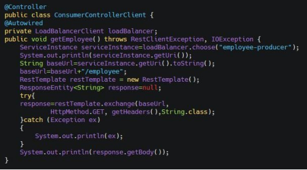
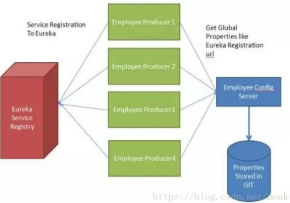
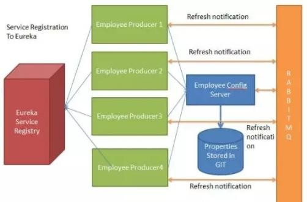
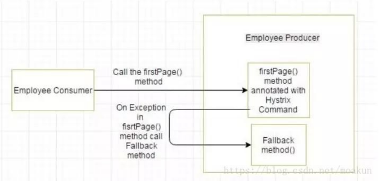
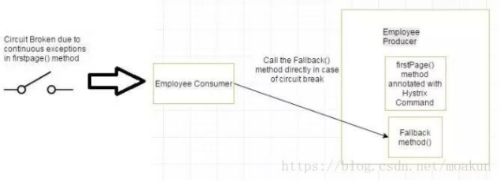

# 分布式

## 1.Redis和Memcache的区别

1. 存储方式Memecache把数据全部存在内存之中，断电后会挂掉，数据不能超过内存大小。Redis有部份存在硬盘上，redis可以持久化其数据

2. 数据支持类型memcached所有的值均是简单的字符串，redis作为其替代者，支持更为丰富的数据类型，提供list，set，zset，hash等数据结构的存储
3. 使用底层模型不同它们之间底层实现方式以及与客户端之间通信的应用协议不一样。Redis直接自己构建了VM机制，因为一般的系统调用系统函数的话，会浪费一定的时间去移动和请求。

4. value值大小不同：Redis最大可以达到1gb；memcache只有1mb。

5. redis的速度比memcached快很多

6. Redis支持数据的备份，即master-slave模式的数据备份。

## 2.使用Redis有哪些好处

1. 速度快，因为数据存在内存中，类似于HashMap，HashMap的优势就是查找和操作的时间复杂度都是O(1)

2. 支持丰富数据类型，支持string，list，set，sorted set，hash
3. 支持事务，操作都是原子性，所谓的原子性就是对数据的更改要么全部执行，要么全部不执行
4. 丰富的特性：可用于缓存，消息，按key设置过期时间，过期后将会自动删除

## 3.什么是redis持久化、rdb和aof的比较

持久化就是把内存的数据写到磁盘中去，防止服务宕机了内存数据丢失。

比较：

1. aof文件比rdb更新频率高，优先使用aof还原数据。

2. aof比rdb更安全也更大
3. rdb性能比aof好
4. 如果两个都配了优先加载AOF

## 4.Redis最适合的场景

**会话缓存**（Session Cache）

最常用的一种使用Redis的情景是会话缓存（session cache）。用Redis缓存会话比其他存储（如Memcached）的优势在于：Redis提供持久化。

**全页缓存**（FPC）

除基本的会话token之外，Redis还提供很简便的FPC平台。回到一致性问题，即使重启了Redis实例，因为有磁盘的持久化，用户也不会看到页面加载速度的下降，这是一个极大改进，类似[PHP](http：//lib.csdn.net/base/php)本地FPC。

再次以Magento为例，Magento提供一个插件来使用Redis作为[全页缓存后端](https：//github.com/colinmollenhour/Cm_Cache_Backend_Redis)。

此外，对WordPress的用户来说，Pantheon有一个非常好的插件[wp-redis](https：//wordpress.org/plugins/wp-redis/)，这个插件能帮助你以最快速度加载你曾浏览过的页面。

**队列**

Reids在内存存储引擎领域的一大优点是提供list和set操作，这使得Redis能作为一个很好的消息队列平台来使用。Redis作为队列使用的操作，就类似于本地程序语言（如[Python](http：//lib.csdn.net/base/python)）对list的push/pop操作。

**排行榜/计数器**

Redis在内存中对数字进行递增或递减的操作实现的非常好。集合（Set）和有序集合（Sorted Set）也使得我们在执行这些操作的时候变的非常简单，Redis只是正好提供了这两种数据结构。所以，我们要从排序集合中获取到排名最靠前的10个用户–我们称之为“user_scores”

**发布/订阅**

最后（但肯定不是最不重要的）是Redis的发布/订阅功能。发布/订阅的使用场景确实非常多。我已看见人们在社交网络连接中使用，还可作为基于发布/订阅的脚本触发器，甚至用Redis的发布/订阅功能来建立聊天系统！

## 5.redis哈希槽的概念

Redis集群没有使用一致性hash，而是引入了哈希槽的概念，Redis集群有16384个哈希槽，每个key通过CRC16校验后对16384取模来决定放置哪个槽，集群的每个节点负责一部分hash槽。

## 6.怎么理解Redis事务

事务是一个单独的隔离操作：事务中的所有命令都会序列化、按顺序地执行，事务在执行的过程中，不会被其他客户端发送来的命令请求所打断。事务是一个原子操作：事务中的命令要么全部被执行，要么全部都不执行。

## 7.redis的淘汰策略有哪些

noeviction：返回错误当内存限制达到并且客户端尝试执行会让更多内存被使用的命令（大部分的写入指令，但DEL和几个例外）

allkeys-lru：尝试回收最少使用的键（LRU），使得新添加的数据有空间存放。

volatile-lru：尝试回收最少使用的键（LRU），但仅限于在过期集合的键，使得新添加的数据有空间存放。

allkeys-random：回收随机的键使得新添加的数据有空间存放。

volatile-random：回收随机的键使得新添加的数据有空间存放，但仅限于在过期集合的键。

volatile-ttl：回收在过期集合的键，并且优先回收存活时间（TTL）较短的键，使得新添加的数据有空间存放。

## 8.redis有哪些数据结构

String、List、Set、Zset(Sorted Set)、hash

## 9.redis缓存穿透、缓存雪崩、缓存击穿

**缓存穿透：**无效ID，在redis缓存中查不到，去查询DB，造成DB压力增大。

解决方法：

* 方法1：布隆过滤器，提供一个很大的Bit-Map，提供多个hash函数，分别对查询参数值【比如UUID】，进行求hash，然后分别对多个hash结果，在对应位置对比是否全为1或者某个位置为0，一旦有一个位置标识为0，表示本次查询UUID，不存在于缓存，再去查询DB.起到一个再过滤的效果。
* 方法2：把无效的ID，也在redis缓存起来，并设置一个很短的超时时间。

**缓存雪崩：**缓存同一时间批量失效，导致大量的访问直接访问DB

解决方法：

* 在做缓存时候，就做固定失效时间+随机时间段，保证所有的缓存不会同一时间失效

缓存击穿：在缓存失效的时候，会有高并发访问失效的缓存【热点数据】

解决方法：

* 最简单的解决方法，就是将热点数据设置永不超时！

* 第二个解决方法：对访问的Key加上互斥锁，请求的Key如果不存在，则加锁，去数据库取，新请求过来，如果相同KEy，则暂停10s再去缓存取值；如果Key不同，则直接去缓存取！

## 10.redis如何实现高并发

redis通过一主多从，主节点负责写，从节点负责读，读写分离，从而实现高并发。

## 11.redis如何实现高可用

主备切换，哨兵集群，主节点宕机的情况下，自动选举出一个从节点变成主节点，从而保证了redis集群的高可用。

## 12.redis单线程还能处理速度那么快

首先，redis是单进程单线程的k-v内存型可持久化数据库。

单线程还能处理速度很快的原因：

1. redis操作是基于内存的，内存的读写速度非常快

2. 正是由于redis的单线程模式，避免了线程上下文切换的损耗

3. redis采用的IO多路复用技术，可以很好的解决多请求并发的问题。多路代表多请求，复用代表多个请求重复使用同一个线程。

## 13.为什么Redis的操作是原子性的，怎么保证原子性

对于Redis而言，命令的原子性指的是：一个操作的不可以再分，操作要么执行，要么不执行。

Redis的操作之所以是原子性的，是因为Redis是单线程的。

Redis本身提供的所有API都是原子操作，Redis中的事务其实是要保证批量操作的原子性。

**多个命令在并发中也是原子性的吗?**

> 不一定，将get和set改成单命令操作，incr。使用Redis的事务，或者使用Redis+Lua==的方式实现.

## 14.redis的主从复制的实现过程

1. 从服务发送一个sync同步命令给主服务要求全量同步
2. 主服务接收到从服务的sync同步命令时，会fork一个子进程后台执行bgsave命令（非阻塞）快照保存，生成RDB文件，并将RDB文件发送给从服务

3. 从服务再将接收到的RDB文件载入自己的redis内存

4. 待从服务将RDB载入完成后，主服务再将缓冲区所有写命令发送给从服务

5. 从服务在将主服务所有的写命令载入内存从而实现数据的完整同步

6. 从服务下次在需要同步数据时只需要发送自己的offset位置（相当于mysql binlog的位置）即可，只同步新增加的数据，再不需要全量同步

## 15.redis的哨兵机制的作用

1. 监控：Sentinel会不断的检查主服务器和从服务器是否正常运行。

2. 通知：当被监控的某个redis服务器出现问题，Sentinel通过API脚本向管理员或者其他的应用程序发送通知。
3. 自动故障转移：当主节点不能正常工作时，Sentinel会开始一次自动的故障转移操作，它会将与失效主节点是主从关系的其中一个从节点升级为新的主节点，并且将其他的从节点指向新的主节点。

## 16.redis常见的性能问题和解决方案

1. Master最好不要做任何持久化工作，如RDB内存快照和AOF日志文件
2. 如果数据比较重要，某个Slave开启AOF备份数据，策略设置为每秒同步一次
3. 为了主从复制的速度和连接的稳定性，Master和Slave最好在同一个局域网内
4. 尽量避免在压力很大的主库上增加从库
5. 主从复制不要用图状结构，用单向链表结构更为稳定，即：Master<-Slave1<-Slave2<-Slave3…

## 17.分布式缓存

硬盘上的数据，缓存在别的计算机上（非程序运行的计算机）的内存上，而且可以缓存的计算机的个数不止一个，可以使用n个用户通过访问http服务器，然后访问应用服务器资源，应用服务器调用后端的数据库，在第一次访问的时候，直接访问数据库，然后将要缓存的内容放入到memcached集群，集群规模根据缓存文件的大小而定。在第二次访问的时候就直接进入缓存读取，不需要进行数据库的操作。这个适合数据变化不频繁的场景，比如：互联网站显示的榜单，阅读排行等。

## 18.什么是Nginx

Nginx是一个高性能的HTTP和反向代理服务器，及电子邮件代理服务器，同时也是一个非常高效的反向代理、负载平衡。

## 19.nginx相对于apache的优点

轻量级，同样起web服务，比apache占用更少的内存及资源

抗并发，nginx处理请求是异步非阻塞的，而apache则是阻塞型的，在高并发下nginx能保持低资源低消耗高性能

高度模块化的设计，编写模块相对简单

社区活跃，各种高性能模块出品迅速

rewrite，比nginx的rewrite强大

模块超多，基本想到的都可以找到

少bug，nginx的bug相对较多

## 20.Nginx优化的方式

Nginx运行工作进程数量

Nginx运行工作进程个数一般设置CPU的核心或者核心数*2

Nginx运行CPU亲和力

比如4核配置：

> worker_processes4;
>
> worker_cpu_affinity 0001 0010 0100 1000 
>
> Nginx最大打开文件数
>
> worker_rlimit_nofile65535;
>
> Nginx事件处理模型
>
> events{
>
> ​	useepoll;
>
> ​	worker_connections 65535;
>
> ​	multi_accepton;
>
> }

nginx采用epoll事件模型，处理效率高。

开启高效传输模式

连接超时时间

主要目的是保护服务器资源，CPU，内存，控制连接数，因为建立连接也是需要消耗资源的

## 21.Nginx如何处理一个请求的

首先，nginx在启动时，会解析配置文件，得到需要监听的端口与ip地址，然后在nginx的master进程里面先初始化好这个监控的socket，再进行listen，然后再fork出多个子进程出来，子进程会竞争accept新的连接。此时，客户端就可以向nginx发起连接了。当客户端与nginx进行三次握手，与nginx建立好一个连接后，此时，某一个子进程会accept成功，然后创建nginx对连接的封装，即ngx_connection_t结构体，接着，根据事件调用相应的事件处理模块，如http模块与客户端进行数据的交换。最后，nginx或客户端来主动关掉连接，到此，一个连接就寿终正寝了

## 22.Nginx是如何实现高并发的

nginx之所以可以实现高并发，与它采用的epoll模型有很大的关系。epoll模型采用异步非阻塞的事件处理机制。这种机制可让nginx进程同时监控多个事件。

简单来说，就是异步非阻塞，使用了epoll模型和大量的底层代码优化。如果深入一点的话，就是nginx的特殊进程模型和事件模型的设计，才使其可以实现高并发。

## 23.Nginx的进程模型

它是采用一个master进程和多个worker进程的工作模式。

1. master进程主要负责收集、分发请求。当一个请求过来时，master拉起一个worker进程负责处理这个请求。
2. master进程也要负责监控worker的状态，保证高可靠性；
3. worker进程议案设置为和CPU核心数一致或者其二倍。nginx的worker进程和Apache的不一样。apache的进程在同一时间只能处理一个请求，所以它会开启很多个进程，几百甚至几千个。而nginx的worker进程在同一时间可以处理的请求数只受内存限制，因此可以处理更多请求。

## 24.Nginx负载均衡的4种分配方式

**轮询**（默认）

每个请求按时间顺序逐一分配到不同的后端服务器，如果后端服务器down掉，能自动剔除。

**weight**

指定轮询几率，weight和访问比率成正比，用于后端服务器性能不均的情况。

**ip_hash**

每个请求按访问ip的hash结果分配，这样每个访客固定访问一个后端服务器，可以解决的问题。

**fair**（第三方）

按后端服务器的响应时间来分配请求，响应时间短的优先分配。

**url_hash**（第三方）

按访问url的hash结果来分配请求，使同样的url定向到同一个后端服务器，后端服务器为缓存时比较有效

## 25.为什么要用Nginx

**跨平台、配置简单，非阻塞、高并发连接**：处理2-3万并发连接数，官方监测能支持5万并发；

**内存消耗小**：开启10个nginx才占150M内存，nginx处理静态文件好，耗费内存少；

**内置的健康检查功能**：如果有一个服务器宕机，会做一个健康检查，再发送的请求就不会发送到宕机的服务器了。重新将请求提交到其他的节点上；

**节省宽带**：支持GZIP压缩，可以添加浏览器本地缓存；

**稳定性高**：宕机的概率非常小；

**接收用户请求是异步的**：浏览器将请求发送到nginx服务器，它先将用户请求全部接收下来，再一次性发送给后端web服务器，极大减轻了web服务器的压力，一边接收web服务器的返回数据，一边发送给浏览器客户端，网络依赖性比较低，只要ping通就可以负载均衡，可以有多台nginx服务器使用dns做负载均衡，事件驱动：通信机制采用epoll模型（nio2异步非阻塞）

## 26.什么是正向代理

一个位于客户端和原始服务器之间的服务器，为了从原始服务器取得内容，客户端向代理发送一个请求并指定目标(原始服务器)，然后代理向原始服务器转交请求并将获得的内容返回给客户端，客户端才能使用正向代理。

> 正向代理总结就一句话：代理端代理的是客户端

## 27.什么是反向代理

反向代理是指以代理服务器来接受internet上的连接请求，然后将请求，发给内部网络上的服务器，并将从服务器上得到的结果返回给internet上请求连接的客户端，此时代理服务器对外就表现为一个反向代理服务器

> 反向代理总结就一句话：代理端代理的是服务端

## 28.什么是负载均衡

负载均衡即是代理服务器将接收的请求均衡的分发到各服务器中，负载均衡主要解决网络拥塞问题，提高服务器响应速度，服务就近提供，达到更好的访问质量，减少后台服务器大并发压力

## 29.Nginx的调度算法有哪些

**sticky**：通过nginx-sticky模块，来实现cookie黏贴的方式将来自同一个客户端的请求发送到同一个后端服务器上处理，这样一定程度上可以解决多个后端服务器的session会话同步的问题；

**round-robin**（RR）：轮询，每个请求按时间顺序依次分配到不同的后端服务器，如果后端某台服务器死机，自动剔除故障系统，使用户访问不受影响；

**weight**：轮询权重，weight的值越大分配到的访问概率就越高，主要用于后端每台服务器性能不均衡的情况下，或者仅仅为在主从的情况下设置不同的权重，达到合理有效的利用主机资源。**least_conn**：请求被发送到当前活跃连接最少的realserver上，会考虑到weight的值；

**ip_hash**：每个请求按照IP的哈希结果分配，使来自同一个IP的访客固定访问后端服务器，可以有效的解决动态网页存在的session共享问题。

**fair**：比weight、ip_hash更加智能的负载均衡算法，fair算法可以根据页面的大小和加载时间长短智能地进行负载均衡，也就是根据后端服务器的响应时间来分配请求，相应时间短的优先分配。nginx本身不支持fair，如果需要使用这种调度算法，则必须安装upstream_fair模块。

**url_hash**：按访问的URL的哈希结果来分配请求，使每个URL定向到后端服务器，可以进一步提高后端缓存服务器的效率。同样，nginx本身不支持url_hash，如果需要这种调度算法，则必须安装nginx的hash软件包。

## 30.Nginx负载均衡调度状态

常用的状态有：

1. down：表示当前的server暂时不参与负载均衡；

2. backup：预留的备份机器。当其他所有的非backup机器出现故障或者繁忙的时候，才会请求backup机器，因此这台机器的访问压力最低；

3. max_fails：允许请求失败的次数，默认为1，当超过最大次数时，返回proxy_next_upstraem模块定义的错误；

4. fail_timeout：请求失败超时时间，在经历了max_fails次失败后，暂停服务的时间。max_fails和fail_timeout可以一起使用。

## 31.可以从哪些方面来优化nginx服务

1. 配置nginx的proxy缓存；

2. 对静态页面开启压缩功能，如br压缩或者gzip压缩；

3. 调整nginx运行工作进程个数，最多开启8个，8个以上话性能就不会再提升了，而且稳定性变得更低，所以8个足够用了；

4. 调整nginx运行CPU的亲和力；

5. 修改nginx最多可打开的文件数，若超过系统限制的最多打开文件数（ulimit-n命令查看系统的最多打开文件数），还需要修改系统默认的文件数；

6. 修改单个worker的最大连接数；

7. 开启高效传输；

8. 设置连接超时时间，以便保护服务器资源，因为建立连接也是需要消耗资源的；

9. 优化fastCGI的一个超时时间，也可以根据实际情况对其配置缓存动态页面；

10. expires缓存调优，主要针对图片、css、js等元素更改较少的情况下使用。

11. 配置防盗链；

12. 优化内核参数，如进程可以同时打开的最大句柄数；开启tcp重用机制，以便允许TIME_WAITsockets重新用于新的TCP连接

## 32.为什么要用MQ

1. 解耦：如果多个模块或者系统中，互相调用很复杂，维护起来比较麻烦，但是这个调用又不是同步调用，就可以运用MQ到这个业务中。

2. 异步：这个很好理解，比如用户的操作日志的维护，可以不用同步处理，节约响应时间。

3. 削峰：在高峰期的时候，系统每秒的请求量达到5000，那么调用MySQL的请求也是5000，一般情况下MySQL的请求大概在2000左右，那么在高峰期的时候，数据库就被打垮了，那系统就不可用了。此时引入MQ，在系统A前面加个MQ，用户请求先到MQ，系统A从MQ中每秒消费2000条数据，这样就把本来5000的请求变为MySQL可以接受的请求数量了，可以保证系统不挂掉，可以继续提供服务。MQ里的数据可以慢慢的把它消费掉。

### 33.使用MQ会有什么问题

降低了系统可用性

增加了系统的复杂性

## 34.怎么保证MQ的高可用

RabbitMQ是比较有代表性的，因为是基于主从做高可用性的。以他为例，自行查阅以下模式。

rabbitmq有三种模式：单机模式、普通集群模式、镜像集群模式。

## 35.MQ的优缺点

在特殊场景下有其对应的好处，解耦、异步、削峰。

**缺点有以下几个：**

* 系统可用性降低
* 系统引入的外部依赖越多，越容易挂掉。万一MQ挂了，MQ一挂，整套系统崩溃，你不就完了

* 系统复杂度提高

* 硬生生加个MQ进来，你怎么保证消息没有重复消费怎么处理消息丢失的情况怎么保证消息传递的顺序性问题一大堆。

**一致性问题**

A系统处理完了直接返回成功了，人都以为你这个请求就成功了；但是问题是，要是BCD三个系统那里，BD两个系统写库成功了，结果C系统写库失败了，咋整你这数据就不一致了。

## 36.Kafka、ActiveMQ、RabbitMQ、RocketMQ都有什么区别

对于吞吐量来说kafka和RocketMQ支撑高吞吐，ActiveMQ和RabbitMQ比他们低一个数量级。对于延迟量来说RabbitMQ是最低的。

**从社区活跃度**

按照目前网络上的资料，RabbitMQ、activeM、ZeroMQ三者中，综合来看，RabbitMQ是首选。

**持久化消息比较**

ActiveMq和RabbitMq都支持。持久化消息主要是指我们机器在不可抗力因素等情况下挂掉了，消息不会丢失的机制。

**综合技术实现**

可靠性、灵活的路由、集群、事务、高可用的队列、消息排序、问题追踪、可视化管理工具、插件系统等等。

RabbitMq/Kafka最好，ActiveMq次之，ZeroMq最差。当然ZeroMq也可以做到，不过自己必须手动写代码实现，代码量不小。尤其是可靠性中的：持久性、投递确认、发布者证实和高可用性。

**高并发**

毋庸置疑，RabbitMQ最高，原因是它的实现语言是天生具备高并发高可用的erlang语言。

**比较关注的比较**，RabbitMQ和Kafka

RabbitMq比Kafka成熟，在可用性上，稳定性上，可靠性上，RabbitMq胜于Kafka（理论上）。另外，Kafka的定位主要在日志等方面，因为Kafka设计的初衷就是处理日志的，可以看做是一个日志（消息）系统一个重要组件，针对性很强，所以如果业务方面还是建议选择RabbitMq。

还有就是，Kafka的性能（吞吐量、TPS）比RabbitMq要高出来很多。

## 37.如何设置消息的过期时间

设置队列属性，队列中所有消息都有相同的过期时间

对消息本身进行单独设置，每条消息的TTL可以不同

如果两种方法一起使用，则消息的TTL以两者之间较小的那个数值为准

## 38.消息的持久化是如何实现的

RabbitMQ的持久化分为：交换器的持久化、队列的持久化和消息的持久化

交换器和队列的持久化都是通过在声明时将durable参数置为true实现的

消息的持久化是在发送消息指定deliveryMode为2实现的

## 39.Zookeeper是什么

ZooKeeper是一个开放源码的分布式协调服务，它是集群的管理者，监视着集群中各个节点的状态根据节点提交的反馈进行下一步合理操作。最终，将简单易用的接口和性能高效、功能稳定的系统提供给用户。

## 40.Zookeeper的应用场景

数据发布/订阅

负载均衡

命名服务

分布式协调/通知

集群管理

Master选举

分布式锁

分布式队列

## 41.四种类型的数据节点Znode

**PERSISTENT-持久节点**

除非手动删除，否则节点一直存在于Zookeeper上

**EPHEMERAL-临时节点**

临时节点的生命周期与客户端会话绑定，一旦客户端会话失效（客户端与zookeeper连接断开不一定会话失效），那么这个客户端创建的所有临时节点都会被移除。

**PERSISTENT_SEQUENTIAL-持久顺序节点**

基本特性同持久节点，只是增加了顺序属性，节点名后边会追加一个由父节点维护的自增整型数字。

**EPHEMERAL_SEQUENTIAL-临时顺序节点**

基本特性同临时节点，增加了顺序属性，节点名后边会追加一个由父节点维护的自增整型数字。

## 42.ZookeeperWatcher机制

1、**一次性**

无论是服务端还是客户端，一旦一个Watcher被触发，Zookeeper都会将其从相应的存储中移除。这样的设计有效的减轻了服务端的压力，不然对于更新非常频繁的节点，服务端会不断的向客户端发送事件通知，无论对于网络还是服务端的压力都非常大。

2、**客户端串行执行**

客户端Watcher回调的过程是一个串行同步的过程。

3、**轻量**

Watcher通知非常简单，只会告诉客户端发生了事件，而不会说明事件的具体内容。

客户端向服务端注册Watcher的时候，并不会把客户端真实的Watcher对象实体传递到服务端，仅仅是在客户端请求中使用boolean类型属性进行了标记。

4、**watcher event** 异步发送watcher的通知事件从server发送到client是异步的，这就存在一个问题，不同的客户端和服务器之间通过socket进行通信，由于网络延迟或其他因素导致客户端在不通的时刻监听到事件，由于Zookeeper本身提供了ordering guarantee，即客户端监听事件后，才会感知它所监视znode发生了变化。所以我们使用Zookeeper不能期望能够监控到节点每次的变化。Zookeeper只能保证最终的一致性，而无法保证强一致性。

5、注册watcher getData、exists、getChildren

6、触发watcher create、delete、setData

7、当一个客户端连接到一个新的服务器上时，watch将会被以任意会话事件触发。当与一个服务器失去连接的时候，是无法接收到watch的。而当client重新连接时，如果需要的话，所有先前注册过的watch，都会被重新注册。通常这是完全透明的。只有在一个特殊情况下，watch可能会丢失：对于一个未创建的znode的exist watch，如果在客户端断开连接期间被创建了，并且随后在客户端连接上之前又删除了，这种情况下，这个watch事件可能会被丢失。

## 43.Zookeeper下Server工作状态

服务器具有四种状态，分别是LOOKING、FOLLOWING、LEADING、OBSERVING。

**LOOKING**：寻找Leader状态。当服务器处于该状态时，它会认为当前集群中没有Leader，因此需要进入Leader选举状态。

**FOLLOWING**：跟随者状态。表明当前服务器角色是Follower。

**LEADING**：领导者状态。表明当前服务器角色是Leader。

**OBSERVING**：观察者状态。表明当前服务器角色是Observer。

## 44.Zookeeper是如何保证事务的顺序一直性的

zookeeper采用了全局递增的事务Id来标识，所有的proposal（提议）都在被提出的时候加上了zxid，zxid实际上是一个64位的数字，高32位是epoch（时期;纪元;世;新时代）用来标识leader周期，如果有新的leader产生出来，epoch会自增，低32位用来递增计数。当新产生proposal的时候，会依据数据库的两阶段过程，首先会向其他的server发出事务执行请求，如果超过半数的机器都能执行并且能够成功，那么就会开始执行。

## 45.ZK节点宕机如何处理

Zookeeper本身也是集群，推荐配置不少于3个服务器。Zookeeper自身也要保证当一个节点宕机时，其他节点会继续提供服务。

如果是一个Follower宕机，还有2台服务器提供访问，因为Zookeeper上的数据是有多个副本的，数据并不会丢失；

如果是一个Leader宕机，Zookeeper会选举出新的Leader。

ZK集群的机制是只要超过半数的节点正常，集群就能正常提供服务。只有在ZK节点挂得太多，只剩一半或不到一半节点能工作，集群才失效。

> 所以
>
> 3个节点的cluster可以挂掉1个节点(leader可以得到2票>1.5)
>
> 2个节点的cluster就不能挂掉任何1个节点了(leader可以得到1票<=1)

## 46.Zookeeper有哪几种部署模式

部署模式：单机模式、伪集群模式、集群模式。

## 47.Dubbo内置了哪几种容器

Spring Container

Jetty Container

Log4j Container

## 48.Dubbo里面有哪几种角色

Provider：暴露服务的服务提供方

Consumer：调用远程服务的服务消费方

Registry：服务注册与发现的注册中心

Monitor：统计服务的调用次数和调用时间的监控中心

Container：服务运行容器

## 49.Dubbo有哪几种集群容错方案，默认是那种

Failover Cluster：失败自动切换，自动重试其他服务器（默认）

Failfast Cluster：快速失败，立即报错，只发起一次调用

Failsafe Cluster：失败安全，出现异常时，直接忽略

Failback Cluster：失败自动恢复，记录失败请求，定时重发

Forking Cluster：并行调用多个服务器，只要一个成功即返回

Broadcast Cluster：广播逐个调用所有提供者，任意一个报错则报错

## 50.Dubbo有哪几种负载均衡策略，默认是哪种

Random LoadBalance：随机，按权重设置随机概率(默认)

Round RobinLoadBalance：轮询，按公约后的权重设置轮询比率 

LeastActive LoadBalance：最少活跃调用次数，相同活跃数的随机

ConsistentHash LoadBalance：一直性Hash，相同参数的请求总是发到同一提供者

## 51.Dubbo的管理控制台能做什么

管理控制台主要包含：路由规则，动态配置，服务降级，访问控制，权重调整，负载均衡，等管理功能。

## 52.什么是SpringBoot

多年来，随着新功能的增加，spring变得越来越复杂。只需访问             https：//spring.io/projects 页面，我们就会看到可以在我们的应用程序中使用的所有Spring项目的不同功能。如果必须启动一个新的Spring项目，我们必须添加构建路径或添加Maven依赖关系，配置应用程序服务器，添加spring配置。因此，开始一个新的spring项目需要很多努力，因为我们现在必须从头开始做所有事情。

SpringBoot是解决这个问题的方法。SpringBoot已经建立在现有spring框架之上。使用spring启动，我们避免了之前我们必须做的所有样板代码和配置。因此，SpringBoot可以帮助我们以最少的工作量，更加健壮地使用现有的Spring功能。

## 53.SpringBoot有哪些优点

减少开发，测试时间和努力。

使用JavaConfig有助于避免使用XML。

避免大量的Maven导入和各种版本冲突。

提供意见发展方法。

通过提供默认值快速开始开发。

没有单独的Web服务器需要。这意味着你不再需要启动Tomcat，Glassfish或其他任何东西。需要更少的配置因为没有web.xml文件。只需添加用@Configuration注释的类，然后添加用@Bean注释的方法，Spring将自动加载对象并像以前一样对其进行管理。甚至可以将@Autowired添加到bean方法中，以使Spring自动装入需要的依赖关系中。

基于环境的配置使用这些属性，您可以将您正在使用的环境传递到应用程序：-Dspring.profiles.active={enviornment}。在加载主应用程序属性文件后，Spring将在（application{environment}.properties）中加载后续的应用程序属性文件。

## 54.什么是JavaConfig

Spring JavaConfig是Spring社区的产品，它提供了配置SpringIoC容器的纯Java方法。因此它有助于避免使用XML配置。

使用JavaConfig的优点在于：

面向对象的配置。由于配置被定义为JavaConfig中的类，因此用户可以充分利用Java中的面向对象功能。一个配置类可以继承另一个，重写它的@Bean方法等。

减少或消除XML配置。基于依赖注入原则的外化配置的好处已被证明。但是，许多开发人员不希望在XML和Java之间来回切换。JavaConfig为开发人员提供了一种纯Java方法来配置与XML配置概念相似的Spring容器。从技术角度来讲，只使用JavaConfig配置类来配置容器是可行的，但实际上很多人认为将JavaConfig与XML混合匹配是理想的。

类型安全和重构友好。JavaConfig提供了一种类型安全的方法来配置Spring容器。由于Java5.0对泛型的支持，现在可以按类型而不是按名称检索bean，不需要任何强制转换或基于字符串的查找。

## 55.如何重新加载SpringBoot上的更改，而无需重新启动服务器

这可以使用DEV工具来实现。通过这种依赖关系，您可以节省任何更改，嵌入式tomcat将重新启动。SpringBoot有一个开发工具（DevTools）模块，它有助于提高开发人员的生产力。Java开发人员面临的一个主要挑战是将文件更改自动部署到服务器并自动重启服务器。开发人员可以重新加载SpringBoot上的更改，而无需重新启动服务器。这将消除每次手动部署更改的需要。SpringBoot在发布它的第一个版本时没有这个功能。这是开发人员最需要的功能。DevTools模块完全满足开发人员的需求。该模块将在生产环境中被禁用。它还提供H2数据库控制台以更好地测试应用程序。

## 56.SpringBoot中的监视器是什么

Springbootactuator是spring启动框架中的重要功能之一。Springboot监视器可帮助您访问生产环境中正在运行的应用程序的当前状态。有几个指标必须在生产环境中进行检查和监控。即使一些外部应用程序可能正在使用这些服务来向相关人员触发警报消息。监视器模块公开了一组可直接作为HTTP URL访问的REST端点来检查状态。

## 57.如何在SpringBoot中禁用Actuator端点安全性

默认情况下，所有敏感的HTTP端点都是安全的，只有具有ACTUATOR角色的用户才能访问它们。安全性是使用标准的HttpServletRequest.isUserInRole方法实施的。我们可以使用management.security.enabled=false来禁用安全性。只有在执行机构端点在防火墙后访问时，才建议禁用安全性。

## 59.什么是WebSocket

WebSocket是一种计算机通信协议，通过单个TCP连接提供全双工通信信道。

WebSocket是双向的-使用WebSocket客户端或服务器可以发起消息发送。

WebSocket是全双工的-客户端和服务器通信是相互独立的。

单个TCP连接-初始连接使用HTTP，然后将此连接升级到基于套接字的连接。然后这个单一连接用于所有未来的通信

Light-与http相比，WebSocket消息数据交换要轻得多。

## 60.什么是Swagger、用SpringBoot怎么实现

Swagger广泛用于可视化API，使用Swagger UI为前端开发人员提供在线沙箱。Swagger是用于生成RESTful Web服务的可视化表示的工具，规范和完整框架实现。它使文档能够以与服务器相同的速度更新。当通过Swagger正确定义时，消费者可以使用最少量的实现逻辑来理解远程服务并与其进行交互。因此，Swagger消除了调用服务时的猜测。

## 61.什么是ApacheKafka

ApacheKafka是一个分布式发布-订阅消息系统。它是一个可扩展的，容错的发布-订阅消息系统，它使我们能够构建分布式应用程序。这是一个Apache顶级项目。Kafka适合离线和在线消息消费。

## 62.什么是SpringCloud

Springcloud流应用程序启动器是基于SpringBoot的Spring集成应用程序，提供与外部系统的集成。Springcloud Task，一个生命周期短暂的微服务框架，用于快速构建执行有限数据处理的应用程序。

### 63.使用SpringCloud有什么优势

使用SpringBoot开发分布式微服务时，我们面临以下问题：

1. 与分布式系统相关的复杂性-这种开销包括网络问题，延迟开销，带宽问题，安全问题。

2. 服务发现-服务发现工具管理群集中的流程和服务如何查找和互相交谈。它涉及一个服务目录，在该目录中注册服务，然后能够查找并连接到该目录中的服务。

3. 冗余-分布式系统中的冗余问题。

4. 负载平衡--负载平衡改善跨多个计算资源的工作负荷，诸如计算机，计算机集群，网络链路，中央处理单元，或磁盘驱动器的分布。

5. 性能-问题由于各种运营开销导致的性能问题。

6. 部署复杂性-Devops技能的要求。

## 64.服务注册和发现是什么意思、SpringCloud如何实现

当我们开始一个项目时，我们通常在属性文件中进行所有的配置。随着越来越多的服务开发和部署，添加和修改这些属性变得更加复杂。有些服务可能会下降，而某些位置可能会发生变化。手动更改属性可能会产生问题。Eureka服务注册和发现可以在这种情况下提供帮助。由于所有服务都在Eureka服务器上注册并通过调用Eureka服务器完成查找，因此无需处理服务地点的任何更改和处理。

## 65.什么是NetflixFeign、优点是什么

Feign是受到Retrofit，JAXRS-2.0和WebSocket启发的java客户端联编程序。Feign的第一个目标是将约束分母的复杂性统一到http apis，而不考虑其稳定性。在employee-consumer的例子中，我们使用了employee-producer使用REST模板公开的REST服务。

但是我们必须编写大量代码才能执行以下步骤：

1. 使用功能区进行负载平衡。

2. 获取服务实例，然后获取基本URL。
3. 利用REST模板来使用服务。前面的代码如下

之前的代码，有像NullPointer这样的例外的机会，并不是最优的。我们将看到如何使用Netflix Feign使呼叫变得更加轻松和清洁。如果Netflix Ribbon依赖关系也在类路径中，那么Feign默认也会负责负载平衡。

## 66.什么是SpringCloudBus、需要它吗

考虑以下情况：我们有多个应用程序使用SpringCloudConfig读取属性，而SpringCloudConfig从GIT读取这些属性。

下面的例子中多个员工生产者模块从EmployeeConfigModule获取Eureka注册的财产。

如果假设GIT中的Eureka注册属性更改为指向另一台Eureka服务器，会发生什么情况。在这种情况下，我们将不得不重新启动服务以获取更新的属性。

还有另一种使用执行器端点/刷新的方式。但是我们将不得不为每个模块单独调用这个url。例如，如果Employee Producer1部署在端口8080上，则调用http：//localhost：8080/refresh。同样对于Employee Producer2 http：//localhost：8081/refresh等等。这又很麻烦。这就是SpringCloudBus发挥作用的地方。

SpringCloudBus提供了跨多个实例刷新配置的功能。因此，在上面的示例中，如果我们刷新EmployeeProducer1，则会自动刷新所有其他必需的模块。如果我们有多个微服务启动并运行，这特别有用。这是通过将所有微服务连接到单个消息代理来实现的。无论何时刷新实例，此事件都会订阅到侦听此代理的所有微服务，并且它们也会刷新。可以通过使用端点/总线/刷新来实现对任何单个实例的刷新。

## 67.什么是Hystrix断路器、是否需要它

由于某些原因，employee-consumer公开服务会引发异常。在这种情况下使用Hystrix我们定义了一个回退方法。如果在公开服务中发生异常，则回退方法返回一些默认值。

如果firstPage method()中的异常继续发生，则Hystrix电路将中断，并且员工使用者将一起跳过firtsPage方法，并直接调用回退方法。断路器的目的是给第一页方法或第一页方法可能调用的其他方法留出时间，并导致异常恢复。可能发生的情况是，在负载较小的情况下，导致异常的问题有更好的恢复机会。

