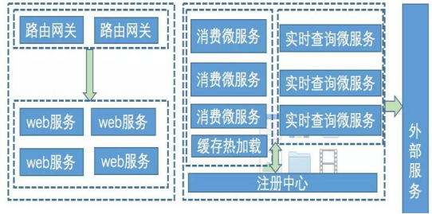
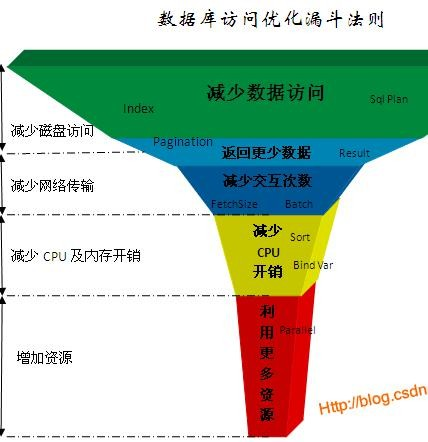

# 并发与性能调优

## 1.每秒钟5k个请求，查询手机号的笔试题，设计算法请求再多，比如5w，如何设计整个系统

设计出每秒并5K的一个系统，根据网上的这个题目做以下梳理，众所周知一个良好的架构需要考虑它的高可用和可伸缩，需要做服务的熔断、降级、隔离等等

 

**架构设计原理**：

1、路由网关-流量分发入口，不承载具体业务，简单点可以使用nginx，如果是微服务可以使用zuul等（支持请求的分发、限流、下游依赖的发现，可以结合docker实现服务下游的web服务自动伸缩），如果采用nginx完成不了下游的伸缩发现，但是基本的限流和分发可以解决

2、web服务-可以水平扩展，通过cache加速，查询手机号码号段对应的地区，对于缓存未命中的号段，直接丢入kafka队列，实时返回client端查询中的状态

3、消费微服务-完成kafka队列的消费，根据kafkatopic的partition个数也可以实现水平扩展，负责把发送号段的查询请求至实时查询微服务，保存至cache

4、实时查询微服务-因为是无状态服务，根据业务负载也可以实现水平扩展，且仅负责对外部运营商的查询，根据外部供应商的接口能力，也可以通过hystrix把该服务export出的接口做限流和熔断，这样影响面就不会波及外部合作伙伴

5、缓存预热服务-为提升体验，减少发出查询请求后的刷新等待时间，在服务发布前，可以预先把一批号段通过请求实时查询微服务，并先保存起来

> 总结
>
> 如上设计：缓存读取不会形成瓶颈，队列生产不会形成瓶颈，唯一形成瓶颈的点有可能发生在外部运营商接口，因此我们会对实时查询服务做限流和熔断，所以不会压垮运营商，但是用户端的体验就糟些了，所以我们需要把缓存预热的功夫做足，改善体验。上面的设计在不同场景下需要进行微调，基本思想不会发生大的变化，把请求异步化，一天吃不成胖子，就分多天吃，就是这个意思，当然还考察了服务的隔离、降级、可伸缩的特性！

## 2.高并发情况下，我们系统是如何支撑大量的请求的

1、尽量使用缓存技术

包括用户缓存，信息缓存还有静态页面缓存，多花点内存来做缓存，可以大大减少与数据库的交互次数和tomcat执行次数，减少不变的数据重复在tomcat和数据库中获取的次数。

2、同步转异步

对于一些不需要即时结果的操作，可以使用MQ消息机制，达到同步转异步的效果，如秒杀系统，正常流程：先点击秒杀，然后往服务器发送请求，在页面等待响应，这样融入大量请求，服务器压力会特别大，搞不好服务器就会宕机。使用MQ消息队列实现异步的步骤为：点击秒杀，返回请稍后查看结果，请求去MQ队列中排队，等排队执行完成后返回给用户信息。这样就可以大大减少服务器的压力，提升用户体验度。

3、合并多个同类型请求为一个请求

使用SpringCloud的Hystrix技术来实现。在服务提供者提供了返回单个对象和多个对象的接口，并且单个对象的查询并发数很高，服务提供者负载较高的时候，我们就可以使用请求合并来降低服务提供者的负载。

4、数据库方面

搭建数据库集群，网站一般读的多写的少，可以按照网站的统计数据来找到一个合适的平衡点，来搭建主从数据库服务，可以实现一主多从，或者多主多从，来减轻单个数据库的压力。可以按照每台数据库服务器的硬件条件，合理分配权重，配合Mycat达到负载均衡。

5、高质量代码

合理的使用循环和递归，不要为了速度丢了内存，也不要为内存丢了速度，要看业务场景，来合理使用。减少自动处理逻辑，比如字符串拼接，每次拼接都会创建一个字符串放入常量池，这里可以按照业务场景来使用StringBuilder或者StringBuffer来进行字符串拼接，能手动处理就手动处理，代码中所有的临时对象，用完之后都赋值为Null，这样可以减少GC的重复排查，效率就会有所提升。所有的资源用完都要回收，如：IO、数据库连接对象等，因为这些资源对GC不是特别友好。减少代码调用链，尽量不要让代码调用链超过10，远程方法调用没事。提供过滤能力，把每个过滤器写的详细一点，把耦合度高的数据放入到同一个过滤器中，如果第一个过滤器没有通过那么后面的过滤器不执行，相对的业务也就不执行了，效率也就提升了。

6、网络优化

外网转内网，内网转局域网，外网转VPN。配合公司内的网络运维人员，进行网络网段的切换，尽量让服务器群处于内网，或者局域网中，提供访问速度。服务器之间的通讯如果都是局域网内进行的，那么可想而知，访问速度肯定有所提升。

7、中间件处理

搭建Tomcat集群：通过Nginx代理Tomcat服务器做负载均衡，对每个Tomcat的调优，合理设置设置Tomcat的最大连接数，因为Tomcat的默认最大并发数为200。适当的加大Tomcat的内存和最多线程数，设置JVM的处置大小为服务器可用内存的最大值的80%。关闭DNS查询，开启gzip压缩。

搭建MQ集群：高并发的时候一个MQ来处理队列根本不够用，这时可以搭建集群来处理。增加Nginx的内存，加大Nginx缓存数据的范围。服务器操作系统都用64位的，因为32位的系统最大内存只能有4G

图片服务器分离：搭建vsftpd服务器来存储图片数据，通过Nginx代理vsftpd存放路径就可以直接访问到图片，这样响应到页面的只是超链接，并不是图片，这样页面的响应会得到大大的提升。

## 3.集群如何同步会话状态

**利用Redis同步session**

Redis可以做分布式，正式因为这个功能他才可以用来做session同步。他可以把web服务器中的内存组合起来，形成一个“内存池”，不管是哪个服务器产生的session都可以存放于这个内存池中，其它的都可以使用。

以这种方式来同步session，不会加大数据库的负担，安全性比cookie要大大提高，把session放到内存中，这样比从文件读取也要快很多。

## 4.负载均衡的原理

网站访问量已经越来越大，响应速度越来越慢。

考虑：

Scale Up（也就是Scale vertically）纵向扩展，向上扩展：机器硬件升级，增加配置，如添加CPU、内存。（往往需要购置新机器）–>旧机器不能利用上。

Scale Out（也就是Scale horizontally）横向扩展，向外扩展：向原有的web、邮件系统添加一个新机器。–>旧机器仍然可以发挥作用。

负载均衡技术为scale out服务。

**Nginx负载均衡器的特点是：**

1. 工作在网络的7层之上，可以针对http应用做一些分流的策略，比如针对域名、目录结构；

2. Nginx安装和配置比较简单，测试起来比较方便；

3. 也可以承担高的负载压力且稳定，一般能支撑超过上万次的并发；

4. Nginx可以通过端口检测到服务器内部的故障，比如根据服务器处理网页返回的状态码、超时等等，并且会把返回错误的请求重新提交到另一个节点，不过其中缺点就是不支持url来检测；

5. Nginx对请求的异步处理可以帮助节点服务器减轻负载；

6. Nginx能支持http和Email，这样就在适用范围上面小很多；

7. 默认有三种调度算法:轮询、weight以及ip_hash（可以解决会话保持的问题），还可以支持第三方的fair和url_hash等调度算法；

## 5.怎么提高并发量，请列举你所知道的方案

HTML静态化模板引擎

图片服务器分离Nginx

数据库集群、库表散列数据分片Mycat

缓存基于Redis

镜像是大型网站常采用的提高性能和数据安全性的方式

负载均衡

CDN加速技术

## 6.系统的用户量有多少、多用户并发访问时如何解决

分布式是以缩短单个任务的执行时间来提升效率的，而集群则是通过提高单位时间内执行的任务数来提升效率。

集群主要分为：高可用集群(High Availability Cluster)，负载均衡集群(Load Balance Cluster，nginx即可实现)，科学计算集群(High Performance Computing Cluster)。

分布式是指将不同的业务分布在不同的地方；而集群指的是将几台服务器集中在一起，实现同一业务。分布式中的每一个节点，都可以做集群。而集群并不一定就是分布式的。

采用微服务架构，使用技术Spring Cloud的一站式解决方案

## 7.如果有一个特别大的访问量，到数据库上，怎么做优化

1. SQL语句的优化处理通过慢查询确认执行效率低下的SQL语句，进行拆解和索引的控制

2. 为数据库搭建集群，实现主从复制

3. 实现数据库的读写分离

4. 实现数据的分片处理

5. 采用数据库中间件Mycat

## 8.大面积并发，在不增加服务器，如何解决服务器响应不及时问题

**衡量服务器的并发能力**

1. 吞吐率

   吞吐率，单位时间里服务器处理的最大请求数，单位req/s

2. 压力测试

   使用Jmeter，压力测试中关心的时间又细分以下2种:

   * 用户平均请求等待时间（这里暂不把数据在网络的传输时间，还有用户PC本地的计算时间计算入内）

   * 服务器平均请求处理时间

**提高服务器的并发能力**

1. 提高CPU并发计算能力

2. 考虑减少内存分配和释放

3. 考虑使用持久连接

4. 改进I/O模型

5. Sendfile Linux提供sendfile()系统调用，可以讲磁盘文件的特定部分直接传送到代表客户端的socket描述符，加快了静态文件的请求速度，同时减少CPU和内存的开销。

6. 内存映射
