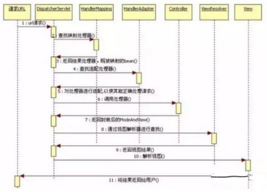
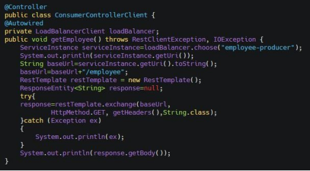
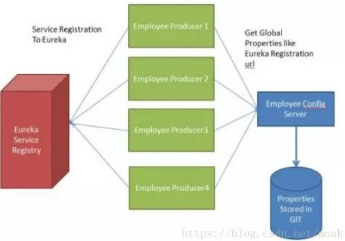
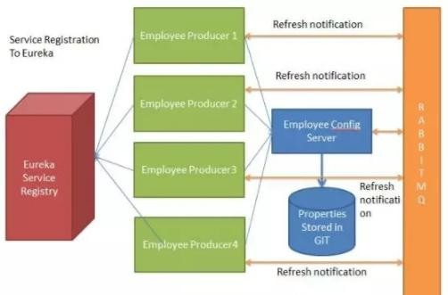
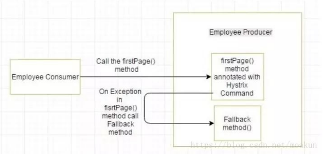
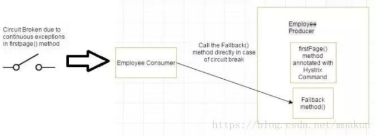

# 开源框架

## 1.hibernate和mybatis的区别

相同点

1）都属于ORM框架

2）都是对jdbc的包装

3）都属于持久层的框架

不同点

1）hibernate是面向对象的，mybatis是面向sql的；

2）hibernate全自动的orm,mybatis是半自动的orm;

1)hibernate查询映射实体对象必须全字段查询，mybatis可以不用；

4）hibernate级联操作，mybatis则没有；

5）hibernate编写hql查询数据库大大降低了对象和数据库的耦合性，mybatis提供动态sql，需要手写sql，与数据库之间的耦合度取决于程序员所写的sql的方法，所以hibernate的移植性要远大于mybatis。

6）hibernate有方言夸数据库，mybatis依赖于具体的数据库。

7）hibernate拥有完整的日志系统，mybatis则相对比较欠缺。

## 2.MyBatis的优点

1、基于SQL语句编程，相当灵活，不会对应用程序或者数据库的现有设计造成任何影响，SQL写在XML里，解除sql与程序代码的耦合，便于统一管理；提供XML标签，支持编写动态SQL语句，并可重用。

2、与JDBC相比，减少了50%以上的代码量，消除了JDBC大量冗余的代码，不需要手动开关连接；

3、很好的与各种数据库兼容（因为MyBatis使用JDBC来连接数据库，所以只要JDBC支持的数据库MyBatis都支持）。

4、能够与Spring很好的集成；

5、提供映射标签，支持对象与数据库的ORM字段关系映射；提供对象关系映射标签，支持对象关系组件维护。

### 3.MyBatis框架的缺点

（1）SQL语句的编写工作量较大，尤其当字段多、关联表多时，对开发人员编写SQL语句的功底有一定要求。

（2）SQL语句依赖于数据库，导致数据库移植性差，不能随意更换数据库。

## 4.SpringMVC工作流程

1、用户发送请求至前端控制器DispatcherServlet

2、DispatcherServlet收到请求调用HandlerMapping处理器映射器。

3、处理器映射器根据请求url找到具体的处理器，生成处理器对象及处理器拦截器(如果有则生成)一并返回给DispatcherServlet。

4、DispatcherServlet通过HandlerAdapter处理器适配器调用处理器

5、执行处理器(Controller，也叫后端控制器)。

6、Controller执行完成返回ModelAndView

7、HandlerAdapter将controller执行结果ModelAndView返回给DispatcherServlet

8、DispatcherServlet将ModelAndView传给ViewReslover视图解析器

9、ViewReslover解析后返回具体View

10、DispatcherServlet对View进行渲染视图（即将模型数据填充至视图中）。

11、DispatcherServlet响应用户

## 5.MyBatis框架使用的场合

（1）MyBatis专注于SQL本身，是一个足够灵活的DAO层解决方案。

（2）对性能的要求很高，或者需求变化较多的项目，如互联网项目，MyBatis将是不错的选择。

## 6.Spring中beanFactory和ApplicationContext的联系和区别

BeanFactory是spring中较为原始的Factory，无法支持spring的许多插件，如AOP功能、Web应用等。

ApplicationContext接口是通过BeanFactory接口派生而来的，除了具备BeanFactory接口的功能外，还具备资源访问、事件传播、国际化消息访问等功能。

总体区别如下

1）使用ApplicationContext，配置bean默认配置是singleton，无论是否使用，都会被实例化。优点是预先加载，缺点是浪费内存；

2）使用BeanFactory实例化对象时，配置的bean等到使用的时候才会被实例化。优点是节约内存，缺点是速度比较慢，多用于移动设备的开发；

3）没有特殊要求的情况下，应该使用ApplicationContext完成，ApplicationContext可以实现BeanFactory所有可实现的功能，还具备其他更多的功能。

## 7.SpringIOC注入的几种方式

构造器注入

set方法注入

接口注入

## 8.拦截器与过滤器的区别

1、拦截器是基于java的反射机制的，而过滤器是基于函数回调

2、拦截器不依赖与servlet容器，过滤器依赖与servlet容器。

3、拦截器只能对action请求起作用，而过滤器则可以对几乎所有的请求起作用。

4、拦截器可以访问action上下文、值栈里的对象，而过滤器不能访问。

5、在action的生命周期中，拦截器可以多次被调用，而过滤器只能在容器初始化时被调用一次

## 9.SpringIOC是什么

SpringIOC负责创建对象，管理对象（通过依赖注入（DI），装配对象，配置对象，并且管理这些对象的整个生命周期。

## 10.AOP有哪些实现方式

实现AOP的技术，主要分为两大类

静态代理-指使用AOP框架提供的命令进行编译，从而在编译阶段就可生成AOP代理类，因此也称为编译时增强。

> 编译时编织（特殊编译器实现）；类加载时编织（特殊的类加载器实现）。

动态代理-在运行时在内存中“临时”生成AOP动态代理类，因此也被称为运行时增强。

> JDK动态代理、CGLIB

## 11.代理模式

1、代理模式代理模式就是本该我做的事，我不做，我交给代理人去完成。就比如，我生产了一些产品，我自己不卖，我委托代理商帮我卖，让代理商和顾客打交道，我自己负责主要产品的生产就可以了。代理模式的使用，需要有本类，和代理类，本类和代理类共同实现统一的接口。然后在main中调用就可以了。本类中的业务逻辑一般是不会变动的，在我们需要的时候可以不断的添加代理对象，或者修改代理类来实现业务的变更。

2、代理模式可以分为

静态代理

优点可以做到在不修改目标对象功能的前提下，对目标功能扩展

缺点因为本来和代理类要实现统一的接口，所以会产生很多的代理类，类太多，一旦接口增加方法，目标对象和代理对象都要维护。

动态代理（JDK代理/接口代理）

代理对象，不需要实现接口，代理对象的生成，是利用JDK的API，动态的在内存中构建代理对象，需要我们指定代理对象/目标对象实现的接口的类型。Cglib代理特点在内存中构建一个子类对象，从而实现对目标对象功能的扩展。

3、使用场景修改代码的时候。不用随便去修改别人已经写好的代码，如果需要修改的话，可以通过代理的方式来扩展该方法。隐藏某个类的时候，可以为其提供代理类当我们要扩展某个类功能的时候，可以使用代理类当一个类需要对不同的调用者提供不同的调用权限的时候，可以使用代理类来实现。减少本类代码量的时候。需要提升处理速度的时候。就比如我们在访问某个大型系统的时候，一次生成实例会耗费大量的时间，我们可以采用代理模式，当用来需要的时候才生成实例，这样就能提高访问的速度。

## 12.Mybatis是如何sql执行结果封装为目标对象都有哪些映射形式

第一种是使用<resultMap>标签，逐一定义数据库列名和对象属性名之间的映射关系。

第二种是使用sql列的别名功能，将列的别名书写为对象属性名。

有了列名与属性名的映射关系后，Mybatis通过反射创建对象，同时使用反射给对象的属性逐一赋值并返回，那些找不到映射关系的属性，是无法完成赋值的。

## 13.Springbean的生命周期

1、Spring容器根据配置中的bean定义中实例化bean。

2、Spring使用依赖注入填充所有属性，如bean中所定义的配置。

3、如果bean实现BeanNameAware接口，则工厂通过传递bean的ID来调用setBeanName()。

4、如果bean实现BeanFactoryAware接口，工厂通过传递自身的实例来调用setBeanFactory()。

5、如果存在与bean关联的任何BeanPostProcessors，则调用preProcessBeforeInitialization()方法。

6、如果为bean指定了init方法（<bean>的init-method属性），那么将调用它。

7、最后，如果存在与	bean关联的任何	BeanPostProcessors，则将调用

postProcessAfterInitialization()方法。

8、如果bean实现DisposableBean接口，当spring容器关闭时，会调用destory()。

9、如果为bean指定了destroy方法（<bean>的destroy-method属性），那么将调用它。

## 14.Spring框架中都用到了哪些设计模式

代理模式，在AOP中被使用最多。

单例模式，在Spring配置文件中定义bean的时候默认的是单例模式。工厂模式,BeanFactory用来创建对象的实例。

模板方法，用来解决重复性代码。

前端控制器，Spring提供了DispatcherSerclet来对请求进行分发。视图帮助，Spring提供了一系列的JSP标签。

依赖注入，它是惯穿于BeanFactory/ApplicationContext接口的核心理念。

## 15.Spring中的事件处理

1、Spring的核心是ApplicatonContext,它负责管理bean的完整的生命周期。Spring提供了以下内置事件ContextRefreshedEvent、ContextStartedEvent、ContextStoppedEvent、ContextClosedEven、tRequestHandleEvent

2、由于Spring的事件处理是单线程的，所以如果一个事件被发布，直至并且除非所有的接收者得到的该消息，该进程被阻塞并且流程将不会继续。因此，如果事件处理被使用，在设计应用程序时应注意。

3、监听上下文事件

4、自定义事件

## 16.使用Sping框架的好处是什么

1、简化开发，解耦，集成其它框架。

2、低侵入式设计，代码污染级别级别。

3、Spring的DI机制降低了业务对象替换的复杂性，提高了软件之间的解耦。

4、SpringAOP支持将一些通用的任务进行集中式的管理，例如安全，事务，日志等，从而使代码能更好的复用。

## 17.解释Spring支持的几种bean的作用域

当通过Spring容器创建一个Bean实例的时候，不仅可以完成bean实例的实力化，还可以为bean指定作用域。Springbean元素的支持以下5种作用域

Singleton单例模式，在整个springIOC容器中，使用singleton定义的bean将只有一个实例。

Prototype多例模式，每次通过容器中的getBean方法获取prototype定义的beans时，都会产生一个新的bean的实例。

Request对于每次Http请求，使用request定义的bean都会产生一个新的实例，只有在

web应用时候，该作用域才会有效。

Session对于每次HttpSession，使用session定义的Bean都将产生一个新的实例。

Globalsession每个全局的HttpSesisonn，使用session定义的本都将产生一个新的实例

## 18.在Spring中如何注入一个java集合

Spring提供理论四种集合类的配置元素

lt;List&该标签用来装配有重复值的list值

lt;set&该标签用来装配没有重复值的set值

lt;map&该标签科以用来注入键值对

lt;props&该标签用来支持注入键值对和字符串类型键值对。

## 19.什么是Springbean

它们是构成用户应用程序主干的对象。

Bean由SpringIoC容器管理。

它们由SpringIoC容器实例化，配置，装配和管理。

Bean是基于用户提供给容器的配置元数据创建。

## 20.什么是spring自动装配

就是将一个Bean注入到其它的Bean的Property中，默认情况下，容器不会自动装配，需要我们手动设定。Spring可以通过向BeanFactory中注入的方式来搞定bean之间的依赖关系，达到自动装配的目的。

自动装配建议少用，如果要使用，建议使用ByName

## 21.自动装配有哪些方式

1、no-这是默认设置，表示没有自动装配。应使用显式bean引用进行装配。

2、byName-它根据bean的名称注入对象依赖项。它匹配并装配其属性与XML文件中由相同名称定义的bean。

3、byType-它根据类型注入对象依赖项。如果属性的类型与XML文件中的一个bean名称匹配，则匹配并装配属性。

4、构造函数-它通过调用类的构造函数来注入依赖项。它有大量的参数。

5、autodetect-首先容器尝试通过构造函数使用autowire装配，如果不能，则尝试通过byType自动装配。

## 22.自动装配有什么局限

1、覆盖的可能性-您始终可以使用<constructor-arg>和<property>设置指定依赖项，这将覆盖自动装配。

2、基本元数据类型-简单属性（如原数据类型，字符串和类）无法自动装配。

3、令人困惑的性质-总是喜欢使用明确的装配，因为自动装配不太精确。

## 23.Spring的重要注解

@Controller-用于SpringMVC项目中的控制器类。

@Service-用于服务类。

@RequestMapping-用于在控制器处理程序方法中配置URI映射。

@ResponseBody-用于发送Object作为响应，通常用于发送XML或JSON数据作为响应。

@PathVariable-用于将动态值从URI映射到处理程序方法参数。

@Autowired-用于在springbean中自动装配依赖项。

@Qualifier-使用@Autowired注解，以避免在存在多个bean类型实例时出现混淆。

@Scope-用于配置springbean的范围。

@Configuration，@ComponentScan和@Bean-用于基于java的配置。

@Aspect，@Before，@After，@Around，@Pointcut-用于切面编程（AOP）。

## 24.@Component,@Controller,@Repository,@Service有何区

1、@Component这将java类标记为bean。它是任何Spring管理组件的通用构造型。spring的组件扫描机制现在可以将其拾取并将其拉入应用程序环境中。2、@Controller这将一个类标记为SpringWebMVC控制器。标有它的Bean会自动导入到IoC容器中。

3、@Service此注解是组件注解的特化。它不会对@Component注解提供任何其他行为。您可以在服务层类中使用@Service而不是@Component，因为它以更好的方式指定了意图。

4、@Repository这个注解是具有类似用途和功能的@Component注解的特化。它为DAO提供了额外的好处。它将DAO导入IoC容器，并使未经检查的异常有资格转换为SpringDataAccessException。

## 25.列举spring支持的事务管理类型

Spring支持两种类型的事务管理

程序化事务管理在此过程中，在编程的帮助下管理事务。它为您提供极大的灵活性，但维护起来非常困难。

声明式事务管理在此，事务管理与业务代码分离。仅使用注解或基于XML的配置来管理事务。

## 26.Spring框架的事物管理有哪些优点

1、它为不同的事务API(如JTA,JDBC,Hibernate,JPA,和JDO)提供了统一的编程模型。

2、它为编程式事务管理提供了一个简单的API而非一系列复杂的事务API(如JTA).

3、它支持声明式事务管理。

4、它可以和Spring的多种数据访问技术很好的融合。

## 27.SpringAOP（面向切面）编程的原理

1、AOP面向切面编程，它是一种思想。它就是针对业务处理过程中的切面进行提取，以达到优化代码的目的，减少重复代码的目的。就比如，在编写业务逻辑代码的时候，我们习惯性的都要写日志记录，事物控制，以及权限控制等，每一个子模块都要写这些代码，代码明显存在重复。这时候，我们运用面向切面的编程思想，采用横切技术，将代码中重复的部分，不影响主业务逻辑的部分抽取出来，放在某个地方进行集中式的管理，调用。形成日志切面，事物控制切面，权限控制切面。这样，我们就只需要关系业务的逻辑处理，即提高了工作的效率，又使得代码变的简洁优雅。这就是面向切面的编程思想，它是面向对象编程思想的一种扩展。

2、AOP的使用场景缓存、权限管理、内容传递、错误处理、懒加载、记录跟踪、优化、校准、调试、持久化、资源池、同步管理、事物控制等。

> AOP的相关概念切面（Aspect）、连接点(JoinPoint)、通知（Advice）、切入点（Pointcut）、代理（Proxy）、织入（WeaVing）

3、SpringAOP的编程原理代理机制JDK的动态代理只能用于实现了接口的类产生代理。Cglib代理针对没有实现接口的类产生代理，应用的是底层的字节码增强技术，生成当前类的子类对象。

## 28.SpringMVC框架有什么用

SpringWebMVC框架提供模型-视图-控制器架构和随时可用的组件，用于开发灵活且松散耦合的Web应用程序。MVC模式有助于分离应用程序的不同方面，如输入逻辑，业务逻辑和UI逻辑，同时在所有这些元素之间提供松散耦合。

## 29.介绍一下WebApplicationContext

WebApplicationContext是ApplicationContext的扩展。它具有Web应用程序所需的一些额外功能。它与普通的ApplicationContext在解析主题和决定与哪个servlet关联的能力方面有所不同。

## 30.SpringMVC和struts2的区别有哪些

拦截机制的不同

Struts2是类级别的拦截，每次请求就会创建一个Action，和Spring整合时Struts2的ActionBean注入作用域是原型模式prototype，然后通过setter，getter吧request数据注入到属性。Struts2中，一个Action对应一个request，response上下文，在接收参数时，可以通过属性接收，这说明属性参数是让多个方法共享的。Struts2中Action的一个方法可以对应一个url，而其类属性却被所有方法共享，这也就无法用注解或其他方式标识其所属方法了，只能设计为多例。

SpringMVC是方法级别的拦截，一个方法对应一个Request上下文，所以方法直接基本上是独立的，独享request，response数据。而每个方法同时又何一个url对应，参数的传递是直接注入到方法中的，是方法所独有的。处理结果通过ModeMap返回给框架。在Spring整合时，SpringMVC的ControllerBean默认单例模式Singleton，所以默认对所有的请求，只会创建一个Controller，有应为没有共享的属性，所以是线程安全的，如果要改变默认的作用域，需要添加@Scope注解修改。

Struts2有自己的拦截Interceptor机制，SpringMVC这是用的是独立的Aop方式，这样导致Struts2的配置文件量还是比SpringMVC大。

底层框架的不同

Struts2采用Filter（StrutsPrepareAndExecuteFilter）实现，SpringMVC（DispatcherServlet）则采用Servlet实现。Filter在容器启动之后即初始化；服务停止以后坠毁，晚于Servlet。Servlet在是在调用时初始化，先于Filter调用，服务停止后销毁。

性能方面

Struts2是类级别的拦截，每次请求对应实例一个新的Action，需要加载所有的属性值注入，SpringMVC实现了零配置，由于SpringMVC基于方法的拦截，有加载一次单例模式bean注入。所以，SpringMVC开发效率和性能高于Struts2。

配置方面

springMVC和Spring是无缝的。从这个项目的管理和安全上也比Struts2高

## 31.Mybatis中#{}和${}的区别是什么

#{}是预编译处理，${}是字符串替换。Mybatis在处理#{}时，会将sql中的#{}替换为号，调用PreparedStatement的set方法来赋值；Mybatis在处理${}时，就是把${}替换成变量的值。

使用#{}可以有效的防止SQL注入，提高系统安全性。

## 32.Spring中@Autowire与@Resource的区别

@Autowire默认按照类型装配，默认情况下它要求依赖对象必须存在如果允许为null，可以设置它required属性为false，如果我们想使用按照名称装配，可以结合@Qualifier注解一起使用;

@Resource默认按照名称装配，当找不到与名称匹配的bean才会按照类型装配，可以通过name属性指定，如果没有指定name属性，当注解标注在字段上，即默认取字段的名称作为bean名称寻找依赖对象，当注解标注在属性的setter方法上，即默认取属性名作为bean名称寻找依赖对象

## 33.什么是控制反转（IOC），什么是依赖注入（DI）

IOC就是对象之间的依赖关系由容器来创建，对象之间的关系本来是由我们开发者自己创建和维护的，在我们使用Spring框架后，对象之间的关系由容器来创建和维护，将开发者做的事让容器做，这就是控制反转。BeanFactory接口是SpringIoc容器的核心接口。

DI我们在使用Spring容器的时候，容器通过调用set方法或者是构造器来建立对象之间的依赖关系。

控制反转是目标，依赖注入是我们实现控制反转的一种手段。

## 34.Spring运行原理

1、内部最核心的就是IOC了，之前是new对象，现在可以直接从容器中获取，动态注入，这其实就是利用java里的反射。反射其实就是在运行时动态的去创建、调用对象，Spring就是在运行时，根据xmlSpring的配置文件来动态的创建对象，和调用对象里的方法的。

2、Spring另一个核心就是AOP面向切面编程，可以为某一类对象进行监督和控制（也就是在调用这类对象的具体方法的前后去调用你指定的模块）从而达到对一个模块扩充的功能。这些都是通过配置类达到的。（日志、事务等）

3、Spring目的就是让对象与对象（模块与模块）之间的关系没有通过代码来关联，都是通过配置类说明管理的（Spring根据这些配置内部通过反射去动态的组装对象）要记住Spring是一个容器，凡是在容器里的对象才会有Spring所提供的这些服务和功能。

4、Spring里用的最经典设计模式模板方法模式。核心容器组件是BeanFactory，它是工厂模式的实现。BeanFactory使用控制反转（IOC）模式将应用程序的配置和依赖性规范与实际的应用程序代码分开。

## 35.Spring的事务传播行为

PROPAGATION(蔓延、传播、传输)

事务传播行为类型	说明

* PROPAGATION_REQUIRED

  如果当前没有事务，就新建一个事务，如果已经存在一个事务

中，加入到这个事务中。这是默认的事务传播行为

* PROPAGATION_SUPPORTS	

  支持当前事务，如果当前没有事务，就以非事务方式执行。

* PROPAGATION_MANDATORY	

  使用当前的事务，如果当前没有事务，就抛出异常。

* PROPAGATION_REQUIRES_NEW

  新建事务，如果当前存在事务，把当前事务挂起。（一个新的事务将启动，而且如果有一个现有的事务在运行的话，则这个方法将在运行期被挂起，直到新的事务提交或者回滚才恢复执行。）

* PROPAGATION_NOT_SUPPORTED

  以非事务方式执行操作，如果当前存在事务，就把当前事务挂起。

* PROPAGATION_NEVER	

  以非事务方式执行，如果当前存在事务，则抛出异常。

* PROPAGATION_NESTED

  如果当前存在事务，则在嵌套事务内执行。如果当前没有事务，则执行与PROPAGATION_REQUIRED类似的操作。（外层事务抛出异常回滚，那么内层事务必须回滚，反之内层事务并不影响外层事务）

## 36.SpringMVC的运行流程

DispatcherServlet前置控制器

HandlerMapping请求映射（到Controller）

HandlerAdapter请求映射（到Controller类的方法上）

Controller控制器

HandlerIntercepter拦截器

ViewResolver视图映射

View视图处理

## 37.什么是SpringBoot

多年来，随着新功能的增加，spring变得越来越复杂。只需访问 https://spring.io/projects 页面，我们就会看到可以在我们的应用程序中使用的所有Spring项目的不同功能。如果必须启动一个新的Spring项目，我们必须添加构建路径或添加Maven依赖关系，配置应用程序服务器，添加spring配置。因此，开始一个新的spring项目需要很多努力，因为我们现在必须从头开始做所有事情。

SpringBoot是解决这个问题的方法。SpringBoot已经建立在现有spring框架之上。使用spring启动，我们避免了之前我们必须做的所有样板代码和配置。因此，SpringBoot可以帮助我们以最少的工作量，更加健壮地使用现有的Spring功能。

## 38.SpringBoot有哪些优点

减少开发，测试时间和努力。

使用JavaConfig有助于避免使用XML。

避免大量的Maven导入和各种版本冲突。

提供意见发展方法。

通过提供默认值快速开始开发。

没有单独的Web服务器需要。这意味着你不再需要启动Tomcat，Glassfish或其他任何东西。需要更少的配置因为没有web.xml文件。只需添加用@Configuration注释的类，然后添加用@Bean注释的方法，Spring将自动加载对象并像以前一样对其进行管理。您甚至可以将@Autowired添加到bean方法中，以使Spring自动装入需要的依赖关系中。

基于环境的配置使用这些属性，您可以将您正在使用的环境传递到应用程序-Dspring.profiles.active={enviornment}。在加载主应用程序属性文件后，Spring将在（application{environment}.properties）中加载后续的应用程序属性文件。

## 39.什么是JavaConfig

SpringJavaConfig是Spring社区的产品，它提供了配置SpringIoC容器的纯Java方法。因此它有助于避免使用XML配置。使用JavaConfig的优点在于：面向对象的配置。由于配置被定义为JavaConfig中的类，因此用户可以充分利用Java中的面向对象功能。一个配置类可以继承另一个，重写它的@Bean方法等。

减少或消除XML配置。基于依赖注入原则的外化配置的好处已被证明。但是，许多开发人员不希望在XML和Java之间来回切换。JavaConfig为开发人员提供了一种纯Java方法来配置与XML配置概念相似的Spring容器。从技术角度来讲，只使用JavaConfig配置类来配置容器是可行的，但实际上很多人认为将JavaConfig与XML混合匹配是理想的。

类型安全和重构友好。JavaConfig提供了一种类型安全的方法来配置Spring容器。由于Java5.0对泛型的支持，现在可以按类型而不是按名称检索bean，不需要任何强制转换或基于字符串的查找。

## 40.如何重新加载SpringBoot上的更改，而无需重新启动服务器

这可以使用DEV工具来实现。通过这种依赖关系，您可以节省任何更改，嵌入式tomcat将重新启动。SpringBoot有一个开发工具（DevTools）模块，它有助于提高开发人员的生产力。Java开发人员面临的一个主要挑战是将文件更改自动部署到服务器并自动重启服务器。开发人员可以重新加载SpringBoot上的更改，而无需重新启动服务器。这将消除每次手动部署更改的需要。SpringBoot在发布它的第一个版本时没有这个功能。这是开发人员最需要的功能。DevTools模块完全满足开发人员的需求。该模块将在生产环境中被禁用。它还提供H2数据库控制台以更好地测试应用程序。

## 41.SpringBoot中的监视器是什么

Springbootactuator是spring启动框架中的重要功能之一Springboot监视器可帮助您访问生产环境中正在运行的应用程序的当前状态。有几个指标必须在生产环境中进行检查和监控。即使一些外部应用程序可能正在使用这些服务来向相关人员触发警报消息。监视器模块公开了一组可直接作为HTTPURL访问的REST端点来检查状态。

## 42.如何在SpringBoot中禁用Actuator端点安全性

默认情况下，所有敏感的HTTP端点都是安全的，只有具有ACTUATOR角色的用户才能访问它们。安全性是使用标准的HttpServletRequest.isUserInRole方法实施的。我们可以使用management.security.enabled=false来禁用安全性。只有在执行机构端点在防火墙后访问时，才建议禁用安全性。

## 43.什么是WebSocket

WebSocket是一种计算机通信协议，通过单个TCP连接提供全双工通信信道。

WebSocket是双向的-使用WebSocket客户端或服务器可以发起消息发送。

WebSocket是全双工的-客户端和服务器通信是相互独立的。

单个TCP连接-初始连接使用HTTP，然后将此连接升级到基于套接字的连接。然后这个单一连接用于所有未来的通信

Light-与http相比，WebSocket消息数据交换要轻得多。

## 44.什么是Swagger你用SpringBoot实现了它吗

Swagger广泛用于可视化API，使用SwaggerUI为前端开发人员提供在线沙箱。Swagger是用于生成RESTfulWeb服务的可视化表示的工具，规范和完整框架实现。它使文档能够以与服务器相同的速度更新。当通过Swagger正确定义时，消费者可以使用最少量的实现逻辑来理解远程服务并与其进行交互。因此，Swagger消除了调用服务时的猜测。

## 45.什么是SpringCloud

Springcloud流应用程序启动器是基于SpringBoot的Spring集成应用程序，提供与外部系统的集成。SpringcloudTask，一个生命周期短暂的微服务框架，用于快速构建执行有限数据处理的应用程序。

## 46.使用SpringCloud有什么优势

使用SpringBoot开发分布式微服务时，我们面临以下问题

1、与分布式系统相关的复杂性-这种开销包括网络问题，延迟开销，带宽问题，安全问题。

2、服务发现-服务发现工具管理群集中的流程和服务如何查找和互相交谈。它涉及一个服务目录，在该目录中注册服务，然后能够查找并连接到该目录中的服务。

3、冗余-分布式系统中的冗余问题。

4、负载平衡--负载平衡改善跨多个计算资源的工作负荷，诸如计算机，计算机集群，网络链路，中央处理单元，或磁盘驱动器的分布。

5、性能-问题由于各种运营开销导致的性能问题。

6、部署复杂性-Devops技能的要求。

## 47.服务注册和发现是什么意思、SpringCloud如何实现

当我们开始一个项目时，我们通常在属性文件中进行所有的配置。随着越来越多的服务开发和部署，添加和修改这些属性变得更加复杂。有些服务可能会下降，而某些位置可能会发生变化。手动更改属性可能会产生问题。Eureka服务注册和发现可以在这种情况下提供帮助。由于所有服务都在Eureka服务器上注册并通过调用Eureka服务器完成查找，因此无需处理服务地点的任何更改和处理。

## 48.什么是NetflixFeign、它的优点是什么

Feign是受到Retrofit，JAXRS-2.0和WebSocket启发的java客户端联编程序。Feign的第一个目标是将约束分母的复杂性统一到httpapis，而不考虑其稳定性。在employee-consumer的例子中，我们使用了employee-producer使用REST模板公开的REST服务。

但是我们必须编写大量代码才能执行以下步骤

* 使用功能区进行负载平衡。
* 获取服务实例，然后获取基本URL。
* 利用REST模板来使用服务。前面的代码如下

之前的代码，有像NullPointer这样的例外的机会，并不是最优的。我们将看到如何使用NetflixFeign使呼叫变得更加轻松和清洁。如果NetflixRibbon依赖关系也在类路径中，那么Feign默认也会负责负载平衡。

## 49.什么是SpringCloudBus我们需要它吗

考虑以下情况我们有多个应用程序使用SpringCloudConfig读取属性，而SpringCloudConfig从GIT读取这些属性。

下面的例子中多个员工生产者模块从EmployeeConfigModule获取Eureka注册的财产。

如果假设GIT中的Eureka注册属性更改为指向另一台Eureka服务器，会发生什么情况。在这种情况下，我们将不得不重新启动服务以获取更新的属性。

还有另一种使用执行器端点/刷新的方式。但是我们将不得不为每个模块单独调用这个url。例如，如果EmployeeProducer1部署在端口8080上，则调用http://localhost8080/refresh。同样对于EmployeeProducer2  http://localhost8081/refresh等等。这又很麻烦。这就是SpringCloud Bus发挥作用的地方。

SpringCloud Bus提供了跨多个实例刷新配置的功能。因此，在上面的示例中，如果我们刷新EmployeeProducer1，则会自动刷新所有其他必需的模块。如果我们有多个微服务启动并运行，这特别有用。这是通过将所有微服务连接到单个消息代理来实现的。无论何时刷新实例，此事件都会订阅到侦听此代理的所有微服务，并且它们也会刷新。可以通过使用端点/总线/刷新来实现对任何单个实例的刷新。

## 50.什么是Hystrix断路器、我们是否需要它

由于某些原因，employee-consumer公开服务会引发异常。在这种情况下使用Hystrix我们定义了一个回退方法。如果在公开服务中发生异常，则回退方法返回一些默认值。

如果firstPagemethod()中的异常继续发生，则Hystrix电路将中断，并且员工使用者将一起跳过firtsPage方法，并直接调用回退方法。断路器的目的是给第一页方法或第一页方法可能调用的其他方法留出时间，并导致异常恢复。可能发生的情况是，在负载较小的情况下，导致异常的问题有更好的恢复机会。

