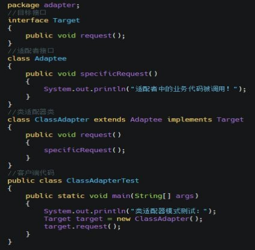
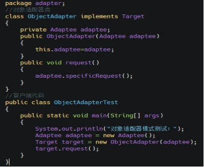
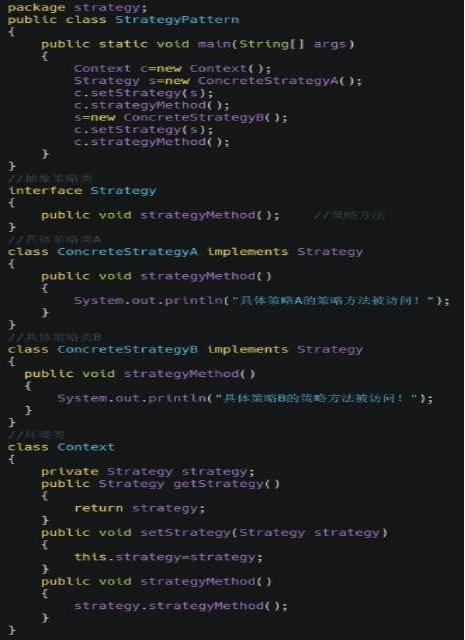

# 设计模式

## 1. 说一下你熟悉的设计模式

单例模式：保证被创建一次，节省系统开销。 工厂模式（简单工厂、抽象工厂）：解耦代码。

观察者模式：定义了对象之间的一对多的依赖，这样一来，当一个对象改变时，它的所有的  依赖者都会收到通知并自动更新。

外观模式：提供一个统一的接口，用来访问子系统中的一群接口，外观定义了一个高层的接  口，让子系统更容易使用。

模版方法模式：定义了一个算法的骨架，而将一些步骤延迟到子类中，模版方法使得子类可  以在不改变算法结构的情况下，重新定义算法的步骤。

状态模式：允许对象在内部状态改变时改变它的行为，对象看起来好像修改了它的类。

## 2. 简单工厂和抽象工厂的区别

简单工厂：用来生产同一等级结构中的任意产品，对于增加新的产品，无能为力。  工厂方法：用来生产同一等级结构中的固定产品，支持增加任意产品。

抽象工厂：用来生产不同产品族的全部产品，对于增加新的产品，无能为力；支持增加产品族。

## 3. 设计模式的优点

设计模式可在多个项目中重用。

设计模式提供了一个帮助定义系统架构的解决方案。 设计模式吸收了软件工程的经验。

设计模式为应用程序的设计提供了透明性。

设计模式是被实践证明切实有效的，由于它们是建立在专家软件开发人员的知识和经验  之上的。

## 4. 设计模式的六大基本原则

(1) 单一原则(Single Responsibility Principle)：一个类只负责一项职责，尽量做到类的只有一个行为原因引起变化；

(2) 里氏替换原则（LSP liskov substitution principle）：子类可以扩展父类的功能，但不能改变原有父类的功能；                                

(3)依赖倒置原则（dependence inversion principle）：面向接口编程；

(4) 接口隔离（interface segregation principle）：建立单一接口；

(5) 迪米特原则（law of demeter LOD）：最少知道原则，尽量降低类与类之间的耦合； 

(6)开闭原则（open closed principle）：用抽象构建架构，用实现扩展原则；

## 5. 单例模式

单例就是该类只能返回一个实例。单例所具备的特点：      

私有化的构造函数

私有的静态的全局变量

公有的静态的方法

单例分为懒汉式、饿汉式和双层锁式饿汉式:

~~~java
public class Singleton1 {

    private Singleton1() {};
    private static Singleton1 single = new Singleton1(); 
    public static Singleton1 getInstance() {
    	return single;
    }
}
~~~

懒汉式：

~~~java
public class Singleton2 { 
    
    private Singleton2() {}
	private static Singleton2 single=null; 
    public tatic Singleton2 getInstance() {
        if (single == null) {
            single = new Singleton2();
        }
    	return single;
    }
}
~~~

线程安全：

~~~java
public class Singleton3 { 
    
    private Singleton3() {}
	private static Singleton3 single; 
    public static Singleton3 getInstance() {
        if(null == single){ 
            synchronized(single){
                if(null == single){
                    single = new Singleton3();
                }
            }
          return single;  
    }
}
~~~

## 6. 设计模式的分类

根据目的来分

根据模式是用来完成什么工作来划分，这种方式可分为创建型模式、结构型模式和行为型模式 3 种。

创建型模式：用于描述“怎样创建对象”，它的主要特点是“将对象的创建与使用分离”。GoF 中提供了单例、原型、工厂方法、抽象工厂、建造者等 5 种创建型模式。

结构型模式：用于描述如何将类或对象按某种布局组成更大的结构，GoF 中提供了代理、适配器、桥接、装饰、外观、享元、组合等 7 种结构型模式。

行为型模式：用于描述类或对象之间怎样相互协作共同完成单个对象都无法单独完成的任务，以及怎样分配职责。GoF 中提供了模板方法、策略、命令、职责链、状态、观察者、中介者、迭代器、访问者、备忘录、解释器等 11 种行为型模式。

根据作用范围来分

根据模式是主要用于类上还是主要用于对象上来分，这种方式可分为类模式和对象模式两种。

类模式：用于处理类与子类之间的关系，这些关系通过继承来建立，是静态的，在编译  时刻便确定下来了。GoF 中的工厂方法、（类）适配器、模板方法、解释器属于该模式。

对象模式：用于处理对象之间的关系，这些关系可以通过组合或聚合来实现，在运行时  刻是可以变化的，更具动态性。GoF 中除了以上 4 种，其他的都是对象模式。

## 7.23 种设计模式的具体的每种模式的功能

单例（Singleton）模式：某个类只能生成一个实例，该类提供了一个全局访问点供外部获取  该实例，其拓展是有限多例模式。

原型（Prototype）模式：将一个对象作为原型，通过对其进行复制而克隆出多个和原型类似的新实例。

工厂方法（Factory Method）模式：定义一个用于创建产品的接口，由子类决定生产什么产品。

抽象工厂（AbstractFactory）模式：提供一个创建产品族的接口，其每个子类可以生产一系列相关的产品。

建造者（Builder）模式：将一个复杂对象分解成多个相对简单的部分，然后根据不同需  要分别创建它们，最后构建成该复杂对象。

代理（Proxy）模式：为某对象提供一种代理以控制对该对象的访问。即客户端通过代理间接地访问该对象，从而限制、增强或修改该对象的一些特性。

适配器（Adapter）模式：将一个类的接口转换成客户希望的另外一个接口，使得原本由于接口不兼容而不能一起工作的那些类能一起工作。

桥接（Bridge）模式：将抽象与实现分离，使它们可以独立变化。它是用组合关系代替  继承关系来实现，从而降低了抽象和实现这两个可变维度的耦合度。

装饰（Decorator）模式：动态的给对象增加一些职责，即增加其额外的功能。

外观（Facade）模式：为多个复杂的子系统提供一个一致的接口，使这些子系统更加容易被访问。

享元（Flyweight）模式：运用共享技术来有效地支持大量细粒度对象的复用。

组合（Composite）模式：将对象组合成树状层次结构，使用户对单个对象和组合对象具有一致的访问性。

模板方法（TemplateMethod）模式：定义一个操作中的算法骨架，而将算法的一些步骤延迟到子类中，使得子类可以不改变该算法结构的情况下重定义该算法的某些特定步骤。

策略（Strategy）模式：定义了一系列算法，并将每个算法封装起来，使它们可以相互替换，且算法的改变不会影响使用算法的客户。

命令（Command）模式：将一个请求封装为一个对象，使发出请求的责任和执行请求的责任分割开。

职责链（Chain of Responsibility）模式：把请求从链中的一个对象传到下一个对象，直到请求被响应为止。通过这种方式去除对象之间的耦合。

状态（State）模式：允许一个对象在其内部状态发生改变时改变其行为能力。

观察者（Observer）模式：多个对象间存在一对多关系，当一个对象发生改变时，把这  种改变通知给其他多个对象，从而影响其他对象的行为。

中介者（Mediator）模式：定义一个中介对象来简化原有对象之间的交互关系，降低系  统中对象间的耦合度，使原有对象之间不必相互了解。

迭代器（Iterator）模式：提供一种方法来顺序访问聚合对象中的一系列数据，而不暴  露聚合对象的内部表示。

访问者（Visitor）模式：在不改变集合元素的前提下，为一个集合中的每个元素提供多  种访问方式，即每个元素有多个访问者对象访问。

备忘录（Memento）模式：在不破坏封装性的前提下，获取并保存一个对象的内部状态， 以便以后恢复它。

解释器（Interpreter）模式：提供如何定义语言的文法，以及对语言句子的解释方法， 即解释器。

## 7. UML 是什么

统一建模语言（Unified Modeling Language，UML）是用来设计软件蓝图的可视化建模语言，

1997 年被国际对象管理组织（OMG）采纳为面向对象的建模语言的国际标准。它的特点是简单、统一、图形化、能表达软件设计中的动态与静态信息。

统一建模语言能为软件开发的所有阶段提供模型化和可视化支持。而且融入了软件工程领域  的新思想、新方法和新技术，使软件设计人员沟通更简明，进一步缩短了设计时间，减少开  发成本。它的应用领域很宽，不仅适合于一般系统的开发，而且适合于并行与分布式系统的  建模。

UML 从目标系统的不同角度出发，定义了用例图、类图、对象图、状态图、活动图、时序图、协作图、构件图、部署图等 9 种图。

## 8. 桥接模式是什么

桥接（Bridge模式的定义如下：将抽象与实现分离，使它们可以独立变化。它是用组合关  系代替继承关系来实现，从而降低了抽象和实现这两个可变维度的耦合度。

桥接（Bridge）模式

优点：由于抽象与实现分离，所以扩展能力强； 其实现细节对客户透明。

缺点：由于聚合关系建立在抽象层，要求开发者针对抽象化进行设计与编程，这增加了系  统的理解与设计难度

类适配器：

 

对象适配器：

 

## 9. 策略模式是什么

策略（Strategy）模式的定义：该模式定义了一系列算法，并将每个算法封装起来，使它们可以相互替换，且算法的变化不会影响使用算法的客户。策略模式属于对象行为模式，它通  过对算法进行封装，把使用算法的责任和算法的实现分割开来，并委派给不同的对象对这些  算法进行管理。

策略模式的主要优点如下：

* 多重条件语句不易维护，而使用策略模式可以避免使用多重条件语句。
* 策略模式提供了一系列的可供重用的算法族，恰当使用继承可以把算法族的公共代码转  移到父类里面，从而避免重复的代码。
* 策略模式可以提供相同行为的不同实现，客户可以根据不同时间或空间要求选择不同的。
* 策略模式提供了对开闭原则的完美支持，可以在不修改原代码的情况下，灵活增加新算法。
* 策略模式把算法的使用放到环境类中，而算法的实现移到具体策略类中，实现了二者的分离。

其主要缺点如下：

* 客户端必须理解所有策略算法的区别，以便适时选择恰当的算法类。  策略模式造成很多的策略类

 
